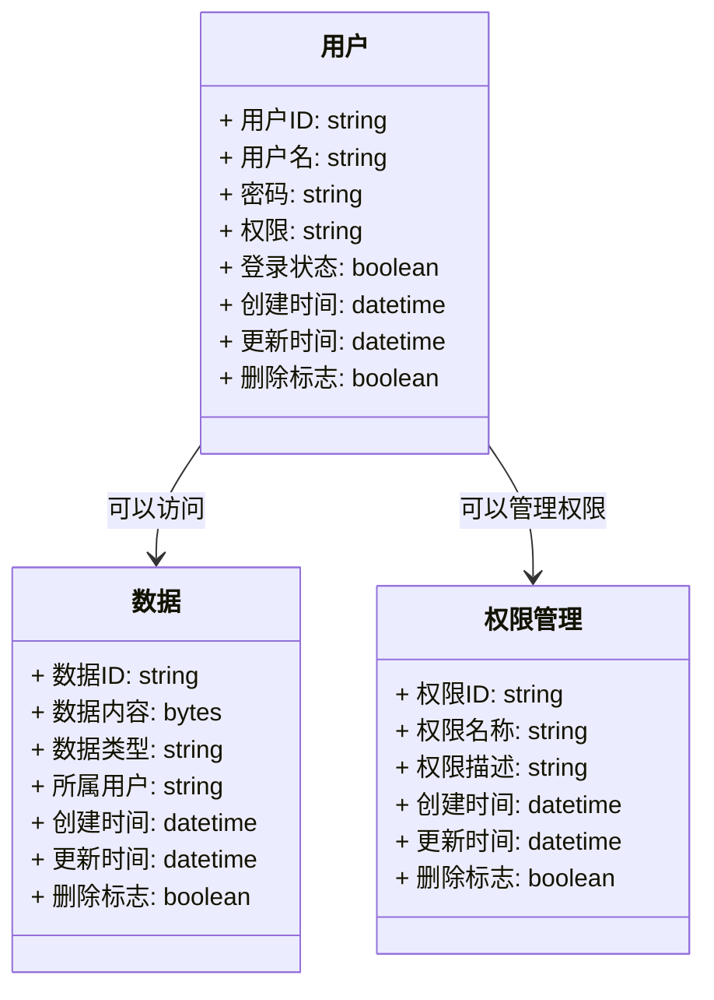
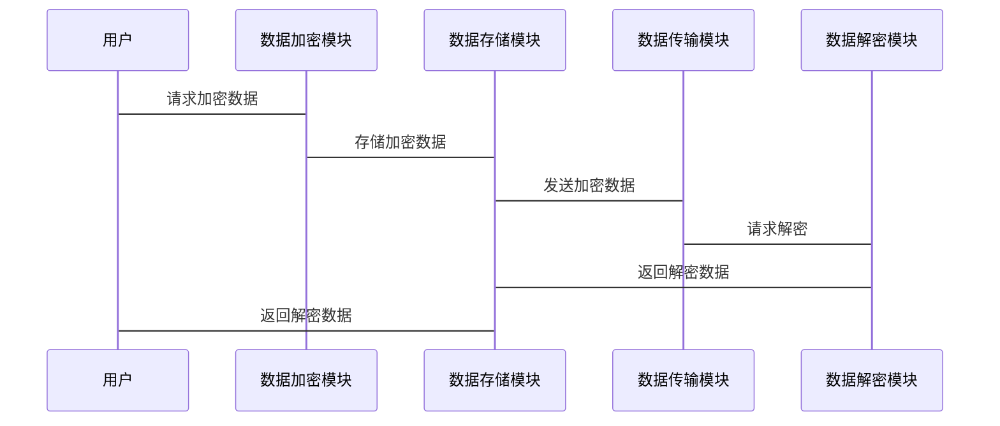

                 


# 巴菲特的护城河理论7.0：量子加密时代的数据主权

> 关键词：巴菲特护城河理论，量子加密，数据主权，企业竞争优势，技术博客

> 摘要：本文探讨了巴菲特护城河理论在量子加密时代下的演变，特别是数据主权对企业的核心影响。通过分析量子加密技术的原理及其在数据主权中的应用，结合实际案例，提出护城河理论7.0版本的新框架，为企业在量子加密时代的竞争优势提供新的思路。

---

# 第一部分：巴菲特的护城河理论7.0概述

## 第1章：巴菲特护城河理论的演进

### 1.1 护城河理论的起源与演变

#### 1.1.1 巴菲特护城河理论的核心思想
巴菲特的护城河理论是投资学中的经典理论，核心在于识别那些具备长期竞争优势的企业。护城河是指企业建立的某种壁垒，使其竞争对手难以模仿或超越。护城河的常见形式包括成本优势、品牌效应、网络效应、专利和技术壁垒等。

#### 1.1.2 护城河理论的版本更新与演变
护城河理论并非一成不变，随着时代的发展，理论也在不断更新。从最初的护城河1.0版本到如今的7.0版本，每一次升级都反映了商业环境的变化和技术的进步。7.0版本的护城河理论将目光投向了量子加密和数据主权，这是当前技术革命和全球化背景下的重要趋势。

#### 1.1.3 7.0版本的核心特征与创新点
护城河理论7.0版本的最大创新在于将量子加密技术和数据主权纳入其中。数据主权是指数据的所有者对其数据拥有完全的控制权，这在量子计算时代尤为重要。量子计算的出现使得传统的加密算法面临威胁，而数据主权则为企业提供了在数据保护方面的竞争优势。

---

## 第2章：量子加密时代的商业变革

### 2.1 量子加密技术的核心原理

#### 2.1.1 量子密钥分发（QKD）的基本原理
量子密钥分发是一种利用量子力学原理进行加密的技术。其基本原理是通过量子态的传输和测量，生成共享的密钥。由于量子态的不可克隆性，任何窃听行为都会破坏密钥的完整性，从而被发现。

#### 2.1.2 量子加密算法的数学模型
量子加密算法的核心是基于量子叠加和量子纠缠的原理。例如，Shor算法是一种用于分解大整数的量子算法，它能够有效地破解RSA加密算法。然而，随着量子计算机的发展，传统的加密算法将面临严峻挑战。

#### 2.1.3 量子加密技术的优劣势对比
量子加密技术的优势在于其安全性，劣势在于其实现成本较高，且目前仍处于发展阶段。然而，随着技术的进步，量子加密有望在未来成为主流的加密方式。

---

### 2.2 数据主权的崛起与挑战

#### 2.2.1 数据主权的定义与内涵
数据主权是指数据的所有者对数据拥有完全的控制权，包括数据的存储、传输和使用等方面。在数字化时代，数据主权的重要性日益凸显，尤其是在跨国企业和全球化的背景下。

#### 2.2.2 数据主权的法律框架与国际实践
数据主权的实现需要法律的支持。不同国家和地区在数据主权方面的法律框架有所不同，例如欧盟的GDPR（通用数据保护条例）就是一项重要的数据保护法规。

#### 2.2.3 数据主权与企业竞争优势的关系
数据主权是企业竞争优势的重要组成部分。拥有数据主权的企业能够更好地保护自己的数据资产，从而在市场竞争中占据优势。

---

## 第3章：护城河理论7.0的核心框架

### 3.1 护城河理论7.0的理论体系

#### 3.1.1 核心概念：数据主权、量子加密与企业护城河
护城河理论7.0将数据主权和量子加密技术作为核心概念，强调企业通过建立数据主权壁垒，利用量子加密技术保护数据资产，从而在竞争中占据优势。

#### 3.1.2 护城河的构成要素与相互关系
护城河的构成要素包括数据主权、量子加密技术、数据存储与传输安全、法律合规等。这些要素相互关联，共同构成了企业的竞争优势。

#### 3.1.3 7.0版本的创新性突破与应用场景
护城河理论7.0的创新性在于将量子加密技术与数据主权结合，为企业提供了在数字时代中的竞争优势。应用场景包括金融、医疗、能源等领域。

---

## 第4章：量子加密与数据主权的技术解析

### 4.1 量子加密算法的数学模型

#### 4.1.1 量子密钥分发（QKD）的数学模型
量子密钥分发的数学模型基于量子态的传输和测量。通过量子态的不可克隆性，确保密钥的安全性。

#### 4.1.2 量子加密算法的实现步骤
量子加密算法的实现步骤包括密钥生成、密钥分发、加密和解密等过程。

#### 4.1.3 量子加密算法的优劣势分析
量子加密算法的优势在于其安全性，劣势在于其实现成本较高，且需要依赖量子计算机的支持。

---

## 第5章：数据主权的技术实现

### 5.1 数据主权的实现技术

#### 5.1.1 数据加密与解密技术
数据加密是实现数据主权的重要手段。通过加密技术，确保数据在传输和存储过程中不被未经授权的第三方访问。

#### 5.1.2 数据存储与访问控制
数据存储需要采用安全的存储技术，并通过访问控制确保只有授权人员能够访问数据。

#### 5.1.3 数据跨境流动的管理
数据跨境流动需要遵守相关法律法规，并采取技术手段确保数据的安全性。

---

## 第6章：系统分析与架构设计方案

### 6.1 系统功能设计

#### 6.1.1 领域模型mermaid类图


### 6.2 系统架构设计mermaid架构图


### 6.3 系统接口设计

#### 6.3.1 接口1：数据加密接口
```plaintext
接口名称：加密接口
输入参数：
    - 数据内容: bytes
    - 加密算法: string
输出参数：
    - 加密后的数据: bytes
```

#### 6.3.2 接口2：数据解密接口
```plaintext
接口名称：解密接口
输入参数：
    - 加密后的数据: bytes
    - 解密算法: string
输出参数：
    - 原始数据: bytes
```

### 6.4 系统交互mermaid序列图



---

## 第7章：项目实战

### 7.1 环境安装

#### 7.1.1 安装量子加密库
```bash
pip install qkd-library
```

#### 7.1.2 安装数据主权管理模块
```bash
pip install data-sovereignty
```

### 7.2 系统核心实现源代码

#### 7.2.1 量子密钥生成代码
```python
import qkd_library

def generate_quantum_key():
    key = qkd_library.generate_key()
    return key
```

#### 7.2.2 数据加密与解密代码
```python
from data_sovereignty import DataEncryption

def encrypt_data(data):
    encryptor = DataEncryption()
    encrypted_data = encryptor.encrypt(data)
    return encrypted_data

def decrypt_data(encrypted_data):
    decryptor = DataEncryption()
    decrypted_data = decryptor.decrypt(encrypted_data)
    return decrypted_data
```

### 7.3 实际案例分析与详细讲解

#### 7.3.1 案例分析
假设一家跨国企业需要保护其客户数据，使用护城河理论7.0版本，通过量子加密技术和数据主权管理模块，确保数据的安全性和合规性。

#### 7.3.2 案例解读
通过量子加密技术，企业能够有效防止数据泄露，同时通过数据主权管理模块，确保数据在跨境流动中的合法性。

---

## 第8章：总结与展望

### 8.1 总结
护城河理论7.0版本通过将量子加密技术和数据主权结合，为企业提供了在数字时代中的竞争优势。量子加密技术的安全性与数据主权的法律保障相结合，使得企业能够在复杂的商业环境中立于不败之地。

### 8.2 展望
随着量子计算技术的不断发展，护城河理论7.0版本将更加完善，数据主权和量子加密技术的应用也将更加广泛。未来的企业竞争优势将更加依赖于数据主权和量子技术的结合。

---

## 第9章：注意事项与最佳实践

### 9.1 注意事项
1. 在实施量子加密技术时，需要确保技术的成熟性和可靠性。
2. 数据主权的实现需要结合法律法规，确保合规性。
3. 在实际应用中，需要综合考虑成本效益，避免过度投入。

### 9.2 最佳实践
1. 企业应积极关注量子加密技术的发展，及时调整自身的技术架构。
2. 在数据主权管理方面，应结合企业的实际情况，制定合理的数据保护策略。
3. 通过与专业的技术团队合作，确保量子加密和数据主权技术的顺利实施。

---

## 第10章：拓展阅读

### 10.1 相关书籍
1. 《量子计算与数据主权》
2. 《护城河理论的现代发展》
3. 《量子加密算法入门》

### 10.2 相关技术博客
1. [量子计算与数据主权](https://example.com)
2. [护城河理论7.0](https://example.com)
3. [量子加密技术的应用](https://example.com)

---

# 作者：AI天才研究院/AI Genius Institute & 禅与计算机程序设计艺术/Zen And The Art of Computer Programming

