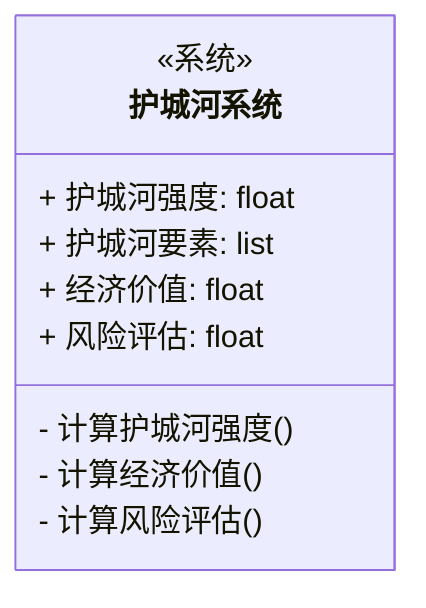

                 


# 巴菲特的护城河理论及其应用

> 关键词：巴菲特、护城河理论、企业竞争优势、投资策略、风险管理

> 摘要：本文深入探讨了巴菲特的护城河理论，分析了其核心概念、数学模型、系统架构以及在实际商业中的应用。通过具体案例分析和系统设计，揭示了护城河理论如何帮助企业构建长期竞争优势，并为企业管理者和投资者提供了实用的策略和建议。

---

## 第1章: 护城河理论的背景与核心概念

### 1.1 护城河理论的背景

巴菲特的护城河理论是其投资哲学的核心之一，源于他对企业竞争优势的深刻理解。护城河是指企业在市场中形成的难以被竞争对手复制或超越的竞争优势，这种优势能够为公司提供长期的超额收益。

#### 1.1.1 护城河理论的起源

护城河理论的形成与巴菲特的投资实践密不可分。他通过长期观察和分析发现，真正伟大的企业往往具有某种独特的竞争优势，这种优势可以被称为“护城河”。护城河的存在使得企业能够在激烈的市场竞争中保持领先地位，并为股东创造持续的经济价值。

#### 1.1.2 护城河理论的核心思想

护城河理论的核心思想是：企业竞争优势的可持续性决定了其长期盈利能力。具有强大护城河的企业能够在市场中抵御竞争对手的进攻，同时也能在经济周期波动中保持稳健的增长。

#### 1.1.3 护城河理论在投资中的重要性

在投资领域，护城河理论帮助投资者识别那些具备长期竞争优势的企业。通过分析企业的护城河，投资者能够更好地评估其未来的盈利能力和抗风险能力。

---

### 1.2 护城河理论的核心要素

护城河理论的核心要素包括成本优势、资源优势、品牌优势和技术优势。这些要素共同构成了企业的竞争优势。

#### 1.2.1 成本优势

成本优势是指企业在生产或运营过程中能够以更低的成本提供产品或服务。例如，亚马逊通过其高效的物流体系和规模效应，形成了强大的成本优势。

#### 1.2.2 资源优势

资源优势是指企业拥有的独特资源，例如专利、特许经营权或关键人才。例如，可口可乐通过其强大的品牌影响力和全球分销网络，形成了独特的资源优势。

#### 1.2.3 品牌优势

品牌优势是指企业的品牌在市场上具有强大的认知度和忠诚度。例如，苹果通过其创新的产品设计和品牌营销，形成了强大的品牌优势。

#### 1.2.4 技术优势

技术优势是指企业在技术开发和应用方面具有领先优势。例如，微软通过其操作系统和云服务的技术优势，形成了强大的市场竞争力。

---

## 第2章: 护城河理论的数学模型与公式

### 2.1 护城河强度评估模型

护城河强度评估模型用于衡量企业护城河的强弱。公式如下：

$$
\text{护城河强度} = \frac{\text{核心竞争优势}}{\text{行业竞争程度}}
$$

其中，核心竞争优势包括成本优势、资源优势、品牌优势和技术优势，而行业竞争程度则反映了行业内的竞争激烈程度。

---

### 2.2 护城河经济价值模型

护城河的经济价值模型用于评估护城河对企业经济价值的影响。公式如下：

$$
\text{经济价值} = \text{护城河强度} \times \text{市场空间}
$$

市场空间反映了企业的目标市场规模和增长潜力。

---

### 2.3 护城河风险评估模型

护城河风险评估模型用于评估护城河抵御风险的能力。公式如下：

$$
\text{风险} = \frac{\text{替代品威胁} + \text{技术变革影响}}{\text{护城河强度}}
$$

替代品威胁和技术变革影响反映了市场中替代品和技术创新对企业护城河的冲击程度。

---

## 第3章: 护城河理论的系统分析与架构设计

### 3.1 系统分析

#### 3.1.1 问题场景介绍

护城河理论的系统分析需要考虑企业的核心竞争优势、行业竞争程度以及市场空间等因素。通过系统分析，我们可以更好地理解护城河理论的应用场景。

#### 3.1.2 领域模型分析

以下是护城河系统的领域模型分析图：



---

### 3.2 系统架构设计

#### 3.2.1 系统功能设计

以下是护城河系统的功能设计类图：


---

## 第4章: 护城河理论的项目实战

### 4.1 项目介绍

#### 4.1.1 项目背景

本项目旨在通过护城河理论分析某企业的竞争优势，并构建数学模型进行评估。

#### 4.1.2 核心需求

- 分析企业的护城河要素。
- 计算护城河强度和经济价值。
- 评估护城河风险。

---

### 4.2 系统实现

#### 4.2.1 环境安装

需要安装Python和相关库（如numpy、pandas）。

#### 4.2.2 核心代码实现

以下是护城河强度计算的Python代码：

```python
import numpy as np
import pandas as pd

def calculate_h护城河强度(competitors, market_size):
    core_advantages = []
    for competitor in competitors:
        cost Advantage = competitor['cost_advantage']
        resource Advantage = competitor['resource_advantage']
        brand Advantage = competitor['brand_advantage']
        tech Advantage = competitor['tech_advantage']
        core_advantages.append((cost Advantage + resource Advantage + brand Advantage + tech Advantage) / 4)
   护城河强度 = np.mean(core_advantages) / (market_size ** 0.5)
    return 护城河强度

competitors = [
    {'cost_advantage': 0.8, 'resource_advantage': 0.7, 'brand_advantage': 0.9, 'tech_advantage': 0.8},
    {'cost_advantage': 0.7, 'resource_advantage': 0.6, 'brand_advantage': 0.8, 'tech_advantage': 0.7}
]

market_size = 100
result = calculate_h护城河强度(competitors, market_size)
print(f"护城河强度: {result}")
```

---

## 第5章: 总结与展望

### 5.1 总结

护城河理论是巴菲特投资哲学的重要组成部分，通过分析企业的竞争优势，可以帮助投资者和企业管理者制定更有效的战略。本文从理论到实践，详细探讨了护城河理论的核心概念、数学模型和系统设计，并通过具体案例展示了其应用。

### 5.2 展望

未来，护城河理论将继续在商业和投资领域发挥重要作用。随着技术的不断发展，护城河的内涵和外延也将进一步扩展，为企业管理者和投资者提供更多新的思考方向。

---

## 作者：AI天才研究院/AI Genius Institute & 禅与计算机程序设计艺术 /Zen And The Art of Computer Programming

---

**感谢您的阅读！**

