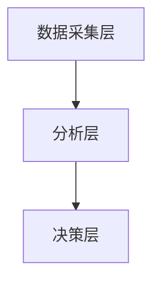
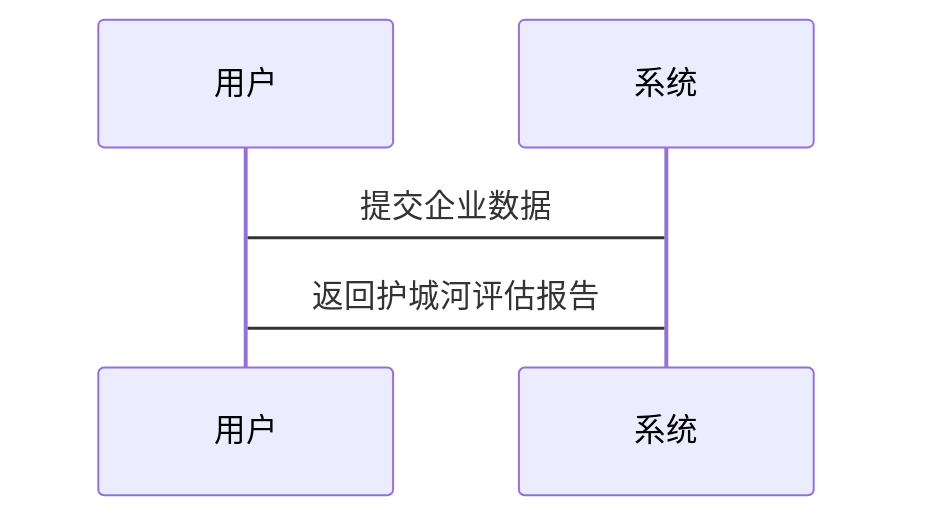

                 

# 巴菲特的护城河理论：寻找持久竞争优势

> 关键词：巴菲特, 护城河理论, 企业竞争优势, 投资策略, 数学模型, 竞争分析

> 摘要：本文深入探讨巴菲特的护城河理论，分析其核心概念、数学模型、系统架构设计、实践应用和风险管理，结合实际案例，为企业和投资者提供寻找持久竞争优势的策略和方法。

---

## 第一部分: 护城河理论的背景与核心概念

### 第1章: 投资界的传奇——巴菲特与护城河理论

#### 1.1 巴菲特的投资理念
- **1.1.1 巴菲特的生平与投资风格**  
  巴菲特是价值投资的代表人物，他强调长期投资和企业基本面分析。他的投资理念基于对企业内在价值的评估，而非短期市场波动。

- **1.1.2 巴菲特的价值投资理论**  
  巴菲特的价值投资理论认为，市场先生是疯狂的，投资者应该在市场恐慌时买入，在市场疯狂时卖出。他强调安全边际和企业内在价值的评估。

- **1.1.3 护城河理论的提出背景**  
  护城河理论是巴菲特在投资实践中总结出的重要概念，旨在帮助企业建立持久的竞争优势，抵御竞争对手和市场风险。

#### 1.2 护城河理论的核心概念
- **1.2.1 什么是护城河**  
  护城河是指企业在市场上拥有的独特优势，使其能够在长期竞争中保持领先地位。这些优势可以是成本优势、品牌优势、技术优势或网络效应等。

- **1.2.2 护城河的分类与特点**  
  - 成本优势：企业通过规模效应或流程优化降低生产成本，从而在价格竞争中占据优势。
  - 品牌优势：强大的品牌影响力吸引消费者，形成客户忠诚度。
  - 技术优势：企业通过技术创新或专利保护保持市场领先地位。
  - 网络效应：用户的增加会增强产品的价值，形成正反馈效应。

- **1.2.3 护城河与企业竞争优势的关系**  
  护城河是企业竞争优势的核心，通过构建护城河，企业可以在市场上形成壁垒，防止竞争对手的侵蚀。

### 第2章: 护城河理论的数学模型与分析框架

#### 2.1 护城河的定量分析方法
- **2.1.1 财务指标分析**  
  通过分析企业的财务指标，如ROE（净资产收益率）和净利润率，评估企业的盈利能力。公式如下：
  $$ \text{ROE} = \frac{\text{净利润}}{\text{股东权益}} $$
  高ROE表明企业盈利能力强，可能具备护城河。

- **2.1.2 市场占有率分析**  
  市场占有率是衡量企业竞争优势的重要指标。公式如下：
  $$ \text{市场占有率} = \frac{\text{企业销售额}}{\text{行业总销售额}} $$
  高市场占有率表明企业具备较强的市场影响力。

- **2.1.3 竞争优势的评估模型**  
  通过构建竞争优势评估模型，分析企业的护城河强度。模型包括成本优势、品牌优势和技术优势三个维度，每个维度用指标量化。

#### 2.2 护城河的定性分析方法
- **2.2.1 企业核心竞争力分析**  
  核心竞争力是企业长期竞争优势的来源。例如，苹果的创新能力和品牌影响力是其核心竞争力。

- **2.2.2 行业环境分析**  
  分析行业竞争格局、市场进入壁垒和政策环境，判断企业护城河的可持续性。

- **2.2.3 竞争对手分析**  
  通过分析竞争对手的优劣势，评估企业在市场中的相对位置和竞争优势。

### 第3章: 护城河理论的系统架构设计

#### 3.1 系统分析与架构设计方案
- **3.1.1 问题场景介绍**  
  企业面临市场竞争压力，需要构建护城河以维持竞争优势。

- **3.1.2 系统功能设计**  
  系统功能包括竞争分析、护城河评估和竞争优势优化。

- **3.1.3 系统架构设计**  
  系统架构采用分层设计，包括数据采集层、分析层和决策层。使用mermaid图展示系统架构。

- **3.1.4 系统接口设计**  
  系统接口包括数据输入接口、分析结果输出接口和用户交互接口。

- **3.1.5 系统交互设计**  
  使用mermaid序列图展示系统交互流程。

## 第二部分: 护城河理论的实践应用

### 第4章: 企业竞争优势的识别与评估

#### 4.1 企业竞争优势的识别方法
- **4.1.1 财务指标分析**  
  通过分析企业的ROE、净利润率等财务指标，识别企业的盈利能力。

- **4.1.2 市场分析与竞争对手分析**  
  通过分析市场趋势和竞争对手的优劣势，识别企业的市场地位。

- **4.1.3 企业内部资源与能力分析**  
  评估企业的核心能力和资源，判断其竞争优势。

#### 4.2 护城河的有效性评估
- **4.2.1 护城河的宽度与深度**  
  宽度指护城河的广度，深度指其强度。例如，苹果的创新能力和品牌影响力是其宽而深的护城河。

- **4.2.2 护城河的可持续性**  
  评估护城河的可持续性，判断企业在未来能否保持竞争优势。

- **4.2.3 护城河的可扩展性**  
  评估护城河的扩展性，判断企业能否在新的市场或领域中复制竞争优势。

### 第5章: 护城河的构建策略

#### 5.1 护城河的构建策略
- **5.1.1 通过创新构建护城河**  
  创新是构建护城河的重要途径，例如特斯拉通过技术创新构建电动汽车市场的护城河。

- **5.1.2 通过品牌建设构建护城河**  
  强大的品牌形象和客户忠诚度是重要的护城河，例如可口可乐。

- **5.1.3 通过成本控制构建护城河**  
  通过规模效应和流程优化降低成本，形成价格竞争优势，例如亚马逊。

#### 5.2 护城河的持续优化
- **5.2.1 定期评估护城河的有效性**  
  定期分析市场环境和竞争对手的变化，及时调整护城河策略。

- **5.2.2 持续创新与优化**  
  通过技术创新和管理优化，保持竞争优势。

### 第6章: 护城河的风险管理

#### 6.1 护城河的风险分析
- **6.1.1 护城河的潜在威胁**  
  市场变化、技术进步和政策变化可能削弱护城河。

- **6.1.2 竞争对手的应对策略**  
  分析竞争对手可能采取的策略，评估其对护城河的影响。

#### 6.2 护城河的风险管理策略
- **6.2.1 建立风险管理机制**  
  设立专门的风险管理部门，定期评估风险并制定应对策略。

- **6.2.2 提升企业灵活性与应变能力**  
  通过多元化经营和灵活的组织结构，增强企业的应变能力。

### 第7章: 未来趋势与护城河的演进

#### 7.1 数字化转型与护城河重构
- **7.1.1 数字化转型对企业竞争优势的影响**  
  数字化转型可能改变企业的竞争优势，例如互联网企业通过数据和技术构建护城河。

- **7.1.2 技术创新与护城河的动态变化**  
  技术创新是护城河的重要来源，企业需要持续创新以保持竞争优势。

#### 7.2 可持续发展与护城河的新维度
- **7.2.1 可持续发展对企业竞争优势的影响**  
  可持续发展成为企业竞争优势的新维度，例如环保企业的竞争优势。

- **7.2.2 社会责任与品牌价值**  
  社会责任的履行可以提升企业的品牌形象，增强客户忠诚度。

### 第8章: 总结与展望

#### 8.1 总结
- 护城河理论是企业竞争优势的重要工具，通过构建护城河，企业可以在长期竞争中保持领先地位。

#### 8.2 展望
- 随着市场环境的变化和技术进步，护城河的构建和管理将更加复杂。企业需要不断创新和优化，以应对未来的挑战。

---

## 作者：AI天才研究院 & 禅与计算机程序设计艺术

---

> 本文内容基于对巴菲特护城河理论的深入研究和实践分析，结合技术博客的特点，通过系统化的思考和分析，为您提供了一种全新的视角来理解和应用护城河理论。希望本文能为您提供有价值的见解和启示，帮助您在投资和企业管理中找到持久的竞争优势。

