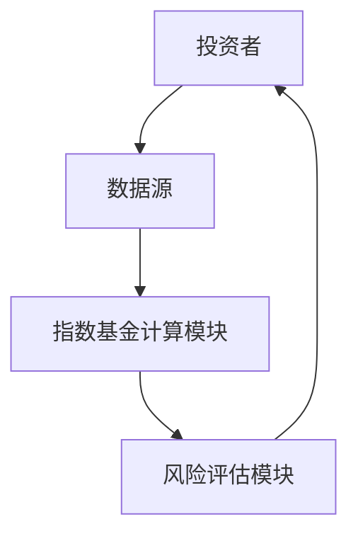
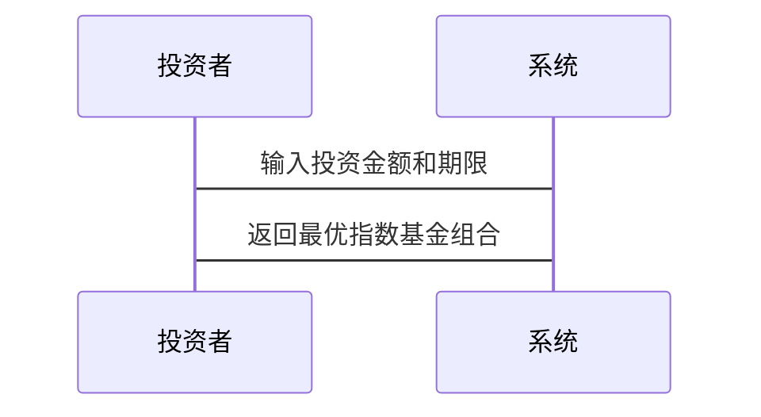

                 


# 巴菲特的指数投资观：大多数投资者的选择

> 关键词：巴菲特，指数投资，被动管理，主动管理，投资策略

> 摘要：本文深入探讨了巴菲特推崇的指数投资策略，分析了其核心观点、数学模型、系统架构，并结合实际案例进行详细解读，旨在为投资者提供清晰的指导。

---

# 第一部分: 巴菲特投资理念的背景与核心观点

## 第1章: 巴菲特投资哲学概述

### 1.1 巴菲特的生平与投资理念

#### 1.1.1 巴菲特的早期经历与投资起步

沃伦·巴菲特（Warren Buffett）是全球最著名的投资者之一，被誉为“股神”。他出生于1934年，早年通过阅读投资书籍和实践，逐渐形成了自己的投资理念。巴菲特的投资哲学以“价值投资”为核心，强调长期持有优质资产，避免短期市场波动的干扰。

#### 1.1.2 巴菲特的价值投资理念

巴菲特的价值投资理念强调寻找那些具有持续竞争优势、良好治理结构和稳定财务状况的企业。他认为，市场的短期波动不可预测，但优质企业的长期价值是可以通过基本面分析确定的。因此，他建议投资者长期持有优质股票，而不是频繁交易。

#### 1.1.3 巴菲特对指数投资的推崇

尽管巴菲特以价值投资闻名，但他也多次提到指数投资的重要性。他认为，对于大多数不具备专业投资知识的普通投资者来说，投资指数基金是一种简单、有效的方式，能够获得市场的平均收益。这种投资方式不需要选股，也不需要频繁交易，适合长期投资。

### 1.2 指数投资的基本概念

#### 1.2.1 指数基金的定义与特点

指数基金是一种跟踪特定指数的基金，其投资组合按照指数的成分股构成比例进行配置。指数基金的特点是分散风险、费用低、操作简单。由于其被动跟踪指数，指数基金的管理费用通常低于主动管理型基金。

#### 1.2.2 指数基金的优势与劣势

**优势：**

1. **分散风险**：指数基金投资于多个股票，降低了单一股票的风险。
2. **费用低**：被动管理的指数基金管理费用较低，长期来看成本优势明显。
3. **操作简单**：投资者无需选股或判断市场趋势，只需定期定额投资即可。

**劣势：**

1. **缺乏灵活性**：指数基金的仓位固定，无法根据市场变化进行调整。
2. **市场风险**：指数基金的收益取决于市场的整体表现，无法避免市场的系统性风险。

#### 1.2.3 指数基金与主动管理的区别

| 对比维度       | 指数基金                     | 主动管理型基金                 |
|----------------|------------------------------|------------------------------|
| 投资策略       | 被动跟踪指数                 | 主动选股和市场 timing          |
| 管理费用       | 低                          | 高                          |
| 风险           | 分散风险                     | 集中风险                     |
| 适合投资者     | 适合长期投资，无专业投资知识 | 适合有专业知识或高风险承受能力的投资者 |

### 1.3 巴菲特指数投资观的核心观点

#### 1.3.1 巴菲特对指数投资的评价

巴菲特认为，指数投资是一种适合大多数投资者的策略。他指出，大多数投资者不具备选出跑赢市场的股票的能力，而投资指数基金可以确保获得市场的平均收益。

#### 1.3.2 巴菲特指数投资观的适用场景

对于那些不具备投资知识、时间或资金不足以进行广泛研究的投资者来说，指数投资是一种理想的选择。特别是对于长期投资者，指数基金能够提供稳定的复利收益。

#### 1.3.3 巴菲特指数投资观的争议与批评

尽管巴菲特推崇指数投资，但也有不少人认为指数投资忽视了个别优质企业的成长机会，特别是在市场出现极端情况时，指数基金的表现可能不如优质个股。

---

## 1.4 本章小结

本章介绍了巴菲特的投资哲学，特别是他对指数投资的推崇。指数投资作为一种被动管理策略，适合大多数投资者，尤其是那些不具备专业投资知识的投资者。通过分散投资和低成本的优势，指数投资能够为投资者提供稳定的长期收益。

---

# 第二部分: 指数投资的核心概念与原理

## 第2章: 指数投资的核心概念

### 2.1 指数基金的类型与分类

#### 2.1.1 标准普尔500指数基金

标准普尔500指数（S&P 500）是美国最著名的股票指数之一，涵盖500家大型上市公司。投资标准普尔500指数基金可以较好地跟踪美国股市的整体表现。

#### 2.1.2 道琼斯指数基金

道琼斯指数（Dow Jones）是另一个著名的股票指数，由30家大型蓝筹股公司组成。道琼斯指数基金适合那些希望投资于美国大公司的投资者。

#### 2.1.3 其他常见指数基金类型

除了标准普尔500指数和道琼斯指数，还有其他类型的指数基金，如新兴市场指数基金、行业指数基金等。这些基金的投资范围更加狭窄，适合有特定投资目标的投资者。

### 2.2 指数投资的数学模型与原理

#### 2.2.1 指数基金的构建方法

指数基金的构建方法是按照指数的成分股比例进行投资。例如，如果标准普尔500指数中有科技股占10%，金融股占20%，那么指数基金中的科技股和金融股的仓位也将分别占10%和20%。

#### 2.2.2 指数基金的跟踪误差

跟踪误差（Tracking Error）是衡量指数基金与目标指数表现差异的指标。跟踪误差越小，指数基金的表现越接近目标指数。计算公式如下：

$$
\text{跟踪误差} = \sqrt{\text{残差方差}}
$$

其中，残差方差是指数基金实际收益与目标指数收益差异的平方的平均值。

#### 2.2.3 指数基金的复制误差

复制误差（Replication Error）是指指数基金的实际投资组合与目标指数的成分股比例之间的差异。复制误差的存在主要由于交易成本、流动性限制等因素。

### 2.3 指数投资与主动管理的对比分析

#### 2.3.1 主动管理的定义与特点

主动管理型基金由基金经理主动选股和调整仓位，目标是跑赢市场指数。其特点是灵活性高，但管理费用较高，且对基金经理的投资能力有较高要求。

#### 2.3.2 指数投资与主动管理的优劣势对比

| 对比维度       | 指数投资                     | 主动管理                     |
|----------------|------------------------------|------------------------------|
| 管理费用       | 低                          | 高                          |
| 风险           | 分散风险                     | 集中风险                     |
| 适合投资者     | 适合长期投资，无专业投资知识 | 适合有专业知识或高风险承受能力的投资者 |

#### 2.3.3 巴菲特对主动管理的评价

巴菲特认为，大多数主动管理型基金无法长期跑赢指数基金，尤其是扣除高昂的管理费用后，主动管理型基金的净收益往往低于指数基金。

---

## 2.4 本章小结

本章详细介绍了指数基金的类型和指数投资的核心概念，包括指数基金的构建方法、跟踪误差和复制误差等。同时，对比了指数投资与主动管理的优劣势，强调了指数投资的低成本和分散风险的优势。

---

# 第三部分: 指数投资的数学模型与算法原理

## 第3章: 指数投资的数学模型

### 3.1 指数基金的构建与优化

#### 3.1.1 指数基金的构建方法

指数基金的构建需要严格按照目标指数的成分股比例进行投资。例如，目标指数的成分股权重为 $w_i$，则指数基金的仓位分配也应为 $w_i$。

#### 3.1.2 指数基金的优化策略

在实际操作中，由于交易成本和流动性限制，完全复制指数可能会增加成本。因此，指数基金会采用优化策略，如最小化交易成本和流动性冲击。

#### 3.1.3 指数基金的风险调整收益

指数基金的风险调整收益可以通过夏普比率（Sharpe Ratio）来衡量。夏普比率的计算公式为：

$$
\text{夏普比率} = \frac{R_p - R_f}{\sigma_p}
$$

其中，$R_p$ 是基金的平均收益，$R_f$ 是无风险收益率，$\sigma_p$ 是基金的收益标准差。

### 3.2 指数投资的数学公式与模型

#### 3.2.1 指数基金的收益计算公式

假设指数基金的投资组合中各成分股的比例为 $w_i$，各成分股的预期收益率为 $r_i$，则指数基金的预期收益率为：

$$
R_p = \sum_{i=1}^{n} w_i r_i
$$

#### 3.2.2 指数基金的风险度量模型

指数基金的风险可以通过方差来衡量，计算公式为：

$$
\text{方差} = \sum_{i=1}^{n} \sum_{j=1}^{n} w_i w_j \sigma_{ij}
$$

其中，$\sigma_{ij}$ 是成分股 $i$ 和 $j$ 的协方差。

#### 3.2.3 指数基金的夏普比率

指数基金的夏普比率计算公式为：

$$
\text{夏普比率} = \frac{R_p - R_f}{\sqrt{\text{方差}}}
$$

---

## 3.3 本章小结

本章通过数学模型和公式，详细解释了指数投资的核心原理，包括指数基金的构建方法、风险度量和收益计算。这些模型为投资者提供了科学的分析工具，帮助他们更好地理解指数投资的本质。

---

# 第四部分: 系统分析与架构设计方案

## 第4章: 指数投资的系统分析

### 4.1 问题场景介绍

假设我们是一名普通投资者，希望通过指数投资实现资产的长期增值。我们需要选择合适的指数基金，并制定投资策略。

### 4.2 系统功能设计

#### 4.2.1 领域模型


#### 4.2.2 系统架构设计



#### 4.2.3 系统接口设计

投资者通过界面输入投资金额和期限，系统根据输入数据计算最优的指数基金组合。

#### 4.2.4 系统交互设计



---

## 4.3 本章小结

本章通过系统分析和架构设计，展示了如何将指数投资应用于实际投资决策中。通过领域模型和系统架构图，帮助投资者更好地理解指数投资的实现过程。

---

# 第五部分: 项目实战

## 第5章: 项目实战

### 5.1 环境安装

建议使用Python编程语言和相关库（如Pandas、NumPy）进行指数基金的分析和模拟。

### 5.2 系统核心实现源代码

```python
import pandas as pd
import numpy as np

# 假设我们有标准普尔500指数的成分股数据和权重
# 读取数据
data = pd.read_csv('sp500.csv')

# 计算指数基金的预期收益率
weights = data['权重']
returns = data['预期收益率']
expected_return = np.dot(weights, returns)

# 计算风险
cov_matrix = data.cov()
risk = np.sqrt(weights.T @ cov_matrix @ weights)

# 计算夏普比率
rf = 0.02  # 无风险收益率
sharp_ratio = (expected_return - rf) / risk

print(f"预期收益率: {expected_return:.2%}")
print(f"风险: {risk:.2%}")
print(f"夏普比率: {sharp_ratio:.2}")
```

### 5.3 代码应用解读与分析

上述代码展示了如何计算指数基金的预期收益率、风险和夏普比率。通过这些指标，投资者可以更好地评估指数基金的收益与风险。

### 5.4 实际案例分析

以标准普尔500指数为例，假设我们投资于一只跟踪该指数的指数基金。通过上述代码，我们可以计算出该指数基金的预期收益率、风险和夏普比率，从而判断其是否符合我们的投资目标。

### 5.5 本章小结

本章通过实际案例和代码实现，展示了如何应用指数投资的原理进行投资决策。通过模拟指数基金的表现，投资者可以更好地理解指数投资的实际应用。

---

# 第六部分: 最佳实践、小结、注意事项与拓展阅读

## 第6章: 最佳实践与小结

### 6.1 最佳实践

1. **长期投资**：指数投资适合长期投资，避免频繁交易。
2. **费用控制**：选择费用低的指数基金，长期来看成本优势明显。
3. **分散投资**：通过投资多个指数基金实现资产配置。

### 6.2 小结

本文详细探讨了巴菲特的指数投资观，分析了其核心观点、数学模型和系统架构，并结合实际案例进行了详细解读。指数投资作为一种简单有效的投资策略，适合大多数投资者，尤其是那些不具备专业投资知识的投资者。

### 6.3 注意事项

1. **市场风险**：指数基金的收益取决于市场的整体表现，无法避免系统性风险。
2. **费用影响**：虽然指数基金的管理费用低，但长期来看仍需关注费用对收益的影响。
3. **选择合适的指数基金**：根据自己的投资目标和风险承受能力选择合适的指数基金。

### 6.4 拓展阅读

- 巴菲特的其他投资观点
- 主动管理型基金的优劣势
- 全球主要指数基金的表现分析

---

# 作者

作者：AI天才研究院/AI Genius Institute & 禅与计算机程序设计艺术 /Zen And The Art of Computer Programming

---

本文通过系统分析和实际案例，深入探讨了巴菲特的指数投资观。希望读者能够通过本文更好地理解指数投资的核心原理和实际应用，从而做出明智的投资决策。

