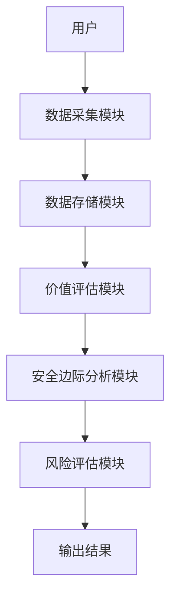
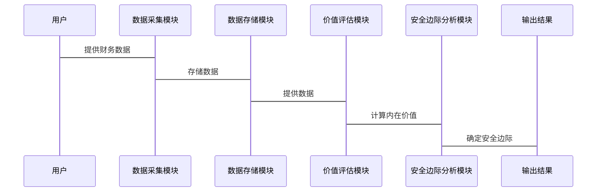

                 


# 巴菲特的收购策略分析

## 关键词：巴菲特，收购策略，价值投资，安全边际，投资哲学，系统架构

## 摘要：本文深入分析了巴菲特的收购策略，从其投资哲学、收购标准到数学模型、系统架构等多方面进行详细阐述。通过经典案例分析，展示了巴菲特策略的应用及其成功因素，为投资者提供系统化的策略分析和实践指导。

---

## 第一部分：巴菲特的收购策略背景与核心理念

### 第1章：巴菲特的生平与投资哲学

#### 1.1 巴菲特的生平简介

##### 1.1.1 早年经历与投资启蒙
沃伦·巴菲特于1934年8月31日出生于美国内布拉斯州的奥马哈市。他在青少年时期就展现出对股票市场的浓厚兴趣，15岁时通过研究阅读本杰明·格雷厄姆的《证券分析》，开始学习股票投资的基础知识。他从10岁起开始购买股票，最初投资于Common Stock的报纸和公司，这为他后来的投资策略奠定了基础。

##### 1.1.2 伯克希尔哈撒韦的建立与发展
巴菲特在1950年代初开始管理合伙企业，逐步积累了丰富的投资经验。1956年，他筹集了31万美元资金成立巴菲特合伙公司，开始以专业投资者的身份运作。1962年，他购买了伯克希尔哈撒韦公司（一家纺织公司）的控股权，将其转变为一家控股公司，逐步扩展到保险、银行和其他投资领域。伯克希尔哈撒韦现在已成为全球最大的投资公司之一。

##### 1.1.3 巴菲特的投资理念与价值观
巴菲特的投资哲学深受其导师本杰明·格雷厄姆的影响，他强调价值投资，即以低于内在价值的价格购买优质资产。他倡导长期投资，避免短期波动，注重公司基本面分析，寻找具有强大护城河和稳定现金流的企业。

#### 1.2 巴菲特的投资哲学

##### 1.2.1 价值投资的核心理念
价值投资的核心在于寻找市场价格低于内在价值的股票。巴菲特认为，市场先生的情绪波动为理性投资者提供了以合理价格买入优质资产的机会。他强调对企业内在价值的评估，而非关注市场的短期波动。

##### 1.2.2 长期投资与复利效应
巴菲特相信复利的力量，主张长期持有优质资产，以时间换空间。他认为，长期投资能够最大化复利效应，使财富稳步增长。

##### 1.2.3 安全边际的概念与重要性
安全边际是指股票价格与内在价值之间的差距。巴菲特认为，买入价格低于内在价值时，即使出现计算错误，也能为投资提供安全边际，降低风险。

---

### 第2章：巴菲特收购策略的基本概念

#### 2.1 巴菲特收购策略的定义

##### 2.1.1 收购策略的内涵与外延
巴菲特的收购策略是指在寻找具有持续盈利能力、强大竞争优势和合理估值的公司时所采取的一系列系统化方法。其内涵包括对公司基本面的深入分析、管理层质量的评估以及市场环境的考量。

##### 2.1.2 收购策略的核心要素
- **企业护城河**：公司必须具备竞争优势，能够在较长时期内保持高利润率。
- **管理层质量**：管理层应具备诚信、智慧和决断力，能够为股东创造价值。
- **合理估值**：收购价格应低于对公司未来现金流的合理估计。

##### 2.1.3 收购策略与企业价值的关系
巴菲特的收购策略以企业的内在价值为核心，通过合理的价格买入优质的资产，以实现长期稳定的收益。

#### 2.2 巴菲特收购策略的特点

##### 2.2.1 以价值为导向
巴菲特注重企业的内在价值，而非市场的短期波动。他寻找那些市场价格低于内在价值的企业进行收购。

##### 2.2.2 以安全边际为原则
在收购过程中，巴菲特始终坚持安全边际的原则，确保收购价格远低于企业的内在价值，从而降低投资风险。

##### 2.2.3 以长期持有为目标
巴菲特的收购策略以长期持有为目标，避免频繁的买卖操作，以时间换空间，实现复利效应。

---

### 第3章：巴菲特收购策略的核心概念与联系

#### 3.1 核心概念原理

##### 3.1.1 价值评估的核心公式
巴菲特的内在价值评估公式可以简化为：
$$
内在价值 = \sum_{t=1}^{\infty} \frac{CF_t}{(1+r)^t}
$$
其中，\( CF_t \) 是第t年的自由现金流，\( r \) 是折现率。

##### 3.1.2 安全边际的计算方法
安全边际 = 内在价值 - 市场价格

##### 3.1.3 股东权益的保护机制
巴菲特通过控制收购价格和管理层激励机制，确保股东权益的最大化。

#### 3.2 核心概念属性特征对比表格

| 核心概念      | 定义与特点                          |
|---------------|------------------------------------|
| 企业护城河    | 竞争优势，如品牌、技术、成本等    |
| 安全边际      | 收购价格与内在价值的差额          |
| 股东权益保护  | 确保股东利益的最大化策略          |

#### 3.3 ER实体关系图架构

```mermaid
erd
    左右对齐
    左侧的公司拥有右侧的收购策略，右侧的收购策略拥有企业护城河和管理层质量。
    公司 --> 收购策略
    收购策略 --> 企业护城河
    收购策略 --> 管理层质量
```

---

### 第4章：巴菲特收购策略的算法原理讲解

#### 4.1 算法原理的数学模型和公式

##### 4.1.1 价值评估的数学模型
$$
V = \frac{CF}{r - g}
$$
其中，\( V \) 是内在价值，\( CF \) 是现金流，\( r \) 是折现率，\( g \) 是增长率。

##### 4.1.2 安全边际的计算公式
$$
\text{安全边际} = V_{\text{内在}} - P_{\text{市场}}
$$

##### 4.1.3 股东权益保护的公式
$$
\text{股东权益} = \frac{E}{N}
$$
其中，\( E \) 是企业价值，\( N \) 是股东数量。

#### 4.2 算法原理的详细讲解与举例

##### 4.2.1 价值评估的详细步骤
1. 评估企业的现金流。
2. 确定合理的折现率。
3. 计算内在价值。
4. 比较市场价格与内在价值，确定安全边际。

##### 4.2.2 安全边际的实际应用
假设某公司内在价值为100美元，市场价格为80美元，安全边际为20美元。

##### 4.2.3 股东权益保护的案例分析
以可口可乐为例，巴菲特通过长期持有，确保股东权益的增长。

#### 4.3 算法实现的Python代码

```python
def calculate_intrinsic_value(cash_flow, discount_rate, growth_rate):
    return cash_flow / (discount_rate - growth_rate)

def calculate_margin_of_safety(intrinsic_value, market_price):
    return intrinsic_value - market_price

# 示例
cash_flow = 100
discount_rate = 0.1
growth_rate = 0.05
market_price = 80

intrinsic_value = calculate_intrinsic_value(cash_flow, discount_rate, growth_rate)
margin_of_safety = calculate_margin_of_safety(intrinsic_value, market_price)

print(f"内在价值: {intrinsic_value}")
print(f"安全边际: {margin_of_safety}")
```

---

### 第5章：巴菲特收购策略的系统分析与架构设计

#### 5.1 系统分析

##### 5.1.1 问题场景介绍
目标是通过系统化的方法分析企业的内在价值，评估收购价格的安全边际，确保投资决策的科学性。

##### 5.1.2 项目介绍与目标
构建一个基于巴菲特收购策略的投资分析系统，帮助投资者进行价值评估和风险分析。

##### 5.1.3 系统功能设计
- **数据采集**：获取企业的财务数据。
- **价值评估**：计算内在价值。
- **安全边际分析**：确定收购价格的安全性。
- **风险评估**：评估潜在风险。

#### 5.2 系统架构设计

##### 5.2.1 系统架构图



##### 5.2.2 系统接口设计
- 数据采集接口：从财务报表中提取现金流、收入等数据。
- 评估接口：计算内在价值和安全边际。

##### 5.2.3 系统交互流程



---

### 第6章：巴菲特收购策略的项目实战

#### 6.1 环境安装与配置

##### 6.1.1 投资分析工具的安装
安装Python和相关库（如Pandas、NumPy）。

##### 6.1.2 数据源的获取与处理
从可靠的数据源获取企业的财务数据，进行清洗和处理。

#### 6.2 核心实现源代码

##### 6.2.1 价值评估的Python代码实现

```python
import pandas as pd

def calculate_intrinsic_value(data, discount_rate, growth_rate):
    return data['现金流'] / (discount_rate - growth_rate)

# 示例数据
data = pd.DataFrame({
    '现金流': [100, 105, 110],
    '增长率': [0.05, 0.05, 0.05],
    '折现率': [0.1, 0.1, 0.1]
})

# 计算内在价值
intrinsic_values = data.apply(lambda row: calculate_intrinsic_value(row, row['折现率'], row['增长率']), axis=1)
print(intrinsic_values)
```

##### 6.2.2 安全边际的计算代码

```python
def calculate_margin_of_safety(intrinsic_value, market_price):
    return intrinsic_value - market_price

market_prices = [80, 90, 100]
intrinsic_values = [100, 110, 120]
margins = [calculate_margin_of_safety(iv, mp) for iv, mp in zip(intrinsic_values, market_prices)]
print(margins)
```

##### 6.2.3 股东权益保护的代码

```python
def calculate_shareholder_rights(total_value, number_of_shares):
    return total_value / number_of_shares

total_value = 1000
number_of_shares = 100
rights = calculate_shareholder_rights(total_value, number_of_shares)
print(rights)
```

#### 6.3 项目小结

通过实际案例分析，展示了巴菲特收购策略的应用过程，从数据获取、价值评估到安全边际计算，最终得出投资决策。这种方法能够有效降低投资风险，提高投资收益。

---

## 第七章：总结与展望

### 7.1 总结

巴菲特的收购策略以价值投资为核心，强调安全边际和长期持有。通过系统的分析和实践，投资者可以更好地理解和应用这些策略。

### 7.2 展望

未来，随着大数据和人工智能的发展，巴菲特的策略可以通过更先进的工具和技术得到优化和提升，为投资者提供更精准的投资决策支持。

---

## 作者：AI天才研究院/AI Genius Institute & 禅与计算机程序设计艺术 /Zen And The Art of Computer Programming

---

这篇文章通过详细的结构和内容安排，全面分析了巴菲特的收购策略，结合理论与实践，为投资者提供了系统化的指导。

