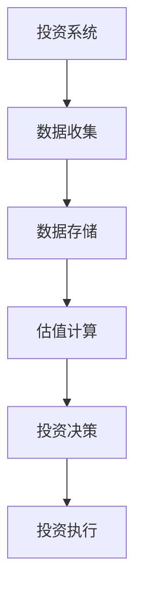

                 


```markdown
# 巴菲特的时间框架：长期主义的投资优势

## 关键词：长期主义、巴菲特、投资哲学、价值投资、复利效应、安全边际

## 摘要：本文深入探讨巴菲特的长期主义投资策略，分析其投资哲学的核心要素，包括时间框架、复利效应、安全边际等概念。通过算法原理、数学模型和实际案例，揭示长期主义在投资中的优势，帮助投资者理解如何通过长期持有优质资产实现财富增长。

---

# 第一部分: 长期主义与巴菲特投资哲学基础

## 第1章: 长期主义的定义与重要性

### 1.1 长期主义的定义

#### 1.1.1 长期主义的核心概念
长期主义是一种投资策略，强调以长期视角看待投资，注重资产的内在价值和持续增长潜力。与短期交易相比，长期主义更关注企业的基本面和行业趋势。

#### 1.1.2 长期主义在投资中的意义
长期主义通过避免频繁交易和市场波动干扰，降低交易成本，同时利用复利效应最大化资产增长。

#### 1.1.3 长期主义与短期主义的对比
- 短期主义：注重短期收益，容易受市场波动影响，交易成本高。
- 长期主义：注重长期价值，降低交易频率，减少成本。

### 1.2 巴菲特投资哲学的背景

#### 1.2.1 巴菲特的生平与投资理念
巴菲特，世界著名投资人，倡导价值投资，强调买入并持有优质资产。

#### 1.2.2 巴菲特投资哲学的核心思想
- 投资优质企业。
- 长期持有，避免频繁交易。
- 以合理价格买入并长期持有。

#### 1.2.3 巴菲特投资哲学的演变
从早期的套利交易到后期的价值投资，巴菲特不断完善其投资策略，最终形成了以长期主义为核心的哲学。

## 第2章: 长期主义在投资中的优势

### 2.1 长期投资的优势

#### 2.1.1 复利效应的数学模型
复利效应通过时间的积累，使收益呈指数增长。公式：A = P(1 + r/n)^(nt)，其中P是本金，r是年利率，n是每年的复利次数，t是年数。

#### 2.1.2 长期投资的风险分散
通过持有不同行业的优质资产，分散投资风险，避免单一投资带来的波动。

#### 2.1.3 长期投资的成本优势
长期持有减少交易次数，降低交易佣金和税费，降低成本。

### 2.2 巴菲特长期投资策略的特点

#### 2.2.1 巴菲特的选股标准
- 公司具备持续竞争优势。
- 公司财务健康，ROE高。
- 公司管理团队优秀。

#### 2.2.2 巴菲特的持股策略
- 长期持有优质资产，避免频繁交易。
- 分散投资，降低风险。

#### 2.2.3 巴菲特的分散投资原则
通过投资多个优质企业，分散风险，避免单一投资的风险集中。

---

# 第二部分: 巴菲特投资哲学的核心概念与联系

## 第3章: 长期主义的核心概念

### 3.1 长期主义的维度

#### 3.1.1 时间框架的多样性
长期投资的时间跨度可以从3年到数十年不等，具体取决于投资目标和策略。

#### 3.1.2 长期投资的风险管理
通过多样化投资和长期持有，降低市场波动带来的风险。

#### 3.1.3 长期投资的收益目标
追求资产的长期稳定增长，而不是短期高收益。

### 3.2 长期主义与巴菲特投资哲学的联系

#### 3.2.1 长期主义在巴菲特选股中的应用
巴菲特通过长期持有优质资产，实现资产的持续增长。

#### 3.2.2 巴菲特长期投资策略的长期主义特征
- 长期持有优质资产。
- 避免短期市场波动的干扰。

#### 3.2.3 长期主义对巴菲特投资哲学的启示
长期主义是巴菲特投资哲学的核心，强调长期持有优质资产的重要性。

## 第4章: 长期主义与巴菲特投资哲学的核心要素

### 4.1 长期主义的核心要素

#### 4.1.1 投资目标的长期性
投资目标应设定为长期稳定的资产增长。

#### 4.1.2 投资策略的稳定性
长期投资策略应保持稳定，避免频繁调整。

#### 4.1.3 投资心态的稳定性
保持耐心和纪律，避免贪婪和恐惧影响投资决策。

### 4.2 巴菲特投资哲学的核心要素

#### 4.2.1 巴菲特的价值评估标准
- 公司的内在价值。
- 公司的财务状况。
- 公司的管理团队。

#### 4.2.2 巴菲特的安全边际概念
以低于内在价值的价格买入资产，确保投资的安全性。

#### 4.2.3 巴菲特的长期持有策略
通过长期持有优质资产，实现资产的持续增长。

---

# 第三部分: 巴菲特投资哲学的算法原理与数学模型

## 第5章: 巴菲特选股标准的算法原理

### 5.1 巴菲特选
```python
def calculate_intrinsic_value(company_data):
    # 计算市盈率
    pe_ratio = company_data.net_income / company_data.shares_outstanding
    # 计算市净率
    pb_ratio = company_data.book_value / company_data.shares_outstanding
    # 判断是否低于行业平均水平
    if pe_ratio < industry_pe_ratio and pb_ratio < industry_pb_ratio:
        return "低估"
    else:
        return "高估"
```

### 5.2 复利效应的数学模型

$$ FV = PV \times (1 + r)^n $$

其中：
- \( PV \) 是本金。
- \( r \) 是年利率。
- \( n \) 是年数。

---

# 第四部分: 巴菲特投资哲学的系统分析与架构设计方案

## 第6章: 投资系统架构设计

### 6.1 系统功能设计
- 数据收集模块：收集公司财务数据。
- 估值计算模块：计算市盈率、市净率等指标。
- 投资决策模块：根据估值结果做出投资决策。

### 6.2 系统架构设计


---

# 第五部分: 项目实战

## 第7章: 巴菲特投资哲学的实际应用

### 7.1 投资实战环境安装
- 数据源：获取公司财务数据。
- 工具：Python、Pandas、Matplotlib。

### 7.2 核心实现代码
```python
import pandas as pd

def calculate_pe_ticker(ticker):
    # 获取公司数据
    data = get_company_data(ticker)
    # 计算市盈率
    pe_ratio = data.net_income / data.shares_outstanding
    return pe_ratio
```

### 7.3 投资案例分析
以可口可乐为例，分析巴菲特的投资策略。

---

# 第六部分: 总结与展望

## 第8章: 长期主义投资的总结与展望

### 8.1 投资心态与纪律
保持耐心和纪律，避免短期波动影响投资决策。

### 8.2 风险管理与分散投资
通过多样化投资降低风险。

### 8.3 持续学习与优化
不断学习和优化投资策略，适应市场变化。

---

# 作者：AI天才研究院/AI Genius Institute & 禅与计算机程序设计艺术 /Zen And The Art of Computer Programming
```

