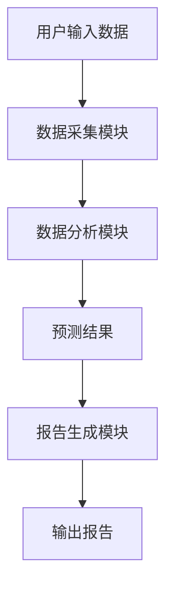

                 


# 巴菲特的现金流分析在SaaS企业中的新解读

> 关键词：巴菲特，现金流分析，SaaS企业，自由现金流，财务健康评估，价值投资

> 摘要：本文从巴菲特的价值投资理念出发，详细解读现金流分析在SaaS企业中的应用。通过分析SaaS企业的财务特征、现金流预测模型、数学算法、系统架构设计以及项目实战，为读者提供一套完整的现金流分析方法论。文章结合实际案例，深入探讨如何利用现金流分析优化SaaS企业的财务管理和投资决策。

---

## 第1章 巴菲特的现金流分析概述

### 1.1 巴菲特投资理念的核心

#### 1.1.1 巴菲特的价值投资理念
巴菲特的价值投资理念强调长期持有优质资产，关注企业的内在价值。他提出“安全边际”概念，即以低于内在价值的价格买入优质企业。现金流是衡量企业内在价值的重要指标之一，尤其是自由现金流（FCF），因为它反映了企业在不依赖外部融资的情况下，能够产生多少现金用于偿还债务、投资于新项目或回馈股东。

#### 1.1.2 现金流在巴菲特投资中的重要性
在巴菲特的投资策略中，现金流被视为企业财务健康的核心指标。他认为，一个企业如果能够持续产生正的自由现金流，说明其商业模式是可持续的，且具备竞争优势。现金流充裕的企业在经济下行周期中更能抵御风险。

#### 1.1.3 SaaS企业与传统企业的现金流差异
SaaS（软件即服务）企业的收入模式以订阅制为主，具有以下特点：
- 收入来源稳定，客户续签率高。
- 销售周期短，但获客成本较高。
- 现金流波动性较小，但前期投入较大。

与传统企业相比，SaaS企业的现金流分析需要特别关注客户获取成本（CAC）和客户生命周期价值（CLV）。

---

### 1.2 现金流分析的基本概念

#### 1.2.1 现金流的定义与分类
现金流是指企业在一定时期内，由于经营活动、投资活动和筹资活动而产生的现金流入和流出。现金流可以分为以下三类：
1. **经营活动现金流**：来自企业日常运营的现金流，如销售收入、成本支出。
2. **投资活动现金流**：来自企业投资活动的现金流，如购买固定资产、出售投资。
3. **筹资活动现金流**：来自企业筹资活动的现金流，如贷款、发行股票、偿还债务。

#### 1.2.2 自由现金流的计算公式
自由现金流（FCF）是衡量企业财务健康的重要指标，公式如下：

$$\text{自由现金流} = \text{净利润} - \text{折旧与摊销} + \text{非现金支出}$$

其中：
- 净利润：企业税后利润。
- 折旧与摊销：非现金支出，需要加回计算现金流。
- 非现金支出：如研发支出、营销支出等。

#### 1.2.3 现金流与企业价值的关系
现金流与企业价值密切相关。企业价值可以用未来现金流的现值来衡量。巴菲特常用贴现现金流模型（DCF）来评估企业价值，公式如下：

$$\text{企业价值} = \sum_{t=1}^{n} \frac{\text{现金流}_t}{(1+r)^t}$$

其中：
- 现金流\_t：第t年的现金流。
- r：贴现率。
- n：现金流预测的年数。

---

### 1.3 SaaS企业的独特财务特征

#### 1.3.1 SaaS企业的收入模式
SaaS企业的收入模式以订阅制为主，收入来源稳定，客户续签率高。然而，前期获客成本较高，需要通过长期客户关系来摊销。

#### 1.3.2 SaaS企业的客户获取成本
客户获取成本（CAC）是SaaS企业的重要指标，公式如下：

$$\text{CAC} = \frac{\text{销售和营销支出}}{\text{新增客户数}}$$

CAC越低，企业的盈利能力越强。

#### 1.3.3 SaaS企业的现金流波动性
由于订阅制的收入模式，SaaS企业的现金流波动性较小，但前期可能需要大量资本支出用于技术研发和市场推广。

---

## 第2章 SaaS企业的现金流预测模型

### 2.1 现金流预测的基本原理

#### 2.1.1 现金流预测的定义与作用
现金流预测是指根据历史数据和未来预期，预测企业在一定时期内的现金流情况。其作用包括：
- 优化资金管理，确保企业运营资金充裕。
- 支持投资决策，评估新项目的可行性。
- 评估企业财务健康，为投资者提供参考。

#### 2.1.2 现金流预测的关键指标
- **收入增长率**：预测企业收入的未来增长。
- **客户留存率**：预测客户续签情况。
- **获客成本**：预测销售和营销支出。

#### 2.1.3 现金流预测的数学模型
现金流预测可以采用时间序列分析或机器学习算法。以下是一个简单的线性回归模型：

$$\text{现金流}_t = a \cdot t + b + \epsilon$$

其中：
- \(a\)：斜率，表示现金流随时间的变化趋势。
- \(b\)：截距。
- \(\epsilon\)：误差项。

---

### 2.2 SaaS企业的现金流预测方法

#### 2.2.1 历史数据分析法
通过分析历史现金流数据，识别趋势和季节性波动，预测未来现金流。

#### 2.2.2 客户生命周期模型
将客户分为新客户、成熟客户和流失客户，预测不同阶段客户的现金流贡献。

#### 2.2.3 财务比率分析法
通过分析财务比率（如收入增长率、获客成本率等）预测现金流。

---

### 2.3 现金流预测的实战应用

#### 2.3.1 现金流预测的步骤与流程
1. 收集历史数据，包括收入、成本、客户数等。
2. 确定预测模型，如线性回归或时间序列分析。
3. 预测未来现金流，评估企业财务健康。
4. 调整模型参数，优化预测精度。

#### 2.3.2 现金流预测的工具与技术
- 数据分析工具：Python、Excel、Tableau。
- 机器学习算法：随机森林、XGBoost。
- 时间序列分析：ARIMA、Prophet。

#### 2.3.3 现金流预测的案例分析
假设某SaaS企业历史数据如下：

| 年份 | 收入（万元） | 客户数（人） | 获客成本（万元） |
|------|--------------|--------------|------------------|
| 2020 | 1000         | 100          | 50               |
| 2021 | 1200         | 150          | 75               |
| 2022 | 1500         | 200          | 100              |

预测2023年的收入增长率为20%，获客成本增长率为15%。预测现金流如下：

$$\text{2023年收入} = 1500 \times 1.2 = 1800 \text{万元}$$

$$\text{2023年获客成本} = 100 \times 1.15 = 115 \text{万元}$$

---

## 第3章 现金流分析的数学模型与算法

### 3.1 现金流分析的数学公式

#### 3.1.1 自由现金流公式
$$\text{自由现金流} = \text{净利润} - \text{折旧与摊销} + \text{非现金支出}$$

#### 3.1.2 现金流贴现模型
$$\text{企业价值} = \sum_{t=1}^{n} \frac{\text{现金流}_t}{(1+r)^t}$$

#### 3.1.3 现金流波动性模型
$$\text{标准差} = \sqrt{\sum_{i=1}^{n} (\text{现金流}_i - \text{平均现金流})^2 / (n-1)}$$

---

### 3.2 现金流分析的算法原理

#### 3.2.1 时间序列分析
时间序列分析是一种常用的数据分析方法，适用于预测现金流的时间变化。以下是ARIMA模型的步骤：

1. 确定数据的平稳性，如果不平稳，进行差分处理。
2. 选择合适的ARIMA参数（p, d, q）。
3. 拟合模型并预测未来现金流。

---

## 第4章 现金流分析的系统架构设计

### 4.1 系统功能设计

#### 4.1.1 系统需求分析
系统需要实现现金流预测、财务健康评估、投资决策支持等功能。

#### 4.1.2 系统功能模块划分
- 数据采集模块：采集企业财务数据。
- 数据分析模块：进行现金流预测和分析。
- 报告生成模块：输出财务健康评估报告。
- 用户界面模块：提供直观的可视化界面。

#### 4.1.3 系统流程图设计


---

### 4.2 系统架构设计

#### 4.2.1 分层架构设计
- 数据层：存储企业财务数据。
- 业务逻辑层：实现现金流预测算法。
- 表现层：提供用户交互界面。

#### 4.2.2 微服务架构设计
- 独立的服务模块：数据采集、数据分析、报告生成。
- 服务间通过API进行通信。

#### 4.2.3 数据库设计
- 使用关系型数据库（如MySQL）存储财务数据。
- 数据表包括收入、成本、客户数等字段。

---

### 4.3 系统接口设计

#### 4.3.1 API接口定义
- GET /api/cashflow/predict：获取现金流预测结果。
- POST /api/cashflow/analyze：提交数据分析任务。

#### 4.3.2 接口调用流程
1. 用户通过API提交数据。
2. 系统接收数据并进行预测。
3. 返回预测结果。

#### 4.3.3 接口安全设计
- 使用JWT进行身份验证。
- 设置权限控制，确保只有授权用户可以调用API。

---

## 第5章 项目实战与最佳实践

### 5.1 环境搭建与工具安装

#### 5.1.1 开发环境配置
- 安装Python、Jupyter Notebook。
- 安装数据分析库（如Pandas、NumPy）。

#### 5.1.2 数据库安装与配置
- 安装MySQL或MongoDB。
- 配置数据库连接信息。

#### 5.1.3 开发工具安装
- 安装Visual Studio Code或PyCharm。
- 安装数据可视化库（如Matplotlib、Seaborn）。

---

### 5.2 系统核心实现

#### 5.2.1 现金流预测算法实现
```python
import pandas as pd
from sklearn.linear_model import LinearRegression

# 数据准备
data = pd.DataFrame({
    '年份': [2020, 2021, 2022],
    '收入': [1000, 1200, 1500],
    '客户数': [100, 150, 200]
})

# 建立线性回归模型
model = LinearRegression()
model.fit(data[['年份']], data['收入'])

# 预测2023年的收入
predicted_income = model.predict([[2023]])
print(predicted_income)
```

#### 5.2.2 系统功能模块实现
- 数据采集模块：使用爬虫技术采集企业财务数据。
- 数据分析模块：实现现金流预测算法。
- 报告生成模块：生成财务健康评估报告。

#### 5.2.3 系统测试与优化
- 进行单元测试，确保各模块功能正常。
- 优化算法性能，提高预测精度。

---

### 5.3 项目案例分析

#### 5.3.1 案例背景介绍
以某SaaS企业为例，分析其现金流情况，评估企业财务健康。

#### 5.3.2 现金流分析过程
1. 收集企业过去三年的财务数据。
2. 使用线性回归模型预测未来现金流。
3. 评估企业价值，判断是否符合投资标准。

#### 5.3.3 实验结果与分析
通过预测模型，得出未来三年的现金流情况，评估企业是否具备投资价值。

---

## 第6章 最佳实践与注意事项

### 6.1 现金流分析的注意事项

#### 6.1.1 数据质量的重要性
确保数据准确、完整，避免因数据问题导致预测偏差。

#### 6.1.2 模型选择的合理性
根据企业特点选择合适的预测模型，避免盲目使用复杂算法。

#### 6.1.3 风险管理的必要性
现金流预测存在不确定性，需建立风险管理机制，应对突发情况。

---

### 6.2 SaaS企业的财务健康评估

#### 6.2.1 评估指标
- 自由现金流。
- 客户获取成本与收入比。
- 客户留存率。

#### 6.2.2 优化建议
- 提高客户留存率，降低获客成本。
- 合理规划资金使用，确保财务健康。

---

## 小结

通过本文的分析，我们可以看到，现金流分析在SaaS企业中的应用具有重要意义。结合巴菲特的价值投资理念，我们可以更好地评估企业财务健康，优化资金管理，支持投资决策。未来，随着技术的进步，现金流分析将更加智能化、精准化，为SaaS企业的发展提供更有力的支持。

---

## 作者

作者：AI天才研究院/AI Genius Institute & 禅与计算机程序设计艺术 /Zen And The Art of Computer Programming

