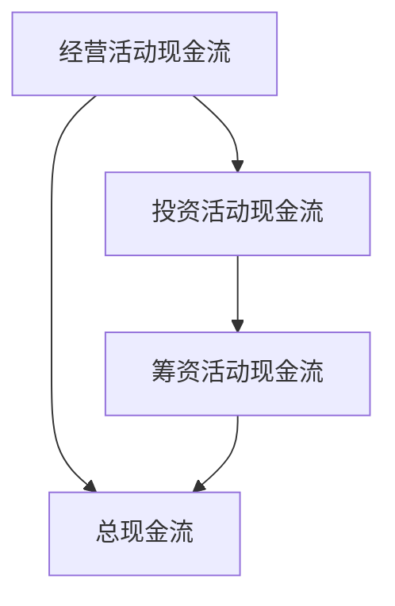
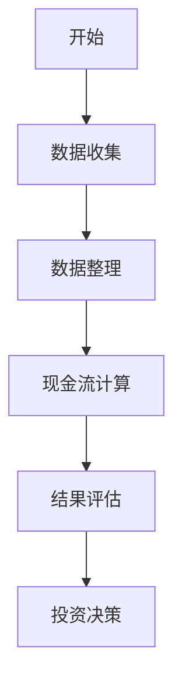
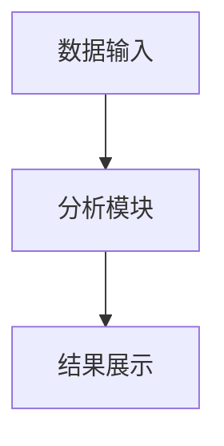
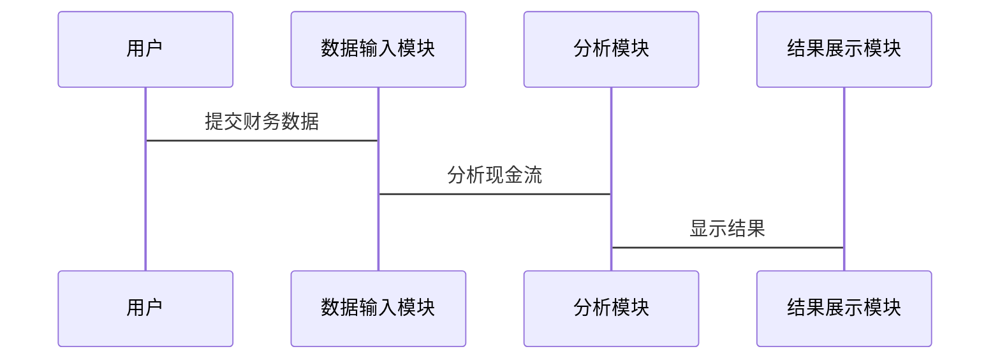

                 


# 巴菲特的现金流分析方法

## 关键词
现金流分析，巴菲特，投资决策，财务健康，自由现金流

## 摘要
本文深入探讨了巴菲特的现金流分析方法，分析其核心概念、算法原理、系统架构及实际应用，结合Python代码实现，通过苹果公司案例详细解读，总结最佳实践，为投资决策提供科学依据。

---

## 第一部分：现金流分析的基本概念

### 1. 现金流的基本定义

#### 1.1 现金流的定义
现金流是指企业在一定时期内现金的流入和流出情况，反映企业资金流动的动态。

#### 1.2 现金流的分类
现金流分为三类：经营活动现金流、投资活动现金流和筹资活动现金流。

#### 1.3 现金流在企业中的重要性
现金流是企业财务健康的重要指标，影响企业的偿债能力和运营能力。

### 2. 巴菲特的现金流分析方法

#### 2.1 巴菲特的现金流分析概述
巴菲特强调现金流的重要性，认为企业应具备稳定的现金流。

#### 2.2 现金流分析的核心理念
现金流分析关注企业实际资金流动情况，而非仅仅依赖利润表。

#### 2.3 现金流分析与其他方法的区别
现金流分析侧重实际资金流动，而传统财务分析侧重利润和资产负债。

### 3. 现金流分析的背景与应用

#### 3.1 现金流分析的背景
现金流分析在投资决策中起到关键作用，尤其在评估企业财务健康时。

#### 3.2 现金流分析在投资决策中的应用
通过现金流分析，投资者可以评估企业的盈利能力和偿债能力。

#### 3.3 现金流分析的边界与外延
现金流分析适用于企业财务评估，但需结合其他因素综合考虑。

---

## 第二部分：现金流的核心概念与联系

### 1. 现金流的核心概念

#### 1.1 经营活动现金流
经营活动现金流是企业日常运营产生的现金流，包括销售商品、提供服务等。

#### 1.2 投资活动现金流
投资活动现金流是企业投资于长期资产的现金流，如购买或出售固定资产。

#### 1.3 筹资活动现金流
筹资活动现金流是企业通过融资活动获得或支付的现金流，如发行债券、偿还贷款等。

### 2. 现金流的分类对比

#### 2.1 现金流分类对比表格
| 类型             | 来源                                                                 |
|------------------|----------------------------------------------------------------------|
| 经营活动现金流   | 日常业务运营产生的现金流                                             |
| 投资活动现金流   | 投资于长期资产的现金流                                             |
| 筹资活动现金流   | 通过融资活动获得或支付的现金流                                             |

#### 2.2 现金流分类的Mermaid流程图


---

## 第三部分：现金流分析的算法原理

### 1. 现金流分析的基本步骤

#### 1.1 数据收集与整理
收集企业的财务报表，整理现金流数据。

#### 1.2 现金流计算与分析
计算净现金流，分析其正负情况。

#### 1.3 结果评估与决策
评估企业财务健康状况，做出投资决策。

### 2. 现金流分析的数学模型

#### 2.1 现金流计算公式
$$ 现金流净额 = 现金流入 - 现金流出 $$

### 3. 现金流分析的Mermaid流程图


---

## 第四部分：系统分析与架构设计

### 1. 系统架构设计

#### 1.1 系统功能设计
- 数据输入模块：接收财务数据
- 分析模块：计算现金流
- 结果展示模块：显示分析结果

#### 1.2 系统架构图


### 2. 系统接口设计

#### 2.1 系统接口设计
- 数据输入接口：接收财务数据
- 分析接口：调用现金流计算函数
- 结果展示接口：显示分析结果

### 3. 系统交互设计

#### 3.1 系统交互序列图


---

## 第五部分：项目实战

### 1. 项目背景与目标

#### 1.1 项目背景
分析苹果公司的现金流情况，评估其财务健康状况。

### 2. 环境安装与数据准备

#### 2.1 安装Python环境
安装Python和相关库，如Pandas、Matplotlib。

#### 2.2 数据准备
收集苹果公司最近几年的财务报表数据。

### 3. 核心实现

#### 3.1 现金流计算代码
```python
import pandas as pd

# 假设df是包含现金流数据的DataFrame
def calculate_cash_flow(df):
    cash_flow = df['现金流入'] - df['现金流出']
    return cash_flow

cash_flow = calculate_cash_flow(df)
print(cash_flow)
```

#### 3.2 现金流分析代码
```python
import matplotlib.pyplot as plt

cash_flow.plot(kind='bar')
plt.title('现金流量分析')
plt.xlabel('年份')
plt.ylabel('现金流')
plt.show()
```

### 4. 案例分析与解读

#### 4.1 财务报表分析
解读苹果公司的现金流量表，分析其现金流来源和用途。

#### 4.2 自由现金流计算
$$ 自由现金流 = 经营活动现金流 - 投资活动现金流 $$

### 5. 项目总结

#### 5.1 项目小结
通过现金流分析，评估苹果公司的财务健康状况，为投资决策提供依据。

---

## 第六部分：最佳实践

### 1. 现金流分析的关键点

#### 1.1 关键点
- 重视现金流的质量
- 结合其他财务指标综合分析
- 长期跟踪企业现金流变化

### 2. 投资建议

#### 2.1 投资建议
- 选择现金流稳定的企业投资
- 结合现金流分析和其他指标做出决策

### 3. 注意事项

#### 3.1 注意事项
- 现金流分析需结合企业实际情况
- 数据来源需准确可靠
- 分析结果需动态更新

### 4. 拓展阅读

#### 4.1 拓展阅读
推荐书籍和文章，深入学习现金流分析方法。

---

## 作者：AI天才研究院 & 禅与计算机程序设计艺术

---

通过以上结构，您可以逐步撰写完整的文章，确保每个部分都详细具体，逻辑清晰，帮助读者全面掌握巴菲特的现金流分析方法。

