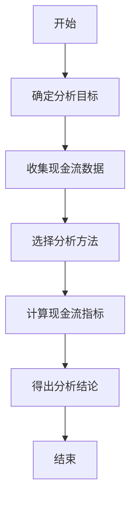
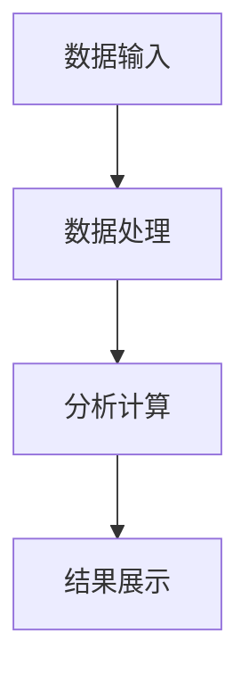

                 

# 巴菲特的现金流分析：公司健康状况的晴雨表

## 关键词：现金流分析，巴菲特，企业估值，自由现金流，投资决策

## 摘要：  
现金流分析是巴菲特评估企业健康和内在价值的核心工具。本文从现金流的基本概念出发，详细阐述了现金流的分类、计算方法及其在投资决策中的应用。通过巴菲特的经典案例，分析了现金流分析在企业估值中的重要性，并结合数学模型和系统架构，深入探讨了现金流分析的算法原理和实际应用。

---

## 第一部分: 背景介绍与核心概念

### 第1章: 股票投资与现金流分析的背景

#### 1.1 股票投资的基本概念  
股票是企业的一部分所有权，投资者通过购买股票成为企业的部分所有者，享有分红和资本增值的收益。股票市场是企业融资和投资者投资的主要场所，其价格波动受到多种因素的影响，包括宏观经济环境、企业基本面和市场情绪等。股票投资的核心目标是通过长期持有优质资产，实现财富的增值。然而，投资过程中也伴随着市场风险、流动性风险和信用风险等挑战。

#### 1.2 现金流分析的重要性  
现金流是指企业在一定时期内通过经营活动、投资活动和筹资活动所获得或支出的现金和现金等价物。现金流分析是评估企业财务健康状况的重要工具，能够反映企业的盈利能力和偿债能力。现金流分析的核心在于识别企业的自由现金流，即企业在满足运营和资本支出需求后剩余的现金流量，这通常被视为企业价值创造的核心指标。

#### 1.3 巴菲特的投资理念与现金流分析  
巴菲特的价值投资理念强调以合理的价格投资于具有持续竞争优势和良好治理的企业。现金流分析在巴菲特的投资决策中占据重要地位，他通过分析企业的自由现金流来评估其内在价值。巴菲特认为，企业价值的真正来源是其创造自由现金流的能力，而非单纯的会计利润。通过现金流分析，巴菲特能够识别那些能够持续产生超额回报的企业，并在市场恐慌时进行逆向投资。

### 第2章: 现金流分析的核心概念  

#### 2.1 现金流的分类与计算  
现金流可以分为经营活动现金流、投资活动现金流和筹资活动现金流三类。经营活动现金流是企业日常运营中产生的现金流，包括销售收入和经营支出；投资活动现金流是企业投资于长期资产或剥离资产所产生的现金流；筹资活动现金流是企业通过借款或发行股票等方式筹集资金或偿还债务所产生的现金流。

自由现金流是衡量企业财务健康状况的重要指标，其计算公式为：
$$ \text{自由现金流} = \text{经营活动现金流} - \text{资本支出} $$

#### 2.2 现金流分析的关键指标  
现金流分析的关键指标包括现金流比率、现金流收益率和现金流质量分析。现金流比率用于衡量企业的流动性，现金流收益率用于评估企业的盈利效率，而现金流质量分析则用于评估企业的现金流来源是否稳定可靠。

#### 2.3 现金流分析的边界与外延  
现金流分析的适用范围主要限于企业的财务数据，其局限性在于无法直接反映企业的无形资产价值和品牌影响力。然而，现金流分析与其他财务指标（如净利润和股东权益）密切相关，可以通过综合分析这些指标来更全面地评估企业的财务状况。

---

## 第二部分: 现金流分析的算法原理  

### 第3章: 现金流分析的数学模型  

#### 3.1 现金流分析的基本公式  
现金流分析的基本公式包括现金流入和现金流出的计算：
$$ \text{现金流入} = \text{销售收入} + \text{其他收入} $$
$$ \text{现金流出} = \text{经营成本} + \text{资本支出} + \text{其他支出} $$

自由现金流的计算公式为：
$$ \text{自由现金流} = \text{净利润} + \text{折旧} + \text{摊销} - \text{资本支出} $$

#### 3.2 现金流分析的高级模型  
现金流贴现模型（DCF模型）是评估企业价值的核心工具，其基本公式为：
$$ \text{NPV} = \sum_{t=1}^{n} \frac{\text{现金流}}{(1 + r)^t} $$
其中，r是贴现率，n是项目的生命周期。

#### 3.3 现金流分析的算法流程  
以下是现金流分析的算法流程图：

### 第4章: 现金流分析的系统架构  

#### 4.1 系统功能设计  
现金流分析系统的功能模块包括：
- 数据输入模块：用于输入企业的财务数据。
- 数据处理模块：对输入数据进行清洗和转换。
- 分析计算模块：根据选定的分析方法计算现金流指标。
- 结果展示模块：以图表和报告的形式展示分析结果。

#### 4.2 系统架构设计  
以下是现金流分析系统的架构图：

---

## 总结  

现金流分析是巴菲特评估企业健康状况的核心工具，其重要性体现在对企业内在价值的准确评估和投资决策的科学指导。通过现金流分析，投资者可以识别那些能够持续创造自由现金流的企业，并在市场波动中做出明智的投资决策。未来，随着人工智能和大数据技术的发展，现金流分析将更加精确和高效，为企业估值和投资决策提供更有力的支持。

---

作者：AI天才研究院/AI Genius Institute & 禅与计算机程序设计艺术/Zen And The Art of Computer Programming

