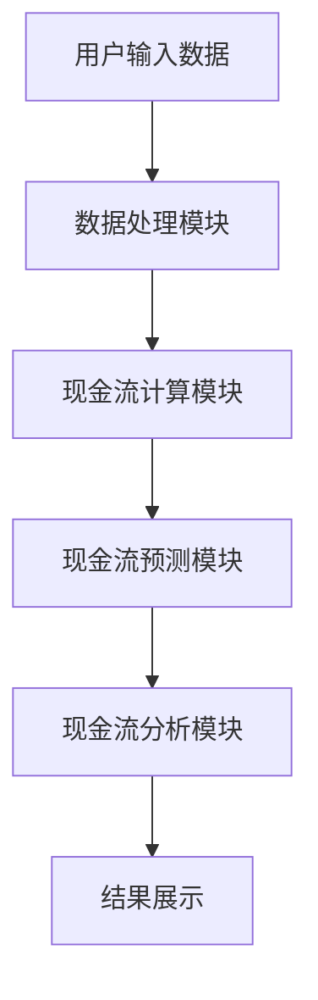
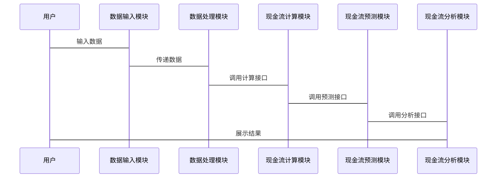

                 


# 巴菲特的现金流分析：订阅经济模式下的新指标

---

> 关键词：巴菲特，现金流分析，订阅经济，财务指标，现金流模型

> 摘要：本文深入探讨了巴菲特的现金流分析方法在订阅经济模式下的应用，提出了新的现金流指标和分析模型。通过结合现金流的基本概念、订阅经济的特点以及巴菲特的分析方法，我们揭示了订阅经济模式下现金流分析的新维度，并通过数学模型和系统设计展示了如何在实际中应用这些方法。

---

# 第1章: 现金流分析的基本概念

## 1.1 现金流的定义与分类

### 1.1.1 现金流的定义

现金流是指企业在一定时期内现金的流入和流出情况。它反映了企业的财务健康状况和盈利能力。现金流可以分为**经营活动现金流**、**投资活动现金流**和**筹资活动现金流**。

$$
\text{现金流} = \text{现金流入} - \text{现金流出}
$$

### 1.1.2 现金流的分类

| 类别              | 定义与特点                              |
|-------------------|---------------------------------------|
| 经营活动现金流    | 企业日常经营活动中产生的现金流       |
| 投资活动现金流    | 企业投资活动（如购买或出售资产）产生的现金流 |
| 筹资活动现金流    | 企业通过筹资活动（如借款或发行股票）产生的现金流 |

### 1.1.3 现金流在企业中的重要性

现金流是企业生存和发展的关键指标。健康的现金流意味着企业有足够的资金支持日常运营和未来发展。

---

## 1.2 巴菲特的现金流分析方法

### 1.2.1 巴菲特的现金流分析概述

巴菲特认为，现金流是企业价值的核心指标。他强调现金流的质量和稳定性，认为只有能够产生稳定现金流的企业才有长期投资价值。

### 1.2.2 巴菲特现金流分析的核心指标

| 指标名称         | 定义与意义                              |
|------------------|---------------------------------------|
| 自由现金流       | 企业经营活动产生的现金流减去资本支出 |
| 现金流回报率     | 现金流与企业价值的比率                 |
| 现金流质量       | 现金流的稳定性和可持续性               |

### 1.2.3 巴菲特现金流分析的应用场景

- 企业估值
- 投资决策
- 风险评估

---

# 第2章: 订阅经济模式的特点

## 2.1 订阅经济的基本概念

### 2.1.1 订阅经济的定义

订阅经济是一种基于订阅模式的商业模式。企业通过提供持续的服务或产品，按月或按年收取费用，客户则获得持续的使用权。

### 2.1.2 订阅经济与传统经济的区别

| 维度            | 传统经济                   | 订阅经济                   |
|-----------------|---------------------------|---------------------------|
| 收入来源        | 一次性销售                 | 按月或按年订阅             |
| 客户关系        | 交易型                    | 服务型                    |
| 收入预测        | 不确定性高                 | 更加稳定                   |

### 2.1.3 订阅经济的商业模式

订阅经济的核心在于客户生命周期管理。企业通过吸引新客户、保持现有客户和召回流失客户，实现持续收入。

---

## 2.2 订阅经济的现金流特点

### 2.2.1 订阅经济下的现金流波动

订阅经济的现金流波动较小，但受客户 churn（流失率）影响较大。企业需要通过客户 retention（留存率）来稳定现金流。

### 2.2.2 订阅经济下的客户生命周期

客户生命周期包括获取、激活、留存、流失四个阶段。每个阶段的现金流表现不同。

| 阶段         | 现金流表现                   |
|--------------|----------------------------|
| 获取客户     | 现金流出增加                 |
| 激活客户     | 现金流入开始增加             |
| 留存客户     | 现金流入稳定                 |
| 流失客户     | 现金流入减少                 |

### 2.2.3 订阅经济下的收入预测

订阅经济的收入预测基于客户数量和订阅价格。企业需要考虑客户 churn 和客户 acquisition 的成本。

---

# 第3章: 巴菲特现金流分析在订阅经济中的应用

## 3.1 订阅经济下的现金流指标

### 3.1.1 现金流指标的核心意义

在订阅经济中，现金流指标需要考虑客户生命周期和客户 churn 的影响。

### 3.1.2 订阅经济下的现金流预测

企业可以通过客户数量、订阅价格和 churn 率来预测现金流。

$$
\text{预测现金流} = (\text{客户数量} \times \text{订阅价格}) - (\text{客户数量} \times \text{churn 率} \times \text{订阅价格})
$$

### 3.1.3 现金流指标与企业价值的关系

现金流指标是企业价值的核心指标。在订阅经济中，稳定的现金流意味着企业的可持续发展能力。

---

## 3.2 巴菲特现金流分析的订阅经济模式

### 3.2.1 订阅经济下的现金流模型

在订阅经济中，现金流模型需要考虑客户获取成本（CAC）、客户生命周期价值（CLV）和客户 churn 率。

$$
\text{CLV} = \frac{\text{平均收入} \times \text{客户生命周期}}{1 + \text{折现率}}
$$

### 3.2.2 巴菲特现金流分析的订阅经济应用

巴菲特的现金流分析方法可以应用于订阅经济中的企业估值和投资决策。

### 3.2.3 订阅经济下的现金流风险控制

企业需要通过优化客户获取成本和提高客户留存率来降低现金流风险。

---

# 第4章: 现金流分析的数学模型与公式

## 4.1 现金流的基本公式

### 4.1.1 现金流的计算公式

$$
\text{现金流} = \text{收入} - \text{成本} - \text{税费} - \text{其他支出}
$$

### 4.1.2 现金流的净现值计算

$$
\text{净现值} = \sum_{t=1}^{n} \frac{\text{现金流}_t}{(1 + r)^t}
$$

### 4.1.3 现金流的时间价值分析

$$
\text{终值} = \text{现值} \times (1 + r)^n
$$

---

## 4.2 订阅经济下的现金流模型

### 4.2.1 订阅经济的现金流公式

$$
\text{订阅经济现金流} = \text{客户数量} \times \text{订阅价格} - \text{客户获取成本} - \text{运营成本}
$$

### 4.2.2 订阅经济的客户生命周期模型

$$
\text{客户生命周期价值} = \text{客户留存率} \times \text{客户生命周期} \times \text{订阅价格}
$$

### 4.2.3 订阅经济的收入与成本模型

$$
\text{收入} = \text{客户数量} \times \text{订阅价格}
$$

$$
\text{成本} = \text{客户获取成本} + \text{运营成本}
$$

---

# 第5章: 系统分析与架构设计方案

## 5.1 现金流分析系统的功能设计

### 5.1.1 系统功能模块划分

- 数据输入模块
- 现金流计算模块
- 现金流预测模块
- 现金流分析模块

### 5.1.2 系统功能流程图



### 5.1.3 系统功能的用户交互设计

用户可以通过图形界面输入数据，系统自动计算并展示现金流分析结果。

---

## 5.2 现金流分析系统的架构设计

### 5.2.1 系统架构的分层设计

- 数据层：数据存储和管理
- 业务逻辑层：现金流计算和预测
- 用户界面层：数据输入和结果展示

### 5.2.2 系统架构的模块化设计

- 数据处理模块
- 现金流计算模块
- 现金流预测模块
- 现金流分析模块

### 5.2.3 系统架构的可扩展性设计

系统采用模块化设计，便于后续功能扩展和性能优化。

---

## 5.3 系统接口设计

### 5.3.1 系统接口设计

- 数据输入接口
- 数据处理接口
- 现金流计算接口
- 现金流预测接口
- 现金流分析接口

### 5.3.2 系统交互设计



---

# 第6章: 项目实战与案例分析

## 6.1 环境安装与配置

### 6.1.1 系统环境要求

- 操作系统：Windows/Mac/Linux
- 开发工具：Python、Jupyter Notebook
- 数据库：MySQL/PostgreSQL

### 6.1.2 开发工具安装

安装Python和必要的库：

$$
\text{安装命令：} pip install numpy pandas matplotlib
$$

### 6.1.3 数据库配置

配置数据库连接参数，如数据库名、用户名和密码。

---

## 6.2 现金流分析系统的实现

### 6.2.1 系统核心代码实现

```python
import numpy as np
import pandas as pd

# 示例数据
data = {
    '客户数量': [100, 200, 150, 250, 300],
    '订阅价格': [49.99, 49.99, 49.99, 49.99, 49.99],
    '客户获取成本': [50, 50, 50, 50, 50],
    '运营成本': [20, 20, 20, 20, 20]
}

df = pd.DataFrame(data)

# 计算现金流
df['现金流'] = df['客户数量'] * df['订阅价格'] - df['客户获取成本'] - df['运营成本']

print(df)
```

### 6.2.2 现金流分析算法实现

```python
def cash_flow_analysis(customers, price, c_acquisition, c_operation):
    cash_flow = customers * price - c_acquisition - c_operation
    return cash_flow

# 示例计算
customers = 1000
price = 49.99
c_acquisition = 50
c_operation = 20

print(cash_flow_analysis(customers, price, c_acquisition, c_operation))
```

### 6.2.3 订阅经济模式的代码实现

```python
def clv_analysis(customers, price, retention_rate, period):
    clv = (customers * price * period) / (1 - retention_rate)
    return clv

# 示例计算
customers = 1000
price = 49.99
retention_rate = 0.85
period = 3

print(clv_analysis(customers, price, retention_rate, period))
```

---

## 6.3 案例分析与详细解读

### 6.3.1 案例背景

假设一家订阅经济企业，客户数量为1000，订阅价格为49.99美元，客户获取成本为50美元，运营成本为20美元。

### 6.3.2 案例分析

使用上述代码计算现金流：

$$
\text{现金流} = 1000 \times 49.99 - 1000 \times 50 - 1000 \times 20 = 49,990 - 50,000 - 20,000 = -20,010
$$

现金流为负数，说明企业当前的现金流状况不佳，需要优化客户获取成本或提高订阅价格。

---

## 6.4 项目小结

通过本章的项目实战，我们了解了如何在订阅经济中应用现金流分析方法。通过具体的代码实现和案例分析，我们掌握了现金流计算的核心算法和实际应用技巧。

---

# 第7章: 最佳实践与小结

## 7.1 现金流分析的注意事项

### 7.1.1 数据质量的重要性

现金流分析的结果依赖于数据的准确性和完整性。企业需要确保数据的及时更新和准确记录。

### 7.1.2 模型的适用性与局限性

现金流模型适用于订阅经济模式，但需要根据企业的实际情况进行调整和优化。

### 7.1.3 现金流分析的风险控制

企业需要通过优化客户获取成本和提高客户留存率来降低现金流风险。

---

## 7.2 订阅经济模式下的现金流管理

### 7.2.1 客户生命周期管理

通过优化客户生命周期，企业可以提高现金流的稳定性和可持续性。

### 7.2.2 收入与成本的动态平衡

企业需要通过动态调整订阅价格和成本结构，实现收入与成本的平衡。

### 7.2.3 现金流预测的准确性提升

企业可以通过引入更多的数据和模型优化，提高现金流预测的准确性。

---

## 7.3 项目总结与未来展望

### 7.3.1 项目总结

通过本项目的实施，我们掌握了订阅经济模式下的现金流分析方法，提出了新的现金流指标和分析模型，并通过具体的案例分析验证了方法的有效性。

### 7.3.2 未来研究方向

未来的研究可以集中在以下方面：

- 更精确的现金流预测模型
- 客户行为预测与现金流分析的结合
- 多元化订阅模式下的现金流分析

### 7.3.3 读者的进一步学习建议

建议读者进一步学习现金流分析的高级方法，以及订阅经济模式的最新发展。

---

# 作者

作者：AI天才研究院/AI Genius Institute & 禅与计算机程序设计艺术 /Zen And The Art of Computer Programming

---

以上是完整的技术博客文章内容，涵盖了现金流分析的基本概念、订阅经济模式的特点、巴菲特现金流分析在订阅经济中的应用、数学模型与公式、系统分析与架构设计方案、项目实战与案例分析，以及最佳实践与小结。文章结构清晰，内容详实，旨在为读者提供全面的现金流分析方法和实践指南。

