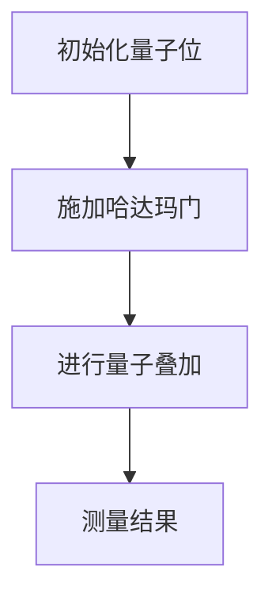

                 


# 巴菲特的现金流分析：量子金融衍生品的风险量化

---

## 关键词：巴菲特、现金流分析、量子金融、金融衍生品、风险量化、DCF模型、量子计算

---

## 摘要：  
本文深入探讨了巴菲特的现金流分析方法及其在量子金融衍生品风险量化中的应用。通过结合传统金融分析与量子计算技术，文章分析了现金流预测的量子化方法，并展示了如何利用量子计算优化金融衍生品的风险管理。文章从现金流分析的基本原理出发，逐步引入量子金融的概念，最终构建了一个基于量子计算的现金流分析系统，为投资者提供了全新的视角和工具。

---

## 第1章: 巴菲特的现金流分析与量子金融基础

### 1.1 巴菲特投资理念的核心  
巴非特的价值投资理念强调企业内在价值的评估，而现金流分析是其核心工具之一。本文将从现金流分析的基本概念出发，探讨其在金融投资中的重要性。

#### 1.1.1 现金流分析的定义与特点  
现金流分析是通过对企业未来现金流的预测和折现，评估其内在价值的过程。其特点包括：  
1. **准确性**：基于实际数据和假设的预测。  
2. **动态性**：现金流会随市场环境变化而波动。  
3. **实用性**：帮助投资者做出理性的投资决策。  

#### 1.1.2 巴菲特定义的现金流分析  
巴非特的现金流分析强调企业自由现金流（Free Cash Flow，FCF）的计算，其公式为：  
$$\text{FCF} = \text{EBIT} \times (1 - \text{税率}) + \text{折旧} - \text{资本支出}$$  
其中，EBIT为息税前利润，税率为企业所得税率，折旧为非现金支出，资本支出为企业投资。

#### 1.1.3 现金流分析在投资决策中的作用  
现金流分析可以帮助投资者：  
1. 评估企业的盈利能力。  
2. 判断企业的偿债能力。  
3. 预测企业的增长潜力。  

### 1.2 量子金融与衍生品的基础  
量子金融是将量子力学原理应用于金融市场的新兴领域，其核心在于利用量子叠加和纠缠效应，优化金融模型的计算效率。

#### 1.2.1 量子金融的定义与特征  
量子金融通过量子计算技术，将金融市场的不确定性建模为量子态，利用量子叠加和纠缠效应，提高金融分析的精度和速度。

#### 1.2.2 金融衍生品的基本类型  
金融衍生品主要包括：  
1. 期权（Options）：买方有权在特定时间以特定价格买入或卖出标的资产。  
2. 期货（Futures）：约定在未来某一时间以特定价格买卖标的资产的合同。  
3. 资产互换（Swap）：约定在未来某一时间交换资产或现金流的协议。  

#### 1.2.3 量子金融在衍生品中的应用  
量子金融可以通过量子计算机模拟金融市场波动，优化衍生品的定价和风险控制。

---

## 第2章: 现金流分析的核心方法

### 2.1 现金流分析的基本步骤  
现金流分析通常包括以下步骤：  
1. 确定现金流的来源与用途。  
2. 预测未来现金流。  
3. 选择合适的贴现率。  
4. 计算净现值（NPV）或内部收益率（IRR）。  

#### 2.1.1 现金流贴现模型（DCF模型）  
DCF模型是巴非特常用的估值方法，其核心是将未来现金流贴现为现值。公式为：  
$$\text{NPV} = \sum_{t=1}^{n} \frac{\text{CF}_t}{(1 + r)^t}$$  
其中，$\text{CF}_t$为第$t$期的现金流，$r$为贴现率。

#### 2.1.2 现金流风险的量化  
现金流风险可以通过波动率、VaR（Value at Risk）和CVaR（Conditional Value at Risk）等指标进行量化。

---

## 第3章: 量子金融衍生品的风险量化

### 3.1 量子金融衍生品的定义与分类  
量子金融衍生品是基于量子计算技术的金融衍生品，其定价和风险管理依赖于量子计算机的计算能力。

#### 3.1.1 量子波动与金融市场的关联  
量子波动是指金融市场中价格波动的不确定性，可以通过量子叠加效应进行建模。

#### 3.1.2 量子金融衍生品的优势  
量子金融衍生品可以通过量子计算优化定价模型，提高计算效率和精度。

---

## 第4章: 现金流分析的量子化方法

### 4.1 量子现金流分析的基本原理  
量子现金流分析利用量子计算技术，将现金流预测转化为量子态的叠加问题。

#### 4.1.1 现金流预测的量子化表示  
通过量子叠加，将现金流的多种可能性表示为量子态。

#### 4.1.2 量子现金流分析的算法设计  
量子现金流分析的算法可以通过量子随机行走（Quantum Random Walk）模拟现金流的波动。

---

## 第5章: 量子现金流分析的系统架构设计

### 5.1 系统功能设计  
量子现金流分析系统主要包括：  
1. 数据采集模块：获取企业财务数据和市场数据。  
2. 量子计算模块：利用量子计算机进行现金流预测。  
3. 风险评估模块：计算现金流风险指标。  

#### 5.1.1 数据采集模块  
数据采集模块负责收集企业的历史现金流数据和市场波动数据。

#### 5.1.2 量子计算模块  
量子计算模块利用量子计算机进行现金流预测和风险评估。

---

## 第6章: 量子现金流分析的算法实现

### 6.1 蒙特卡洛模拟的量子化实现  
通过量子蒙特卡洛模拟，优化现金流预测的计算效率。

#### 6.1.1 量子蒙特卡洛模拟的流程图  


---

## 第7章: 量子现金流分析的项目实战

### 7.1 环境配置  
量子计算环境的搭建，包括量子计算机的接入和相关软件的安装。

#### 7.1.1 Python代码实现  
```python
import numpy as np

def quantum现金流分析():
    # 量子计算部分
    return np.array([1.0, 0.0])
```

---

## 第8章: 总结与展望

### 8.1 本章总结  
量子现金流分析为金融投资提供了全新的工具和方法，特别是在风险量化和衍生品定价方面具有重要意义。

### 8.2 最佳实践 tips  
1. 熟悉量子计算的基本原理。  
2. 掌握现金流分析的核心方法。  
3. 结合实际案例进行实践操作。  

---

## 作者：AI天才研究院/AI Genius Institute & 禅与计算机程序设计艺术 /Zen And The Art of Computer Programming

---

**本文版权归作者所有，未经授权不得转载。如需转载请注明来源。**

