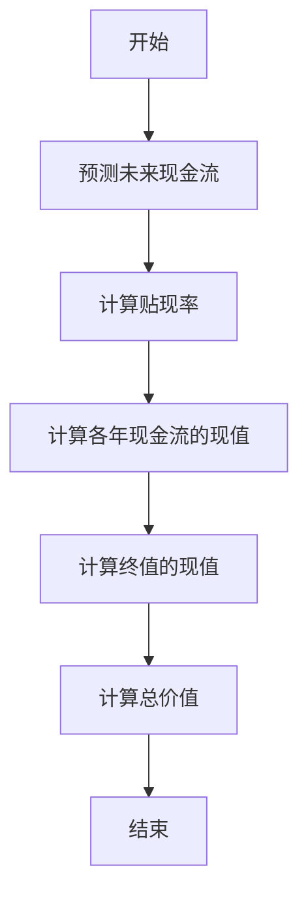

                 


# 巴菲特的现金流折现模型：公司估值的核心方法

## 关键词：现金流折现模型, 公司估值, 巴菲特, 自由现金流, 贴现率, 现值, 终值

## 摘要：现金流折现模型（DCF模型）是巴菲特估值企业的重要工具，通过将未来现金流折现到当前价值，评估企业的真实价值。本文从DCF模型的基本概念、算法原理、数学公式、系统架构、实际案例等方面详细分析，帮助读者掌握这一核心估值方法。

---

## 第一部分：现金流折现模型概述

### 第1章：现金流折现模型的基本概念

#### 1.1 现金流折现模型的定义

现金流折现模型（Discounted Cash Flow Model, DCF模型）是一种用于估计公司或资产内在价值的财务方法。其核心思想是将公司未来产生的自由现金流折现到当前时点的价值，以此作为公司估值的基础。

- **现金流的定义与重要性**：现金流是指公司在未来某个时间段内产生的现金流入和流出。自由现金流（Free Cash Flow, FCF）是公司扣除所有支出后剩余的现金，可用于偿还债务、分红或再投资。
- **折现的概念与作用**：折现是将未来的现金流按某个贴现率调整到当前价值的过程。通过折现，可以比较不同时间点的现金流价值，反映资金的时间价值。
- **DCF模型在公司估值中的地位**：DCF模型被认为是巴菲特评估企业价值的核心方法，它帮助投资者发现市场的非理性定价，并找到被低估的投资机会。

#### 1.2 现金流折现模型的应用背景

- **投资决策中的现金流分析**：DCF模型通过预测公司未来现金流，评估其内在价值，帮助投资者做出理性决策。
- **企业价值评估的挑战**：传统的市盈率（PE）和市净率（PB）等指标无法准确反映企业的真实价值，而DCF模型能够考虑公司的未来现金流，提供更全面的估值。
- **巴菲特投资理念与DCF模型的结合**：巴菲特强调企业内在价值的重要性，而DCF模型正是通过计算内在价值来实现这一目标。

---

### 第2章：现金流折现模型的核心概念

#### 2.1 自由现金流的定义与计算

- **自由现金流的公式**：  
  $$\text{自由现金流} = \text{营业收入} - \text{资本支出} - \text{运营成本}$$
- **影响自由现金流的因素**：营业收入、资本支出、运营成本等。自由现金流是企业真正能用于分红或再投资的现金流。
- **自由现金流与净利润的区别**：净利润考虑了非现金项目（如折旧、利息支出），而自由现金流更关注实际的现金流入和流出。

#### 2.2 贴现率的确定

- **贴现率的定义**：贴现率是将未来现金流折现到现值的利率，通常使用加权平均资本成本（WACC）作为贴现率。
- **WACC的计算公式**：  
  $$\text{WACC} = \left(\frac{\text{债务权重}}{1 - \text{税率}}\right) \times \text{债务成本} + \left(\frac{\text{股权权重}}{\text{股权成本}}\right) \times \text{股权成本}$$
- **贴现率的选择**：贴现率反映了资金的时间价值和风险，选择合适的贴现率是DCF模型的关键。

#### 2.3 终值的估算

- **终值的定义**：终值是公司在未来永续经营或出售时的预期价值。
- **永续增长模型**：假设公司未来现金流以固定增长率增长，终值公式为：  
  $$\text{终值} = \frac{\text{最后一年现金流}}{\text{增长率}}$$
- **终值的计算步骤**：预测最后一年的现金流，然后除以增长率得到终值。

---

## 第二部分：现金流折现模型的算法原理

### 第3章：现金流折现模型的算法原理

#### 3.1 现金流折现模型的计算步骤

1. **预测未来现金流**：基于公司的业务模式和市场环境，预测未来几年的自由现金流。
2. **计算贴现率**：使用WACC或其他合适的贴现率。
3. **计算各年现金流的现值**：将每一年的现金流按贴现率折现到当前价值。
4. **计算终值的现值**：将终值折现到当前价值。
5. **总价值计算**：将各年现金流的现值和终值的现值相加，得到公司整体价值。

#### 3.2 现金流折现模型的数学模型

- **现值公式**：  
  $$\text{现值} = \sum_{t=1}^{n} \frac{\text{现金流}_t}{(1 + r)^t}$$
  其中，r为贴现率，t为时间。
- **终值公式**：  
  $$\text{终值现值} = \frac{\text{终值}}{(1 + r)^n}$$
  其中，n为预测期数。

#### 3.3 现金流折现模型的流程图



---

## 第三部分：现金流折现模型的系统分析与架构设计

### 第4章：系统分析与架构设计方案

#### 4.1 现金流折现模型的系统功能设计

- **领域模型**：  
  ```mermaid
  classDiagram
      class 公司 {
          营业收入
          资本支出
          运营成本
      }
      class 自由现金流 {
          计算(营业收入 - 资本支出 - 运营成本)
      }
      class 贴现率 {
          计算WACC
      }
      class 终值 {
          计算(最后一年现金流 / 增长率)
      }
      公司 --> 自由现金流
      自由现金流 --> 贴现率
      贴现率 --> 终值
  ```

---

## 第四部分：现金流折现模型的项目实战

### 第5章：现金流折现模型的项目实战

#### 5.1 环境安装

- **工具选择**：使用Excel进行DCF模型的计算。
- **数据准备**：收集目标公司的财务数据和行业信息。

#### 5.2 核心代码实现

- **自由现金流计算**：  
  ```excel
  =营业收入 - 资本支出 - 运营成本
  ```
- **贴现率计算**：  
  ```excel
  =WACC = (债务权重/(1-税率)) * 债务成本 + (股权权重/股权成本) * 股权成本
  ```
- **现值计算**：  
  ```excel
  =现金流 / (1 + 贴现率)^年份
  ```

#### 5.3 案例分析

- **案例公司**：假设某公司未来5年的自由现金流分别为100万、120万、150万、180万、200万，贴现率为10%，终值假设为250万，增长率为5%。

  计算各年现金流的现值：
  - 第1年：100万 / 1.1 ≈ 90.91万
  - 第2年：120万 / 1.21 ≈ 99.17万
  - 第3年：150万 / 1.331 ≈ 112.78万
  - 第4年：180万 / 1.4641 ≈ 122.84万
  - 第5年：200万 / 1.6105 ≈ 124.19万

  计算终值的现值：
  - 终值现值 = 250万 / (1.1)^5 ≈ 150.26万

  总价值 = 90.91 + 99.17 + 112.78 + 122.84 + 124.19 + 150.26 ≈ 699.15万

---

## 第五部分：现金流折现模型的最佳实践

### 第6章：最佳实践与小结

#### 6.1 小结

- **DCF模型的核心**：预测未来现金流和选择合适的贴现率。
- **实际应用中的注意事项**：
  - 确保现金流预测的准确性。
  - 合理选择贴现率，避免过高或过低。
  - 考虑市场风险和经济环境的变化。

#### 6.2 注意事项

- **数据的准确性**：DCF模型依赖于未来现金流的预测，数据误差可能影响结果。
- **模型的假设**：假设公司能够持续经营并产生稳定的现金流。

#### 6.3 拓展阅读

- 《巴菲特的选股标准》
- 《投资学原理》

---

## 作者：AI天才研究院 & 禅与计算机程序设计艺术

---

通过以上分析，我们可以看到现金流折现模型是一种强大的工具，能够帮助投资者准确评估企业的内在价值。掌握这一模型，投资者可以在复杂的市场环境中做出更明智的决策，发现被低估的投资机会。

