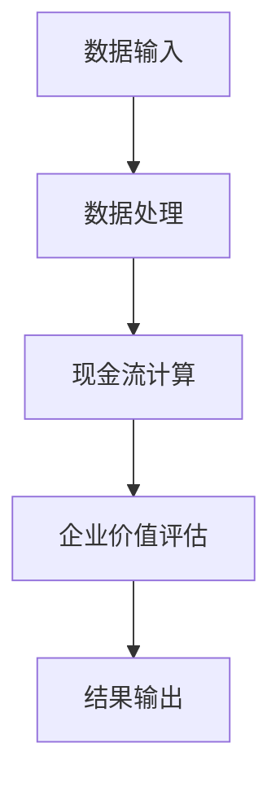

                 


# 巴菲特的现金流重要性：为什么自由现金流是王道

> 关键词：巴菲特，现金流，自由现金流，企业价值，投资，财务分析，价值投资

> 摘要：本文深入探讨巴菲特的现金流重要性，特别是自由现金流在投资中的核心地位。通过详细分析自由现金流的定义、计算方法及其与企业价值的关系，结合实例和系统架构，揭示现金流在投资决策中的关键作用，并提供实战指导和最佳实践建议。

---

## 第一章: 巴菲特的现金流理念概述

### 1.1 现金流的重要性

#### 1.1.1 现金流的基本概念

现金流是企业在一定时期内通过经营活动、投资活动和筹资活动所获得或支出的现金和现金等价物的总和。它反映了企业的实际财务状况和运营能力，是衡量企业健康状况的重要指标。

#### 1.1.2 巴菲特的价值投资理念

巴菲特的价值投资理念强调购买具有持续竞争优势的企业，并以合理的价格买入。他认为，企业的内在价值是其未来现金流的现值，而自由现金流是评估企业价值的核心指标。

#### 1.1.3 现金流在企业中的重要性

现金流的重要性体现在以下几个方面：

- **偿债能力**：企业需要足够的现金流来偿还债务和支付股息。
- **投资能力**：健康的现金流支持企业进行再投资和扩张。
- **风险管理**：现金流充裕可以应对市场波动和不确定性。

### 1.2 巴菲特的现金流分析方法

#### 1.2.1 自由现金流的定义

自由现金流（Free Cash Flow, FCF）是企业在扣除运营所需的所有成本和资本支出后剩余的现金流量。它反映了企业在不依赖外部融资的情况下，能够产生的现金流。

#### 1.2.2 自由现金流的计算公式

自由现金流的计算公式如下：

$$\text{自由现金流} = \text{营业收入} - \text{运营成本} - \text{资本支出}$$

#### 1.2.3 现金流与企业价值的关系

现金流与企业价值密切相关。企业价值可以通过将未来自由现金流的现值进行评估。公式如下：

$$\text{企业价值} = \sum_{t=1}^{n} \frac{\text{自由现金流}_t}{(1 + r)^t}$$

其中，\( r \) 是折现率，\( n \) 是预测期数。

---

## 第二章: 自由现金流的核心概念

### 2.1 自由现金流的定义与属性

#### 2.1.1 自由现金流的定义

自由现金流是企业在支付了所有运营费用和资本支出后的剩余现金，可用于偿还债务、支付股息或进一步投资。

#### 2.1.2 自由现金流的计算公式

自由现金流的计算公式如下：

$$\text{FCF} = \text{EBITDA} - \text{折旧与摊销} - \text{利息支出} - \text{税款} - \text{资本支出}$$

#### 2.1.3 自由现金流的特征

自由现金流具有以下特征：

- **可预测性**：可以通过历史数据和未来预期进行预测。
- **可持续性**：稳定的现金流表明企业具有持续的盈利能力。
- **灵活性**：自由现金流可用于多种用途，如再投资或回报股东。

### 2.2 自由现金流与净利润的对比

#### 2.2.1 净利润的定义

净利润是企业在扣除所有费用和税金后的利润，是企业整体盈利能力的指标。

#### 2.2.2 净利润与自由现金流的区别

以下是净利润与自由现金流的主要区别：

| **指标**      | **定义**                                                                 |
|----------------|--------------------------------------------------------------------------|
| 净利润         | 扣除所有费用和税金后的利润，反映企业的整体盈利能力。                      |
| 自由现金流     | 经营活动产生的现金流，扣除资本支出后的剩余现金，反映企业的实际现金流。|

#### 2.2.3 净利润与自由现金流的联系

净利润与自由现金流都反映企业的财务健康状况，但自由现金流更能体现企业的实际现金流情况。净利润可能因会计处理而变化，而自由现金流则更直接反映企业的现金生成能力。

---

## 第三章: 自由现金流的数学模型与公式

### 3.1 自由现金流的计算公式

自由现金流的计算公式如下：

$$\text{FCF} = \text{营业收入} - \text{运营成本} - \text{资本支出}$$

### 3.2 企业价值的计算公式

企业价值的计算公式如下：

$$\text{企业价值} = \sum_{t=1}^{n} \frac{\text{FCF}_t}{(1 + r)^t}$$

其中，\( r \) 是折现率，\( n \) 是预测期数。

### 3.3 自由现金流与企业价值的关系

自由现金流是企业价值的核心驱动因素。通过将未来自由现金流折现，可以评估企业的内在价值，从而指导投资决策。

---

## 第四章: 自由现金流的系统分析与架构设计

### 4.1 系统分析

#### 4.1.1 现金流分析的流程

现金流分析的流程包括以下几个步骤：

1. **数据收集**：收集企业的财务报表数据，包括营业收入、成本、资本支出等。
2. **计算自由现金流**：根据公式计算自由现金流。
3. **评估企业价值**：使用折现模型评估企业价值。
4. **投资决策**：根据分析结果做出投资决策。

#### 4.1.2 现金流分析的工具

常用的现金流分析工具包括：

- **Excel**：用于数据计算和图表绘制。
- **Python**：用于高级数据分析和建模。
- **Financial Models**：用于企业价值评估。

#### 4.1.3 现金流分析的步骤

现金流分析的步骤如下：

1. **收集数据**：获取企业的财务报表和市场数据。
2. **计算现金流**：使用公式计算自由现金流。
3. **评估价值**：使用折现模型评估企业价值。
4. **比较分析**：将企业价值与市场价格进行比较，判断投资价值。

### 4.2 系统架构设计

#### 4.2.1 系统架构图

以下是现金流分析系统的架构图：



#### 4.2.2 系统功能模块

系统功能模块包括：

- **数据输入**：接收企业的财务数据。
- **数据处理**：清洗和转换数据。
- **现金流计算**：计算自由现金流。
- **企业价值评估**：评估企业价值。
- **结果输出**：输出分析结果。

#### 4.2.3 系统接口设计

系统接口设计如下：

- **输入接口**：接收财务数据和市场数据。
- **输出接口**：输出现金流计算结果和企业价值评估结果。

---

## 第五章: 自由现金流的项目实战

### 5.1 环境安装

#### 5.1.1 数据收集工具

常用的数据收集工具包括：

- **Excel**：用于数据整理和初步分析。
- **Python**：用于数据爬取和处理。

#### 5.1.2 数据分析工具

常用的数据分析工具包括：

- **Excel**：用于基本数据分析。
- **Python**：用于高级数据分析和建模。

#### 5.1.3 代码实现工具

常用的代码实现工具包括：

- **Python**：用于编写数据分析代码。
- **Jupyter Notebook**：用于数据可视化和分析。

### 5.2 核心实现

#### 5.2.1 代码实现

以下是计算自由现金流的Python代码示例：

```python
import pandas as pd

# 假设df是包含财务数据的DataFrame
def calculate_fcf(df):
    fcf = df['营业收入'] - df['运营成本'] - df['资本支出']
    return fcf

# 示例数据
data = {
    '营业收入': [100, 200, 300],
    '运营成本': [50, 100, 150],
    '资本支出': [20, 30, 40]
}
df = pd.DataFrame(data)

# 计算自由现金流
fcf = calculate_fcf(df)
print(fcf)
```

### 5.3 应用解读

以苹果公司为例，计算其自由现金流：

```python
import pandas as pd

# 示例数据
data = {
    '营业收入': [2000, 2500, 3000],
    '运营成本': [1000, 1200, 1400],
    '资本支出': [500, 600, 700]
}
df = pd.DataFrame(data)

# 计算自由现金流
def calculate_fcf(df):
    fcf = df['营业收入'] - df['运营成本'] - df['资本支出']
    return fcf

fcf = calculate_fcf(df)
print(fcf)
```

输出结果为：

```
0    500
1    700
2    900
```

### 5.4 案例分析

通过上述代码，我们可以看到苹果公司的自由现金流逐年增加，表明其经营状况良好，具有较高的投资价值。

---

## 第六章: 小结与最佳实践

### 6.1 小结

现金流是企业价值的核心驱动因素，自由现金流是巴菲特投资理念中的关键指标。通过计算和分析自由现金流，可以评估企业的实际价值，并做出明智的投资决策。

### 6.2 注意事项

在进行现金流分析时，需要注意以下几点：

- **数据准确性**：确保财务数据的准确性和完整性。
- **模型假设**：合理假设折现率和预测期数。
- **行业特点**：不同行业的现金流特征不同，需结合行业特点进行分析。

### 6.3 拓展阅读

推荐以下书籍和资源，供进一步学习：

- 《巴菲特传》：了解巴菲特的投资理念。
- 《财务报表分析》：掌握财务报表分析技巧。
- 《价值投资入门》：学习价值投资的基本方法。

---

## 作者

作者：AI天才研究院/AI Genius Institute & 禅与计算机程序设计艺术/Zen And The Art of Computer Programming

---

通过本文的详细分析，读者可以全面理解巴菲特的现金流重要性，并掌握自由现金流的计算和应用方法，从而在投资决策中做出明智的选择。

