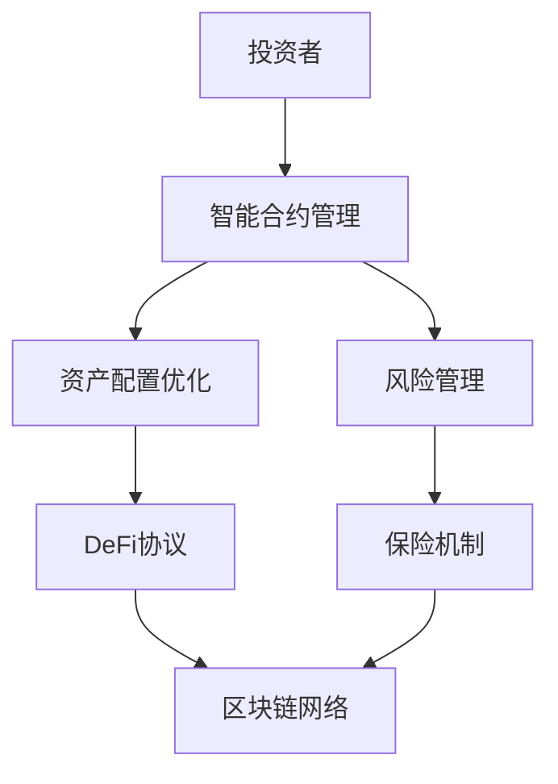
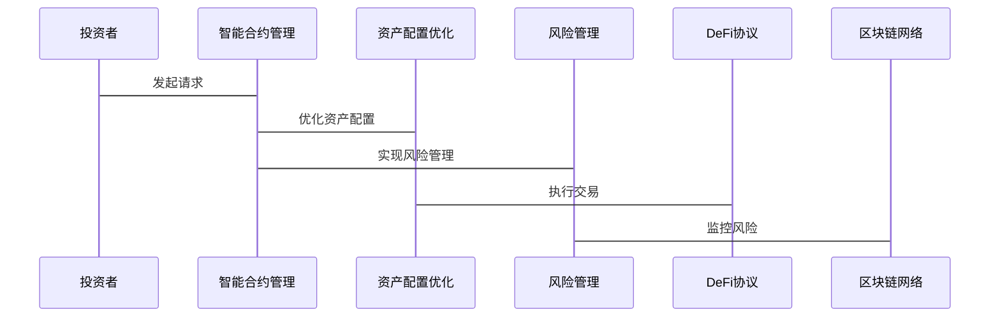

                 


# 巴菲特的现金管理策略：去中心化金融(DeFi)时代的资产配置

> 关键词：巴菲特，现金管理，DeFi，去中心化金融，资产配置，智能合约，风险管理，价值投资

> 摘要：本文探讨了巴菲特的经典现金管理策略在DeFi时代的应用与演变，分析了DeFi的核心机制，结合价值投资理念，提出了在去中心化金融环境下的资产配置策略，通过实际案例和系统架构设计，展示了如何将传统投资理念与现代技术相结合，实现高效的金融资产管理。

---

## 第一章：背景介绍

### 1.1 巴菲特投资理念的核心思想

#### 1.1.1 价值投资的定义与核心要素
价值投资是一种以内在价值为导向的投资策略，核心在于寻找市场价格低于其内在价值的资产。巴菲特的价值投资理念强调以下几个核心要素：
- **安全边际**：买入价格低于内在价值，确保有一定的安全空间。
- **长期视角**：关注企业的长期盈利能力，而非短期市场波动。
- **企业质量**：选择具备强大竞争优势和良好治理的企业。

#### 1.1.2 巴菲特的长期投资策略
巴菲特的投资策略以长期持有优质资产为主，强调复利效应。他倾向于投资那些能够持续创造价值的企业，而非追逐短期收益。这种策略在DeFi时代依然具有重要意义，尤其是在去中心化金融环境中，长期稳定的收益机制是吸引投资者的关键。

#### 1.1.3 巴菲特投资理念的现代意义
随着金融市场的全球化和数字化，传统的价值投资理念需要与现代技术相结合。DeFi的兴起为投资者提供了新的资产类别和投资工具，但也带来了新的挑战和风险。如何在DeFi环境中应用巴菲特的投资理念，实现稳健的资产配置，是本文的核心问题。

### 1.2 DeFi时代的金融创新与挑战

#### 1.2.1 DeFi的定义与核心机制
DeFi（Decentralized Finance）即去中心化金融，是基于区块链技术的金融体系，通过智能合约实现去中心化的金融交易和资产管理。其核心机制包括：
- **智能合约**：自动执行预设的金融协议。
- **去中心化交易所**：通过区块链技术实现点对点的资产交易。
- **稳定币**：用于减少加密货币价格波动的法定货币替代品。

#### 1.2.2 DeFi与传统金融的对比
与传统金融相比，DeFi具有以下特点：
- **去中心化**：消除中间机构，降低交易成本。
- **透明性**：所有交易记录在区块链上，公开透明。
- **可编程性**：通过智能合约实现复杂的金融逻辑。

#### 1.2.3 DeFi时代下的资产配置新需求
DeFi的兴起为投资者提供了新的资产类别和投资机会。然而，DeFi市场的高波动性和技术复杂性也带来了新的挑战。投资者需要重新思考资产配置策略，结合传统投资理念与现代技术手段，制定适应DeFi环境的投资策略。

### 1.3 巴菲特投资理念与DeFi的结合

#### 1.3.1 巴菲特投资理念在现代金融环境下的适用性
尽管DeFi带来了新的技术和市场环境，但巴菲特的核心投资理念依然具有指导意义。例如，他对企业质量的重视可以延伸到DeFi协议的选择上，投资者需要选择具有强大技术支撑和良好治理的DeFi平台。

#### 1.3.2 DeFi时代下资产配置的挑战与机遇
DeFi的兴起为投资者提供了多样化的投资机会，但也带来了更高的风险。如何在DeFi环境中实现资产的长期稳定收益，是投资者需要解决的难题。结合巴菲特的价值投资理念，可以通过选择优质DeFi协议和长期持有策略来实现稳健的资产配置。

#### 1.3.3 巴菲特投资理念对DeFi时代的影响
巴菲特的投资理念强调长期视角和风险管理，这与DeFi的去中心化和透明性特点相契合。通过将巴菲特的投资理念与DeFi技术相结合，投资者可以更好地应对市场波动，实现资产的长期稳健增长。

---

## 第二章：DeFi的核心机制与技术原理

### 2.1 智能合约与去中心化金融

#### 2.1.1 智能合约的定义与特点
智能合约是一种基于区块链的自动执行合同，具有以下特点：
- **自动化**：自动执行预设的金融协议。
- **不可篡改**：区块链上的智能合约无法被篡改。
- **透明性**：所有交易记录公开透明。

#### 2.1.2 智能合约的工作原理
智能合约通过区块链网络实现自动化的金融交易。当满足特定条件时，智能合约会自动执行相应的操作，例如转移资金或发放收益。其工作原理包括以下几个步骤：
1. **触发条件**：当满足预设条件时，智能合约开始执行。
2. **状态检查**：智能合约检查当前区块链的状态。
3. **执行操作**：根据预设的逻辑，智能合约执行相应的操作。
4. **记录交易**：交易结果记录在区块链上，确保透明性和不可篡改性。

#### 2.1.3 智能合约在DeFi中的应用
智能合约在DeFi中的应用非常广泛，例如：
- **去中心化交易所**：通过智能合约实现自动化的交易匹配和结算。
- **流动性池**：通过智能合约管理资金池，实现自动化的收益分配。
- **借贷平台**：通过智能合约实现自动化的借贷协议。

### 2.2 去中心化交易所与流动性池

#### 2.2.1 去中心化交易所的运作模式
去中心化交易所（DEX）通过区块链技术实现点对点的资产交易，无需依赖中央机构。其运作模式包括以下几个步骤：
1. **订单匹配**：用户发布买卖订单，系统自动匹配订单。
2. **智能合约执行**：匹配成功后，智能合约自动执行交易。
3. **资金结算**：交易完成后，资金自动结算到用户钱包。

#### 2.2.2 流动性池的定义与作用
流动性池是DeFi中的一个重要概念，指的是将资金池中的资金用于提供流动性支持。流动性池的作用包括：
- **降低交易成本**：通过池中的资金提供流动性，降低交易滑点。
- **提高交易效率**：通过池中的资金实现快速交易匹配。
- **收益分配**：通过池中的资金实现收益分配。

#### 2.2.3 去中心化交易所与传统交易所的对比
与传统交易所相比，去中心化交易所具有以下优势：
- **去中心化**：无需依赖中央机构，降低交易成本。
- **透明性**：所有交易记录在区块链上，公开透明。
- **可编程性**：通过智能合约实现复杂的交易逻辑。

### 2.3 稳定币与DeFi生态

#### 2.3.1 稳定币的定义与作用
稳定币是一种与法定货币挂钩的加密货币，用于减少加密货币价格波动带来的风险。其作用包括：
- **降低波动性**：通过与法定货币挂钩，减少价格波动。
- **提高流动性**：作为DeFi生态中的主要交易媒介。
- **支持智能合约**：作为智能合约的执行基础。

#### 2.3.2 稳定币在DeFi中的应用场景
稳定币在DeFi中的应用场景非常广泛，例如：
- **借贷平台**：作为借贷协议的抵押品。
- **去中心化交易所**：作为交易的媒介。
- **流动性池**：作为池中的资金来源。

#### 2.3.3 稳定币的风险与管理
尽管稳定币在DeFi中具有重要作用，但也存在一定的风险。例如：
- **智能合约漏洞**：智能合约的漏洞可能导致资金损失。
- **市场波动**：虽然稳定币价格稳定，但市场波动可能会影响其价值。
- **监管风险**：不同国家对稳定币的监管政策不同，可能带来合规风险。

---

## 第三章：巴菲特现金管理策略的现代应用

### 3.1 巴菲特投资哲学的现代解读

#### 3.1.1 价值投资的长期视角
在DeFi时代，价值投资的长期视角依然适用。投资者需要关注DeFi协议的内在价值，选择那些具有强大技术支撑和良好治理的平台。

#### 3.1.2 巴菲特对风险管理的重视
巴菲特强调风险管理的重要性，认为风险管理是投资成功的基石。在DeFi环境中，投资者需要特别注意智能合约的安全性和市场波动性。

#### 3.1.3 巴菲特对资产质量的要求
巴菲特的价值投资理念强调选择优质资产，这一原则在DeFi环境中同样重要。投资者需要选择那些具有强大技术支撑和良好市场前景的DeFi协议。

### 3.2 DeFi时代下的资产配置策略

#### 3.2.1 资产配置的基本原则
在DeFi时代，资产配置的基本原则包括：
- **分散投资**：将资金分散投资于不同的DeFi协议，降低风险。
- **长期持有**：坚持长期投资策略，关注资产的内在价值。
- **风险管理**：通过智能合约和保险机制实现风险控制。

#### 3.2.2 DeFi环境下资产配置的优化
在DeFi环境下，资产配置的优化可以通过以下方式实现：
- **选择优质协议**：选择那些具有强大技术支撑和良好治理的DeFi协议。
- **合理分配资金**：根据风险承受能力和收益预期，合理分配资金。
- **动态调整**：根据市场变化和协议表现，动态调整资产配置。

#### 3.2.3 巴菲特投资理念对资产配置的启示
巴菲特的投资理念对DeFi时代的资产配置具有重要的启示：
- **长期视角**：坚持长期投资，关注资产的内在价值。
- **风险管理**：通过智能合约和保险机制实现风险控制。
- **优质资产**：选择那些具有强大技术支撑和良好市场前景的DeFi协议。

### 3.3 巴菲特现金管理策略的DeFi实现

#### 3.3.1 DeFi环境下的现金流管理
在DeFi环境中，现金流管理需要考虑以下几个方面：
- **资金流动性**：确保资金能够灵活调配，满足投资需求。
- **资金安全性**：通过智能合约和保险机制实现资金安全。
- **收益最大化**：通过合理的资金分配，实现收益的最大化。

#### 3.3.2 DeFi环境下的投资组合优化
在DeFi环境下，投资组合优化可以通过以下方式实现：
- **多样化投资**：将资金分散投资于不同的DeFi协议，降低风险。
- **智能合约**：利用智能合约实现自动化的投资组合管理。
- **风险管理**：通过智能合约和保险机制实现风险控制。

#### 3.3.3 巴菲特投资理念的DeFi实践
通过将巴菲特的投资理念与DeFi技术相结合，投资者可以实现以下目标：
- **长期稳健收益**：通过选择优质DeFi协议，实现长期的稳健收益。
- **智能合约优化**：利用智能合约实现自动化的投资组合管理。
- **风险管理强化**：通过智能合约和保险机制实现风险控制。

---

## 第四章：DeFi环境下的风险管理与优化

### 4.1 风险管理的重要性

#### 4.1.1 DeFi环境下的主要风险
在DeFi环境中，投资者需要关注以下主要风险：
- **智能合约漏洞**：智能合约的漏洞可能导致资金损失。
- **市场波动**：加密货币价格的高波动性可能影响资产价值。
- **流动性风险**：某些DeFi协议可能面临流动性不足的问题。

#### 4.1.2 巴菲特风险管理理念的现代应用
巴菲特强调风险管理的重要性，认为风险管理是投资成功的基石。在DeFi环境中，投资者需要特别注意智能合约的安全性和市场波动性。

### 4.2 智能合约的风险管理

#### 4.2.1 智能合约漏洞的防范
为了避免智能合约漏洞带来的风险，投资者需要注意以下几点：
- **选择优质协议**：选择那些经过严格审计的DeFi协议。
- **定期更新**：定期检查和更新智能合约，修复潜在漏洞。
- **多重签名**：通过多重签名技术提高智能合约的安全性。

#### 4.2.2 智能合约的风险控制机制
为了实现智能合约的风险控制，可以采取以下措施：
- **多重签名**：通过多重签名技术实现智能合约的安全性。
- **风险管理模块**：在智能合约中嵌入风险管理模块，实现自动化的风险控制。
- **保险机制**：通过保险机制实现智能合约的风险分担。

#### 4.2.3 智能合约的优化设计
在设计智能合约时，需要注意以下几点：
- **简洁性**：避免过于复杂的逻辑，减少漏洞风险。
- **可验证性**：确保智能合约的逻辑可以通过代码审计验证。
- **可扩展性**：设计具有可扩展性的智能合约，以应对未来的市场变化。

### 4.3 DeFi环境下的风险管理策略

#### 4.3.1 风险评估与量化
在DeFi环境中，投资者需要对风险进行评估和量化。这包括对智能合约的安全性、市场波动性和流动性风险的评估。

#### 4.3.2 风险控制的具体措施
为了实现有效的风险控制，投资者可以采取以下措施：
- **分散投资**：将资金分散投资于不同的DeFi协议，降低风险。
- **动态调整**：根据市场变化和协议表现，动态调整资产配置。
- **保险机制**：通过保险机制实现风险分担。

#### 4.3.3 风险管理的优化
通过不断优化风险管理策略，投资者可以更好地应对DeFi环境中的各种风险。这包括：
- **持续监控**：持续监控智能合约和市场变化，及时发现潜在风险。
- **定期评估**：定期评估风险管理策略的有效性，及时调整策略。
- **团队协作**：通过团队协作实现风险管理的优化。

---

## 第五章：系统架构与实现

### 5.1 系统架构设计

#### 5.1.1 系统功能设计
系统功能设计包括以下几个方面：
- **智能合约管理**：实现智能合约的部署、管理和监控。
- **资产配置优化**：根据市场变化和协议表现，优化资产配置。
- **风险管理**：通过智能合约实现自动化的风险管理。

#### 5.1.2 系统架构图
以下是系统的架构图：



#### 5.1.3 系统交互流程
系统的交互流程包括以下几个步骤：
1. **投资者发起请求**：投资者发起资产配置或风险管理请求。
2. **智能合约管理**：系统通过智能合约管理模块处理请求。
3. **资产配置优化**：系统根据市场变化和协议表现，优化资产配置。
4. **风险管理**：系统通过智能合约实现自动化的风险管理。
5. **交易执行**：系统根据优化后的资产配置，执行交易。

### 5.2 核心算法实现

#### 5.2.1 资产配置优化算法
以下是资产配置优化算法的伪代码：

```python
def optimize_asset_allocation(portfolio, market_conditions):
    for asset in portfolio:
        if asset.value < asset.target_value:
            allocate_more(asset)
        elif asset.value > asset.target_value:
            rebalance(asset)
    return optimized_portfolio
```

#### 5.2.2 智能合约风险管理算法
以下是智能合约风险管理算法的伪代码：

```python
def manage_risk(smart_contract, market_conditions):
    if smart_contract.vulnerable:
        trigger_audits(smart_contract)
    if market_conditions.volatility > threshold:
        activateinsurance(smart_contract)
    return updated_smart_contract
```

### 5.3 系统实现细节

#### 5.3.1 环境配置
以下是系统实现的环境配置：
- **操作系统**：Linux
- **编程语言**：Python
- **框架**：Solidity（智能合约开发）
- **区块链平台**：Ethereum

#### 5.3.2 核心代码实现
以下是智能合约管理模块的核心代码实现：

```solidity
// 智能合约管理模块
contract SmartContractManager {
    function deployContract(bytes memory code) external {
        address newContract = create.setCode(code);
        emit ContractDeployed(newContract);
    }

    function updateContract(address contractAddress, bytes memory code) external {
        create.setCode(contractAddress, code);
    }

    function getContractAddress() external view returns (address) {
        return address(this);
    }
}
```

#### 5.3.3 系统交互流程图
以下是系统交互流程图：



---

## 第六章：项目实战与案例分析

### 6.1 项目环境配置

#### 6.1.1 系统环境
以下是项目实现的系统环境：
- **操作系统**：Windows 10
- **编程语言**：Python 3.8
- **区块链平台**：Ethereum
- **钱包**：MetaMask

#### 6.1.2 工具安装
以下是项目实现所需的工具：
- **Solidity**：智能合约开发工具
- **Geth**：Ethereum节点客户端
- **Truffle**：智能合约开发框架
- **Remix IDE**：智能合约在线编辑器

### 6.2 核心代码实现

#### 6.2.1 智能合约实现
以下是智能合约管理模块的代码实现：

```solidity
// 智能合约管理模块
contract SmartContractManager {
    function deployContract(bytes memory code) external {
        address newContract = create.setCode(code);
        emit ContractDeployed(newContract);
    }

    function updateContract(address contractAddress, bytes memory code) external {
        create.setCode(contractAddress, code);
    }

    function getContractAddress() external view returns (address) {
        return address(this);
    }
}
```

#### 6.2.2 资产配置优化实现
以下是资产配置优化模块的代码实现：

```python
def optimize_asset_allocation(portfolio, market_conditions):
    for asset in portfolio:
        if asset.value < asset.target_value:
            allocate_more(asset)
        elif asset.value > asset.target_value:
            rebalance(asset)
    return optimized_portfolio
```

### 6.3 项目实现步骤

#### 6.3.1 环境搭建
1. 安装Solidity和Truffle框架。
2. 配置Ethereum节点。
3. 安装MetaMask钱包。

#### 6.3.2 智能合约部署
1. 编写智能合约代码。
2. 使用Truffle部署智能合约。
3. 验证智能合约部署情况。

#### 6.3.3 交易执行
1. 初始化资产配置。
2. 执行交易请求。
3. 监控交易执行情况。

### 6.4 实际案例分析

#### 6.4.1 案例背景
假设投资者有100万美元的资金，希望通过DeFi实现资产配置优化。

#### 6.4.2 案例分析
1. **选择优质协议**：选择具有强大技术支撑和良好治理的DeFi协议。
2. **资产分配**：将资金分散投资于不同的DeFi协议，降低风险。
3. **风险管理**：通过智能合约和保险机制实现风险控制。

#### 6.4.3 案例结果
通过合理的资产配置和风险管理，投资者实现了稳健的收益。

---

## 第七章：总结与展望

### 7.1 总结

#### 7.1.1 核心观点回顾
本文通过分析巴菲特的投资理念，探讨了其在DeFi时代的应用与演变。通过结合DeFi的核心机制和风险管理策略，提出了适应DeFi环境的资产配置策略。

#### 7.1.2 研究成果
本文的主要研究成果包括：
- **DeFi核心机制分析**：详细分析了智能合约、去中心化交易所和稳定币的核心机制。
- **资产配置策略优化**：提出了适应DeFi环境的资产配置策略，结合了巴菲特的投资理念和现代技术手段。
- **风险管理优化**：通过智能合约和保险机制实现了有效的风险管理。

### 7.2 展望

#### 7.2.1 DeFi的未来发展
DeFi的未来发展将更加注重技术创新和风险管理。随着技术的不断进步，DeFi将更加成熟，为投资者提供更多的投资机会。

#### 7.2.2 巴菲特投资理念的延伸
巴菲特的投资理念在DeFi时代将得到进一步延伸和应用。随着技术的发展，巴菲特的投资理念将与更多的现代技术手段相结合，实现更高效的资产配置。

#### 7.2.3 投资者的机遇与挑战
DeFi时代的投资者将面临更多的机遇和挑战。通过合理配置资产和有效管理风险，投资者可以实现稳健的收益。

---

## 作者

**作者：AI天才研究院/AI Genius Institute & 禅与计算机程序设计艺术 /Zen And The Art of Computer Programming**

---

**注意事项**：
- 本文内容为理论与实践结合的技术博客文章，旨在提供关于巴菲特的现金管理策略在DeFi时代下的应用与实现的深度分析和见解。
- 由于DeFi市场的快速变化，建议读者持续关注行业动态，及时调整投资策略。
- 本文中的代码示例和系统架构仅为说明目的，具体实现应根据实际需求进行调整。

