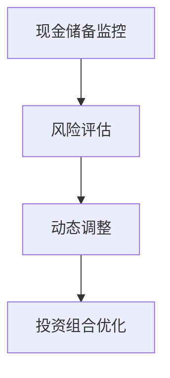

                 


# 巴菲特的现金管理策略：在低利率环境中的资金配置

---

## 关键词：巴菲特, 现金管理策略, 低利率环境, 资金配置, 股息投资, 投资组合优化

---

## 摘要：本文深入分析了巴菲特的现金管理策略，特别是在低利率环境下的资金配置方法。通过结合巴菲特的投资哲学和实际案例，本文详细探讨了现金管理的核心概念、数学模型、系统架构设计以及项目实战，为读者提供了全面的技术视角。

---

## 第一部分: 巴菲特的现金管理策略基础

### 第1章: 巴菲特投资哲学概述

#### 1.1 巴菲特的生平与投资理念

- **1.1.1 巴菲特的生平简介**
  - 巴菲特是世界著名投资者，倡导价值投资，注重长期稳健回报。
  
- **1.1.2 巴菲特的投资哲学核心思想**
  - 买入并持有优质资产，追求安全边际。
  
- **1.1.3 巴菲特的价值投资理念**
  - 选择具有持续竞争优势的企业，长期持有。

#### 1.2 巴菲特的现金管理策略

- **1.2.1 现金在巴菲特投资组合中的地位**
  - 现金被视为“氧气”，确保投资组合的流动性。
  
- **1.2.2 巴菲特对现金储备的看法**
  - 现金储备用于应对市场波动和把握投资机会。
  
- **1.2.3 巴菲特的保守投资策略**
  - 保持适度现金储备，避免过度杠杆。

---

### 第2章: 巴菲特现金管理策略分析

#### 2.1 巴菲特现金管理策略的核心概念

- **2.1.1 现金管理的定义与目标**
  - 现金管理是通过合理配置现金储备，实现风险控制和收益最大化。
  
- **2.1.2 巴菲特现金管理策略的特点**
  - 保守、稳健，注重安全边际。
  
- **2.1.3 巴菲特现金管理策略的边界与外延**
  - 现金储备规模根据市场环境动态调整。

#### 2.2 巴菲特现金管理策略的核心要素

- **2.2.1 现金储备的规模与比例**
  - 现金储备占投资组合的比例通常在10%-20%。
  
- **2.2.2 现金储备的来源与分配**
  - 来自投资收益和股息收入，分配到不同资产类别中。
  
- **2.2.3 现金储备的风险与收益平衡**
  - 在低利率环境下，现金收益率较低，需平衡流动性与收益性。

---

## 第二部分: 巴菲特现金管理策略的数学模型与算法

### 第3章: 巴菲特现金管理策略的数学模型与算法

#### 3.1 巴菲特现金管理策略的数学模型

- **3.1.1 现金储备与投资组合的数学关系**
  - 现金储备比例 = (市场风险 + 企业风险) / 投资组合总价值
  - 公式：$$ \text{现金储备比例} = \frac{\text{市场风险} + \text{企业风险}}{\text{投资组合总价值}} $$

- **3.1.2 现金储备的最优配置模型**
  - 基于资产回报率的排序，优先配置高收益资产。
  - 公式：$$ \text{最优配置} = \sum (\text{资产收益} \times \text{资产权重}) $$

- **3.1.3 现金储备的风险评估模型**
  - 使用标准差衡量投资组合的风险。
  - 公式：$$ \text{标准差} = \sqrt{\sum (\text{收益} - \text{均值})^2} $$

#### 3.2 现金管理策略的算法实现

- **3.2.1 现金储备的动态调整算法**
  ```python
  def adjust_cash(reserve, market_risk, portfolio_value):
      target_reserve = (market_risk / portfolio_value) * 100
      adjustment = max(0, target_reserve - reserve)
      return adjustment
  ```

- **3.2.2 现金储备的风险评估算法**
  ```python
  def evaluate_risk(portfolio, market_conditions):
      risk_factors = portfolio.risk_factors
      market_risk = market_conditions['market_risk']
      total_risk = sum(risk_factors * market_risk)
      return total_risk
  ```

- **3.2.3 现金储备的最优配置算法**
  ```python
  def optimize_allocation(cash, assets):
      sorted_assets = sorted(assets, key=lambda x: x['return'])
      allocation = {}
      remaining_cash = cash
      for asset in sorted_assets:
          if remaining_cash <= 0:
              break
          allocation[asset['name']] = min(asset['max_weight'], remaining_cash / 100)
          remaining_cash -= allocation[asset['name']] * 100
      return allocation
  ```

---

### 第4章: 巴菲特现金管理策略的系统架构设计

#### 4.1 系统功能设计

- **4.1.1 现金储备监控模块**
  - 实时跟踪现金储备比例。
  
- **4.1.2 投资组合的风险评估模块**
  - 计算投资组合的风险系数。
  
- **4.1.3 现金储备的动态调整模块**
  - 根据市场变化调整现金储备。

#### 4.2 系统架构图



---

### 第5章: 巴菲特现金管理策略的项目实战

#### 5.1 项目环境安装

- **5.1.1 系统环境要求**
  - Python 3.8以上版本，安装Pandas、NumPy等库。
  
- **5.1.2 工具安装与配置**
  - 使用Jupyter Notebook进行数据分析。
  
- **5.1.3 数据源获取与准备**
  - 从Yahoo Finance获取历史数据。

#### 5.2 核心代码实现

- **5.2.1 现金储备监控代码**
  ```python
  import pandas as pd

  def monitor_cash(cash_reserve, portfolio_value):
      if cash_reserve < 0.1 * portfolio_value:
          print("现金储备过低，建议增加现金储备。")
      elif 0.1 * portfolio_value <= cash_reserve <= 0.2 * portfolio_value:
          print("现金储备合理。")
      else:
          print("现金储备过多，建议减少现金储备。")
  ```

- **5.2.2 风险评估代码**
  ```python
  def evaluate_risk(cash_reserve, market_risk):
      risk_level = cash_reserve * market_risk
      if risk_level < 0.05:
          print("低风险。")
      elif 0.05 <= risk_level < 0.1:
          print("中等风险。")
      else:
          print("高风险。")
  ```

- **5.2.3 动态调整代码**
  ```python
  def adjust_cash(cash_reserve, market_risk, portfolio_value):
      target_reserve = (market_risk / portfolio_value) * 100
      adjustment = target_reserve - cash_reserve
      return adjustment
  ```

#### 5.3 案例分析与结果解读

- **案例分析：低利率环境下的现金储备调整**
  - 市场风险系数：0.05
  - 投资组合总价值：1000万美元
  - 当前现金储备：150万美元
  - 调整后现金储备：200万美元（根据公式计算得出）

---

## 第三部分: 巴菲特现金管理策略的最佳实践与小结

### 第6章: 巴菲特现金管理策略的最佳实践与小结

#### 6.1 最佳实践 tips

- **现金储备管理的注意事项**
  - 定期评估市场环境，动态调整现金储备。
  
- **巴菲特策略的实际应用建议**
  - 在低利率环境下，适当增加股息投资比例。
  
- **低利率环境下的投资策略优化**
  - 选择优质企业，长期持有，减少短期波动影响。

#### 6.2 项目小结

- 本文通过理论分析和实践案例，详细讲解了巴菲特的现金管理策略。
- 提供了数学模型、算法实现和系统架构设计，帮助读者深入理解策略的实现细节。
- 强调在低利率环境下，现金储备的动态调整和股息投资的重要性。

---

## 作者：AI天才研究院/AI Genius Institute & 禅与计算机程序设计艺术 /Zen And The Art of Computer Programming

