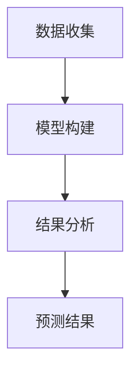
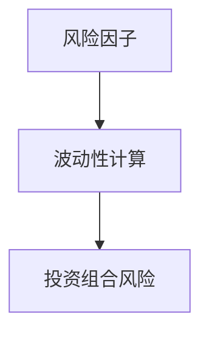

                 


# 巴菲特的现金管理策略：负利率环境下的资金配置

## 关键词：巴菲特、现金管理、负利率、投资策略、资产配置、风险管理

## 摘要：
本文深入分析了巴菲特的现金管理策略，特别是在负利率环境下的资金配置方法。通过探讨巴菲特的投资理念、资产配置策略以及应对负利率环境的措施，本文为投资者提供了实用的指导。文章结合数学模型和系统分析，详细解读了如何在当前经济环境下优化资金配置，降低风险并实现长期收益。

---

## 第一部分：背景介绍

### 第1章：巴菲特的生平与投资理念

#### 1.1 巴菲特的生平简介
- **1.1.1 巴菲特的早年经历**  
  巴菲特出生于1934年，早年展现出对投资的浓厚兴趣，12岁时开始研究股票市场，15岁时撰写了第一篇投资分析文章。这些经历为他后来的投资哲学奠定了基础。

- **1.1.2 巴菲特的投资哲学**  
  巴菲特强调价值投资，即寻找具有持续竞争优势和良好管理团队的公司，长期持有并耐心等待其内在价值的实现。他的投资理念强调安全边际和长期稳定的收益。

- **1.1.3 巴菲特的管理风格**  
  巴菲特以其保守和稳健的管理风格著称，注重现金流和企业盈利能力，避免过度杠杆和高风险投资。

#### 1.2 巴菲特的现金管理策略
- **1.2.1 现金在投资组合中的重要性**  
  巴菲特认为现金是企业的“氧气”，在市场低迷或不确定性增加时，现金储备尤为重要。他倾向于持有大量现金以应对市场机会和潜在风险。

- **1.2.2 巴菲特对现金储备的看法**  
  巴菲特在伯克希尔哈撒韦公司的投资组合中，始终保持一定比例的现金和短期债券，以确保在市场机会出现时能够迅速行动。

- **1.2.3 现金管理的核心原则**  
  巴菲特的现金管理策略强调安全性、流动性和收益性，避免将资金投入到高风险或流动性差的资产中。

---

### 第2章：负利率环境的定义与影响

#### 2.1 负利率的定义
- **2.1.1 利率的基本概念**  
  利率是借款成本的衡量标准，通常由中央银行设定基准利率，商业银行和其他金融机构根据此调整贷款利率。

- **2.1.2 负利率的出现原因**  
  负利率通常出现在经济低迷时期，中央银行通过降低基准利率以刺激经济增长，鼓励企业和个人增加投资和消费。

- **2.1.3 负利率的经济影响**  
  负利率可能导致资产价格上涨、储蓄和投资行为变化，同时也可能加剧贫富差距。

#### 2.2 负利率对资产配置的影响
- **2.2.1 负利率对债券的影响**  
  负利率环境下，债券收益率为负，投资者可能面临本金损失，但债券的稳定性仍使其成为部分投资者的首选。

- **2.2.2 负利率对股票的影响**  
  负利率降低了企业的融资成本，可能推动企业盈利和股价上涨，但也可能导致市场过度投机。

- **2.2.3 负利率对房地产的影响**  
  负利率降低了购房成本，可能推动房地产价格上涨，但也可能引发泡沫。

---

## 第二部分：巴菲特的现金管理策略在负利率环境下的应用

### 第3章：巴菲特的防御性投资策略

#### 3.1 防御性投资的定义
- **防御性投资**是指通过投资于具有稳定收益和低风险的资产，以保护资本不受市场波动影响。

#### 3.2 防御性投资在负利率下的应用
- **3.2.1 选择优质企业**  
  巴菲特倾向于投资那些具有强大竞争优势和稳定盈利的企业，即使在负利率环境下，这些企业的现金流和盈利能力仍能为投资者提供稳定的回报。

- **3.2.2 保持现金储备**  
  在负利率环境下，巴菲特建议保持适度的现金储备，以应对市场机会和潜在风险。

---

### 第4章：负利率环境下的资产配置策略

#### 4.1 资产配置的基本原则
- **分散投资**：将资金分配到不同资产类别中，降低风险。
- **长期视角**：关注企业的长期价值，而非短期市场波动。
- **注重现金流**：选择那些能够产生稳定现金流的企业进行投资。

#### 4.2 负利率环境下的资产配置调整
- **增加债券配置**：尽管债券收益率可能为负，但其稳定性仍使其成为重要的配置之一。
- **精选股票**：选择那些具有强大现金流和竞争优势的股票，以应对负利率带来的市场波动。
- **谨慎对待高风险资产**：避免投资于高风险资产，如高杠杆的金融产品。

---

## 数学模型与系统分析

### 5.1 现金流预测的数学模型

#### 5.1.1 现金流预测模型
$$
\text{现金流} = \text{收入} - \text{支出}
$$

#### 5.1.2 现金流预测的步骤
1. 数据收集：收集历史财务数据和市场信息。
2. 模型构建：使用时间序列分析或回归模型预测未来现金流。
3. 结果分析：评估预测结果的准确性和可行性。

#### 5.1.3 现金流预测的 Mermaid 流程图


### 5.2 风险评估的数学模型

#### 5.2.1 风险评估模型
$$
\text{风险} = \text{标准差} \times \text{资产价值}
$$

#### 5.2.2 风险评估的步骤
1. 确定资产的风险因子。
2. 计算资产的波动性。
3. 评估整体投资组合的风险。

#### 5.2.3 风险评估的 Mermaid 流程图


---

## 项目实战

### 6.1 环境安装

#### 6.1.1 安装 Python 和相关库
```bash
pip install numpy pandas matplotlib
```

### 6.2 核心代码实现

#### 6.2.1 现金流预测代码
```python
import numpy as np
import pandas as pd

def predict_cash_flow(data):
    # 数据预处理
    data = data.fillna(method='ffill')
    # 使用线性回归模型预测现金流
    X = data.index.values
    Y = data['cash_flow'].values
    m = np.mean(X)
    b = (np.sum(Y * (X - m)) / np.sum((X - m)**2))
    predicted_flow = b * X + (np.mean(Y) - b * m)
    return predicted_flow
```

#### 6.2.2 风险评估代码
```python
import numpy as np

def assess_risk(portfolio):
    # 计算投资组合的波动性
    returns = portfolio['returns'].values
    risk = np.std(returns)
    return risk
```

### 6.3 实际案例分析

#### 6.3.1 案例背景
假设当前市场处于负利率环境，某投资者希望优化其资产配置，以应对市场波动。

#### 6.3.2 数据分析与策略实施
1. 收集相关企业的财务数据。
2. 使用上述代码预测现金流并评估风险。
3. 根据预测结果调整资产配置，选择具有稳定现金流和较低风险的资产。

---

## 总结

### 7.1 最佳实践 Tips
- 在负利率环境下，保持适度的现金储备是关键。
- 选择具有稳定现金流和竞争优势的企业进行投资。
- 定期评估和调整资产配置，以应对市场变化。

### 7.2 小结
本文通过分析巴菲特的现金管理策略，探讨了负利率环境下的资金配置方法。结合数学模型和系统分析，为投资者提供了优化资产配置和降低风险的实用建议。

### 7.3 注意事项
- 投资者应根据自身风险承受能力和财务状况调整资产配置。
- 定期监控市场变化，及时调整投资策略。

### 7.4 拓展阅读
- 巴菲特的投资哲学与实践
- 负利率环境下的全球经济与投资策略

---

## 作者：AI天才研究院/AI Genius Institute & 禅与计算机程序设计艺术 /Zen And The Art of Computer Programming

