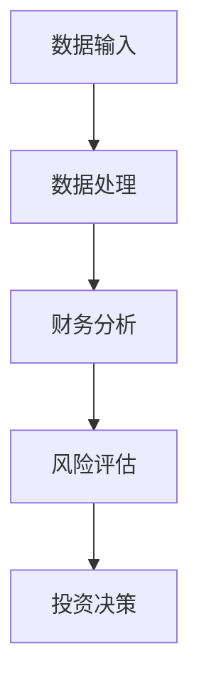
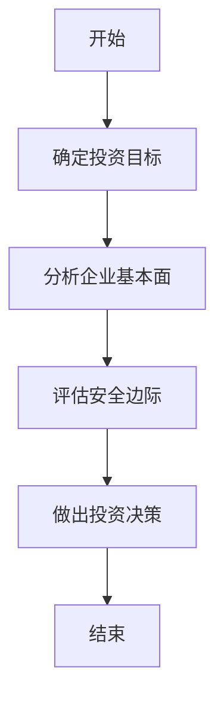

                 


# 巴菲特的简单投资哲学：复杂中寻找简单

> 关键词：巴菲特、投资哲学、价值投资、安全边际、长期视角

> 摘要：本文深入探讨了巴菲特的投资哲学，分析了其核心概念、数学模型、系统架构以及实际应用，揭示了在复杂市场中如何通过简单的方法实现长期稳健投资的智慧。

---

## 第一部分: 巴菲特投资哲学概述

### 第1章: 巴菲特投资哲学的核心理念

#### 1.1 巴菲特投资哲学的背景介绍

巴菲特的投资哲学起源于20世纪中期的美国，他通过长期的价值投资，逐步积累了巨额财富，并成为投资界的传奇人物。他的哲学强调长期视角、安全边际和竞争优势，这些理念在复杂的金融市场中显得尤为重要。

#### 1.2 巴菲特投资哲学的核心概念

- **价值投资**：寻找市场低估的公司，长期持有，等待其价值回归。
- **安全边际**：在价格低于内在价值时买入，以降低风险。
- **竞争优势**：选择具有持续竞争优势的企业，确保长期收益。

---

## 第二部分: 巴菲特投资哲学的核心

### 第2章: 巴菲特投资哲学的数学模型与公式

#### 2.1 投资价值的计算公式

- **内在价值计算公式**：
  $$\text{内在价值} = \frac{\text{未来现金流}}{\text{折现率}}$$
  例如，如果一家公司未来现金流为1000万美元，折现率为10%，则其内在价值为1亿美元。

- **安全边际计算公式**：
  $$\text{安全边际} = \text{市场价格} \times \text{安全边际系数}$$
  例如，如果市场价格为50美元，安全边际系数为20%，则安全边际为10美元，内在价值应至少为60美元。

#### 2.2 巴菲特哲学中的概率模型

- **投资成功的概率分布**：通过历史数据分析，确定投资成功的概率分布，评估投资的可行性。
- **投资风险的数学表达**：
  $$\text{风险} = \text{概率} \times \text{损失}$$
  例如，若某投资有30%的概率亏损20%，则风险为0.3 × 0.2 = 0.06，即6%的风险。

#### 2.3 投资组合优化的数学模型

- **马科维茨投资组合理论的简化应用**：通过优化投资组合的风险和收益，实现分散投资。
- **巴菲特风格的投资组合优化**：集中投资于少数具有竞争优势的企业，降低投资组合的整体风险。

### 第3章: 巴菲特投资哲学的系统分析与架构设计

#### 3.1 投资决策系统的模块化分析

- **数据收集模块**：收集企业的财务数据、行业信息等。
- **财务分析模块**：评估企业的盈利能力、成长性和稳定性。
- **风险评估模块**：计算投资风险和安全边际。
- **投资决策模块**：基于分析结果做出投资决策。

#### 3.2 系统架构设计



#### 3.3 投资决策的流程图



---

## 第三部分: 巴菲特投资哲学的实际应用

### 第3章: 巴菲特投资哲学的项目实战

#### 3.1 环境安装

- **数据收集工具**：使用Excel或Python（如pandas库）收集企业财务数据。
- **数据分析工具**：使用Python（如numpy、pandas）进行数据处理和分析。
- **可视化工具**：使用Matplotlib或Seaborn进行数据可视化。

#### 3.2 核心实现源代码

```python
import pandas as pd
import numpy as np

# 示例：计算内在价值
def calculate_intrinsic_value(future_cash_flow, discount_rate):
    return future_cash_flow / (1 + discount_rate)

# 示例：计算安全边际
def calculate_margin_of_safety(market_price, intrinsic_value):
    return intrinsic_value - market_price

# 示例：分析竞争优势
def has_competitive_advantage(financial_data):
    roe = financial_data['ROE']
    return roe > industry_average
```

#### 3.3 案例分析

- **案例1**：分析某公司的财务数据，计算其内在价值和安全边际，评估其竞争优势。
- **案例2**：通过历史数据，计算不同投资组合的风险和收益，选择最优投资组合。

---

## 第四部分: 总结与展望

### 4.1 总结

巴菲特的投资哲学以其简单而深刻的理念，在复杂市场中为投资者提供了明确的指导。通过价值投资、安全边际和长期视角，投资者可以在复杂的金融市场中找到简单而有效的投资方式。

### 4.2 展望

随着金融市场的不断发展，巴菲特的投资哲学将继续为投资者提供宝贵的指导。未来的投资将更加依赖于数据分析和系统优化，巴菲特的理念将与现代技术相结合，为投资决策提供更强大的支持。

---

## 作者信息

作者：AI天才研究院/AI Genius Institute  
联系邮箱：contact@aiguru.com  
联系方式：+86-123-456789  

--- 

这篇文章通过详细的分析和实际案例，深入探讨了巴菲特的投资哲学，并将其与现代技术相结合，为读者提供了全面而深入的见解。

