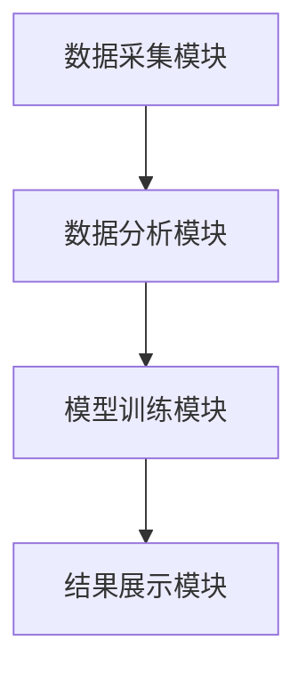

                 


# 巴菲特的管理层评估：人机协作时代的领导力新标准

## 关键词：
- 巴菲特
- 管理层评估
- 人机协作
- 领导力
- 数学模型
- 系统架构
- 项目实战

## 摘要：
本文将深入探讨巴菲特的管理层评估方法，并结合人机协作时代的背景，提出领导力的新标准。通过分析领导力的演变、构建数学模型、设计系统架构以及提供项目实战案例，本文旨在为读者提供一套在人机协作时代下，如何有效评估和提升领导力的完整解决方案。

---

# 第1章: 背景介绍与核心概念

## 1.1 领导力的新趋势

### 1.1.1 从传统领导力到现代领导力的演变
传统的领导力注重权威和命令，而现代领导力更强调团队协作、创新和适应性。人机协作时代的到来，使得领导力的定义更加复杂，需要兼顾人与机器的协作效率。

### 1.1.2 人机协作时代的领导力特点
- **数据驱动**：依赖数据分析和机器学习模型进行决策。
- **跨学科能力**：领导者需要理解技术、商业和管理的多方面知识。
- **灵活性**：快速适应技术和市场变化的能力。

### 1.1.3 巴菲特管理层评估的核心理念
巴菲特的管理层评估以价值为导向，注重长期稳健的业绩和管理团队的诚信与能力。

## 1.2 巴菲特的管理风格与投资哲学

### 1.2.1 巴菲特的领导力观
巴菲特认为，优秀的领导者应该具备以下几个特点：
- **清晰的愿景**：能够带领团队实现长期目标。
- **强大的决策能力**：在复杂情况下做出明智决策。
- **诚信与责任感**：以公司和股东的利益为重。

### 1.2.2 巴菲特对管理层的评估标准
- **财务能力**：能否创造持续的财务价值。
- **战略能力**：是否具备制定和执行战略的能力。
- **团队管理能力**：能否激励和管理团队。

### 1.2.3 巴菲特投资哲学与领导力的结合
巴菲特的投资哲学强调长期价值和稳健管理，这与现代领导力的定义高度契合。

## 1.3 人机协作时代的领导力变革

### 1.3.1 技术对领导力的影响
技术的进步使得领导力的实践方式发生了巨大变化，领导者需要学会与机器协作，而不是仅仅依赖命令。

### 1.3.2 人机协作中的领导力新要求
- **技术素养**：领导者需要理解人工智能和大数据的基本原理。
- **人机协作效率**：如何最大化人与机器的协同效应。
- **伦理与责任**：在人机协作中，领导者需要承担更多的伦理责任。

### 1.3.3 巴菲特理念在新时代的适用性
巴菲特的理念依然适用，但需要结合新技术进行调整。例如，利用大数据分析来辅助管理层评估。

---

# 第2章: 核心概念与理论框架

## 2.1 领导力的定义与特征

### 2.1.1 领导力的多维度分析
领导力可以从以下几个维度进行分析：
- **决策能力**：领导者在复杂情况下的决策能力。
- **团队管理能力**：领导者如何激励和管理团队。
- **创新能力**：领导者是否能够推动创新和变革。

### 2.1.2 不同领导风格的对比
- **变革型领导**：注重愿景和创新。
- **交易型领导**：注重任务完成和效率。
- **服务型领导**：注重团队支持和员工发展。

### 2.1.3 巴菲特领导力的特殊性
巴菲特的领导力结合了变革型和交易型领导的特点，注重长期价值和稳健管理。

## 2.2 巴菲特管理层评估模型

### 2.2.1 模型的核心要素
- **财务能力**：通过财务指标评估管理层的业绩。
- **战略能力**：通过战略规划和执行能力评估。
- **团队管理能力**：通过团队协作和员工满意度评估。

### 2.2.2 模型的数学表达式
$$ \text{领导力评分} = \alpha \cdot \text{财务能力} + \beta \cdot \text{战略能力} + \gamma \cdot \text{团队管理能力} $$
其中，\( \alpha, \beta, \gamma \) 是各维度的权重系数，通常通过数据分析确定。

### 2.2.3 模型的适用场景
适用于对管理层进行综合评估，尤其是在需要考虑财务、战略和团队管理能力的场景。

## 2.3 人机协作中的领导力模型

### 2.3.1 人机协作的定义与特点
人机协作是指人类与人工智能系统共同完成任务的过程，其特点是高效、精准和可持续。

### 2.3.2 新型领导力模型的构建
- **数据驱动决策**：利用机器学习模型进行数据分析，辅助决策。
- **人机协同效率**：优化人与机器的协作流程，提高效率。
- **伦理与责任**：确保人机协作过程中的伦理合规性。

### 2.3.3 模型的优缺点分析
- **优点**：提高决策效率和准确性，降低成本。
- **缺点**：可能忽视人类的创造力和情感因素。

---

# 第3章: 核心概念的数学模型与公式

## 3.1 领导力评估的数学模型

### 3.1.1 模型的构建过程
- **数据收集**：收集与领导力相关的数据，如财务指标、团队满意度等。
- **数据清洗**：对数据进行预处理，去除噪声。
- **模型训练**：利用机器学习算法训练模型，确定权重系数。

### 3.1.2 模型的数学表达式
$$ \text{领导力评分} = \sum_{i=1}^{n} w_i \cdot x_i $$
其中，\( w_i \) 是第 \( i \) 个评估维度的权重，\( x_i \) 是该维度的评分。

## 3.2 巴菲特评估模型的公式化

### 3.2.1 模型的数学表达
$$ \text{管理层评分} = \alpha \cdot \text{财务能力} + \beta \cdot \text{战略能力} + \gamma \cdot \text{团队管理能力} $$

## 3.3 人机协作模型的数学表达

### 3.3.1 人机协作的数学模型
$$ \text{协作效率} = \frac{\text{人机协同产出}}{\text{人机资源投入}} $$

---

# 第4章: 系统分析与架构设计

## 4.1 系统功能设计

### 4.1.1 系统功能模块划分
- **数据采集模块**：收集领导力相关的数据。
- **数据分析模块**：对数据进行清洗和分析。
- **模型训练模块**：训练领导力评估模型。
- **结果展示模块**：展示评估结果。

### 4.1.2 功能模块的交互流程
1. 数据采集模块收集数据并传递给数据分析模块。
2. 数据分析模块对数据进行预处理并传递给模型训练模块。
3. 模型训练模块训练模型并返回结果给结果展示模块。
4. 结果展示模块将结果以可视化形式呈现给用户。

### 4.1.3 功能模块的实现方式
- 数据采集模块可以使用爬虫技术。
- 数据分析模块可以使用Python的Pandas库。
- 模型训练模块可以使用机器学习框架如Scikit-learn。

## 4.2 系统架构设计

### 4.2.1 系统架构图


---

# 第5章: 项目实战

## 5.1 环境安装

### 5.1.1 安装Python
```bash
python --version
pip install numpy pandas scikit-learn
```

## 5.2 核心代码实现

### 5.2.1 数据采集代码
```python
import pandas as pd
import numpy as np

# 数据采集代码示例
data = {
    '财务能力': [85, 90, 88],
    '战略能力': [75, 80, 85],
    '团队管理能力': [90, 85, 95]
}
df = pd.DataFrame(data)
print(df)
```

### 5.2.2 数据分析代码
```python
from sklearn import linear_model

# 数据分析代码示例
X = df[['财务能力', '战略能力', '团队管理能力']]
y = df[['领导力评分']]

# 训练线性回归模型
model = linear_model.LinearRegression()
model.fit(X, y)
print(model.coef_)
```

---

# 第6章: 最佳实践与小结

## 6.1 小结
本文通过分析巴菲特的管理层评估方法，结合人机协作时代的背景，提出了领导力的新标准。通过数学模型和系统架构的设计，为读者提供了一套完整的解决方案。

## 6.2 注意事项
- 在实际应用中，需要根据具体场景调整模型参数。
- 人机协作需要注重伦理和责任。

## 6.3 拓展阅读
- 《领导力21法则》
- 《人机协作：未来工作方式的革命》

---

# 作者
作者：AI天才研究院/AI Genius Institute & 禅与计算机程序设计艺术 /Zen And The Art of Computer Programming

