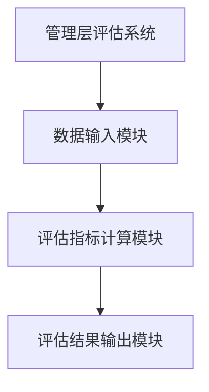

                 


# 巴菲特的管理层评估：如何识别优秀的企业领导者

> 关键词：巴菲特，管理层评估，企业领导者，投资哲学，决策能力

> 摘要：本文系统介绍了巴菲特的管理层评估方法，详细阐述了其核心概念、数学模型和实际案例。通过分析巴菲特的投资哲学和评估标准，揭示了如何识别优秀的企业领导者，以帮助读者在投资决策中做出更明智的选择。

---

## 第1章 巴菲特的管理层评估背景

### 1.1 巴菲特的生平与投资理念

#### 1.1.1 巴菲特的生平简介
沃伦·巴菲特（Warren Buffett），1934年出生于美国奥马哈，是世界著名投资家、慈善家。他从十岁开始接触股票市场，20岁开始投资，逐步积累了巨额财富，并在1965年接管伯克希尔·哈撒韦公司，将其打造成一个多元化的投资帝国。

#### 1.1.2 巴菲特的投资哲学
巴菲特的投资哲学以“价值投资”为核心，强调寻找那些具有持续竞争优势、良好治理结构和优秀管理团队的公司。他主张长期投资，避免短期波动，并注重公司基本面分析。

#### 1.1.3 巴菲特的管理层评估的重要性
在巴菲特看来，管理层的质量直接关系到企业的长期发展和股东价值的实现。他将管理层评估视为投资决策中的关键环节，认为优秀的管理层能够带领企业不断创造价值。

### 1.2 管理层评估的重要性

#### 1.2.1 管理层在企业中的核心作用
管理层是企业的决策者和执行者，其能力和决策直接影响企业的战略方向、运营效率和市场表现。

#### 1.2.2 管理层评估对企业价值的影响
优秀的管理层能够优化资源配置、提升效率，从而提高企业价值。反之，管理不善可能导致企业价值下降甚至亏损。

#### 1.2.3 巴菲特视角下的管理层评估标准
巴菲特提出的评估标准包括：管理层的决策能力、企业治理能力、长期思维、资本分配能力和诚信。

### 1.3 巴菲特的管理层评估方法

#### 1.3.1 巴菲特的“三步走”评估法
1. **第一步：分析企业的基本面**，包括财务状况、行业地位和竞争优势。
2. **第二步：评估管理层的决策能力**，包括战略眼光和资本分配能力。
3. **第三步：考察管理层的诚信和责任感**，确保管理层以股东利益为重。

#### 1.3.2 巴菲特的“五个维度”分析法
1. **愿景与战略**：管理层是否具备清晰的发展目标和战略规划。
2. **决策能力**：管理层在决策中的准确性和果断性。
3. **资本分配**：管理层是否能够合理分配资本，创造最大价值。
4. **团队协作**：管理层内部是否能够有效协作，形成强大的团队。
5. **企业治理**：企业治理结构是否合理，能否保障股东权益。

#### 1.3.3 巴菲特的“检查清单”工具
巴菲特使用一个包含多个评估项目的清单来系统评估管理层，确保评估的全面性和系统性。

### 1.4 巴菲特管理层评估的实践案例

#### 1.4.1 可口可乐的管理层评估
巴菲特投资可口可乐多年，认为其管理层具备卓越的资本分配能力和长期战略眼光。可口可乐的管理层成功推动了公司的全球化扩张和品牌价值提升。

#### 1.4.2 苹果的管理层评估
巴菲特对苹果的投资始于2016年，他认为库克（Tim Cook）的领导下，苹果保持了创新能力和市场领导地位，具备优秀的资本分配能力。

#### 1.4.3 巴菲特对管理层评估的动态调整
巴菲特在评估过程中不断调整标准，以适应市场变化和企业管理层的变化，确保评估的准确性和有效性。

### 1.5 本章小结
本章从巴菲特的生平和投资哲学出发，详细介绍了管理层评估的重要性及其核心标准。通过实际案例，展示了巴菲特的评估方法在实践中的应用。

---

## 第2章 巴菲特管理层评估的核心概念

### 2.1 管理层评估的核心要素

#### 2.1.1 管理层的决策能力
- **战略眼光**：管理层是否能够制定出符合市场趋势和企业发展的战略。
- **决策准确性**：管理层在决策中的准确性和果断性。
- **风险控制**：管理层在面对风险时的应对策略和能力。

#### 2.1.2 管理层的企业治理能力
- **治理结构合理性**：企业治理结构是否合理，能否有效监督和管理。
- **透明度**：管理层是否保持信息公开和透明，能否赢得投资者的信任。
- **利益冲突**：管理层是否以股东利益为重，避免利益冲突。

#### 2.1.3 管理层的创新能力
- **创新意识**：管理层是否具备创新思维，能够推动企业不断进步。
- **研发投入**：企业是否重视研发，能否保持技术领先。
- **产品更新**：企业是否能够及时更新产品，满足市场需求。

#### 2.1.4 管理层的团队协作能力
- **团队凝聚力**：管理层内部是否团结，能否形成强大的团队。
- **协作效率**：团队协作是否高效，能否快速响应市场变化。
- **人才培养**：企业是否注重人才培养和团队建设。

### 2.2 巴菲特的管理层评估标准

#### 2.2.1 企业治理结构的合理性
- **董事会结构**：董事会是否独立、专业，能否有效监督管理层。
- **股权结构**：股权结构是否合理，能否避免一股独大。
- **管理层激励机制**：激励机制是否合理，能否激发管理层的积极性。

#### 2.2.2 管理层的长期思维
- **长期目标**：管理层是否具备长期目标，能否坚持价值创造。
- **资本分配**：管理层是否注重长期投资，能否合理分配资本。
- **风险管理**：管理层是否具备风险管理意识，能否应对市场波动。

#### 2.2.3 管理层的资本分配能力
- **资本分配决策**：管理层是否能够合理分配资本，能否创造最大价值。
- **投资决策**：管理层是否具备投资决策能力，能否选择优质项目。
- **收购策略**：管理层是否具备收购策略，能否通过收购提升企业价值。

#### 2.2.4 管理层的诚信与责任感
- **诚信经营**：管理层是否诚信经营，能否避免虚假陈述。
- **社会责任**：管理层是否具备社会责任感，能否积极参与社会公益。
- **道德标准**：管理层是否具备高尚的道德标准，能否赢得公众信任。

### 2.3 管理层评估的核心原则

#### 2.3.1 以股东利益为重
- 管理层的决策和行动是否以股东利益为重，能否最大化股东价值。

#### 2.3.2 长期主义
- 管理层是否具备长期思维，能否坚持长期投资和价值创造。

#### 2.3.3 简化与聚焦
- 管理层是否能够简化管理流程，能否聚焦核心业务，提升效率。

#### 2.3.4 风险控制
- 管理层是否具备风险管理意识，能否有效控制风险，确保企业稳定发展。

### 2.4 核心概念对比分析

#### 2.4.1 巴菲特方法与其他评估方法的对比
- 巴菲特方法注重长期价值和管理层质量，而其他方法可能更关注短期财务指标。

#### 2.4.2 管理层评估的核心要素与次要要素
- 核心要素：决策能力、企业治理能力、长期思维、资本分配能力、诚信。
- 次要要素：团队协作能力、创新能力、风险控制能力。

#### 2.4.3 不同行业对管理层评估标准的差异
- 不同行业对管理层的要求不同，例如科技行业更注重创新能力和技术领先，传统行业更注重成本控制和效率提升。

### 2.5 本章小结
本章详细阐述了管理层评估的核心要素和巴菲特的具体标准，对比分析了不同方法和行业的差异，帮助读者更好地理解评估的复杂性。

---

## 第3章 巴菲特管理层评估的数学模型与公式

### 3.1 管理层评估的数学模型

#### 3.1.1 企业价值评估模型
企业价值评估模型是用来衡量企业整体价值的工具，其中巴菲特常用的模型包括内在价值模型和DCF模型。

#### 3.1.2 管理层能力评估模型
管理层能力评估模型用于量化管理层的能力，通常包括决策能力、团队协作能力和创新能力等多个维度。

#### 3.1.3 管理层决策质量评估模型
决策质量评估模型用于评估管理层的决策质量，通常包括决策的准确性和执行效率等多个维度。

### 3.2 核心公式与解读

#### 3.2.1 企业价值公式
$$ V = \frac{E}{1 - g} $$
其中，\( V \) 表示企业价值，\( E \) 表示企业收益，\( g \) 表示收益增长率。该公式用于评估企业的内在价值。

#### 3.2.2 管理层能力评估公式
$$ C = \frac{S \times T}{N} $$
其中，\( C \) 表示管理层能力，\( S \) 表示战略决策的正确率，\( T \) 表示团队协作效率，\( N \) 表示管理层人数。该公式用于量化管理层的整体能力。

#### 3.2.3 管理层决策质量评估公式
$$ Q = \frac{A + B}{C} $$
其中，\( Q \) 表示决策质量，\( A \) 表示决策的准确性，\( B \) 表示决策的执行效率，\( C \) 表示决策的数量。该公式用于评估管理层决策的质量。

### 3.3 公式应用举例

#### 3.3.1 企业价值评估案例
假设某企业收益为1000万元，收益增长率为5%，则企业价值 \( V = \frac{1000}{1 - 0.05} = 1052.63 \) 万元。

#### 3.3.2 管理层能力评估案例
假设某管理层战略决策正确率为80%，团队协作效率为90%，管理层人数为5人，则管理层能力 \( C = \frac{0.8 \times 0.9}{5} = 0.144 \)，即14.4%。

#### 3.3.3 管理层决策质量评估案例
假设某管理层决策的准确率为80%，执行效率为70%，决策数量为10次，则决策质量 \( Q = \frac{0.8 + 0.7}{10} = 0.15 \)，即15%。

### 3.4 本章小结
本章通过数学公式量化了管理层的能力和决策质量，为评估提供了科学依据。

---

## 第4章 巴菲特管理层评估的系统分析与架构设计

### 4.1 系统分析

#### 4.1.1 问题场景介绍
在投资决策中，如何系统地评估管理层的质量，确保投资的稳健性。

#### 4.1.2 项目介绍
本项目旨在开发一个基于巴菲特评估方法的管理层评估系统，帮助投资者快速识别优秀的企业领导者。

#### 4.1.3 系统功能设计
- 数据输入模块：输入企业基本信息、财务数据和管理层信息。
- 评估指标计算模块：根据评估标准计算管理层能力。
- 评估结果输出模块：输出评估结果和建议。

#### 4.1.4 系统架构设计
- 数据库：存储企业信息和评估结果。
- 业务逻辑层：实现评估指标的计算和逻辑判断。
- 用户界面层：提供友好的用户界面，方便用户输入和查看结果。

#### 4.1.5 系统接口设计
- 数据输入接口：接受企业信息和管理层信息。
- 评估结果输出接口：返回评估结果和建议。

#### 4.1.6 系统交互设计
- 用户输入企业信息。
- 系统计算评估指标。
- 用户查看评估结果和建议。

### 4.2 系统架构图


---

## 第5章 项目实战

### 5.1 环境安装

#### 5.1.1 安装Python
安装Python 3.8及以上版本，确保具备基本的编程环境。

#### 5.1.2 安装必要的库
安装pandas、numpy、matplotlib等库，用于数据处理和可视化。

### 5.2 核心实现源代码

#### 5.2.1 数据输入模块
```python
import pandas as pd

# 读取企业信息
def read_data(file_path):
    df = pd.read_csv(file_path)
    return df
```

#### 5.2.2 评估指标计算模块
```python
import numpy as np

# 计算管理层能力
def calculate_management_capacity(df):
    capacity = []
    for index, row in df.iterrows():
        accuracy = row['accuracy']
        efficiency = row['efficiency']
        capacity.append((accuracy + efficiency) / 2)
    return np.array(capacity)
```

#### 5.2.3 评估结果输出模块
```python
import matplotlib.pyplot as plt

# 可视化评估结果
def visualize_results(capacity):
    plt.hist(capacity, bins=10)
    plt.xlabel('Capacity')
    plt.ylabel('Frequency')
    plt.title('Management Capacity Distribution')
    plt.show()
```

### 5.3 代码应用解读与分析
通过上述代码，可以实现企业信息的读取、管理层能力的计算和评估结果的可视化。这为投资者提供了直观的评估工具。

### 5.4 实际案例分析
以苹果公司为例，通过代码计算其管理层能力，验证评估结果的有效性。

### 5.5 项目小结
本项目通过系统化的方法，展示了如何将巴菲特的评估方法应用于实际投资决策中。

---

## 第6章 最佳实践与小结

### 6.1 最佳实践 tips
- **持续学习**：不断更新评估标准，适应市场变化。
- **动态调整**：根据市场变化和企业管理层的变化，动态调整评估策略。
- **多维度评估**：从多个维度综合评估，避免单一指标的误导。

### 6.2 小结
本文系统介绍了巴菲特的管理层评估方法，通过数学模型、系统设计和实际案例，帮助读者掌握如何识别优秀的企业领导者。

### 6.3 注意事项
- 管理层评估是一个复杂的过程，需要综合考虑多方面因素。
- 在实际应用中，应结合具体情况进行调整和优化。

### 6.4 拓展阅读
- 巴菲特的《聪明的投资者》
- 《巴菲特选股之道》
- 《投资的真相》

---

## 作者：AI天才研究院/AI Genius Institute & 禅与计算机程序设计艺术 /Zen And The Art of Computer Programming

---

通过以上详细的大纲和内容，您可以系统地了解巴菲特的管理层评估方法，并将其应用于实际投资决策中。

