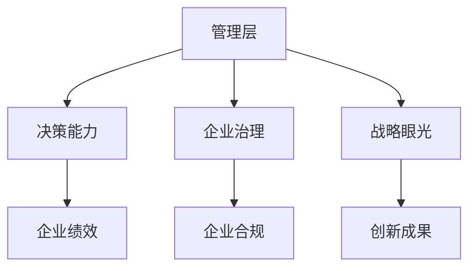
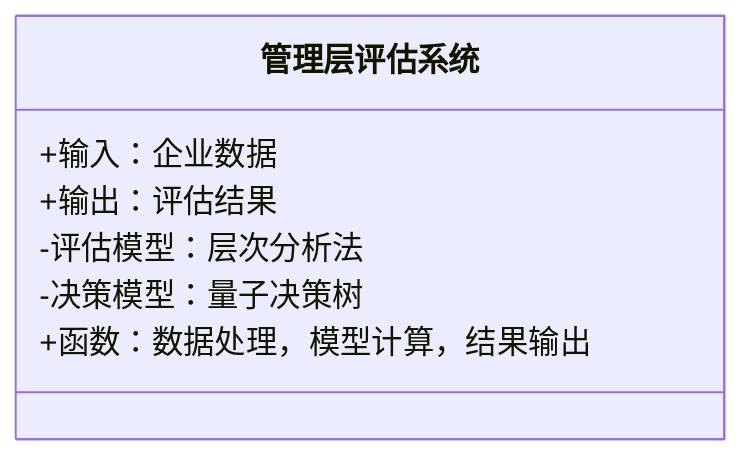
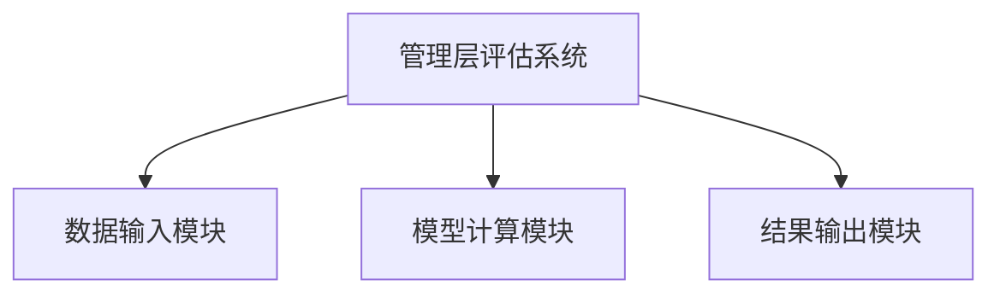
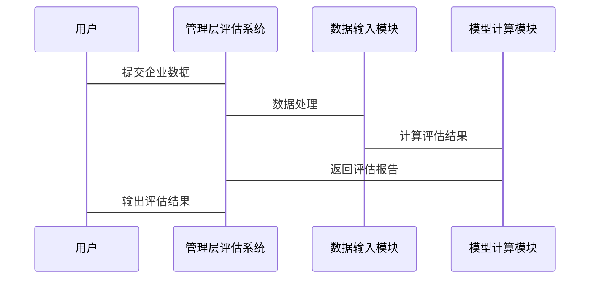

                 


# 巴菲特的管理层评估：量子时代的企业家精神新标准

> 关键词：巴菲特，管理层评估，量子时代，企业家精神，企业管理，决策模型

> 摘要：本文探讨了巴菲特的管理层评估方法在量子时代下的新标准，分析了企业家精神的变化及其对管理层评估的影响，并提出了基于数学模型和系统架构的新方法。

---

## 第1章: 巴菲特投资理念的演变与核心思想

### 1.1 巴菲特投资理念的形成

#### 1.1.1 早期投资经历与价值投资的萌芽
巴菲特早期的投资经历为他的价值投资理念奠定了基础。他从格雷厄姆的价值投资中学习到安全边际和内在价值的概念，形成了以基本面分析为核心的选股方法。

#### 1.1.2 《巴菲特传》中的核心投资原则
通过《巴菲特传》，我们可以了解到巴菲特的核心投资原则，如买入并持有优质资产、注重企业的竞争优势（护城河）以及长期稳定的投资策略。

#### 1.1.3 巴菲特投资理念的现代意义
尽管巴菲特的投资理念源自传统价值投资，但在当前快速变化的市场环境中，其核心思想依然具有重要的指导意义。

### 1.2 量子时代的企业家精神

#### 1.2.1 量子时代对企业管理的挑战
量子时代指的是科技迅速发展、信息爆炸的时代，企业管理面临前所未有的挑战，如快速的技术变革和复杂多变的市场环境。

#### 1.2.2 企业家精神的内涵与外延
企业家精神包括创新、冒险、领导力和战略眼光等，其外延扩展到了企业文化、团队协作和数字化转型等多个方面。

#### 1.2.3 量子时代对企业领导力的新要求
在量子时代，领导力需要更具前瞻性和适应性，领导者需要具备跨学科的知识和应对复杂问题的能力。

### 1.3 管理层评估的核心意义

#### 1.3.1 管理层在企业价值创造中的作用
管理层的决策和执行能力直接影响企业的价值和长期发展，因此对其评估至关重要。

#### 1.3.2 巴菲特对管理层评估的重视
巴菲特在投资过程中非常重视管理层的质量，认为优秀管理层是企业长期成功的关键。

#### 1.3.3 量子时代下管理层评估的新标准
随着科技的发展和市场的变化，管理层评估需要引入新的标准，如创新能力、数字化能力和应对不确定性能力。

---

## 第2章: 巴菲特管理层评估的核心标准

### 2.1 管理层评估的核心维度

#### 2.1.1 领导力与决策能力
领导力决定团队的方向和凝聚力，决策能力则直接影响企业的战略选择和执行效果。

#### 2.1.2 企业治理与道德标准
良好的企业治理和道德标准是企业长期稳定发展的基石，也是评估管理层的重要指标。

#### 2.1.3 战略眼光与创新能力
在量子时代，企业需要不断创新和适应变化，因此管理层的战略眼光和创新能力尤为重要。

#### 2.1.4 团队建设与文化塑造
优秀的团队和积极的企业文化是企业成功的关键，这也需要管理层的精心管理和培养。

### 2.2 管理层评估的数学模型

#### 2.2.1 评估维度的权重分配
为了量化评估维度的重要性，可以采用层次分析法（AHP）来确定各维度的权重。

#### 2.2.2 层次分析法（AHP）的应用
通过构建决策层次结构模型，计算各评估维度的权重，从而为评估提供依据。

#### 2.2.3 数学模型的构建与验证
利用层次分析法构建数学模型，并通过实际案例验证其有效性和合理性。

### 2.3 核心概念与联系

#### 2.3.1 核心概念原理
通过分析管理层评估的核心概念，明确各维度之间的关系和相互作用。

#### 2.3.2 核心概念属性特征对比表格
| 核心概念 | 领导力 | 决策能力 | 企业治理 |
|---------|--------|----------|----------|
| 战略性  | 高     | 中       | 高       |
| 准确性  | 中     | 高       | 中       |
| 合规性  | 中     | 中       | 高       |

#### 2.3.3 ER实体关系图


### 2.4 本章小结
本章总结了巴菲特管理层评估的核心标准，并通过数学模型和系统架构的方法，提出了新的评估方法。

---

## 第3章: 管理层决策能力的量子评估

### 3.1 管理层决策的量子特征

#### 3.1.1 量子决策的不确定性
量子决策的特点是不确定性高，需要考虑多种可能性和概率。

#### 3.1.2 量子决策的叠加态与纠缠态
通过量子叠加和纠缠的特性，分析管理层决策中的复杂性和不确定性。

#### 3.1.3 量子决策对企业管理的影响
量子决策模型可以帮助企业在复杂环境中做出更优的决策。

### 3.2 管理层决策的数学模型

#### 3.2.1 量子概率模型的构建
通过量子概率理论，构建管理层决策的数学模型，考虑多种可能的结果和概率。

#### 3.2.2 量子决策树的分析方法
利用量子决策树来分析管理层决策的路径和可能性，优化决策过程。

#### 3.2.3 量子决策的数学公式
$$ P = \sum_{i} \lambda_i |\psi_i|^2 $$

### 3.3 管理层决策的算法实现

#### 3.3.1 算法流程
1. 确定决策目标和可能结果。
2. 构建量子概率模型。
3. 计算各结果的概率。
4. 优化决策路径。
5. 输出最优决策。

#### 3.3.2 Python实现
```python
import numpy as np

def quantum_decision_model():
    # 示例代码，计算量子概率
    psi = np.array([1, 0])
    lambda_values = [0.5, 0.5]
    probabilities = [lambda * abs(psi[i])**2 for i, lambda in enumerate(lambda_values)]
    return probabilities

quantum_decision_model()
```

### 3.4 本章小结
本章通过量子决策理论和数学模型，分析了管理层决策的新方法，为量子时代的决策提供了新的思路。

---

## 第4章: 管理层评估的系统架构与实现

### 4.1 系统功能设计

#### 4.1.1 领域模型


#### 4.1.2 系统架构


### 4.2 系统接口设计

#### 4.2.1 输入接口
- 数据格式：JSON或CSV
- 数据内容：企业基本信息、管理层数据、财务数据等。

#### 4.2.2 输出接口
- 数据格式：JSON或XML
- 输出内容：评估结果、模型计算报告、优化建议等。

### 4.3 系统交互

#### 4.3.1 序列图


### 4.4 本章小结
本章通过系统架构和接口设计，详细阐述了管理层评估系统的实现过程和关键模块。

---

## 第5章: 项目实战与案例分析

### 5.1 项目背景
通过一个具体案例，分析如何应用新的评估标准进行管理层评估。

### 5.2 核心实现
#### 5.2.1 代码实现
```python
def evaluate_management(teams):
    # 示例代码，评估团队决策能力
    scores = []
    for team in teams:
        score = sum(team.performance) / len(team.performance)
        scores.append(score)
    return scores
```

#### 5.2.2 应用解读
通过代码实现，分析管理层决策能力和团队绩效之间的关系，验证评估模型的有效性。

### 5.3 案例分析
分析一个具体企业的管理层评估过程，展示新标准的应用和效果。

### 5.4 本章小结
本章通过项目实战和案例分析，验证了新评估标准的可行性和实际应用效果。

---

## 第6章: 最佳实践与注意事项

### 6.1 最佳实践 tips
- 结合企业实际情况选择评估模型。
- 定期更新评估标准以适应变化。
- 注重数据质量和模型的可解释性。

### 6.2 小结
总结全文，强调管理层评估在量子时代的重要性，以及新标准的应用价值。

### 6.3 注意事项
- 数据隐私和安全问题。
- 模型的可扩展性和适应性。
- 团队协作和知识共享的重要性。

### 6.4 拓展阅读
推荐相关书籍和资源，供读者进一步学习。

---

## 作者：AI天才研究院/AI Genius Institute & 禅与计算机程序设计艺术 /Zen And The Art of Computer Programming

---

本文通过系统分析和实际案例，探讨了巴菲特管理层评估在量子时代的新标准，为现代企业管理提供了新的思路和方法。希望本文能为读者在复杂多变的商业环境中，提供有价值的指导和启发。

