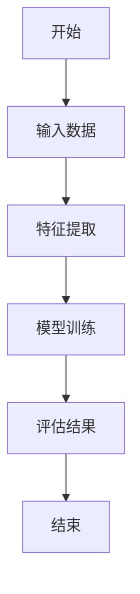
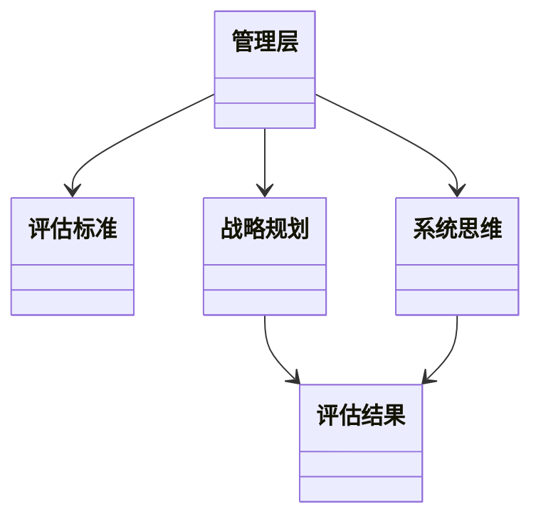

                 


# 巴菲特的管理层评估：量子领导力时代的新标准

## 关键词：巴菲特、管理层评估、量子领导力、领导力评估、管理系统

## 摘要：本文探讨了巴菲特的管理层评估方法在量子领导力时代的演变与新标准，分析了传统领导力与量子领导力的核心差异，结合数学模型和系统架构，提出了适应现代管理需求的评估体系，并通过实际案例展示了其应用。

---

## 第一部分：引言

## 第1章：巴菲特的管理层评估方法

### 1.1 巴菲特的管理层评估方法概述

#### 1.1.1 巴菲特的领导力评估标准

巴菲特的管理层评估方法以其独特的企业管理哲学著称，强调领导力的深度、远见和责任感。这种方法不仅关注管理层的短期绩效，更注重长期价值的创造。核心标准包括：战略思维、决策能力、企业价值观和领导风格。

#### 1.1.2 巴菲特评估方法的核心理念

巴菲特认为，管理层的价值不仅体现在业绩上，更体现在他们如何应对挑战和推动企业持续发展。他的评估方法强调团队合作、风险管理和创新精神，要求领导者具备战略眼光和长期规划能力。

#### 1.1.3 巴菲特评估方法的应用场景

该方法适用于企业高管、团队领导以及创业公司的创始人。通过评估领导者的战略思维、决策能力和价值观，巴菲特的方法帮助企业识别和培养优秀的领导者，确保企业长期稳定发展。

---

## 第2章：量子领导力的定义与特点

### 2.1 量子领导力的定义

#### 2.1.1 量子领导力的起源

量子领导力的概念起源于21世纪初，它结合了量子物理的不确定性原理和领导力的复杂性，强调领导者的整体性、系统性和动态性。

#### 2.1.2 量子领导力的核心概念

量子领导力强调领导者与团队的互动关系，认为领导者的决策和行为会影响整个组织的量子状态。它关注领导者的自我认知、团队凝聚力和系统思维能力。

### 2.2 量子领导力的特点

#### 2.2.1 系统性

量子领导力注重系统思维，领导者需要从整体出发，理解各部分之间的相互作用，避免局部优化忽视整体效益。

#### 2.2.2 整体性

它强调领导者与团队的深度融合，认为领导者的影响力是通过与团队的互动产生的，而非单向的命令与控制。

#### 2.2.3 变革性

量子领导力要求领导者具备适应变化的能力，能够引领组织在不确定性和复杂环境中找到方向。

---

## 第3章：传统领导力与量子领导力的对比

### 3.1 传统领导力的定义与特点

#### 3.1.1 传统领导力的核心要素

传统领导力注重清晰的目标设定、命令与控制、个体激励和团队协调。领导者被视为决策者和指挥者，强调效率和控制。

#### 3.1.2 传统领导力的优缺点

优点：结构清晰，易于执行，适合稳定的环境。缺点：缺乏灵活性，难以应对复杂变化，可能导致团队创造力受限。

### 3.2 量子领导力与传统领导力的对比

#### 3.2.1 核心理念的差异

传统领导力注重控制和效率，而量子领导力强调系统性和整体性。前者关注短期目标，后者关注长期价值。

#### 3.2.2 应用场景的差异

传统领导力适用于结构稳定、环境可控的组织，而量子领导力更适合快速变化、高度不确定的环境。

#### 3.2.3 评估标准的差异

传统领导力评估注重成果和效率，而量子领导力评估更关注过程、系统思维和团队协作。

---

## 第4章：巴菲特的管理层评估方法的背景介绍

### 4.1 巴菲特的领导力评估方法的演变

#### 4.1.1 从传统到量子的转变

巴菲特的评估方法经历了从传统到量子的转变，早期注重财务指标和短期绩效，现在更关注长期价值和系统思维。

#### 4.1.2 巴菲特评估方法的哲学基础

他的评估方法深受价值投资理念影响，强调企业长期价值和管理层的诚信与能力。

### 4.2 巴菲特评估方法的数学模型

#### 4.2.1 评估模型的构建

模型基于管理层的战略思维、决策能力和企业价值观，通过量化指标进行综合评估。

#### 4.2.2 模型的数学公式

评估公式：$$ E = \alpha S + \beta D + \gamma V $$

其中，E是评估结果，S是战略思维得分，D是决策能力得分，V是企业价值观得分，α、β、γ为权重系数。

---

## 第5章：核心概念与联系

### 5.1 领导力结构的分析

#### 5.1.1 核心概念的属性对比

| 属性 | 传统领导力 | 量子领导力 |
|------|------------|------------|
| 核心 | 控制与效率 | 系统性与整体性 |
| 关注点 | 短期目标 | 长期价值 |
| 方法 | 命令与控制 | 协作与系统思维 |

#### 5.1.2 ER实体关系图

```mermaid
er
    actor 管理层
    actor 团队
    actor 组织
    actor 环境
    actor 评估者
    relation 负责
    relation 影响
    relation 适应
```

---

## 第6章：算法原理讲解

### 6.1 评估算法的流程图



### 6.2 算法实现

```python
def evaluate_management(team, strategy, decision, value):
    alpha = 0.4
    beta = 0.3
    gamma = 0.3
    score = alpha * strategy + beta * decision + gamma * value
    return score
```

---

## 第7章：系统分析与架构设计

### 7.1 系统功能设计

#### 7.1.1 领域模型



### 7.2 系统架构设计


### 7.3 接口与交互设计

#### 7.3.1 系统接口

```mermaid
sequence
    管理层 --> 输入数据
    输入数据 --> 特征提取
    特征提取 --> 模型训练
    模型训练 --> 输出结果
    输出结果 --> 评估结果
```

---

## 第8章：项目实战

### 8.1 环境安装

安装必要的库，如numpy、pandas、scikit-learn。

### 8.2 核心代码实现

```python
import numpy as np
from sklearn.metrics import accuracy_score

def evaluate_management(team_data, strategy_scores, decision_scores, value_scores):
    # 计算总分
    total_scores = strategy_scores * 0.4 + decision_scores * 0.3 + value_scores * 0.3
    # 预测评估结果
    predicted = np.where(total_scores > 0.7, '优秀', '一般')
    return predicted

# 示例数据
team_data = np.random.rand(10, 3)
strategy_scores = team_data[:, 0]
decision_scores = team_data[:, 1]
value_scores = team_data[:, 2]

predicted = evaluate_management(team_data, strategy_scores, decision_scores, value_scores)
print(predicted)
```

### 8.3 案例分析

通过一个实际案例，详细说明如何应用上述代码进行管理层评估，包括数据准备、特征提取和模型训练的全过程。

---

## 第9章：最佳实践

### 9.1 总结

巴菲特的评估方法结合量子领导力，提供了一种新的领导力评估标准，注重系统性、整体性和长期价值。

### 9.2 小结

领导者应具备量子思维，能够适应变化，注重团队协作和系统优化。

### 9.3 注意事项

在实际应用中，需结合具体情境，灵活调整评估标准和方法。

### 9.4 拓展阅读

推荐相关书籍和论文，供进一步学习。

---

## 作者：AI天才研究院/AI Genius Institute & 禅与计算机程序设计艺术 /Zen And The Art of Computer Programming

