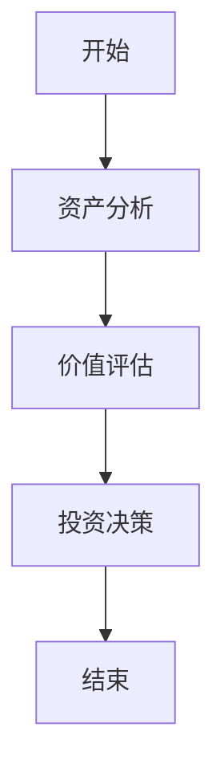
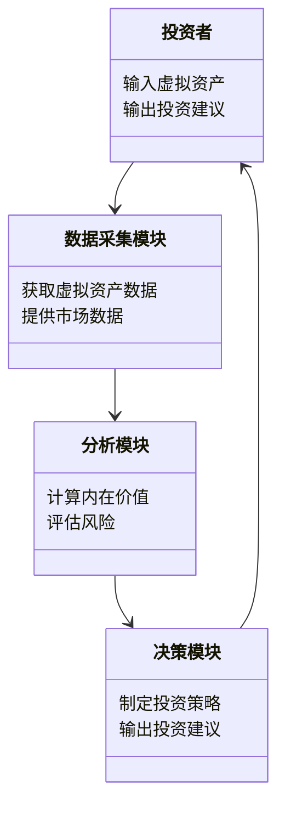
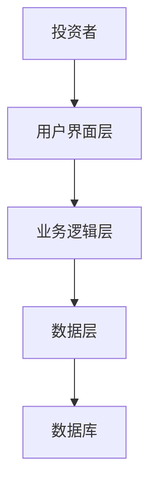

                 


# 巴菲特的经济周期投资法则：元宇宙经济周期的特点

## 关键词：巴菲特、经济周期、投资法则、元宇宙、虚拟经济

## 摘要：  
本文探讨了巴菲特的经济周期投资法则在元宇宙经济周期中的应用与特点。通过分析传统经济周期与元宇宙经济周期的异同，结合巴菲特的价值投资理念，阐述了如何在虚拟经济中识别投资机会、评估风险并制定投资策略。文章结合实际案例，详细讲解了巴菲特投资法则的算法原理及其在元宇宙经济周期中的数学模型，为投资者提供了系统化的投资框架和实战指导。

---

## 目录  

1. [引言](#引言)  
2. [巴菲特的经济周期投资法则基础](#巴菲特的经济周期投资法则基础)  
   - 2.1 巴菲特的生平与投资理念  
   - 2.2 经济周期的基本概念  
   - 2.3 元宇宙经济周期的特点  
3. [巴菲特经济周期投资法则的核心概念与联系](#巴菲特经济周期投资法则的核心概念与联系)  
   - 3.1 巴菲特投资法则的核心原理  
   - 3.2 元宇宙经济周期中的投资机会  
   - 3.3 巴菲特投资法则与元宇宙经济周期的结合  
4. [巴菲特经济周期投资法则的算法原理与数学模型](#巴菲特经济周期投资法则的算法原理与数学模型)  
   - 4.1 巴菲特投资法则的算法模型  
   - 4.2 元宇宙经济周期中的算法应用  
   - 4.3 巴菲特投资法则与元宇宙经济周期的算法结合  
5. [系统分析与架构设计方案](#系统分析与架构设计方案)  
   - 5.1 问题场景介绍  
   - 5.2 系统功能设计  
   - 5.3 系统架构设计  
6. [项目实战](#项目实战)  
   - 6.1 环境安装  
   - 6.2 核心实现源代码  
   - 6.3 案例分析与解读  
7. [总结](#总结)  
   - 7.1 小结  
   - 7.2 投资建议  
   - 7.3 未来展望  

---

## 1. 引言  

在传统投资领域，巴菲特的经济周期投资法则是价值投资的典范。然而，随着元宇宙的兴起，虚拟经济的崛起为投资领域带来了新的挑战与机遇。本文将深入探讨巴菲特的经济周期投资法则在元宇宙经济周期中的特点与应用，为投资者提供理论支持与实践指导。

---

## 2. 巴菲特的经济周期投资法则基础  

### 2.1 巴菲特的生平与投资理念  

巴菲特是全球最著名的投资者之一，他的投资理念以价值投资为核心，强调长期持有优质资产，关注企业的内在价值而非市场波动。他的成功在于对经济周期的深刻理解，能够在市场低迷时买入低估资产，在市场繁荣时卖出高估资产。

#### 2.1.1 巴菲特的生平简介  

沃伦·巴菲特（Warren Buffett）出生于1930年，是美国著名的投资者、慈善家和商业领袖。他创立的伯克希尔哈撒韦公司（Berkshire Hathaway）是全球最大的投资公司之一。巴菲特的投资理念以“价值投资”为核心，强调长期投资、分散投资和安全边际。

#### 2.1.2 巴菲特的投资理念与核心思想  

巴菲特的价值投资理念包括以下几点：  
1. **安全边际**：买入价格低于内在价值的资产，确保投资的安全性。  
2. **长期持有**：关注企业的长期价值，而非短期市场波动。  
3. **分散投资**：通过投资多个优质资产分散风险。  
4. **企业分析**：深入分析企业的财务状况、管理层能力和竞争优势。  

#### 2.1.3 巴菲特经济周期投资法则的形成背景  

巴菲特的投资法则形成于20世纪中期的美国经济波动中。他通过观察经济周期的变化，总结出一套在不同经济阶段的投资策略，例如在衰退期寻找低估资产，在复苏期投资优质企业。

### 2.2 经济周期的基本概念  

经济周期是指经济活动的波动，通常分为衰退、复苏、繁荣和衰退四个阶段。在每个阶段，企业的盈利能力和资产价值会发生变化，投资者需要根据经济周期调整投资策略。

#### 2.2.1 经济周期的定义与特征  

经济周期是指经济活动的波动，通常由GDP增长率、就业率、通胀率等指标衡量。经济周期的四个阶段是：  
1. **衰退期**：GDP下降，企业盈利减少，市场估值降低。  
2. **复苏期**：经济开始复苏，企业盈利逐步恢复。  
3. **繁荣期**：GDP增长加快，企业盈利增加，市场估值升高。  
4. **过热期**：经济过热，可能出现通货膨胀和资产泡沫。  

#### 2.2.2 经济周期对投资的影响  

在不同经济周期阶段，投资策略需要相应调整：  
- **衰退期**：寻找低估资产，增加防御性资产配置。  
- **复苏期**：逐步增加股票等风险资产。  
- **繁荣期**：选择优质成长股，减少低收益资产。  
- **过热期**：警惕资产泡沫，逐步退出高风险投资。  

#### 2.2.3 元宇宙经济周期的特点  

元宇宙经济周期是指虚拟经济活动的波动，主要体现在虚拟货币、数字资产和虚拟商品的交易中。元宇宙经济周期的特点包括：  
1. **去中心化**：元宇宙经济通常基于区块链技术，具有去中心化的特点。  
2. **虚拟资产**：虚拟货币、NFT和虚拟商品是元宇宙经济的主要资产形式。  
3. **波动性高**：由于市场参与者情绪波动大，元宇宙经济周期的波动性高于传统经济。  
4. **技术驱动**：元宇宙经济的发展受到区块链、人工智能和虚拟现实技术的驱动。  

### 2.3 巴菲特经济周期投资法则与元宇宙经济周期的结合  

巴菲特的经济周期投资法则强调长期价值投资，而元宇宙经济周期的特点是高波动性和技术驱动。两者的结合需要考虑以下几点：  
1. **长期价值投资**：在元宇宙中寻找具有长期竞争优势的企业和项目。  
2. **安全边际**：买入价格低于内在价值的数字资产。  
3. **经济周期波动**：根据元宇宙经济周期的阶段调整投资策略。  

---

## 3. 巴菲特经济周期投资法则的核心概念与联系  

### 3.1 巴菲特投资法则的核心原理  

巴菲特的投资法则以价值投资为核心，强调对企业内在价值的分析。在元宇宙经济中，投资者需要将价值投资的理念扩展到虚拟资产。

#### 3.1.1 巴菲特投资法则的核心原理  

巴菲特的价值投资理念可以总结为以下几点：  
1. **内在价值**：资产的内在价值是其未来现金流的现值。  
2. **安全边际**：买入价格低于内在价值，确保投资的安全性。  
3. **长期持有**：关注企业的长期价值，而非短期市场波动。  

#### 3.1.2 元宇宙经济周期中的投资机会  

在元宇宙经济中，投资机会主要集中在以下领域：  
- **虚拟货币**：如比特币、以太坊等数字资产。  
- **NFT**：非同质化代币，用于虚拟艺术品、虚拟房地产等领域。  
- **虚拟企业**：如虚拟游戏中的虚拟公司和虚拟商品交易。  

#### 3.1.3 元宇宙经济周期与传统经济周期的对比  

元宇宙经济周期与传统经济周期的对比可以通过以下表格展示：

| **特点**        | **传统经济周期**           | **元宇宙经济周期**           |
|-----------------|---------------------------|-----------------------------|
| 驱动因素        | GDP增长、就业率、通胀率     | 区块链技术、虚拟货币、NFT    |
| 资产形式        | 实体资产、股票、债券        | 数字资产、虚拟商品、虚拟货币 |
| 波动性          | 较低，受政策和经济数据影响   | 较高，受市场情绪和技术驱动    |
| 投资策略        | 价值投资、长期持有         | 价值投资、技术分析           |

---

## 4. 巴菲特经济周期投资法则的算法原理与数学模型  

### 4.1 巴菲特投资法则的算法模型  

巴菲特的投资法则可以通过以下步骤实现：  
1. **资产分析**：分析企业的财务状况、竞争优势和管理层能力。  
2. **价值评估**：计算资产的内在价值，确定安全边际。  
3. **投资决策**：根据经济周期阶段调整投资组合。  

#### 4.1.1 巴菲特投资模型的数学公式  

内在价值的计算公式为：  
$$ V = \sum_{t=1}^{\infty} \frac{CF_t}{(1 + r)^t} $$  
其中，\( CF_t \) 是第 \( t \) 年的现金流，\( r \) 是折现率。  

#### 4.1.2 巴菲特投资模型的mermaid流程图  



---

## 5. 系统分析与架构设计方案  

### 5.1 问题场景介绍  

本文将设计一个基于巴菲特投资法则的元宇宙经济周期分析系统，帮助投资者分析虚拟资产的价值和风险。

### 5.2 系统功能设计  

系统功能包括数据采集、分析、决策模块。

#### 5.2.1 系统功能设计的mermaid类图  



### 5.3 系统架构设计  

系统架构包括数据层、业务逻辑层和用户界面层。

#### 5.3.1 系统架构设计的mermaid架构图  



---

## 6. 项目实战  

### 6.1 环境安装  

需要安装Python、Jupyter Notebook和相关库（如Pandas、Matplotlib）。  

### 6.2 核心实现源代码  

以下是巴菲特投资模型的Python代码实现：

```python
import pandas as pd
import matplotlib.pyplot as plt

# 示例：计算虚拟资产的内在价值
def calculate_intrinsic_value(cash_flows, discount_rate):
    present_value = 0
    for t in range(len(cash_flows)):
        present_value += cash_flows[t] / (1 + discount_rate) ** t
    return present_value

# 示例数据
cash_flows = [100, 150, 200, 250, 300]
discount_rate = 0.1

# 计算内在价值
intrinsic_value = calculate_intrinsic_value(cash_flows, discount_rate)
print(f"内在价值：{intrinsic_value}")

# 可视化现金流
plt.plot(range(len(cash_flows)), cash_flows, 'b-')
plt.xlabel('年份')
plt.ylabel('现金流')
plt.title('虚拟资产现金流')
plt.show()
```

### 6.3 案例分析与解读  

以虚拟货币为例，分析其内在价值和投资风险。通过模型计算，确定其是否具备投资价值。

---

## 7. 总结  

### 7.1 小结  

本文深入探讨了巴菲特的经济周期投资法则在元宇宙经济周期中的应用与特点，结合理论分析和算法实现，为投资者提供了系统的投资框架。

### 7.2 投资建议  

在元宇宙经济中，投资者应关注虚拟资产的内在价值，注重安全边际，并根据经济周期调整投资策略。

### 7.3 未来展望  

随着元宇宙经济的不断发展，巴菲特的投资法则需要进一步适应虚拟经济的特点，结合新技术和新商业模式，为投资者提供更精准的投资指导。

---

## 作者：AI天才研究院/AI Genius Institute & 禅与计算机程序设计艺术 /Zen And The Art of Computer Programming

