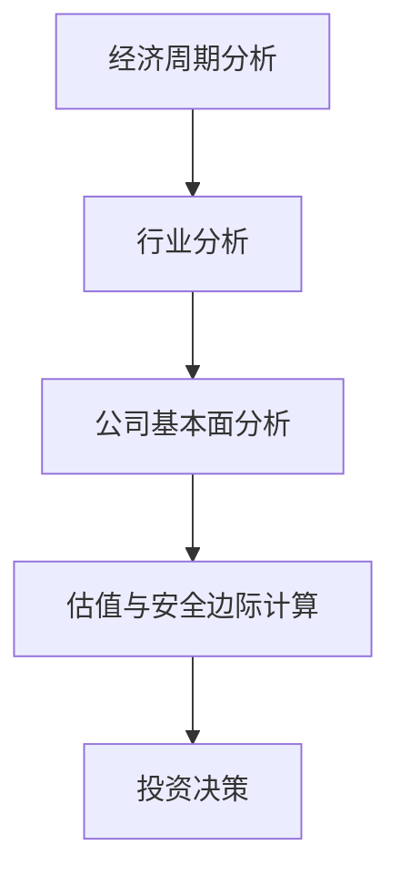

                 


# 巴菲特的经济周期投资法则：后疫情时代的经济复苏

> 关键词：巴菲特、经济周期、投资法则、后疫情时代、经济复苏、风险管理

> 摘要：本文系统阐述了巴菲特的经济周期投资法则，分析了其在后疫情时代的应用。通过详细解读巴菲特的投资理念、价值投资策略、安全边际概念以及经济周期中的投资布局，结合实际案例，探讨了在经济复苏期如何识别投资机会、构建投资组合以及应对市场风险。本文还提供了风险管理的具体方法和长期投资策略，帮助读者在复杂多变的经济环境中实现稳健投资。

---

## 第一部分: 巴菲特的经济周期投资法则概述

### 第1章: 巴菲特投资理念的核心要素

#### 1.1 巴菲特的生平与投资哲学

##### 1.1.1 巴菲特的早年经历与投资启蒙
沃伦·巴菲特（Warren Buffett）于1934年出生在美国奥马哈市，早年展现出对数字和投资的浓厚兴趣。他在高中时期就开始研究股票市场，并通过阅读《格雷厄姆证券分析》一书，接触到价值投资的核心理念。巴菲特的职业生涯始于1950年代，他通过不断学习和实践，逐步形成了自己独特的投资哲学。

##### 1.1.2 巴菲特的价值投资理念
巴菲特的价值投资理念的核心是“买入优秀的公司，以合理的价格买入”。他强调关注企业的内在价值，而非市场的短期波动。他认为，市场的短期波动为投资者提供了以低于内在价值的价格买入优质资产的机会。

##### 1.1.3 巴菲特的长期投资策略
巴菲特主张长期持有优质资产，避免频繁交易。他认为，投资的本质是通过持有优质企业的一部分股权，分享其长期增长的成果。这种策略在经济周期波动中表现出极强的稳定性。

#### 1.2 经济周期的基本概念

##### 1.2.1 经济周期的定义与特征
经济周期是指经济活动的波动性变化，通常分为四个阶段：衰退、萧条、复苏和繁荣。每个阶段都有其独特的市场特征和投资机会。

##### 1.2.2 经济周期的四个阶段
1. **衰退阶段**：经济增长放缓，企业利润下降，市场情绪低迷。
2. **萧条阶段**：经济活动达到低点，失业率上升，消费者信心下降。
3. **复苏阶段**：经济开始逐步恢复，企业利润回升，市场情绪改善。
4. **繁荣阶段**：经济增长强劲，企业利润创新高，市场情绪乐观。

##### 1.2.3 经济周期对投资的影响
在不同的经济周期阶段，投资策略应有所调整。例如，在衰退阶段，应寻找被市场低估的优质资产；在复苏阶段，应关注经济回升带来的投资机会。

### 第2章: 巴菲特投资法则的核心原则

#### 2.1 价值投资的核心原则

##### 2.1.1 买入优秀的公司
巴菲特强调选择那些具有强大竞争优势、稳定的盈利能力和良好管理团队的企业。这些企业在经济周期波动中表现更为稳健。

##### 2.1.2 长期持有优质资产
巴菲特的投资策略是长期持有优质资产，避免频繁交易。他认为，短期市场的波动不应影响长期投资决策。

##### 2.1.3 避免短期市场波动
巴菲特提醒投资者，市场短期波动往往由情绪驱动，而长期投资应关注企业的基本面。

#### 2.2 安全边际的概念与应用

##### 2.2.1 安全边际的定义
安全边际是指买入价格低于企业内在价值的差额部分。巴菲特认为，安全边际是保护投资者免受市场波动影响的重要屏障。

##### 2.2.2 安全边际的计算方法
安全边际 = 内在价值 - 市场价格

##### 2.2.3 安全边际在投资中的作用
通过预留安全边际，投资者可以在市场低估企业价值时获得额外的收益空间，同时降低投资风险。

#### 2.3 经济周期中的投资策略

##### 2.3.1 经济衰退期的投资机会
在衰退阶段，市场情绪低迷，许多优质资产被低估。此时是买入长期优质资产的绝佳机会。

##### 2.3.2 经济复苏期的投资布局
在复苏阶段，市场开始回暖，企业利润逐步回升。投资者应关注那些在衰退阶段表现稳健的企业，继续持有或加仓。

##### 2.3.3 经济繁荣期的风险控制
在繁荣阶段，市场情绪乐观，但企业估值可能偏高。此时应警惕市场的过度泡沫，并考虑适当降低投资组合的风险敞口。

---

## 第二部分: 巴菲特投资法则的系统分析

### 第3章: 巴菲特投资模型的系统架构

#### 3.1 投资模型的输入与输出

##### 3.1.1 输入：经济周期分析
经济周期分析是巴菲特投资模型的核心输入之一。通过分析当前所处的经济周期阶段，投资者可以更好地制定投资策略。

##### 3.1.2 输入：公司基本面分析
公司基本面分析包括对企业财务状况、盈利能力、竞争优势和管理团队的评估。

##### 3.1.3 输出：投资决策
基于经济周期分析和公司基本面分析，投资者可以做出买入、卖出或持有某只股票的决策。

#### 3.2 投资模型的逻辑流程

##### 3.2.1 经济周期判断
通过分析经济指标（如GDP增长率、失业率、通胀率等），判断当前经济所处的周期阶段。

##### 3.2.2 行业分析与筛选
根据经济周期的不同阶段，筛选出具有增长潜力的行业。

##### 3.2.3 公司估值与安全边际计算
对目标公司进行估值，并计算其相对于市场价格的安全边际。

#### 3.3 投资模型的架构图



---

### 第4章: 巴菲特投资法则的数学模型与算法

#### 4.1 投资模型的数学公式

##### 4.1.1 内在价值计算公式
$$
\text{内在价值} = \sum_{t=1}^{\infty} \frac{\text{现金流}}{(1 + r)^t}
$$

其中，$r$ 是折现率，通常使用企业的加权平均资本成本（WACC）。

##### 4.1.2 安全边际计算公式
$$
\text{安全边际} = \text{内在价值} - \text{市场价格}
$$

#### 4.2 投资模型的算法流程

##### 4.2.1 经济周期判断
1. 收集经济指标数据（GDP增长率、失业率、通胀率等）。
2. 分析数据，判断当前经济周期阶段。

##### 4.2.2 行业分析与筛选
1. 根据经济周期阶段，筛选出具有增长潜力的行业。
2. 对目标行业进行深入分析，评估行业前景。

##### 4.2.3 公司估值与安全边际计算
1. 对目标公司进行基本面分析，计算其内在价值。
2. 比较市场价格与内在价值，计算安全边际。

---

## 第三部分: 巴菲特投资法则在后疫情时代的应用

### 第5章: 后疫情时代的经济复苏

#### 5.1 后疫情时代的经济特征

##### 5.1.1 经济衰退的阶段
疫情初期，全球经济遭受重创，许多企业陷入困境，市场情绪低迷。

##### 5.1.2 经济复苏的迹象
随着疫苗的普及和经济政策的支持，全球经济开始逐步复苏，企业利润回升。

##### 5.1.3 经济复苏的投资机会
在复苏阶段，许多优质资产被低估，此时是买入长期优质资产的绝佳机会。

#### 5.2 后疫情时代的投资布局

##### 5.2.1 关注经济复苏受益行业
在后疫情时代，消费、科技、医疗等行业可能成为经济复苏的最大受益者。

##### 5.2.2 选择具有强大竞争优势的企业
投资者应关注那些在疫情中表现稳健、具有强大竞争优势的企业。

##### 5.2.3 优化投资组合
根据经济周期阶段，优化投资组合的结构，降低风险敞口。

### 第6章: 后疫情时代的风险管理

#### 6.1 风险管理的核心原则

##### 6.1.1 风险与收益的平衡
投资者需要在风险与收益之间找到平衡点，避免过度冒险。

##### 6.1.2 风险分散化
通过分散投资，降低投资组合的整体风险。

##### 6.1.3 定期评估与调整
根据市场变化和经济周期阶段，定期评估投资组合，并进行必要的调整。

#### 6.2 后疫情时代的风控策略

##### 6.2.1 关注宏观经济指标
通过分析宏观经济指标，判断经济周期阶段，制定相应的风险管理策略。

##### 6.2.2 评估企业抗风险能力
在选择投资标的时，应关注企业的抗风险能力，确保其能够在经济波动中保持稳健。

##### 6.2.3 控制杠杆风险
避免过度使用杠杆，降低投资组合的整体风险。

---

## 第四部分: 巴菲特投资法则的项目实战

### 第7章: 投资组合的实际操作

#### 7.1 环境安装

##### 7.1.1 数据收集工具
使用Yahoo Finance、Bloomberg等工具收集经济指标和公司基本面数据。

##### 7.1.2 分析工具
使用Excel、Python等工具进行数据分析和建模。

#### 7.2 核心实现源代码

##### 7.2.1 经济周期判断
```python
def get_economic_stage(gdp_growth, unemployment_rate):
    if gdp_growth < -2 and unemployment_rate > 8:
        return "衰退"
    elif -2 <= gdp_growth < 1 and unemployment_rate > 6:
        return "复苏"
    elif gdp_growth >= 1 and unemployment_rate < 6:
        return "繁荣"
    else:
        return "萧条"
```

##### 7.2.2 公司估值计算
```python
def calculate_intrinsic_value(cash_flows, discount_rate):
    iv = 0
    for t in range(len(cash_flows)):
        iv += cash_flows[t] / (1 + discount_rate) ** t
    return iv
```

#### 7.3 实际案例分析
以某科技公司为例，分析其在后疫情时代的投资价值。

---

## 第五部分: 总结与展望

### 第8章: 巴菲特投资法则的总结

#### 8.1 核心思想回顾
巴菲特的投资法则强调长期价值投资、安全边际和经济周期分析。这些理念在后疫情时代的经济复苏中依然具有重要的指导意义。

#### 8.2 投资策略的优化
投资者应根据经济周期阶段，不断优化投资策略，关注优质资产，控制投资风险。

### 第9章: 未来投资趋势的展望

#### 9.1 数字经济的崛起
随着科技的快速发展，数字经济将成为未来经济增长的重要驱动力。

#### 9.2 可持续投资的兴起
环保、社会责任和公司治理（ESG）将成为未来投资的重要考量因素。

#### 9.3 全球化与分散化投资
全球经济的不确定性增加，投资者应注重分散化投资，降低投资风险。

---

## 作者信息

作者：AI天才研究院/AI Genius Institute & 禅与计算机程序设计艺术 /Zen And The Art of Computer Programming

---

通过以上分析，我们可以看到巴菲特的经济周期投资法则在后疫情时代的应用具有重要的现实意义。投资者应根据经济周期阶段，制定相应的投资策略，关注优质资产，控制投资风险，实现长期稳健的投资收益。

