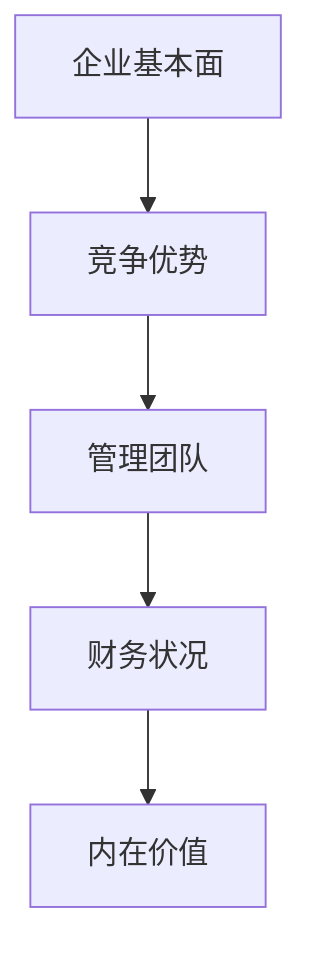

                 

# 巴菲特的经济周期投资：数字货币政策影响下的策略调整

## 关键词：巴菲特，经济周期，数字货币政策，投资策略，风险管理

## 摘要：本文探讨了巴菲特的经济周期投资策略，特别是在数字货币政策影响下的调整。通过分析数字货币政策对经济周期的影响，结合巴菲特的投资理念，提出在不同经济阶段的投资策略和风险管理方法，为投资者提供实用的指导。

---

# 第一部分: 巴菲特的经济周期投资基础

## 第1章: 巴菲特投资理念概述

### 1.1 巴菲特投资哲学的核心思想

#### 1.1.1 价值投资的定义与核心理念
价值投资是一种以内在价值为导向的投资方法，强调购买低于其内在价值的资产。巴菲特的价值投资理念强调企业基本面分析，寻找具有持续竞争优势和良好管理的公司。

**图1.1：价值投资的核心要素**

#### 1.1.2 巴菲特的投资策略与长期主义
巴菲特倡导长期投资，避免短期市场波动的干扰。他通过持有优质资产，等待其内在价值的实现，实现长期收益。

#### 1.1.3 巴菲特投资理念的演变与实践
从早期的烟蒂股策略到后期的买入并持有伟大企业的策略，巴菲特的投资理念随着市场环境和自身经验不断演变。

### 1.2 经济周期与投资策略的关系

#### 1.2.1 经济周期的基本概念与阶段划分
经济周期分为繁荣、衰退、复苏和稳定四个阶段，每个阶段具有不同的市场特征和投资机会。

**图1.2：经济周期的阶段划分**

#### 1.2.2 经济周期对投资决策的影响
经济周期的变化影响企业的盈利能力、市场的流动性以及资产价格的波动，进而影响投资策略的选择。

#### 1.2.3 巴菲特如何应对经济周期波动
巴菲特通过分析经济周期，调整投资策略，寻找在不同周期中的优势资产。

---

## 第2章: 数字货币政策对经济周期的影响

### 2.1 数字货币政策的定义与特点

#### 2.1.1 数字货币的兴起与发展
数字货币，如比特币和各国央行数字货币（CBDC），正在改变传统货币政策的实施方式。

#### 2.1.2 数字货币政策的实施机制
通过数字化手段，央行可以更精准地控制货币供应量和流动性，实现货币政策目标。

#### 2.1.3 数字货币政策与传统货币政策的对比
数字货币政策具有更高的透明度和效率，但同时也带来了新的风险和挑战。

### 2.2 数字货币政策对经济周期的调节作用

#### 2.2.1 数字货币政策在经济衰退中的应用
通过量化宽松和负利率等政策工具，央行可以刺激经济，缓解衰退压力。

#### 2.2.2 数字货币政策在经济过热中的应用
通过加息和收缩货币供应，央行可以抑制通胀和资产泡沫。

#### 2.2.3 数字货币政策对市场预期的影响
数字货币政策的透明度和及时性可以更有效地引导市场预期，减少市场波动。

---

## 第3章: 巴菲特投资策略的经济周期分析

### 3.1 经济周期分析方法

#### 3.1.1 经济周期的指标与信号
常用的经济指标包括GDP增长率、失业率、通胀率等，这些指标可以帮助投资者判断经济周期所处的阶段。

#### 3.1.2 巴菲特如何识别经济周期拐点
巴菲特通过观察市场情绪、企业盈利情况和经济数据变化，判断经济周期的拐点。

#### 3.1.3 经济周期对资产配置的影响
在不同经济周期阶段，巴菲特会调整资产配置，以应对市场变化。

### 3.2 巴菲特投资策略的经济周期调整

#### 3.2.1 繁荣期的投资策略
在繁荣期，巴菲特倾向于选择具有持续增长潜力的企业，避免高风险投资。

#### 3.2.2 衰退期的投资策略
在衰退期，巴菲特会寻找被低估的资产，利用市场恐慌进行逆向投资。

#### 3.2.3 复苏期的投资策略
在复苏期，巴菲特关注经济回升带来的投资机会，逐步增加风险资产配置。

#### 3.2.4 稳定期的投资策略
在稳定期，巴菲特保持适度的资产配置，注重风险管理和长期收益。

---

# 第二部分: 数字货币政策下的投资策略调整

## 第4章: 数字货币政策对投资组合的影响

### 4.1 数字货币政策对股票市场的影响

#### 4.1.1 货币政策对股市的传导机制
通过影响利率、企业盈利和市场流动性，货币政策直接影响股票市场价格。

#### 4.1.2 数字货币政策对股市的短期与长期影响
短期内，宽松货币政策可能推高股价；长期来看，过度宽松可能导致资产泡沫。

#### 4.1.3 巴菲特如何在数字货币政策下调整股票投资
巴菲特会根据货币政策的宽松程度，选择具有持续竞争优势的企业进行投资。

### 4.2 数字货币政策对债券市场的影响

#### 4.2.1 货币政策对债市的传导机制
货币政策通过影响利率和债券收益率，间接影响债券价格。

#### 4.2.2 数字货币政策对债市的短期与长期影响
短期来看，宽松货币政策可能降低债券收益率；长期来看，可能引发债券市场的信用风险。

#### 4.2.3 巴菲特如何在数字货币政策下调整债券投资
巴菲特倾向于在债券市场波动较大时，选择信用评级较高的债券进行配置。

---

## 第5章: 巴菲特投资策略在数字货币政策下的优化

### 5.1 数字货币政策下的资产配置策略

#### 5.1.1 资产配置的基本原则
根据经济周期和货币政策环境，动态调整资产配置比例。

#### 5.1.2 数字货币政策下的资产配置调整
在宽松货币政策下，增加权益类资产配置；在紧缩政策下，增加防御性资产配置。

#### 5.1.3 巴菲特的资产配置经验分享
巴菲特强调分散投资和长期持有，避免过度集中风险。

### 5.2 数字货币政策下的风险管理策略

#### 5.2.1 风险管理的基本原则
量化风险、分散投资、定期评估和调整策略。

#### 5.2.2 数字货币政策下的风险管理调整
通过分析货币政策对资产价格的影响，优化风险敞口。

#### 5.2.3 巴菲特的风险管理经验分享
巴菲特注重企业基本面分析，选择具有强大财务状况和竞争优势的企业。

---

## 第6章: 实际案例分析与经验总结

### 6.1 巴菲特在历次经济周期中的投资策略

#### 6.1.1 2008年金融危机期间的投资策略
巴菲特在金融危机期间大量投资于优质企业，如购买高盛和摩根大通的股权。

#### 6.1.2 疫情期间的投资策略
在疫情导致的市场恐慌中，巴菲特逆向投资，购买伯克希尔 Hathaway等优质资产。

#### 6.1.3 数字货币政策下的投资策略
在数字货币政策实施期间，巴菲特选择具有长期竞争优势和良好财务状况的企业进行投资。

### 6.2 数字货币政策下的投资策略优化

#### 6.2.1 投资策略优化的基本原则
根据货币政策环境，动态调整投资策略。

#### 6.2.2 数字货币政策下的投资策略优化
结合经济周期和货币政策，优化资产配置和风险管理。

#### 6.2.3 巴菲特的投资策略优化经验
巴菲特的成功在于坚持长期投资，选择优质企业，并根据经济环境调整投资策略。

---

# 作者：AI天才研究院/AI Genius Institute & 禅与计算机程序设计艺术 /Zen And The Art of Computer Programming

---

**总结：** 本文通过分析巴菲特的经济周期投资策略，特别是在数字货币政策影响下的调整，为投资者提供了实用的指导。通过结合经济周期分析和数字货币政策的影响，投资者可以更好地优化资产配置和风险管理，实现长期稳定的收益。

---

**最佳实践 Tips:**
1. **长期投资**：坚持巴菲特的长期投资理念，避免短期市场波动的干扰。
2. **资产配置**：根据经济周期和货币政策环境，动态调整资产配置比例。
3. **风险管理**：通过分散投资和基本面分析，降低投资风险。

**注意事项：**
- 数字货币政策可能具有较高的波动性和不确定性，需密切关注政策变化。
- 在实际投资中，需结合市场环境和企业基本面进行综合判断。

**拓展阅读：**
- 巴菲特的投资经典著作《聪明的投资者》。
- 数字货币政策的相关研究和案例分析。

