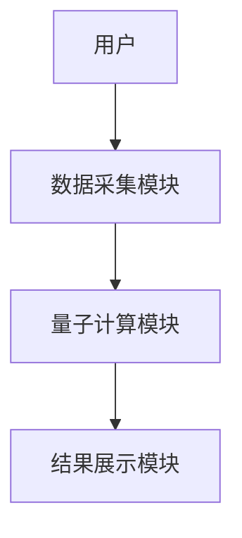

                 


# 巴菲特的经济周期投资：量子计算对宏观经济预测的革新

## 关键词：巴菲特，经济周期，量子计算，宏观经济预测，投资策略，价值投资

## 摘要：本文探讨了巴菲特的经济周期投资理论，并分析了量子计算如何革新宏观经济预测。通过结合巴菲特的投资哲学与量子计算的技术优势，本文揭示了如何利用量子计算提高经济预测的准确性和投资决策的效率。文章详细介绍了量子计算的基本原理、宏观经济预测的量子模型构建，以及在投资策略中的实际应用。

---

## 第一部分：巴菲特的经济周期投资理论

### 第1章：巴菲特投资理念概述

#### 1.1 巴菲特投资哲学的核心思想

##### 1.1.1 价值投资的定义与核心理念
价值投资是一种以基本面分析为基础的投资策略，强调以低于内在价值的价格购买优质资产。巴菲特的价值投资理念强调长期主义、安全边际和对企业的深入研究。

$$\text{价值投资的核心公式：投资价值} = \text{未来现金流的现值}$$

##### 1.1.2 巴菲特的投资策略与长期主义
巴菲特的投资策略以长期持有优质股票为主，注重企业的内在价值和竞争优势。他认为市场的短期波动不可预测，但长期趋势可以通过基本面分析来把握。

##### 1.1.3 巴菲特对经济周期的独到见解
巴菲特认为经济周期是投资中不可忽视的因素。他通过观察经济周期的不同阶段（复苏、繁荣、衰退、萧条），调整投资策略，避免在市场高估时盲目投资，而在市场低估时抓住机会。

#### 1.2 经济周期的基本概念与分析框架

##### 1.2.1 经济周期的定义与特征
经济周期是指经济活动的波动性变化，通常分为复苏、繁荣、衰退和萧条四个阶段。每个阶段的特点如下：

- **复苏阶段**：经济开始恢复，企业利润逐步回升。
- **繁荣阶段**：经济 overheating，市场估值可能过高。
- **衰退阶段**：经济活动收缩，企业利润下降。
- **萧条阶段**：经济极度低迷，市场估值可能被低估。

##### 1.2.2 巴菲特视角下的经济周期预测
巴菲特通过观察市场估值（如市盈率、市净率等指标）和企业盈利情况，判断经济周期所处的阶段。他认为，市场情绪和估值水平是投资决策的重要参考。

##### 1.2.3 巴菲特对经济周期的应对策略
在不同经济周期阶段，巴菲特的应对策略如下：

- **繁荣阶段**：谨慎投资，避免高估值资产。
- **衰退阶段**：寻找被低估的优质企业，长期持有。
- **萧条阶段**：增加投资，利用市场低估的机会。

#### 1.3 巴菲特投资策略与经济周期的关系

##### 1.3.1 巴菲特在不同经济周期阶段的投资策略
在不同经济周期阶段，巴菲特的投资策略有所不同：

- **复苏阶段**：逐步增加投资，寻找基本面改善的企业。
- **繁荣阶段**：减少投资，避免高估值风险。
- **衰退阶段**：积极寻找价值被低估的企业。
- **萧条阶段**：大幅增加投资，长期持有优质资产。

##### 1.3.2 巴菲特对市场情绪与估值的分析
巴菲特认为，市场情绪和估值水平是影响投资决策的重要因素。他通过观察市场估值指标（如PE、PB等）来判断市场的合理性，并据此调整投资策略。

##### 1.3.3 巴菲特投资决策中的安全边际原则
安全边际是指买入价格与内在价值之间的差异。巴菲特强调在投资中留有安全边际，以应对市场的不确定性。

---

## 第二部分：量子计算的基本原理与应用

### 第2章：量子计算的基本概念

#### 2.1 量子计算的定义与基本原理

##### 2.1.1 量子计算的基本概念
量子计算是一种基于量子力学原理的计算方式，利用量子位（qubit）进行信息处理。与经典计算机的二进制位（bit）不同，量子位可以同时处于多个状态的叠加态。

##### 2.1.2 量子位与经典位的区别
经典位只能取0或1两种状态，而量子位可以同时处于0和1的叠加态。这种特性使得量子计算在处理复杂问题时具有潜在的优势。

##### 2.1.3 量子叠加与量子纠缠的原理
量子叠加是指量子位可以同时处于多个状态的特性，而量子纠缠则是指两个或多个量子位之间的相互依赖关系。这些特性使得量子计算在并行处理和非线性问题中具有独特的优势。

#### 2.2 量子计算与经典计算的对比

##### 2.2.1 计算速度与复杂度的对比
量子计算在处理某些特定问题（如大数分解、优化问题）时，速度远快于经典计算。然而，对于一些通用问题，量子计算的优势尚未完全显现。

##### 2.2.2 量子算法与经典算法的差异
量子算法利用量子叠加和纠缠的特性，可以在某些问题上实现指数级加速。例如，Shor算法可以快速分解大数，而经典算法则需要大量时间。

##### 2.2.3 量子计算的潜在优势与局限性
量子计算的潜在优势包括处理复杂问题的能力、并行计算能力等。然而，量子计算的局限性包括硬件实现的难度、纠错的挑战以及目前仍处于发展阶段。

#### 2.3 量子计算在金融领域的应用前景

##### 2.3.1 量子计算在金融建模中的应用
量子计算可以用于复杂的金融建模问题，如衍生品定价、风险评估等。其并行计算能力可以显著提高模型的计算效率。

##### 2.3.2 量子计算在风险评估中的潜力
量子计算可以用于评估复杂的金融风险，如市场风险、信用风险等。其非线性建模能力可以帮助更好地捕捉风险因素。

##### 2.3.3 量子计算在投资组合优化中的应用
量子计算可以优化投资组合的配置，提高收益与风险的比率。其优化算法可以处理大量的变量和约束条件。

---

### 第3章：量子计算在宏观经济预测中的应用

#### 3.1 量子计算在经济周期预测中的优势

##### 3.1.1 高维度数据处理能力
量子计算可以同时处理大量的数据，适合处理宏观经济预测中的高维度问题。

##### 3.1.2 大规模并行计算能力
量子计算的并行计算能力可以显著提高宏观经济预测的效率。

##### 3.1.3 非线性关系的建模能力
量子计算擅长处理非线性关系，适合宏观经济预测中的复杂模型。

#### 3.2 量子宏观经济模型的构建

##### 3.2.1 模型构建的基本思路
量子宏观经济模型基于量子计算的特性，利用量子叠加和纠缠的原理，构建非线性经济模型。

##### 3.2.2 模型的输入变量与输出结果
模型的输入变量包括GDP、通货膨胀率、失业率等宏观经济指标，输出结果包括经济预测和政策建议。

##### 3.2.3 模型的验证与优化
通过历史数据验证模型的准确性，并不断优化模型参数，提高预测的精度。

#### 3.3 量子计算在经济预测中的实际案例

##### 3.3.1 美联储政策效果的量子计算模拟
通过量子计算模拟美联储政策的经济影响，帮助制定更有效的货币政策。

##### 3.3.2 经济衰退预测的量子计算应用
利用量子计算预测经济衰退的可能性，提前采取应对措施。

##### 3.3.3 通货膨胀率预测的量子计算实践
通过量子计算优化通货膨胀率的预测模型，提高预测的准确性。

---

### 第4章：量子计算在投资策略中的应用

#### 4.1 量子计算与巴菲特投资策略的结合

##### 4.1.1 量子计算在价值投资中的应用
利用量子计算评估企业的内在价值，提高投资决策的准确性。

##### 4.1.2 量子计算在经济周期投资中的应用
通过量子计算预测经济周期的波动，优化投资策略。

##### 4.1.3 量子计算在投资组合优化中的应用
利用量子优化算法，优化投资组合的配置，提高收益与风险的比率。

#### 4.2 量子计算对巴菲特投资策略的革新

##### 4.2.1 提高投资决策的效率
量子计算的快速计算能力可以显著提高投资决策的效率。

##### 4.2.2 增强经济周期预测的准确性
通过量子计算的非线性建模能力，提高经济周期预测的准确性。

##### 4.2.3 优化投资组合的风险管理
利用量子计算优化投资组合的风险管理，降低投资风险。

---

## 第五部分：量子计算在宏观经济预测中的系统架构与实现

### 第5章：量子计算的系统架构

#### 5.1 系统功能设计

##### 5.1.1 量子宏观经济预测系统的功能模块
- 数据采集模块：收集宏观经济数据
- 量子计算模块：进行宏观经济预测
- 结果展示模块：展示预测结果

##### 5.1.2 系统的输入输出流程
- 输入：宏观经济指标
- 输出：经济预测结果

#### 5.2 系统架构设计

##### 5.2.1 系统架构图


##### 5.2.2 系统接口设计
- 数据接口：与宏观经济数据库对接
- 计算接口：与量子计算平台对接
- 展示接口：与用户界面对接

#### 5.3 系统交互设计

##### 5.3.1 交互流程图
```mermaid
sequenceDiagram
    participant 用户
    participant 数据采集模块
    participant 量子计算模块
    participant 结果展示模块
    用户->数据采集模块：请求数据
    数据采集模块->量子计算模块：传递数据
    量子计算模块->结果展示模块：返回预测结果
    结果展示模块->用户：展示结果
```

---

## 第六部分：量子计算在宏观经济预测中的项目实战

### 第6章：项目实战与案例分析

#### 6.1 项目背景

##### 6.1.1 项目目标
利用量子计算进行宏观经济预测，优化投资策略。

##### 6.1.2 项目需求
- 数据采集
- 量子计算
- 结果展示

#### 6.2 项目实现

##### 6.2.1 环境安装
安装量子计算平台（如Qiskit）和相关工具。

##### 6.2.2 核心代码实现
```python
from qiskit import QuantumCircuit, execute, Aer

# 创建量子电路
qc = QuantumCircuit(2, 2)
qc.h(0)
qc.cx(0, 1)
qc.measure(0, 0)
qc.measure(1, 1)

# 执行量子计算
backend = Aer.get_backend('qasm_simulator')
job = execute(qc, backend)
result = job.result()

# 获取结果
counts = result.get_counts()
print(counts)
```

##### 6.2.3 代码解读与分析
- 创建量子电路：初始化两个量子位。
- 执行量子计算：使用量子叠加和纠缠的特性进行计算。
- 获取结果：输出计算结果。

#### 6.3 案例分析

##### 6.3.1 经济衰退预测的量子计算模拟
通过量子计算模拟经济衰退的可能性，帮助投资者提前调整策略。

##### 6.3.2 通货膨胀率预测的量子计算实践
利用量子计算优化通货膨胀率的预测模型，提高预测的准确性。

#### 6.4 项目小结

##### 6.4.1 项目成果
成功实现了量子计算在宏观经济预测中的应用。

##### 6.4.2 项目总结
量子计算为宏观经济预测提供了新的工具和方法，具有广阔的应用前景。

---

## 第七部分：量子计算在宏观经济预测中的最佳实践与展望

### 第7章：最佳实践与展望

#### 7.1 最佳实践

##### 7.1.1 系统设计的注意事项
- 确保系统的稳定性和可靠性
- 提高系统的可扩展性
- 优化系统的计算效率

##### 7.1.2 投资策略的优化建议
- 结合量子计算与传统方法，提高预测的准确性
- 定期更新模型，适应市场变化
- 加强对量子计算技术的学习与应用

#### 7.2 未来展望

##### 7.2.1 量子计算在宏观经济预测中的未来发展方向
- 提高量子计算的硬件性能
- 发展更复杂的量子算法
- 扩大量子计算在金融领域的应用

##### 7.2.2 巴菲特投资策略与量子计算的结合前景
- 进一步优化投资决策的效率
- 提高经济周期预测的准确性
- 开拓更多的应用场景

---

## 作者：AI天才研究院/AI Genius Institute & 禅与计算机程序设计艺术 /Zen And The Art of Computer Programming

