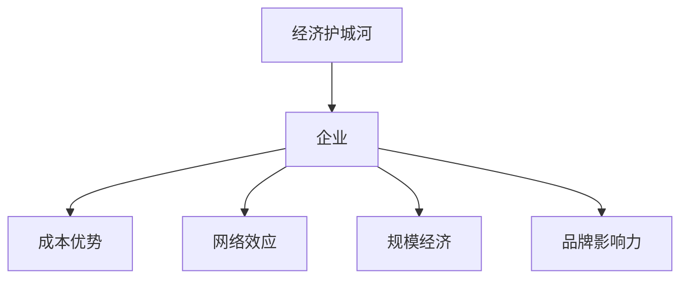
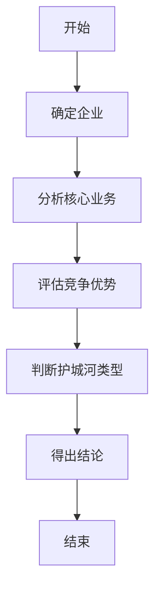
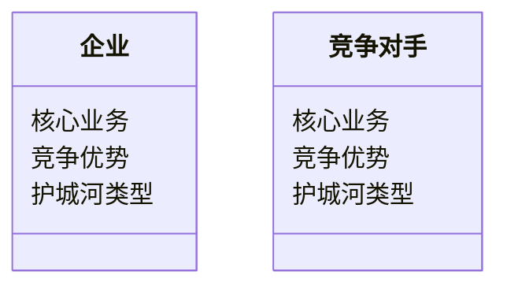
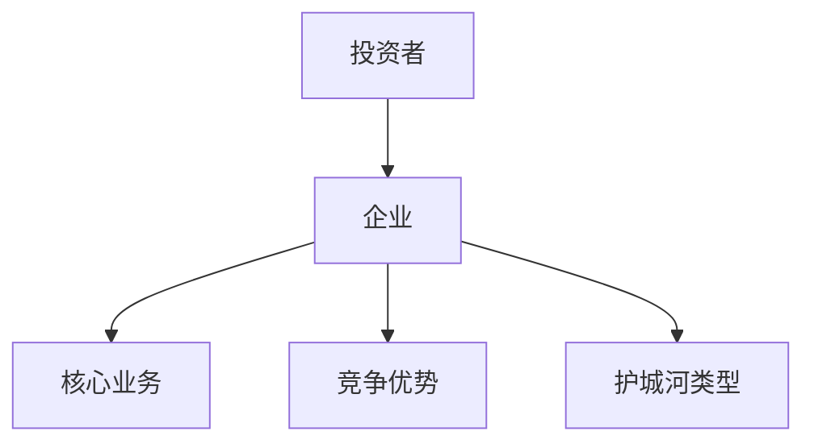

                 


# 巴菲特的经济护城河概念

> 关键词：经济护城河，巴菲特，投资策略，竞争优势，可持续盈利能力

> 摘要：本文深入探讨巴菲特提出的“经济护城河”概念，分析其核心原理、分类、评估方法和实际应用。通过系统化的分析和案例研究，帮助读者理解如何识别和构建企业经济护城河，以确保长期可持续的盈利能力。

---

## 第1章: 经济护城河的背景与核心概念

### 1.1 经济护城河的定义与背景

经济护城河是巴菲特投资理论中的核心概念之一。它是指企业在市场上建立的一种长期竞争优势，能够有效抵御竞争对手的侵蚀，确保企业能够在较长时期内保持高盈利能力。经济护城河的形成通常基于企业的独特资源、商业模式或市场地位。

#### 1.1.1 什么是经济护城河
经济护城河并非简单的市场份额或短期利润，而是企业长期竞争优势的体现。它能够有效防止竞争对手的模仿或替代，确保企业在市场中的领先地位。

#### 1.1.2 经济护城河的历史背景
经济护城河的概念源于古老的城堡防御工事，巴菲特将其类比于企业的竞争优势。通过建立强大的经济护城河，企业能够抵御市场波动和竞争压力，确保长期稳定发展。

#### 1.1.3 巴菲特对经济护城河的重视
巴菲特认为，寻找具有强大经济护城河的企业是投资成功的关键。他更倾向于投资那些能够在长期竞争中保持优势的企业，而不是依赖于短期市场波动的公司。

---

### 1.2 经济护城河的核心要素

经济护城河的核心要素包括可持续的竞争优势、抗御竞争的能力和长期盈利能力的保障。

#### 1.2.1 可持续的竞争优势
可持续的竞争优势是企业能够在市场上长期占据优势的根本原因。这种优势可能来源于独特的技术、品牌影响力、成本优势或网络效应。

#### 1.2.2 抗御竞争的能力
抗御竞争的能力是指企业能够有效抵御竞争对手的侵蚀，保持市场份额和盈利能力。强大的经济护城河能够有效降低竞争对手的进入门槛。

#### 1.2.3 长期盈利能力的保障
经济护城河的最终目标是确保企业能够在较长时期内保持高盈利能力。这种盈利能力不仅体现在收入增长上，还体现在成本控制和利润率提升上。

---

### 1.3 经济护城河的分类

经济护城河可以根据其来源和表现形式分为以下几类：

#### 1.3.1 成本优势型
成本优势型企业通过高效的生产流程或规模经济降低成本，从而在价格竞争中占据优势。例如，低成本航空公司通过规模化运营降低成本，吸引价格敏感的消费者。

#### 1.3.2 网络效应型
网络效应型企业通过用户的相互依赖性形成强大的市场壁垒。例如，社交媒体平台通过用户网络效应形成强大的市场壁垒，新用户只有加入现有网络才能获得价值。

#### 1.3.3 规模经济型
规模经济型企业通过扩大生产规模降低成本，从而在价格竞争中占据优势。例如，大型制造企业通过规模化生产降低成本，提高市场竞争力。

#### 1.3.4 品牌影响力型
品牌影响力型企业通过强大的品牌认知度和消费者忠诚度形成市场壁垒。例如，高端奢侈品牌通过品牌溢价能力吸引高收入消费者。

---

### 1.4 经济护城河的边界与外延

经济护城河的边界和外延是理解其本质的重要部分。经济护城河的边界是指其竞争优势的具体表现形式，而外延则包括其对企业发展的影响范围。

#### 1.4.1 护城河的边界
经济护城河的边界是其竞争优势的具体体现。例如，成本优势型企业通过规模化生产降低成本，形成价格竞争优势。

#### 1.4.2 护城河的外延
经济护城河的外延是指其对企业发展的影响范围。例如，网络效应型企业通过用户网络效应形成强大的市场壁垒，吸引更多的用户加入其平台。

#### 1.4.3 护城河与竞争优势的关系
经济护城河是竞争优势的一种表现形式，但竞争优势的范围更广。经济护城河强调的是长期可持续的竞争优势，而竞争优势可能包括短期的市场机会。

---

### 1.5 本章小结

本章主要介绍了经济护城河的背景、核心要素和分类。经济护城河是巴菲特投资理论中的核心概念，能够帮助投资者识别具有长期竞争优势的企业。通过理解经济护城河的分类和特征，投资者可以更好地评估企业的长期盈利能力。

---

## 第2章: 经济护城河的核心概念与联系

### 2.1 经济护城河的核心原理

经济护城河的核心原理包括其形成机制、动态变化和与企业生命周期的关系。

#### 2.1.1 护城河的形成机制
经济护城河的形成机制是企业通过独特的资源、技术或商业模式建立长期竞争优势的过程。例如，技术创新型企业通过持续的研发投入形成技术壁垒，防止竞争对手的模仿。

#### 2.1.2 护城河的动态变化
经济护城河并非一成不变，随着市场环境和技术的进步，企业需要不断更新和强化其竞争优势。例如，互联网企业需要通过持续的技术创新和产品迭代保持竞争优势。

#### 2.1.3 护城河与企业生命周期的关系
经济护城河与企业生命周期密切相关。在企业成长阶段，护城河的建立是企业成功的关键；而在成熟阶段，护城河的维护是企业持续盈利的基础。

---

### 2.2 经济护城河的核心要素对比

经济护城河的核心要素包括成本优势、网络效应、规模经济和品牌影响力。以下是对这些要素的对比分析。

#### 2.2.1 成本优势对比
成本优势型企业通过规模化生产降低成本，吸引价格敏感的消费者。这种模式适用于标准化产品市场，例如制造业。

#### 2.2.2 网络效应对比
网络效应型企业通过用户的相互依赖性形成强大的市场壁垒。这种模式适用于社交平台和生态系统型业务，例如社交媒体和操作系统。

#### 2.2.3 规模经济对比
规模经济型企业通过扩大生产规模降低成本，吸引更多的消费者。这种模式适用于标准化产品市场，例如快消品行业。

#### 2.2.4 品牌影响力对比
品牌影响力型企业通过强大的品牌认知度和消费者忠诚度形成市场壁垒。这种模式适用于高端消费品和奢侈品市场。

---

### 2.3 经济护城河的ER实体关系图

以下是一个简单的经济护城河ER实体关系图：



---

### 2.4 本章小结

本章主要探讨了经济护城河的核心原理和核心要素的对比分析。通过理解经济护城河的形成机制和动态变化，投资者可以更好地把握企业的长期竞争优势。同时，通过对不同护城河类型的对比分析，可以帮助投资者识别具有强大经济护城河的企业。

---

## 第3章: 经济护城河的算法原理

### 3.1 经济护城河的评估算法

经济护城河的评估算法是通过一系列指标和步骤来判断企业的竞争优势和长期盈利能力。

#### 3.1.1 评估模型概述
经济护城河的评估模型通常包括核心业务分析、竞争优势评估和护城河类型判断等步骤。

#### 3.1.2 评估指标的选择
评估经济护城河的关键指标包括市场份额、利润率、品牌影响力、客户忠诚度和技术创新能力等。

#### 3.1.3 评估流程图
以下是一个简单的经济护城河评估流程图：



---

### 3.2 经济护城河的数学模型

经济护城河的数学模型可以通过以下公式进行表达：

#### 3.2.1 持续竞争优势的数学表达
$$C = \sum_{i=1}^{n} c_i$$

其中，$c_i$ 表示第i个竞争优势的强度。

#### 3.2.2 抗御能力的评估公式
$$R = \frac{C}{T}$$

其中，$C$ 表示竞争优势的总和，$T$ 表示时间因素。

---

### 3.3 算法实现与案例分析

#### 3.3.1 算法实现步骤
1. 确定企业的核心业务。
2. 评估企业的竞争优势。
3. 判断企业的护城河类型。
4. 得出评估结论。

#### 3.3.2 案例分析：可口可乐的护城河
可口可乐通过强大的品牌影响力和广泛的分销网络建立了强大的经济护城河。其品牌认知度和消费者忠诚度使其在碳酸饮料市场中占据了领先地位。

#### 3.3.3 通俗易懂的举例说明
例如，麦当劳通过其强大的品牌影响力和全球化的供应链网络建立了强大的经济护城河。其品牌认知度和运营效率使其能够在全球市场中保持竞争优势。

---

### 3.4 本章小结

本章主要介绍了经济护城河的评估算法和数学模型，并通过案例分析和通俗易懂的举例说明，帮助读者理解如何评估企业的经济护城河。

---

## 第4章: 经济护城河的系统分析与架构设计

### 4.1 问题场景介绍

经济护城河的系统分析需要从投资者和企业的双重视角出发，分析企业的竞争优势和长期盈利能力。

#### 4.1.1 投资者视角
投资者需要识别具有强大经济护城河的企业，以确保投资的长期回报。

#### 4.1.2 企业视角
企业需要通过建立强大的经济护城河来抵御竞争压力，确保长期盈利能力。

#### 4.1.3 竞争对手视角
竞争对手需要通过削弱企业的经济护城河来抢占市场份额。

---

### 4.2 系统功能设计

经济护城河的系统分析需要从领域模型和系统架构两个方面进行设计。

#### 4.2.1 领域模型
以下是一个简单的领域模型：



#### 4.2.2 系统架构图
以下是一个简单的经济护城河系统架构图：



---

### 4.3 本章小结

本章主要从系统分析的角度探讨了经济护城河的领域模型和系统架构设计。通过投资者和企业的双重视角，帮助读者更好地理解经济护城河的系统结构。

---

## 第5章: 经济护城河的项目实战

### 5.1 环境安装与配置

经济护城河的分析需要一定的数据支持，包括企业的财务数据、市场数据和竞争数据。

#### 5.1.1 数据收集
需要收集企业的财务报表、市场占有率、品牌影响力和技术创新能力等数据。

#### 5.1.2 工具安装
可以使用Excel或数据分析工具（如Python的Pandas库）进行数据分析。

---

### 5.2 系统核心实现源代码

以下是一个简单的Python代码示例，用于分析企业的经济护城河类型：

```python
def assess_h Competitive Advantage(enterprise):
    # 竞争优势评估函数
    pass

def determine_h_Barrier(enterprise):
    # 护城河类型判断函数
    pass

def main():
    enterprise = input("请输入企业名称：")
    assess_Competitive Advantage(enterprise)
    determine_h_Barrier(enterprise)
    print("分析完成。")

if __name__ == "__main__":
    main()
```

---

### 5.3 代码应用解读与分析

通过上述代码，投资者可以输入企业的名称，系统将自动评估其竞争优势并判断其护城河类型。

---

### 5.4 实际案例分析

以亚马逊为例，其强大的网络效应和技术创新能力构成了强大的经济护城河。亚马逊通过持续的技术创新和全球化布局，巩固了其在电子商务领域的领先地位。

---

### 5.5 本章小结

本章通过项目实战的方式，帮助读者理解如何通过数据收集和分析工具来评估企业的经济护城河。通过实际案例分析，读者可以更好地掌握经济护城河的分析方法。

---

## 第6章: 经济护城河的最佳实践与小结

### 6.1 最佳实践 tips

1. **关注企业的核心业务**：经济护城河的核心是企业的核心业务。
2. **识别企业的竞争优势**：通过分析企业的成本优势、网络效应、规模经济和品牌影响力，识别其竞争优势。
3. **长期视角**：经济护城河的建立需要时间，投资者需要具备长期视角。

---

### 6.2 小结

经济护城河是巴菲特投资理论中的核心概念，能够帮助投资者识别具有长期竞争优势的企业。通过系统的分析和实战案例，读者可以更好地理解经济护城河的构建和评估方法。

---

## 作者：AI天才研究院/AI Genius Institute & 禅与计算机程序设计艺术 /Zen And The Art of Computer Programming

---

**本文旨在通过系统化的分析和实战案例，帮助读者深入理解巴菲特的经济护城河概念，并将其应用于实际投资和企业管理中。通过识别和构建强大的经济护城河，企业和投资者可以更好地应对市场竞争，实现长期可持续的盈利能力。**

