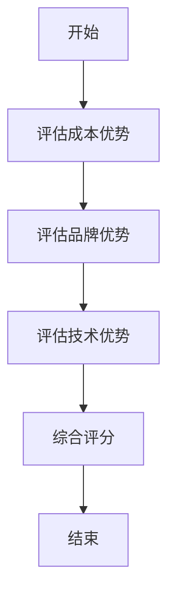
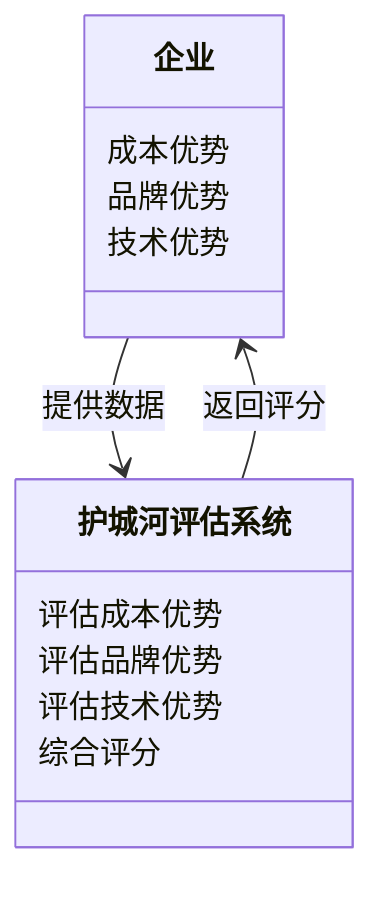
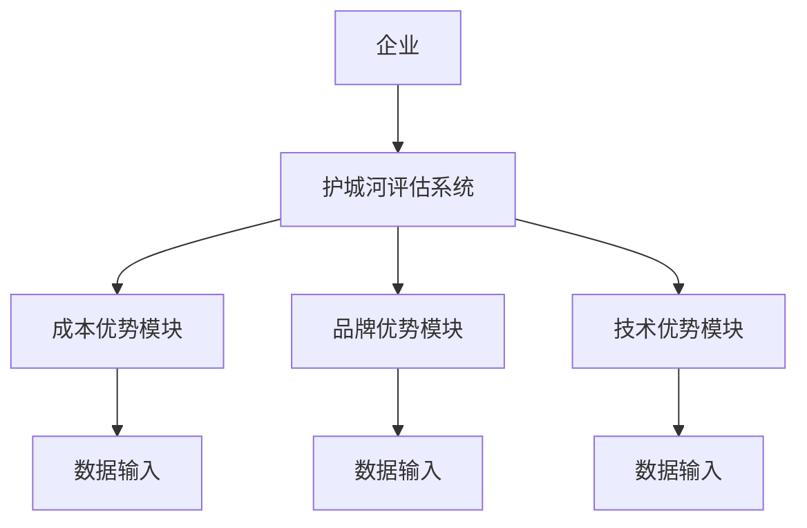
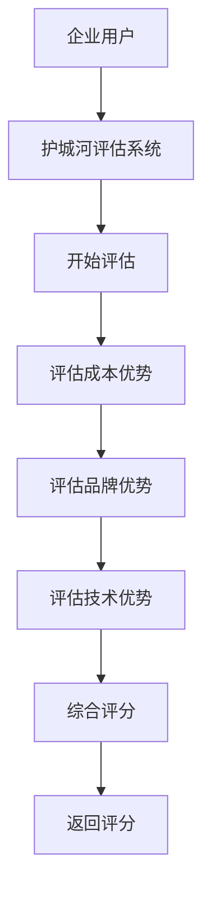

                 


# 巴菲特的经济护城河理论：持久竞争优势的来源

**关键词**：经济护城河，巴菲特，竞争优势，企业战略，投资分析

**摘要**：本文深入探讨了巴菲特的经济护城河理论，分析了其核心概念、分类、算法原理及系统架构，结合实际案例，展示了如何通过护城河理论构建持久竞争优势。

---

## 第一部分: 经济护城河的背景与定义

### 第1章: 经济护城河的定义与背景

#### 1.1 经济护城河的定义与背景

**经济护城河**是巴菲特投资理论中的核心概念，指企业长期竞争优势的来源，能够防止竞争对手侵蚀其市场份额。这种优势使企业在行业中立于不败之地，就像中世纪城堡的护城河保护城堡一样。

**巴菲特的定义**：他将经济护城河定义为那些能够持续为企业创造超额利润并防止竞争对手侵蚀的结构性优势。企业通过这些优势可以维持高利润率和市场主导地位。

#### 1.2 经济护城河的核心要素

**成本优势**：企业以低于行业平均水平的成本提供产品或服务，如沃尔玛的供应链管理。

**品牌优势**：强大的品牌认知度和客户忠诚度，如可口可乐。

**技术优势**：拥有独特的技术或专利，如苹果的创新产品。

**行业结构与市场准入壁垒**：行业进入门槛高，如需要大量资本或技术。

#### 1.3 经济护城河的分类与特征

**可持续的竞争优势**：长期存在的护城河，如品牌忠诚度。

**不可持续的竞争优势**：短期优势，如季节性促销。

**护城河的强弱与企业生命周期的关系**：强护城河企业在市场中更具竞争力。

---

## 第二部分: 经济护城河的核心概念与分析框架

### 第2章: 经济护城河的核心原理

#### 2.1 经济护城河的形成机制

**市场需求与供给的平衡**：企业在满足市场需求的同时，通过降低成本或提升质量形成优势。

**企业竞争优势的动态变化**：护城河会随市场变化而变化，企业需不断强化优势。

**护城河的构建与破坏因素**：技术进步、政策变化等因素可能削弱护城河。

#### 2.2 护城河的数学模型与分析方法

**护城河强度评估流程**：

1. 评估成本优势。
2. 评估品牌优势。
3. 评估技术优势。
4. 综合评分。

**护城河评分公式**：
$$
\text{护城河强度} = \frac{\text{成本优势} + \text{品牌优势} + \text{技术优势}}{3}
$$

### 第3章: 护城河的算法原理与数学模型

#### 3.1 护城河评估算法

**流程图**：


#### 3.2 护城河的数学模型

**市场份额预测模型**：
$$
\text{市场份额} = \frac{\text{企业优势}}{\text{行业总优势}}
$$

**竞争优势的动态变化模型**：
$$
\Delta \text{竞争优势} = \text{护城河强度} \times \text{时间因素}
$$

---

## 第三部分: 经济护城河的系统分析与架构设计

### 第4章: 经济护城河的系统分析

#### 4.1 护城河评估系统的需求分析

**问题场景介绍**：企业需要评估自身竞争优势，识别潜在风险。

**项目目标**：构建一个系统，帮助企业分析和评估护城河强度。

#### 4.2 系统功能设计

**领域模型类图**：


#### 4.3 系统架构设计

**系统架构图**：


#### 4.4 系统接口设计与交互流程

**交互流程图**：


---

## 第四部分: 项目实战与案例分析

### 第5章: 经济护城河的项目实战

#### 5.1 项目实战环境安装

**Python环境与库安装**：安装Python 3.8及以上，安装numpy和pandas库。

#### 5.2 核心代码实现

**计算护城河强度**的代码：
```python
import numpy as np
import pandas as pd

def calculate_h护城河强度(cost_advantage, brand_advantage, tech_advantage):
    return (cost_advantage + brand_advantage + tech_advantage) / 3

# 示例数据
cost_advantage = 80
brand_advantage = 75
tech_advantage = 85

# 计算护城河强度
护城河强度 = calculate_h护城河强度(cost_advantage, brand_advantage, tech_advantage)
print(f"护城河强度：{护城河强度}")
```

#### 5.3 实际案例分析

**案例分析：亚马逊的护城河**：成本优势、品牌优势和物流网络使其在电商领域占据优势。

---

## 第五部分: 最佳实践与总结

### 第6章: 护城河理论的最佳实践

#### 6.1 小结

护城河理论帮助企业识别和强化竞争优势，保持长期盈利能力。

#### 6.2 注意事项

- 定期评估护城河强度。
- 关注行业变化和竞争对手动态。
- 注重多护城河的组合使用。

#### 6.3 拓展阅读

- 巴菲特的其他投资原则。
- 竞争对手分析方法。

---

## 作者

**作者**：AI天才研究院/AI Genius Institute & 禅与计算机程序设计艺术/Zen And The Art of Computer Programming

