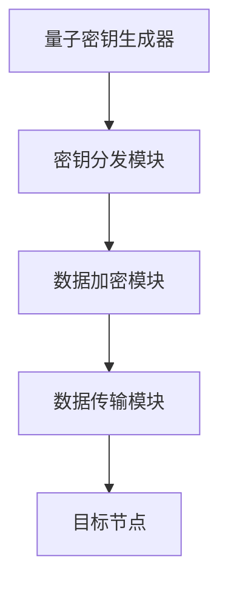
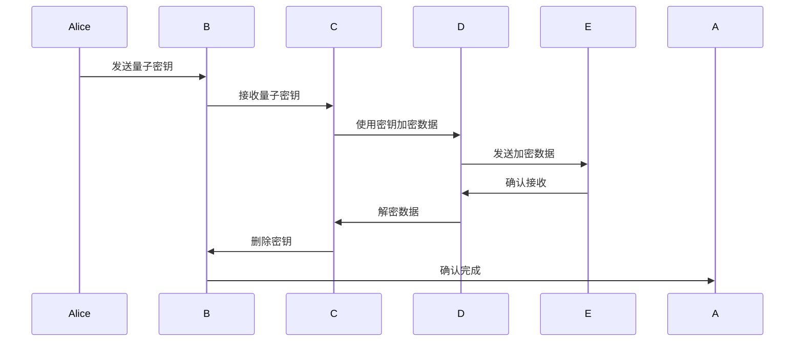

                 


# 巴菲特的经济护城河理论：量子加密时代的数据安全优势

> 关键词：巴菲特，经济护城河，量子加密，数据安全，竞争优势

> 摘要：本文深入探讨了巴菲特的经济护城河理论在量子加密时代的应用，分析了量子加密技术如何成为企业数据安全的核心竞争优势。通过结合经济护城河的数学模型与量子加密技术的实现原理，本文提出了在量子计算威胁下的数据安全解决方案，为企业构建可持续的竞争优势提供了新的视角。

---

# 第一部分: 巴菲特的经济护城河理论基础

## 第1章: 经济护城河的核心概念

### 1.1 经济护城河的定义与起源

#### 1.1.1 巴菲特的经济护城河理论概述

巴菲特的经济护城河理论是投资学中的一个核心概念，它描述了企业在市场上构建竞争优势的能力，从而能够在长期内抵御竞争对手的侵蚀，并保持持续的盈利能力。经济护城河的核心在于企业通过某种独特的资源、能力或机制，形成一种难以被竞争对手复制或超越的壁垒。

经济护城河的概念最早可以追溯到巴菲特的投资理念，他认为企业如果能够建立一个强大的护城河，就能在激烈的市场竞争中立于不败之地。这种护城河可以是技术优势、品牌影响力、成本优势、网络效应或其他形式的资源垄断。

#### 1.1.2 经济护城河的核心要素

经济护城河的核心要素包括以下几个方面：

1. **无形资产**：包括专利、商标、品牌价值、客户忠诚度等。
2. **成本优势**：通过规模化生产或技术优势降低生产成本，形成价格竞争优势。
3. **网络效应**：用户数量的增加会增强产品的价值，形成正反馈循环。
4. **法律和政策支持**：通过法律法规或政策支持，形成市场准入壁垒。

#### 1.1.3 经济护城河的边界与外延

经济护城河的边界在于企业的核心竞争力和市场地位。外延则包括企业在技术、市场、资源等多方面的扩展能力，能够不断强化护城河的高度和宽度。

### 1.2 经济护城河的分类与特征

#### 1.2.1 无形资产型护城河

无形资产型护城河主要依赖于企业的品牌价值、专利技术和客户关系。例如，苹果公司的品牌价值和专利技术形成了强大的市场壁垒，竞争对手难以在短时间内复制其成功。

#### 1.2.2 成本优势型护城河

成本优势型护城河通过规模化生产或技术创新降低生产成本，从而在价格上占据优势。例如，亚马逊通过其全球供应链网络实现了成本优势，竞争对手难以在短期内复制其效率。

#### 1.2.3 网络效应型护城河

网络效应型护城河通过用户的数量和互动形成正反馈循环，例如社交网络平台（如Facebook）或操作系统（如iOS）。随着用户数量的增加，平台的价值也随之增加，形成了强大的市场壁垒。

#### 1.2.4 法律政策型护城河

法律政策型护城河通过法律法规或政策支持形成市场准入壁垒。例如，某些行业可能受到严格的许可证管理或行业标准限制，这使得竞争对手难以进入市场。

---

## 第2章: 经济护城河的数学模型与分析

### 2.1 经济护城河的数学建模

#### 2.1.1 经济护城河的收益函数

经济护城河的收益函数可以表示为：

$$
\text{收益} = f(\text{护城河高度}, \text{市场需求}, \text{竞争对手行为})
$$

其中，护城河的高度决定了企业在市场中的竞争优势，市场需求和竞争对手行为则影响收益的变化。

#### 2.1.2 市场竞争的数学模型

市场竞争的数学模型可以通过博弈论来描述。假设企业A和企业B是两个竞争对手，它们的收益函数分别为：

$$
R_A = a \cdot H_A - b \cdot H_B
$$

$$
R_B = a \cdot H_B - b \cdot H_A
$$

其中，$H_A$和$H_B$分别表示企业A和企业B的护城河高度，$a$和$b$是系数，表示护城河对收益的影响。

#### 2.1.3 护城河强度的量化指标

护城河强度可以通过以下指标量化：

1. 市场占有率
2. 净利润率
3. 顾客忠诚度
4. 技术创新速度

### 2.2 护城河与企业价值的关系

#### 2.2.1 企业价值的计算公式

企业价值（EV）的计算公式为：

$$
\text{EV} = \text{净利润} \times (1 + \text{护城河强度})
$$

护城河强度越高，企业价值的增长潜力越大。

#### 2.2.2 护城河对企业价值的影响

护城河的强度直接影响企业的市场地位和盈利能力。强大的护城河能够有效防止竞争对手的侵蚀，从而提高企业的长期价值。

#### 2.2.3 护城河的可持续性分析

护城河的可持续性取决于企业的创新能力、资源储备和市场适应能力。例如，技术创新能力强的企业能够持续强化其护城河。

---

# 第二部分: 量子加密技术与数据安全

## 第3章: 量子加密技术的基本原理

### 3.1 量子加密的数学基础

#### 3.1.1 量子叠加原理

量子叠加原理表明，量子系统可以处于多个状态的叠加态。例如，一个量子比特（qubit）可以同时处于0和1的状态。

$$
|\psi\rangle = \alpha|0\rangle + \beta|1\rangle
$$

其中，$\alpha$和$\beta$是复数，满足$|\alpha|^2 + |\beta|^2 = 1$。

#### 3.1.2 量子纠缠原理

量子纠缠是指两个或多个量子系统之间的关联性，其中一个系统的状态会直接影响另一个系统的状态。例如，两个纠缠的量子比特的状态是相关联的。

#### 3.1.3 量子密钥分发（QKD）

量子密钥分发是一种基于量子力学原理的加密技术，其核心思想是通过量子态的传输和测量，生成共享的密钥。

### 3.2 量子加密算法的实现

#### 3.2.1 BB84协议

BB84协议是最早的量子密钥分发协议之一，其基本步骤如下：

1. 两个用户（Alice和Bob）分别生成随机的密钥序列。
2. Alice将她的密钥序列编码到光子的偏振上，并发送给Bob。
3. Bob通过测量光子的偏振来获取随机的密钥序列。
4. Alice和Bob通过公开通信协议比较部分密钥，并验证其一致性。

---

## 第4章: 量子加密技术的优缺点分析

### 4.1 量子加密的优势

#### 4.1.1 不可破解性

量子加密的不可破解性基于量子力学的原理，任何试图窃听或干扰量子通信的行为都会破坏量子态的稳定性，从而被发现。

#### 4.1.2 高安全性

量子加密技术能够抵御经典计算机和量子计算机的攻击，提供了更高的安全性。

#### 4.1.3 未来的-proof性

量子加密技术能够应对未来可能出现的量子计算机的威胁，是一种前瞻性的技术。

### 4.2 量子加密的挑战

#### 4.2.1 实现难度

量子加密技术的实现需要高精度的量子态操控和测量技术，目前还处于实验阶段。

#### 4.2.2 成本问题

量子加密设备的成本较高，限制了其大规模应用。

#### 4.2.3 技术瓶颈

量子加密技术在实际应用中还面临许多技术难题，例如量子态的稳定性和通信距离的限制。

---

# 第三部分: 经济护城河与量子加密的结合

## 第5章: 数据安全的经济护城河构建

### 5.1 数据安全作为经济护城河的核心

#### 5.1.1 数据的资产价值

数据是当今企业的核心资产，其价值体现在客户信息、市场洞察和竞争优势中。通过量子加密技术保护数据安全，可以有效提升企业的经济护城河。

#### 5.1.2 数据安全的市场竞争优势

量子加密技术能够提供不可破解的数据加密方案，从而在数据安全领域建立竞争优势。

#### 5.1.3 数据安全的长期战略意义

数据安全是企业长期发展的基石，量子加密技术能够确保数据的安全性和隐私性，为企业的长期战略提供支持。

### 5.2 量子加密技术在数据安全中的应用

#### 5.2.1 数据加密的量子化

通过量子密钥分发（QKD）技术，企业可以实现数据加密的量子化，确保加密密钥的安全性。

#### 5.2.2 数据传输的安全保障

量子加密技术能够提供安全的数据传输通道，防止数据在传输过程中被窃取或篡改。

#### 5.2.3 数据存储的量子防护

通过量子加密技术，企业可以实现数据存储的量子防护，确保存储数据的安全性和完整性。

## 第6章: 量子加密技术对经济护城河的强化

### 6.1 量子加密技术提升数据安全的护城河高度

#### 6.1.1 提高数据泄露的风险成本

通过量子加密技术，企业可以大幅提高数据泄露的风险成本，从而降低竞争对手攻击的可能性。

#### 6.1.2 增强企业的市场地位

量子加密技术的应用能够增强企业的市场地位，吸引更多的客户和合作伙伴。

#### 6.1.3 提高企业的长期盈利能力

通过量子加密技术保护数据安全，企业可以避免数据泄露带来的损失，从而提高长期盈利能力。

---

# 第四部分: 量子加密技术的实际应用

## 第7章: 量子加密技术在金融领域的应用

### 7.1 金融行业的数据安全挑战

金融行业是数据泄露的高风险行业，量子加密技术能够有效应对这一挑战。

### 7.2 量子加密技术在金融交易中的应用

通过量子加密技术，金融交易可以实现更高安全性的数据传输和存储，确保交易的可靠性和安全性。

### 7.3 量子加密技术对金融企业经济护城河的强化

量子加密技术的应用能够强化金融企业的经济护城河，提升其在市场竞争中的优势。

---

## 第8章: 量子加密技术在通信领域的应用

### 8.1 通信行业的数据安全需求

通信行业需要高度安全的数据传输通道，量子加密技术能够满足这一需求。

### 8.2 量子加密技术在通信网络中的应用

通过量子加密技术，通信网络可以实现更高的安全性，防止数据被窃听或篡改。

### 8.3 量子加密技术对通信企业经济护城河的强化

量子加密技术的应用能够强化通信企业的经济护城河，提升其市场竞争力。

---

# 第五部分: 量子加密技术的系统架构与实现

## 第9章: 量子加密技术的系统架构设计

### 9.1 系统功能设计

#### 9.1.1 量子密钥分发模块

量子密钥分发模块负责生成和分发量子密钥，确保密钥的安全性。

#### 9.1.2 数据加密模块

数据加密模块利用量子密钥对数据进行加密，确保数据的机密性。

#### 9.1.3 数据传输模块

数据传输模块负责将加密后的数据传输到目标节点。

### 9.2 系统架构设计

以下是一个量子加密系统的架构图：



### 9.3 系统接口设计

系统接口设计包括以下内容：

1. 量子密钥生成接口
2. 密钥分发接口
3. 数据加密接口
4. 数据传输接口

### 9.4 系统交互设计

以下是一个系统交互的序列图：



---

## 第10章: 量子加密技术的实现与应用案例

### 10.1 环境安装

量子加密技术的实现需要以下环境：

1. 量子计算机或量子模拟器
2. 量子密钥分发设备
3. 通信网络

### 10.2 核心实现源代码

以下是一个量子密钥分发协议的实现代码：

```python
import random

def generate_key():
    key = []
    for _ in range(100):
        bit = random.choice([0, 1])
        key.append(str(bit))
    return ''.join(key)

def send_key(receiver):
    key = generate_key()
    receiver.receive_key(key)
    return key

class Receiver:
    def receive_key(self, key):
        print(f"接收到密钥: {key}")
        return key

# 示例代码
receiver = Receiver()
shared_key = send_key(receiver)
print(f"共享密钥: {shared_key}")
```

### 10.3 代码应用解读与分析

上述代码实现了一个简单的量子密钥分发协议。`generate_key`函数生成随机的密钥序列，`send_key`函数将密钥发送给接收方，接收方通过`receive_key`方法接收密钥。

### 10.4 实际案例分析

以金融行业为例，某银行通过量子密钥分发技术实现客户交易数据的加密传输，确保数据的安全性。

---

# 第六部分: 量子加密技术的未来展望

## 第11章: 量子加密技术的未来发展

### 11.1 量子计算的发展前景

随着量子计算技术的不断进步，量子加密技术将得到更广泛的应用。

### 11.2 数据安全的未来挑战

数据安全的未来挑战包括量子计算的威胁和新兴技术的安全漏洞。

### 11.3 经济护城河的持续优化

企业需要不断优化其经济护城河，以应对未来可能出现的新挑战。

---

# 结语

在量子加密时代，数据安全将成为企业经济护城河的核心竞争优势。通过结合巴菲特的经济护城河理论与量子加密技术，企业可以构建更加安全和可持续的竞争优势。未来，随着量子计算技术的不断发展，数据安全的护城河将变得更加重要，企业需要持续创新，以应对未来的挑战。

---

# 作者：AI天才研究院/AI Genius Institute & 禅与计算机程序设计艺术 /Zen And The Art of Computer Programming

