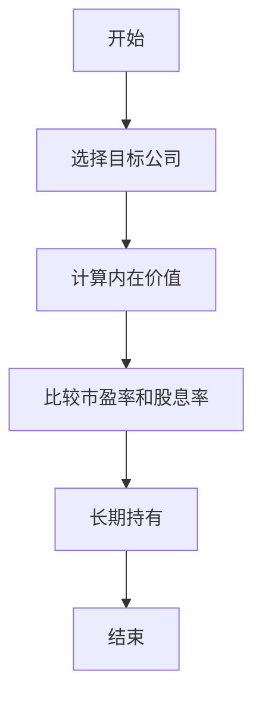
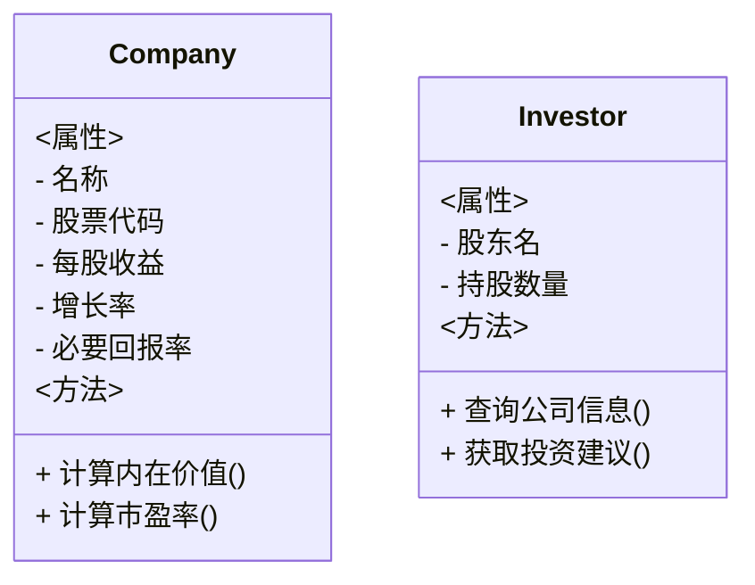
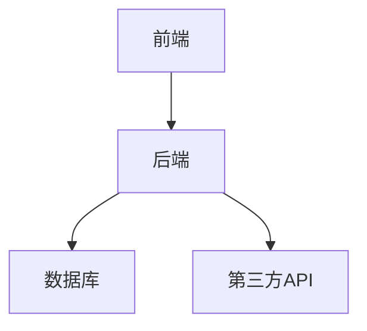

                 


# 巴菲特的股东友好政策

> 关键词：巴菲特、股东友好政策、投资策略、公司治理、股东价值、长期投资

> 摘要：本文深入分析巴菲特的股东友好政策，从背景介绍、核心概念、算法原理、系统分析到项目实战，全面解析其在投资和公司治理中的策略，帮助读者理解如何通过股东友好政策实现长期价值最大化。

## 第一部分：背景介绍

### 第1章：股东友好政策的定义与背景

#### 1.1 股东友好政策的核心概念

股东友好政策是指公司为了维护和增加股东价值而采取的一系列政策和措施。这些政策包括但不限于透明的财务报告、合理的分红策略、有效的公司治理结构以及长期的投资策略。巴菲特作为价值投资的倡导者，他的投资理念和公司治理实践深刻体现了股东友好政策的核心思想。

#### 1.2 巴菲特与股东友好政策的关系

巴菲特的投资理念以长期价值为导向，他不仅关注公司的短期收益，更注重公司的内在价值和长期发展潜力。他的投资策略和公司治理实践对股东友好政策的实施产生了深远影响。

## 第二部分：核心概念与联系

### 第2章：股东友好政策的核心要素

#### 2.1 股东价值最大化

股东价值最大化是股东友好政策的核心目标。通过合理的投资策略和公司治理，公司能够实现股东价值的最大化，从而增强股东对公司管理的信任和支持。

#### 2.2 长期投资与股东友好政策

长期投资是巴菲特实现股东价值最大化的重要手段。通过长期持有优质资产，公司能够稳定增长，为股东创造持续的收益。

#### 2.3 分红策略与股东友好政策

合理的分红策略是股东友好政策的重要组成部分。通过定期分红，公司能够回馈股东，增强股东的满意度和忠诚度。

### 第3章：股东友好政策与公司治理

#### 3.1 公司治理的定义与重要性

公司治理是指公司如何管理和控制其业务活动，确保公司目标的实现和股东利益的保护。有效的公司治理是实现股东友好政策的重要保障。

#### 3.2 股东友好政策在公司治理中的作用

股东友好政策通过透明的财务报告、合理的分红策略和有效的公司治理结构，增强了股东对公司管理的信任和支持，从而为公司的发展提供了坚实的基础。

#### 3.3 巴菲特的公司治理实践

巴菲特在公司治理中注重透明度和长期稳定，他通过持有优质资产和合理的分红策略，实现了股东价值的最大化。

## 第三部分：算法原理讲解

### 第4章：巴菲特投资模型的数学分析

#### 4.1 价值投资模型的定义与特点

价值投资模型是一种以公司内在价值为基础的投资策略。它通过分析公司的财务状况和市场前景，寻找被低估的股票进行投资。

#### 4.2 价值投资模型的数学公式

- 内在价值公式：$$ \text{内在价值} = \frac{\text{每股收益} \times (1 + g)}{r - g} $$
- 市盈率公式：$$ \text{市盈率} = \frac{\text{股价}}{\text{每股收益}} $$
- 股息率公式：$$ \text{股息率} = \frac{\text{每股股息}}{\text{股价}} $$

#### 4.3 价值投资模型的算法流程

1. **确定目标公司**：选择具有长期增长潜力的公司。
2. **计算内在价值**：使用内在价值公式评估公司的价值。
3. **比较市盈率和股息率**：判断公司是否被低估。
4. **长期持有**：投资于低估的股票，等待其价值回归。

### 第5章：数学模型与算法实现

#### 5.1 数学模型的建立

通过分析公司的财务数据和市场数据，建立数学模型来评估公司的内在价值和市场潜力。

#### 5.2 算法实现

```python
def calculate_intrinsic_value(eps, growth_rate, required_return):
    return eps * (1 + growth_rate) / (required_return - growth_rate)

eps = 10  # 每股收益
growth_rate = 0.05  # 增长率
required_return = 0.12  # 必要回报率

intrinsic_value = calculate_intrinsic_value(eps, growth_rate, required_return)
print(f"内在价值: {intrinsic_value}")
```

#### 5.3 算法流程图



## 第四部分：系统分析与架构设计方案

### 第6章：问题场景介绍

#### 6.1 问题描述

如何通过股东友好政策实现公司价值最大化，同时维护股东利益。

#### 6.2 系统介绍

设计一个基于巴菲特投资模型的股东友好政策管理系统，帮助公司实现长期投资和股东价值最大化。

### 第7章：系统功能设计

#### 7.1 系统功能模块

- 数据收集模块：收集公司的财务数据和市场数据。
- 分析模块：计算公司的内在价值和市盈率。
- 报告生成模块：生成投资报告和股东建议。

#### 7.2 领域模型类图



### 第8章：系统架构设计

#### 8.1 系统架构图



#### 8.2 系统接口设计

- 前端接口：用于投资者查询公司信息和获取投资建议。
- 后端接口：用于处理数据分析和计算。
- 数据库接口：用于存储公司数据和投资者信息。

## 第五部分：项目实战

### 第9章：环境安装与核心代码实现

#### 9.1 环境配置

- 安装Python和必要的库（如Pandas、NumPy）。
- 配置数据库和API接口。

#### 9.2 核心代码实现

```python
import pandas as pd
import numpy as np

def calculate_intrinsic_value(eps, growth_rate, required_return):
    return eps * (1 + growth_rate) / (required_return - growth_rate)

data = pd.read_csv('company_data.csv')
data['内在价值'] = data.apply(lambda x: calculate_intrinsic_value(x['eps'], x['growth_rate'], x['required_return']), axis=1)
print(data.head())
```

#### 9.3 代码解读

上述代码读取公司数据，计算内在价值，并输出结果。通过这种方法，投资者可以评估公司的内在价值，判断是否低估。

## 第六部分：总结与展望

### 第10章：最佳实践

- 定期评估公司的内在价值。
- 长期持有优质资产。
- 合理分配分红策略。

### 第11章：小结

通过本文的分析，我们了解了巴菲特的股东友好政策，包括其核心概念、算法原理和系统设计。这些策略和方法可以帮助投资者实现长期价值最大化。

### 第12章：注意事项

- 投资需谨慎，建议在专业指导下进行。
- 定期评估市场变化，调整投资策略。

### 第13章：拓展阅读

- 《巴菲特致股东的信》
- 《价值投资入门》

## 结语

通过本文的详细分析，我们深入理解了巴菲特的股东友好政策，及其在投资和公司治理中的应用。希望这些内容能够帮助读者在实际操作中实现长期价值最大化。

作者：AI天才研究院/AI Genius Institute & 禅与计算机程序设计艺术 /Zen And The Art of Computer Programming

