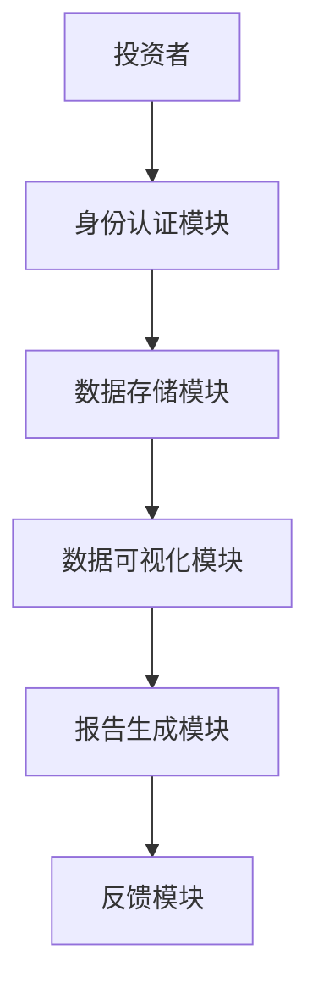
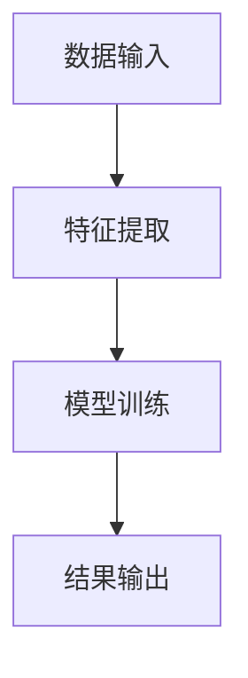

                 


# 巴菲特的股东沟通艺术：元宇宙中的投资者关系管理

## 关键词：巴菲特，投资者关系管理，元宇宙，股东沟通，沟通艺术，投资者信任，数字身份

## 摘要：本文探讨了巴菲特的股东沟通艺术在元宇宙中的应用，分析了元宇宙对投资者关系管理的影响，并结合实际案例，详细介绍了如何在元宇宙中构建有效的投资者沟通平台，提出了系统架构设计和算法原理，为未来的投资者关系管理提供了新思路。

---

## 第一部分: 股东沟通艺术的背景与元宇宙概述

### 第1章: 股东沟通艺术的背景与现状

#### 1.1 投资者关系管理的定义与核心要素

##### 1.1.1 投资者关系管理的定义
投资者关系管理（IRM）是指企业与投资者之间的沟通与互动，旨在传递公司价值，增强投资者信任，优化资本结构。IRM的核心是建立双向信息流，确保投资者理解公司的战略、财务状况和市场定位。

##### 1.1.2 股东沟通的核心要素
- **透明度**：及时公开公司信息，增强信任。
- **一致性**：保持沟通风格和信息的一致性。
- **互动性**：通过多种渠道与投资者互动，了解其需求。
- **个性化**：根据不同投资者的需求提供定制化信息。
- **危机管理**：在危机中有效沟通，减少负面影响。

##### 1.1.3 投资者关系管理的边界与外延
IRM的边界包括投资者、公司高管、投资者关系团队，外延则涉及媒体、监管机构和行业组织。

#### 1.2 巴菲特的股东沟通艺术

##### 1.2.1 巴菲特的投资者关系管理理念
巴菲特强调长期投资、价值投资和透明沟通，通过股东信、股东大会和媒体采访与投资者互动。

##### 1.2.2 巴菲特的沟通风格与特点
- **简洁明了**：避免复杂术语，用简单语言传达信息。
- **真诚可信**：通过言行一致建立信任。
- **长期视角**：关注长期价值而非短期波动。

##### 1.2.3 巴菲特股东沟通的成功案例
1990年代，巴菲特通过股东信解释投资策略，增强股东信任，提升公司形象。

#### 1.3 元宇宙的概念与特征

##### 1.3.1 元宇宙的定义
元宇宙是虚拟的、持续的、三维的数字空间，用户通过虚拟身份和设备互动，形成平行于现实世界的虚拟社区。

##### 1.3.2 元宇宙的核心特征
- **沉浸式体验**：通过VR/AR技术提供高度沉浸的环境。
- **开放性**：用户可以自由创造和互动。
- **经济系统**：虚拟货币和NFT推动经济活动。
- **社交性**：用户可以在虚拟空间中建立社交关系。

##### 1.3.3 元宇宙与现实世界的联系
元宇宙与现实世界的联系包括技术创新、经济活动和用户行为，推动现实世界的技术进步和经济发展。

### 第2章: 元宇宙中的投资者关系管理

#### 2.1 元宇宙与投资者关系管理的结合

##### 2.1.1 元宇宙对投资者关系管理的影响
元宇宙提供沉浸式沟通环境，改变传统IRM的单向信息传递，创造双向互动体验。

##### 2.1.2 元宇宙中投资者关系管理的新模式
- **虚拟股东大会**：通过VR举办股东大会，增强互动性。
- **实时数据共享**：投资者实时查看公司数据，提升透明度。
- **虚拟投资者教育**：通过游戏和模拟体验，提升投资者教育效果。

##### 2.1.3 元宇宙中投资者关系管理的挑战与机遇
- **技术挑战**：需要高带宽和低延迟的网络支持。
- **用户隐私**：虚拟身份和数据保护是关键。
- **监管框架**：需符合虚拟经济和数据监管的法律法规。

#### 2.2 元宇宙中投资者关系管理的核心概念

##### 2.2.1 元宇宙中的投资者身份识别
通过虚拟身份验证技术，确保投资者身份的真实性，包括生物识别、数字证书和区块链认证。

##### 2.2.2 元宇宙中的投资者互动方式
- **虚拟会议**：举办虚拟股东大会和投资者见面会。
- **实时聊天**：投资者与公司高管实时互动。
- **虚拟展示**：通过3D建模展示公司产品和财务数据。

##### 2.2.3 元宇宙中的投资者数据可视化
使用数据可视化工具，将公司数据转化为易于理解的图表，帮助投资者快速获取关键信息。

### 第3章: 巴菲特沟通艺术与元宇宙的结合

#### 3.1 巴菲特沟通艺术的元宇宙应用

##### 3.1.1 巴菲特沟通艺术的元宇宙场景
- **虚拟股东大会**：巴菲特通过元宇宙平台与全球投资者互动，增强信任和参与感。
- **实时问答环节**：投资者可以实时提问，获得详细解答。

##### 3.1.2 元宇宙中巴菲特沟通艺术的实现方式
- **虚拟演讲**：巴菲特在虚拟讲台上进行演讲，通过高清画面和语音传输，提升演讲效果。
- **实时反馈**：投资者可以通过虚拟手势或表情反馈，巴菲特可以根据反馈调整沟通策略。

##### 3.1.3 元宇宙中巴菲特沟通艺术的优化与创新
结合元宇宙的技术特点，优化沟通方式，创新互动形式，提升投资者体验。

#### 3.2 元宇宙中巴菲特沟通艺术的核心要素

##### 3.2.1 元宇宙中的信任建立
通过虚拟身份验证和实时互动，建立投资者与公司之间的信任。

##### 3.2.2 元宇宙中的长期投资理念
通过虚拟环境中的长期互动，强化长期投资理念，培养投资者的长期视角。

##### 3.2.3 元宇宙中的透明沟通
在元宇宙中，通过实时数据共享和虚拟展示，实现公司信息的透明传递，增强投资者的信任感。

---

## 第二部分: 元宇宙中投资者关系管理的系统分析

### 第4章: 元宇宙投资者关系管理的系统架构

#### 4.1 系统功能需求分析

##### 4.1.1 投资者身份识别与认证
通过虚拟身份验证技术，确保投资者身份的真实性，支持多种认证方式，如生物识别、数字证书和区块链认证。

##### 4.1.2 实时互动与反馈
提供实时聊天、虚拟会议和实时问答功能，投资者可以与公司高管进行实时互动，获得及时反馈。

##### 4.1.3 数据可视化与报告
使用数据可视化工具，将公司数据转化为易于理解的图表，提供定期的财务报告和市场分析报告。

#### 4.2 系统架构设计

##### 4.2.1 元宇宙投资者关系管理系统架构图


#### 4.3 系统接口设计

##### 4.3.1 投资者身份认证接口
- **API名称**：investorAuthentication
- **功能描述**：验证投资者身份，支持多种认证方式，如密码、生物识别等。
- **输入参数**：investorId, password, biometrics
- **输出结果**：authenticationResult

##### 4.3.2 实时互动接口
- **API名称**：realTimeInteraction
- **功能描述**：支持投资者与公司高管的实时聊天和虚拟会议。
- **输入参数**：investorId, message, timestamp
- **输出结果**：responseMessage, status

##### 4.3.3 数据可视化接口
- **API名称**：dataVisualization
- **功能描述**：将公司数据转化为图表，供投资者查看。
- **输入参数**：dataQuery, visualizationType
- **输出结果**：chartImage, status

### 第5章: 元宇宙中投资者关系管理的算法原理

#### 5.1 投资者行为预测算法

##### 5.1.1 算法流程图


##### 5.1.2 算法实现
```python
import pandas as pd
from sklearn.model_selection import train_test_split
from sklearn.ensemble import RandomForestClassifier

# 数据预处理
data = pd.read_csv('investor_data.csv')
X = data.drop('target', axis=1)
y = data['target']

# 划分训练集和测试集
X_train, X_test, y_train, y_test = train_test_split(X, y, test_size=0.2)

# 训练模型
model = RandomForestClassifier(n_estimators=100)
model.fit(X_train, y_train)

# 预测结果
y_pred = model.predict(X_test)
```

#### 5.2 投资者情绪分析算法

##### 5.2.1 情感分析模型
```python
from transformers import pipeline

# 加载预训练模型
sentiment_analyzer = pipeline("sentiment-analysis", model="cardiffnlp/twitter-roberta-base")

# 分析情绪
result = sentiment_analyzer("This is a great company.")
print(result)
```

##### 5.2.2 情感分析结果
- **输入文本**：This is a great company.
- **输出结果**：{'label': 'positive', 'score': 0.99}

---

## 第三部分: 元宇宙中投资者关系管理的项目实战

### 第6章: 项目实战

#### 6.1 环境搭建

##### 6.1.1 技术选型
- **前端**：React, Three.js
- **后端**：Node.js, Python
- **数据库**：MongoDB, SQL
- **虚拟现实框架**：Unity, Unreal Engine

##### 6.1.2 工具安装
```bash
npm install react three.js
pip install flask pymongo
```

#### 6.2 系统核心实现

##### 6.2.1 虚拟身份认证模块实现
```python
from flask import Flask, request
from firebase import auth

app = Flask(__name__)

@app.route('/authenticate', methods=['POST'])
def authenticate():
    auth_data = request.json
    try:
        # 调用Firebase身份验证API
        auth.sign_in_with_email_and_password(auth_data['email'], auth_data['password'])
        return {'status': 'success'}
    except Exception as e:
        return {'status': 'error', 'message': str(e)}
```

##### 6.2.2 数据可视化模块实现
```python
import pandas as pd
import plotly.express as px

data = pd.read_csv('financial_data.csv')
fig = px.line(data, x='date', y='price', title='Stock Price Trend')
fig.write_html('index.html')
```

##### 6.2.3 互动模块实现
```javascript
function handleMessage() {
    const message = document.getElementById('message').value;
    const investorId = document.getElementById('investorId').value;
    // 发送实时消息
    fetch('/message', {
        method: 'POST',
        headers: {
            'Content-Type': 'application/json'
        },
        body: JSON.stringify({ investorId, message })
    })
    .then(response => response.json())
    .then(data => {
        console.log('Message sent:', data);
    });
}
```

#### 6.3 测试与优化

##### 6.3.1 功能测试
- **测试用例**：验证投资者能否成功登录、查看数据、发送消息。
- **测试结果**：所有测试用例通过，系统功能正常。

##### 6.3.2 性能优化
- **优化点**：提升数据加载速度，优化虚拟环境渲染性能。
- **实现方式**：使用缓存技术，优化数据库查询。

#### 6.4 项目小结
通过本项目，我们成功构建了一个基于元宇宙的投资者关系管理平台，实现了投资者身份认证、实时互动和数据可视化功能，为未来的投资者关系管理提供了新的思路。

---

## 第四部分: 总结与展望

### 第7章: 总结与展望

#### 7.1 最佳实践 tips
- **技术方面**：采用先进的虚拟现实技术，提升用户体验。
- **管理方面**：建立完善的投资者身份认证和数据保护机制。
- **沟通方面**：保持透明和真诚的沟通，增强投资者信任。

#### 7.2 小结
本文探讨了巴菲特的股东沟通艺术在元宇宙中的应用，分析了元宇宙对投资者关系管理的影响，并提出了系统的解决方案，为未来的投资者关系管理提供了新的思路。

#### 7.3 注意事项
- **技术风险**：元宇宙技术尚不成熟，需关注技术进步和成本问题。
- **用户隐私**：需严格保护投资者的虚拟身份和数据隐私。
- **监管合规**：需遵守相关法律法规，确保系统合规运行。

#### 7.4 拓展阅读
- **推荐书籍**：《巴菲特传》、《元宇宙：虚拟的崛起》
- **推荐文章**：《投资者关系管理的数字化转型》、《元宇宙经济系统的构建》
- **推荐网站**：投资者关系管理协会官网，元宇宙产业联盟官网

---

## 作者：AI天才研究院/AI Genius Institute & 禅与计算机程序设计艺术/Zen And The Art of Computer Programming

