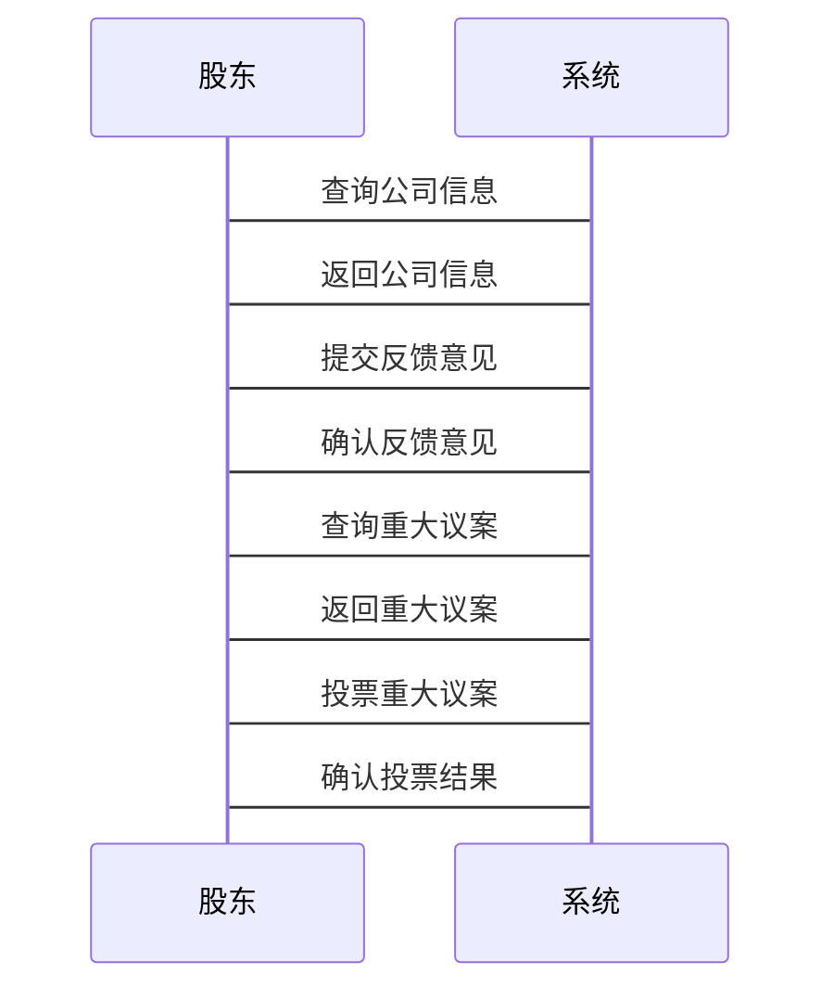

                 


# 巴菲特的股东沟通艺术：区块链时代的公司治理

## 关键词：股东沟通，区块链，公司治理，智能合约，共识机制

## 摘要：本文探讨了巴菲特的股东沟通艺术，并结合区块链技术在现代公司治理中的应用，分析了区块链如何提升股东沟通的透明度和效率。通过理论与实践相结合的方式，详细阐述了区块链技术在公司治理中的核心概念、算法原理、系统架构及项目实战，为读者提供了全面的视角和实用的指导。

---

## 第1章：巴菲特的股东沟通艺术概述

### 1.1 投资者的沟通艺术

#### 1.1.1 投资者的沟通需求
投资者在选择和管理投资时，需要及时、准确的信息来做出决策。有效的沟通能够增强投资者的信任感和参与感，从而提高投资效率和回报率。

#### 1.1.2 巴菲特的沟通风格
巴菲特以其坦诚、透明和耐心的沟通风格闻名。他通过定期的股东大会、致股东的信函以及媒体采访等方式，向投资者传递公司的重要信息和战略规划，增强了投资者对公司治理的信任。

#### 1.1.3 股东沟通的重要性
有效的股东沟通是公司治理的核心要素之一。它不仅能够提升投资者的满意度，还能增强公司的声誉和市场竞争力。通过良好的沟通，公司能够及时了解投资者的需求和期望，从而更好地制定和调整发展战略。

### 1.2 区块链时代的公司治理

#### 1.2.1 区块链技术对现代公司治理的影响
区块链技术通过去中心化、不可篡改和透明化的特性，为公司治理提供了新的可能性。它可以实现公司治理的透明化、智能化和高效化，从而提升股东的参与感和信任感。

#### 1.2.2 区块链时代的股东沟通特点
在区块链时代，股东沟通更加透明、实时和互动。通过区块链技术，股东可以实时查看公司的经营数据和决策过程，从而实现更加高效的沟通和协作。

#### 1.2.3 区块链与传统公司治理的对比
传统的公司治理依赖于中心化的机构和流程，信息传递可能存在延迟和不透明。而区块链技术通过去中心化和分布式账本，能够实现信息的实时共享和高效协作，从而显著提升了公司治理的效率和透明度。

---

## 第2章：股东沟通的核心要素

### 2.1 股东沟通的基本原则

#### 2.1.1 透明性原则
透明性是股东沟通的基本原则之一。公司需要通过公开的信息披露，确保股东能够及时了解公司的经营状况和战略规划。

#### 2.1.2 及时性原则
及时性原则要求公司在重要信息出现时，能够迅速传递给股东，以便股东做出及时的决策。

#### 2.1.3 准确性原则
准确性原则强调信息的真实性和可靠性。公司需要确保提供的信息准确无误，以避免误导投资者。

### 2.2 区块链技术在股东沟通中的应用

#### 2.2.1 区块链的去中心化特性
区块链的去中心化特性能够消除信息传递中的中间环节，确保信息的直接传递和共享，从而提升沟通的效率和安全性。

#### 2.2.2 区块链的不可篡改性
区块链的不可篡改性确保了信息的真实性和可靠性，从而增强了股东对公司的信任。

#### 2.2.3 区块链的智能合约功能
智能合约能够自动执行预设的规则和协议，从而实现了股东沟通的自动化和智能化。

---

## 第3章：股东沟通与区块链治理的核心概念

### 3.1 股东沟通的核心概念

#### 3.1.1 股东的知情权
股东的知情权是公司治理的基本权利之一，股东有权了解公司的经营状况、财务状况和重大决策。

#### 3.1.2 股东的参与权
股东的参与权是指股东有权参与公司的重要决策，如选举董事会成员、审议重大议案等。

#### 3.1.3 股东的决策权
股东的决策权是股东在公司治理中的核心权利，股东可以通过投票等方式，影响公司的决策和管理。

### 3.2 区块链治理的核心概念

#### 3.2.1 区块链的共识机制
共识机制是区块链技术的核心之一，它通过分布式网络中多个节点的共同验证，确保了数据的一致性和可靠性。

#### 3.2.2 区块链的智能合约
智能合约是区块链上的自动化程序，能够根据预设的规则自动执行合同条款，从而实现了去中心化的信任和执行。

#### 3.2.3 区块链的分布式账本
分布式账本是区块链的核心数据结构，它通过多个节点的协作，确保了数据的完整性和不可篡改性。

---

## 第4章：股东沟通与区块链治理的数学模型

### 4.1 股东沟通的数学模型

#### 4.1.1 沟通效率的数学表达
沟通效率可以通过信息传递的速度和准确率来衡量，公式如下：

$$ \text{沟通效率} = \frac{\text{信息传递速度} \times \text{信息准确率}}{\text{信息传递延迟}} $$

#### 4.1.2 沟通成本的数学模型
沟通成本包括信息收集、传递和处理的成本，公式如下：

$$ \text{沟通成本} = \text{信息收集成本} + \text{信息传递成本} + \text{信息处理成本} $$

#### 4.1.3 沟通效果的评价指标
沟通效果可以通过信息的完整性、准确性和及时性来评价，公式如下：

$$ \text{沟通效果} = \text{信息完整性} \times \text{信息准确性} \times \text{信息及时性} $$

### 4.2 区块链治理的数学模型

#### 4.2.1 共识机制的数学模型
共识机制的数学模型可以通过概率论和图论来描述，例如：

$$ P(\text{共识达成}) = \sum_{i=1}^{n} P_i \times \text{节点活跃度}_i $$

其中，\( P_i \) 是第 \( i \) 个节点达成共识的概率，节点活跃度 \( i \) 表示第 \( i \) 个节点的在线状态。

#### 4.2.2 智能合约的执行逻辑
智能合约的执行逻辑可以通过状态机和有限自动机理论来描述，例如：

$$ \text{智能合约执行状态} = \text{输入条件} \rightarrow \text{状态转移} \rightarrow \text{输出结果} $$

#### 4.2.3 分布式账本的数学表示
分布式账本的数学表示可以通过哈希函数和加密算法来描述，例如：

$$ \text{哈希值} = H(\text{数据块} \parallel \text{随机数} \parallel \text{时间戳}) $$

其中，\( H \) 是哈希函数，\( \text{数据块} \) 是区块链中的数据块，\( \text{随机数} \) 是随机数，\( \text{时间戳} \) 是时间戳。

---

## 第5章：股东沟通与区块链治理的系统架构

### 5.1 系统功能设计

#### 5.1.1 股东信息管理模块
股东信息管理模块负责管理股东的信息，包括股东的注册、登录、信息更新等。

#### 5.1.2 沟通渠道管理模块
沟通渠道管理模块负责管理股东与公司之间的沟通渠道，包括邮件、短信、即时通讯等。

#### 5.1.3 治理决策模块
治理决策模块负责公司治理的决策过程，包括董事会选举、重大议案审议等。

### 5.2 系统架构设计

#### 5.2.1 分层架构设计
分层架构设计将系统划分为表示层、业务逻辑层和数据访问层，每一层都有明确的职责和接口。

#### 5.2.2 微服务架构设计
微服务架构设计将系统分解为多个独立的服务，每个服务负责特定的功能模块，通过API进行交互。

#### 5.2.3 区块链节点的分布架构
区块链节点的分布架构通过多个节点的协作，实现数据的分布式存储和共识机制。

### 5.3 系统接口设计

#### 5.3.1 股东信息查询接口
股东信息查询接口允许股东查询自己的持股信息和公司信息。

#### 5.3.2 重大议案审议接口
重大议案审议接口允许股东参与重大议案的审议和投票。

#### 5.3.3 沟通记录查询接口
沟通记录查询接口允许股东查询历史沟通记录和反馈意见。

### 5.4 系统交互流程图

通过Mermaid序列图，展示股东与系统之间的交互流程：



---

## 第6章：股东沟通与区块链治理的项目实战

### 6.1 环境安装与配置

#### 6.1.1 区块链开发环境搭建
需要安装区块链开发框架，例如以太坊Solidity、Hyperledger Fabric等。

#### 6.1.2 沟通系统工具安装
需要安装数据库、前端框架和后端框架等工具。

#### 6.1.3 智能合约部署
通过智能合约实现股东沟通的功能，例如股东信息管理、重大议案审议等。

### 6.2 核心代码实现

#### 6.2.1 智能合约代码
以下是用Solidity语言实现的智能合约代码示例：

```solidity
pragma solidity ^0.8.0;

contract ShareholderCommunication {
    // 定义股东信息结构体
    struct Shareholder {
        address payable account;
        uint shares;
    }

    // 事件：股东信息更新
    event ShareholderUpdated(address indexed account, uint shares);

    // 函数：更新股东信息
    function updateShareholder(address payable account, uint shares) public {
        Shareholder memory shareholder = Shareholder(account, shares);
        emit ShareholderUpdated(account, shares);
    }

    // 函数：查询股东信息
    function getShareholder(address payable account) public view returns (uint) {
        return account.shareholder.shares;
    }
}
```

#### 6.2.2 后端接口实现
以下是用Node.js实现的后端接口代码示例：

```javascript
const express = require('express');
const app = express();

app.get('/api/shareholder-info', (req, res) => {
    // 获取股东信息
    const shareholderInfo = { shares: 1000, account: '0x123456789' };
    res.json(shareholderInfo);
});

app.post('/api/update-shares', (req, res) => {
    // 更新股东股份
    const newShares = req.body.shares;
    // 执行更新操作
    res.json({ status: 'success' });
});
```

### 6.3 案例分析

#### 6.3.1 项目背景
假设我们是一家科技公司，希望通过区块链技术实现股东沟通的透明化和高效化。

#### 6.3.2 项目实施
通过区块链技术实现股东信息管理、重大议案审议和智能合约执行等功能。

#### 6.3.3 实施效果
通过项目的实施，股东能够实时查看公司信息，参与重大决策，提升了股东的参与感和信任感。

### 6.4 项目总结

#### 6.4.1 项目成果
通过项目的实施，实现了股东沟通的透明化和高效化，提升了公司的治理能力。

#### 6.4.2 经验总结
项目实施过程中，需要注意智能合约的安全性和系统的可扩展性，确保系统的稳定运行。

---

## 第7章：股东沟通与区块链治理的最佳实践

### 7.1 小结

通过本文的探讨，我们了解了巴菲特的股东沟通艺术，并结合区块链技术在公司治理中的应用，提出了提升股东沟通效率和透明度的解决方案。

### 7.2 注意事项

在实际操作中，需要注意以下几点：
1. 确保智能合约的安全性，防止被攻击和篡改。
2. 保证系统的可扩展性，适应公司的发展需求。
3. 提高股东的参与度，确保股东的知情权和参与权。

### 7.3 拓展阅读

推荐阅读以下书籍和文章：
1. 《区块链：重新定义价值传递的互联网》
2. 《智能合约：区块链技术的核心创新》
3. 《公司治理：理论与实践》

---

## 作者

作者：AI天才研究院/AI Genius Institute & 禅与计算机程序设计艺术/Zen And The Art of Computer Programming

