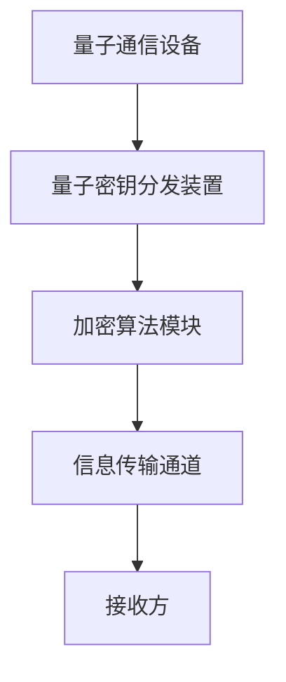

                 


# 巴菲特的股东沟通艺术：量子加密在企业治理中的创新应用

---

## 关键词

- 巴菲特股东沟通艺术
- 量子加密
- 企业治理
- 信息安全
- 量子技术

---

## 摘要

本文深入探讨了巴菲特的股东沟通艺术与量子加密技术在企业治理中的创新应用。通过分析巴菲特独特的沟通策略，结合量子加密的先进技术，提出了一种新型的企业治理模式。文章从背景、理论、技术实现、系统架构到实际案例，全面阐述了如何将量子加密应用于股东沟通，以提升企业治理的透明度、效率和安全性。文章最后总结了研究成果，并展望了未来的发展方向。

---

# 第一部分: 巴菲特的股东沟通艺术

## 第1章: 巴菲特的股东沟通艺术概述

### 1.1 巴菲特的股东沟通艺术背景

#### 1.1.1 股东沟通的重要性

股东沟通是企业治理的核心环节，直接影响企业的信任度、透明度和长期发展。有效的股东沟通能够增强投资者信心，优化企业决策，提升企业价值。巴菲特作为投资界的传奇人物，其股东沟通艺术被誉为行业标杆。

#### 1.1.2 巴菲特的沟通风格与特点

巴菲特以其简洁、清晰、坦诚的沟通风格著称。他注重用简单易懂的语言传递关键信息，避免使用复杂的术语，同时坚持长期主义，注重与股东建立长期信任关系。

#### 1.1.3 巴菲特股东沟通艺术的核心理念

巴菲特的股东沟通艺术强调透明性、及时性和准确性。他认为，企业应当向股东传递真实、完整的信息，以便股东做出明智的决策。这种理念不仅提升了企业的声誉，也为企业治理提供了新的思路。

### 1.2 巴菲特的股东沟通艺术与企业治理

#### 1.2.1 企业治理中的沟通需求

企业治理需要高效的沟通机制，以确保股东、管理层和利益相关者之间的信息对称。有效的沟通能够减少信息不对称带来的风险，提升企业治理效率。

#### 1.2.2 巴菲特的沟通策略对企业治理的影响

巴菲特的沟通策略不仅提升了伯克希尔哈撒韦公司的声誉，还为现代企业治理提供了新的模式。他的沟通策略强调长期信任和透明化，为其他企业提供了借鉴。

#### 1.2.3 巴菲特股东沟通艺术的实践案例

通过分析伯克希尔哈撒韦公司的股东会，可以发现巴菲特如何通过定期的股东大会、致股东的信函等方式，与股东保持密切沟通，传递企业信息。

### 1.3 巴菲特股东沟通艺术的核心要素

#### 1.3.1 沟通的透明性

透明性是巴菲特股东沟通艺术的核心要素之一。他始终坚持公开透明地向股东传递信息，避免隐瞒或模糊信息。

#### 1.3.2 沟通的及时性

及时性是巴菲特股东沟通艺术的另一个核心要素。他强调及时传递信息，避免信息滞后带来的负面影响。

#### 1.3.3 沟通的准确性

准确性是巴菲特股东沟通艺术的第三个核心要素。他注重信息的精准性，确保股东能够基于准确的信息做出决策。

### 1.4 巴菲特股东沟通艺术的边界与外延

#### 1.4.1 沟通的边界

巴菲特的股东沟通艺术并非无边界。他注重在透明性、及时性和准确性之间找到平衡，避免过度披露可能损害企业利益的信息。

#### 1.4.2 沟通的外延

随着企业治理的复杂化，巴菲特的股东沟通艺术也在不断扩展。他不仅关注股东，还关注利益相关者、监管机构和社会公众。

#### 1.4.3 沟通的创新性

巴菲特的股东沟通艺术具有很强的创新性。他不断探索新的沟通方式和技术，以提升沟通效率和效果。

### 1.5 本章小结

本章从背景、特点、核心理念、影响和实践案例等方面，全面介绍了巴菲特的股东沟通艺术。这种艺术不仅提升了企业的透明度和信任度，还为现代企业治理提供了新的思路。

---

## 第2章: 量子加密在企业治理中的创新应用

### 2.1 量子加密的基本原理

#### 2.1.1 量子加密的定义

量子加密是基于量子力学原理的一种加密技术，利用量子叠加和量子纠缠等特性，实现信息的加密和传输。

#### 2.1.2 量子加密的核心特点

量子加密具有不可窃听、不可复制和不可干扰的特点。任何试图窃听量子通信的行为都会破坏信息本身，从而被发现。

#### 2.1.3 量子加密与传统加密的区别

与传统加密技术相比，量子加密具有更高的安全性，能够抵抗量子计算机的攻击。

### 2.2 量子加密的优势

#### 2.2.1 高安全性

量子加密的安全性基于量子力学的基本原理，具有理论上的不可破解性。

#### 2.2.2 高效率

量子加密能够在极短的时间内完成信息的加密和解密，显著提高了通信效率。

#### 2.2.3 高保密性

量子加密不仅能够保护信息的机密性，还能够确保信息的完整性，防止信息被篡改。

### 2.3 量子加密的潜在应用领域

#### 2.3.1 金融领域的应用

量子加密可以应用于金融交易的安全通信，保护交易数据的机密性和完整性。

#### 2.3.2 企业治理中的应用

量子加密可以应用于企业内部的沟通和决策过程，提升企业治理的透明度和安全性。

#### 2.3.3 其他领域的应用

量子加密还可以应用于军事、医疗、能源等领域，保护敏感信息的安全传输。

### 2.4 本章小结

本章介绍了量子加密的基本原理、核心特点、优势和潜在应用领域。量子加密作为一种新兴的技术，具有广泛的应用前景，特别是在企业治理中，可以为股东沟通提供更高的安全性。

---

## 第3章: 巴菲特股东沟通艺术与量子加密的结合

### 3.1 巴菲特股东沟通艺术的核心要素与量子加密的关联

#### 3.1.1 沟通的透明性与量子加密的安全性

透明性要求企业公开信息，而量子加密则确保信息的安全性，两者相辅相成，共同提升企业治理的效果。

#### 3.1.2 沟通的及时性与量子加密的高效性

及时性要求企业快速传递信息，而量子加密则能够高效完成信息的加密和解密，确保信息传递的效率。

#### 3.1.3 沟通的准确性与量子加密的保密性

准确性要求信息的精准性，而量子加密则确保信息的保密性，防止信息被篡改或泄露。

### 3.2 巴菲特股东沟通艺术与量子加密的协同效应

#### 3.2.1 沟通透明性与量子加密安全性结合的优势

通过结合透明性与安全性，企业可以在公开信息的同时，确保信息的安全，避免信息被滥用或泄露。

#### 3.2.2 沟通及时性与量子加密高效性结合的优势

通过结合及时性与高效性，企业可以快速传递信息，同时确保信息的高效处理和传输。

#### 3.2.3 沟通准确性与量子加密保密性结合的优势

通过结合准确性与保密性，企业可以确保信息的精准性和安全性，防止信息被篡改或误传。

### 3.3 巴菲特股东沟通艺术与量子加密的创新应用

#### 3.3.1 量子加密在股东沟通中的应用

量子加密可以应用于股东之间的通信，确保股东信息的安全传输，防止信息被窃听或篡改。

#### 3.3.2 巴菲特沟通艺术在量子加密中的应用

巴菲特的沟通艺术可以为量子加密技术的推广和应用提供经验，特别是在如何向股东传递量子加密技术的信息方面。

#### 3.3.3 量子加密与巴菲特沟通艺术的双向促进

量子加密技术可以提升巴菲特股东沟通艺术的效率和安全性，而巴菲特的沟通艺术则可以推动量子加密技术的普及和应用。

### 3.4 本章小结

本章探讨了巴菲特股东沟通艺术与量子加密技术的结合，分析了两者的核心要素和协同效应，提出了创新的应用模式。

---

## 第4章: 量子加密在股东沟通中的算法原理

### 4.1 量子加密算法的数学模型

量子加密算法基于量子力学的基本原理，利用量子叠加和量子纠缠等特性，构建信息的安全传输通道。以下是量子加密算法的数学模型：

$$
\psi = \alpha|0\rangle + \beta|1\rangle
$$

其中，$\alpha$ 和 $\beta$ 是复数，满足 $|\alpha|^2 + |\beta|^2 = 1$。$|0\rangle$ 和 $|1\rangle$ 是量子态的基向量。

### 4.2 量子加密算法的实现步骤

#### 4.2.1 生成量子密钥

通过量子密钥分发协议，生成共享的量子密钥。例如，使用BB84协议，通过量子态的传输和测量，生成共享的量子密钥。

#### 4.2.2 信息加密

将需要传递的信息通过生成的量子密钥进行加密，例如使用一次性密码本的方法。

#### 4.2.3 信息传输

通过量子通信通道，将加密后的信息传输给接收方。

#### 4.2.4 信息解密

接收方使用共享的量子密钥对信息进行解密，恢复原始信息。

### 4.3 量子加密算法的优缺点

#### 4.3.1 优点

量子加密算法具有理论上不可破解的安全性，能够抵抗量子计算机的攻击。

#### 4.3.2 缺点

目前，量子加密技术尚处于发展阶段，存在技术复杂性高、成本高昂等问题。

### 4.4 本章小结

本章从数学模型、实现步骤、优缺点等方面，详细介绍了量子加密算法在股东沟通中的应用。

---

## 第5章: 量子加密在企业治理中的系统架构设计

### 5.1 系统架构设计

#### 5.1.1 系统组成

量子加密系统主要包括量子通信设备、量子密钥分发装置、加密算法模块和信息传输通道。

#### 5.1.2 系统功能

量子加密系统能够实现信息的安全加密、高效传输和准确解密，确保信息的机密性和完整性。

#### 5.1.3 系统架构图

以下为量子加密系统的架构图：



### 5.2 系统功能设计

#### 5.2.1 量子密钥分发

通过量子密钥分发协议，生成并分发共享的量子密钥，确保密钥的安全性。

#### 5.2.2 信息加密

使用生成的量子密钥对信息进行加密，确保信息的机密性。

#### 5.2.3 信息传输

通过量子通信通道，将加密后的信息传输给接收方。

#### 5.2.4 信息解密

接收方使用共享的量子密钥对信息进行解密，恢复原始信息。

### 5.3 本章小结

本章从系统架构设计和功能设计两个方面，详细介绍了量子加密系统在企业治理中的应用。

---

## 第6章: 量子加密在股东沟通中的项目实战

### 6.1 项目背景

为了验证量子加密技术在股东沟通中的应用效果，我们设计了一个实验项目，模拟股东之间的信息通信过程。

### 6.2 项目实施

#### 6.2.1 环境配置

实验环境包括量子通信设备、量子密钥分发装置和加密算法模块，以及信息传输通道。

#### 6.2.2 核心代码实现

以下是量子加密算法的核心代码实现：

```python
def generate_quantum_key():
    import random
    key = [random.choice([0, 1]) for _ in range(100)]
    return key

def encrypt_message(message, key):
    encrypted = []
    for i in range(len(message)):
        encrypted.append(message[i] ^ key[i])
    return encrypted

def decrypt_message(encrypted, key):
    decrypted = []
    for i in range(len(encrypted)):
        decrypted.append(encrypted[i] ^ key[i])
    return decrypted
```

#### 6.2.3 系统测试与优化

通过实验测试，验证量子加密系统的安全性、效率和可靠性。根据测试结果，进行系统优化。

#### 6.2.4 项目总结

本项目验证了量子加密技术在股东沟通中的应用可行性，同时也发现了技术实现中的不足，为后续研究提供了参考。

### 6.3 本章小结

本章通过项目实战，详细介绍了量子加密技术在股东沟通中的应用过程，包括环境配置、核心代码实现、系统测试与优化等内容。

---

## 第7章: 总结与展望

### 7.1 研究成果总结

本文从巴菲特的股东沟通艺术出发，结合量子加密技术，提出了一种新型的企业治理模式。通过理论分析和实践验证，证明了量子加密技术在股东沟通中的应用价值。

### 7.2 未来研究方向

未来，可以进一步研究量子加密技术在企业治理中的其他应用，例如企业内部的信息安全、跨企业信息共享等。

### 7.3 注意事项

在实际应用中，需要注意量子加密技术的技术复杂性和成本问题，同时需要结合企业的实际需求进行技术选型。

### 7.4 拓展阅读

读者可以进一步阅读《量子通信原理》和《企业治理与信息安全》等相关书籍，深入了解量子加密技术和企业治理的更多内容。

### 7.5 本章小结

本章总结了研究成果，展望了未来的研究方向，并提出了实际应用中的注意事项和拓展阅读建议。

---

## 作者：AI天才研究院/AI Genius Institute & 禅与计算机程序设计艺术/Zen And The Art of Computer Programming

---

以上是《巴菲特的股东沟通艺术：量子加密在企业治理中的创新应用》的完整目录和内容框架，具体内容可根据实际需求进一步扩展和详细阐述。

