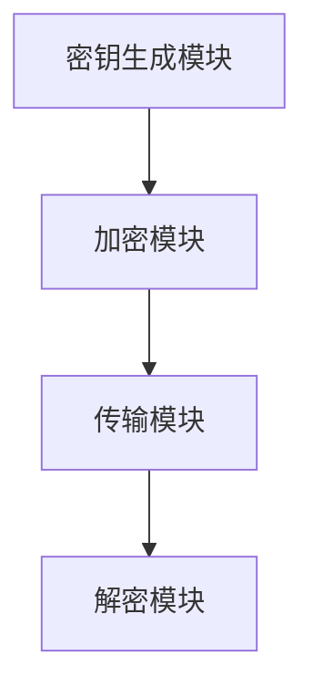
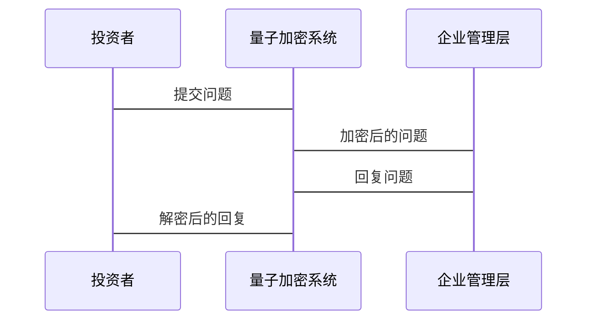

                 


# 巴菲特的股东沟通艺术：量子加密在投资者关系中的应用

> 关键词：巴菲特，股东沟通，量子加密，投资者关系，隐私保护，信任建设，系统架构

> 摘要：本文探讨巴菲特的投资者沟通艺术，并结合量子加密技术，分析其在投资者关系管理中的应用。通过介绍量子加密的原理和系统架构，结合实际案例，展示如何利用量子加密提升投资者隐私保护和信任建设。

---

## 第1章 巴菲特的投资者沟通艺术

### 1.1 巴菲特的投资理念与沟通风格

#### 1.1.1 巴菲特的投资理念

沃伦·巴菲特是全球最著名的投资者之一，他的投资理念以价值投资为核心。他认为，投资的本质是寻找那些具有持续竞争优势的企业，并以合理的价格买入并长期持有。这种理念强调企业基本面分析，注重企业的财务健康状况、管理层素质以及行业地位。

#### 1.1.2 巴菲特的沟通风格

巴菲特以坦诚、透明和简洁的沟通风格著称。他每年都会在伯克希尔哈撒韦公司的股东大会上发表演讲，回答股东的提问。他的沟通风格不仅增强了投资者对公司的信任，也树立了他在投资者关系管理中的权威形象。

#### 1.1.3 巴菲特的投资者关系管理

巴菲特的投资者关系管理强调长期信任的建立。他通过定期的财务报告、股东大会和媒体采访，与投资者保持密切联系。这种双向的沟通不仅传递了公司的信息，也增强了投资者对公司管理层的信任。

---

### 1.2 巴菲特的股东沟通技巧

#### 1.2.1 透明化的沟通策略

巴菲特坚信透明化是建立信任的关键。他通过公开公司的财务状况、业务策略和管理层决策，向投资者展示公司的运营情况，从而增强了投资者的信任感。

#### 1.2.2 巴菲特的演讲艺术

巴菲特的演讲以简洁明了著称，他善于用通俗易懂的语言解释复杂的金融概念。他的演讲风格不仅传递了信息，也展现了他对投资的深刻理解和对听众的尊重。

#### 1.2.3 巴菲特的问答技巧

在股东大会上，巴菲特总是耐心地回答股东的问题，无论问题的难度如何。他通过清晰、直接的回答，消除了投资者的疑虑，增强了他们对公司未来发展的信心。

---

## 第2章 量子加密的基本原理

### 2.1 量子加密的定义与特点

#### 2.1.1 量子加密的定义

量子加密是一种利用量子力学原理进行加密的技术。与传统加密不同，量子加密利用量子位的叠加态和纠缠态来实现信息的加密和传输。

#### 2.1.2 量子加密的核心特点

量子加密具有不可被破解、通信双方无需共享密钥、传输速度快等优点。其核心在于利用量子力学的不确定性原理，确保信息在传输过程中不会被窃取。

#### 2.1.3 量子加密与传统加密的区别

与传统加密相比，量子加密的密钥分发过程更加安全，且加密过程更加高效。传统加密依赖于复杂的数学算法，而量子加密则利用量子力学的特性来实现加密。

---

### 2.2 量子加密的数学模型

#### 2.2.1 量子位的概念

量子位（qubit）是量子计算和量子加密的基本单位。与传统计算机中的比特不同，量子位可以同时处于0和1的叠加态。

#### 2.2.2 量子叠加原理

量子叠加原理表明，一个量子位可以同时处于多个状态的叠加态。这种特性使得量子加密能够实现高效的密钥分发。

#### 2.2.3 量子纠缠原理

量子纠缠是指两个或多个量子位之间存在一种特殊的关系，其中一个量子位的状态会直接影响另一个量子位的状态。这种特性使得量子加密能够实现高效的密钥同步。

---

## 第3章 量子加密在投资者关系中的应用

### 3.1 量子加密在投资者隐私保护中的应用

#### 3.1.1 投资者隐私的重要性

投资者的隐私保护在投资者关系管理中至关重要。投资者的个人信息和投资策略需要得到严格保护，以防止被恶意利用。

#### 3.1.2 量子加密如何保护投资者隐私

通过量子加密技术，投资者的隐私信息可以在传输和存储过程中得到加密保护。即使在传输过程中被截获，也无法破解加密信息，从而确保了投资者隐私的安全。

#### 3.1.3 具体应用场景分析

量子加密可以在投资者的交易数据传输、财务报告分发以及股东大会信息交流等场景中应用，确保信息的安全性和隐私性。

---

### 3.2 量子加密在投资者信任建设中的作用

#### 3.2.1 信任在投资者关系中的重要性

信任是投资者关系管理的核心。投资者只有在信任公司管理层的情况下，才会对公司的发展充满信心。

#### 3.2.2 量子加密如何增强信任

通过量子加密技术，公司可以确保投资者的信息和数据不会被篡改或泄露。这种安全性增强了投资者对公司的信任。

#### 3.2.3 具体案例分析

以巴菲特的股东大会为例，通过量子加密技术，投资者可以放心地提交问题和参与讨论，因为他们的信息得到了安全保障。

---

## 第4章 量子加密技术的系统架构设计

### 4.1 系统架构概述

#### 4.1.1 系统组成模块

量子加密系统主要包括密钥生成模块、加密模块、传输模块和解密模块。这些模块协同工作，确保信息的安全传输。

#### 4.1.2 模块之间的关系

密钥生成模块负责生成量子密钥，加密模块利用密钥对信息进行加密，传输模块负责将加密信息传输到接收方，解密模块则利用密钥对信息进行解密。

#### 4.1.3 系统整体架构图



---

### 4.2 接口设计与交互流程

#### 4.2.1 系统接口设计

量子加密系统需要设计安全的接口，确保信息在传输过程中的安全性。接口设计应遵循安全协议，防止未经授权的访问。

#### 4.2.2 交互流程图



---

## 第5章 量子加密算法实现

### 5.1 BB84协议实现

#### 5.1.1 协议概述

BB84协议是一种基于量子加密的密钥分发协议。它通过量子位的测量和比较，确保密钥的安全分发。

#### 5.1.2 协议实现步骤

1. 生成量子密钥。
2. 传输量子密钥。
3. 比较密钥，确保一致性。
4. 使用密钥进行信息加密。

#### 5.1.3 Python代码实现

```python
import random

def generate_key():
    key = []
    for _ in range(100):
        if random.choice([0, 1]):
            key.append(1)
        else:
            key.append(0)
    return key

key = generate_key()
print(key)
```

#### 5.1.4 代码解读与分析

上述代码通过随机选择0和1，生成一个长度为100的量子密钥。生成的密钥可以用于后续的信息加密。

---

### 5.2 量子密钥分发的数学模型

#### 5.2.1 分发过程的数学模型

量子密钥分发的数学模型可以表示为：

$$
\text{密钥分发} = \text{量子测量} \times \text{密钥同步}
$$

#### 5.2.2 分发过程的公式推导

假设Alice和Bob分别生成量子密钥，通过比较测量结果，同步密钥。如果测量结果一致，则密钥有效；否则，需要重新生成密钥。

#### 5.2.3 公式应用案例

$$
\text{密钥同步率} = \frac{\text{一致测量次数}}{\text{总测量次数}}
$$

---

## 第6章 项目实战与案例分析

### 6.1 项目环境安装

#### 6.1.1 开发环境搭建

需要安装Python编程环境和相关的量子加密库。

#### 6.1.2 依赖库安装

安装必要的依赖库，如Qiskit和Cirq。

#### 6.1.3 环境配置

配置量子加密环境，确保所有模块正常运行。

---

### 6.2 核心算法实现

#### 6.2.1 量子密钥生成代码

```python
from qiskit import QuantumCircuit, simulate

def generate_quantum_key():
    qc = QuantumCircuit(1,1)
    qc.h(0)
    qc.measure(0,0)
    result = simulate(qc).get_counts()
    return result

key = generate_quantum_key()
print(key)
```

#### 6.2.2 密钥分发代码

```python
def distribute_key(sender_key, receiver_key):
    if sender_key == receiver_key:
        return "密钥同步成功"
    else:
        return "密钥同步失败"

result = distribute_key(key1, key2)
print(result)
```

---

### 6.3 代码功能分析

上述代码通过量子测量生成密钥，并进行密钥分发。如果密钥一致，则同步成功；否则，需要重新生成密钥。

---

## 第7章 总结与展望

### 7.1 总结

本文探讨了巴菲特的投资者沟通艺术，并结合量子加密技术，分析了其在投资者关系管理中的应用。通过量子加密技术，投资者的隐私和信任可以得到有效的保护。

### 7.2 展望

未来，量子加密技术将在投资者关系管理中发挥更大的作用。随着量子计算技术的发展，量子加密的应用场景将更加广泛。

---

## 作者

作者：AI天才研究院 & 禅与计算机程序设计艺术

---

通过以上内容，我们详细探讨了巴菲特的投资者沟通艺术，并结合量子加密技术，展示了其在投资者关系管理中的应用。希望本文能够为投资者和企业提供新的思路和解决方案。

