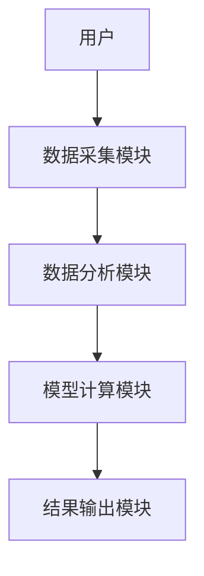

                 


# 巴菲特的股息增长策略更新：在低息环境中的收益来源

## 关键词：巴菲特, 股息增长策略, 低息环境, 股票投资, 股息收益率

## 摘要：  
本文详细探讨了巴菲特的股息增长策略在当前低息环境下的应用与收益来源。通过对股息增长策略的核心概念、算法原理、数学模型、系统架构以及实际案例的分析，本文为投资者提供了在低息环境下如何利用股息增长策略实现稳定收益的深度解析。文章还结合了实际的项目实战和最佳实践，帮助读者更好地理解和应用这一策略。

---

## 第一部分：背景介绍

### 第1章：股息增长策略的起源与发展

#### 1.1 股息增长策略的定义与背景
- **股息增长策略的定义**：股息增长策略是指投资于那些能够持续提高股息支付的公司，通过长期持有这些股票，获得稳定的股息收入和资本增值。
- **股息增长策略的背景**：在低息环境下，传统债券收益率下降，投资者需要寻找新的收益来源，而股息增长策略因其稳定性和增长性，成为一种重要的投资策略。
- **低息环境下的投资机会**：低息环境降低了固定收益产品的吸引力，使得股息增长股票成为投资者的首选。

#### 1.2 巴菲特投资理念的核心要素
- **巴菲特的价值投资哲学**：巴菲特强调长期投资、价值投资和股息的重要性。
- **股息在巴菲特投资组合中的重要性**：巴菲特认为股息是衡量公司稳健性的重要指标，也是投资回报的重要来源。
- **股息增长策略的长期收益分析**：通过持有股息增长股票，巴菲特实现了长期稳定的收益。

#### 1.3 当前低息环境下的投资挑战
- **低息环境对传统投资策略的影响**：传统债券收益率下降，投资者转向股票等风险资产。
- **股息增长策略的优势与劣势**：优势在于稳定的股息收入和资本增值，劣势在于市场波动和公司股息政策的变化。
- **低息环境下股息增长策略的适用性**：在低息环境下，股息增长策略更具吸引力，但需要谨慎选择公司。

---

## 第二部分：核心概念与联系

### 第2章：股息增长策略的核心概念

#### 2.1 股息增长策略的核心要素
- **股息增长的定义**：股息增长是指公司逐年增加股息支付的能力。
- **股息增长策略的实施条件**：公司必须具备稳定的盈利能力和持续的股息增长能力。
- **股息增长策略的实施步骤**：选择股息增长能力强的公司，长期持有，定期再投资。

#### 2.2 股息增长策略与股息收益率的对比
| **属性**      | **股息增长策略**                | **股息收益率**                |
|----------------|-------------------------------|-------------------------------|
| 定义            | 投资于股息逐年增长的公司        | 投资于股息收益率较高的公司    |
| 重点            | 股息增长的持续性                | 当前股息收益率                |
| 适用场景        | 长期稳定增长的公司              | 短期高收益                   |
| 风险            | 市场波动风险                   | 利率上升风险                 |

#### 2.3 股息增长策略的优劣势分析
- **优势**：
  - 稳定的股息收入。
  - 长期资本增值潜力。
  - 抗跌性强。
- **劣势**：
  - 市场波动可能导致短期亏损。
  - 需要选择优质公司，筛选难度大。

---

## 第三部分：算法原理

### 第3章：股息增长策略的评估与实现

#### 3.1 股息增长模型的算法原理
- **Gordon Growth Model**：$$ P = \frac{D_1}{r - g} $$
  - 其中，P为股票价格，D1为下一年度的股息，r为折现率，g为股息增长率。
- **股息增长模型的步骤**：
  1. 确定公司的股息增长率g。
  2. 估计下一年度的股息D1。
  3. 选择合适的折现率r。
  4. 计算股票的内在价值P。

#### 3.2 股息增长策略的评估方法
- **股息增长能力评估**：
  - 股息支付率（DPR）：$$ DPR = \frac{\text{股息}}{\text{净利润}} $$
  - 股息增长率（DGR）：$$ DGR = \frac{\text{当年股息} - \text{上年股息}}{\text{上年股息}} $$

#### 3.3 股息增长策略的实现步骤
1. **筛选股息增长能力强的公司**：
   - 股息支付率稳定且合理（20%-60%）。
   - 股息增长率高于通胀率。
2. **计算股息增长率**：使用DGR公式评估公司的股息增长潜力。
3. **评估公司的财务状况**：通过ROE、ROA等指标评估公司的盈利能力。
4. **构建投资组合**：分散投资于不同行业的股息增长股票。

---

## 第四部分：数学模型

### 第4章：股息增长策略的数学模型

#### 4.1 股息增长模型的数学表达
- **Gordon Growth Model**：
  $$ P = \frac{D_1}{r - g} $$
- **股息增长模型的应用**：
  以可口可乐为例，假设D1=2，r=8%，g=4%，则：
  $$ P = \frac{2}{0.08 - 0.04} = 50 $$

#### 4.2 股息增长策略的数学优化
- **最优股息增长率**：
  $$ g = r - \frac{\text{股息收益率}}{\text{再投资收益率}} $$

---

## 第五部分：系统分析

### 第5章：股息增长策略的系统架构

#### 5.1 系统功能设计
- **领域模型**：
  - 用户输入：股息增长率、股息收益率、折现率。
  - 系统输出：股票内在价值、投资建议。
- **系统架构**：
  1. 数据采集：获取公司财务数据。
  2. 数据分析：计算股息增长率、股息收益率。
  3. 模型计算：使用Gordon Growth Model计算股票价值。
  4. 结果输出：生成投资建议。

#### 5.2 系统架构图


---

## 第六部分：项目实战

### 第6章：股息增长策略的实战应用

#### 6.1 环境安装
- Python 3.8及以上版本。
- 安装相关库：pandas、numpy、scipy。

#### 6.2 核心代码实现
```python
import numpy as np

def calculate_dividend_growth(dividends):
    growth_rates = []
    for i in range(1, len(dividends)):
        growth_rate = ((dividends[i] - dividends[i-1]) / dividends[i-1]) * 100
        growth_rates.append(growth_rate)
    return np.mean(growth_rates)

# 示例数据
dividends = [1, 1.05, 1.10, 1.15, 1.20]
growth_rate = calculate_dividend_growth(dividends)
print(f"股息增长率：{growth_rate}%")
```

#### 6.3 实际案例分析
- 以可口可乐为例，计算其股息增长率：
  - 近五年的股息分别为：1.0、1.04、1.08、1.12、1.16。
  - 股息增长率 = (1.16 - 1.12) / 1.12 = 3.57%。

#### 6.4 项目小结
- 通过代码实现股息增长率的计算，帮助投资者筛选股息增长能力强的公司。

---

## 第七部分：最佳实践

### 第7章：股息增长策略的最佳实践

#### 7.1 投资策略的总结
- **选择优质公司**：关注ROE、ROA等指标，确保公司具备盈利能力。
- **分散投资**：避免过度集中，降低风险。
- **长期持有**：股息增长策略需要时间积累，耐心持有。

#### 7.2 小结与注意事项
- **小结**：股息增长策略在低息环境下具有显著优势，但需要谨慎选择公司和合理分散投资。
- **注意事项**：
  - 避免短期波动影响决策。
  - 定期评估投资组合，调整持仓。
  - 保持对市场的关注，及时应对变化。

#### 7.3 拓展阅读
- 建议阅读巴菲特的《 Intelligent Investor 》和相关投资策略书籍。

---

## 作者：AI天才研究院/AI Genius Institute & 禅与计算机程序设计艺术 /Zen And The Art of Computer Programming

