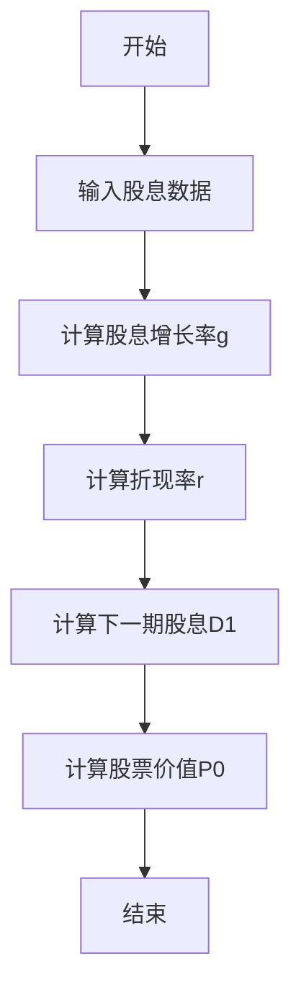
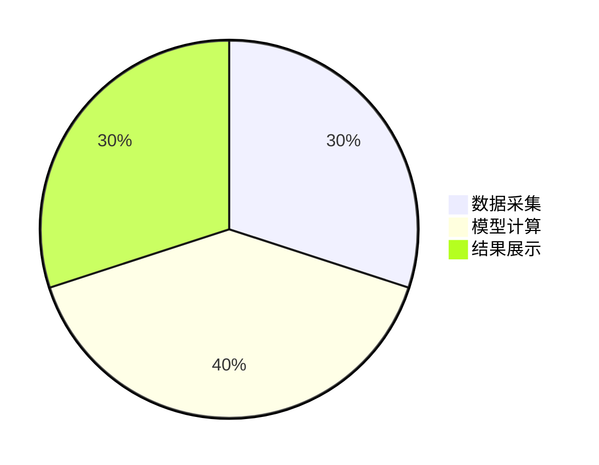
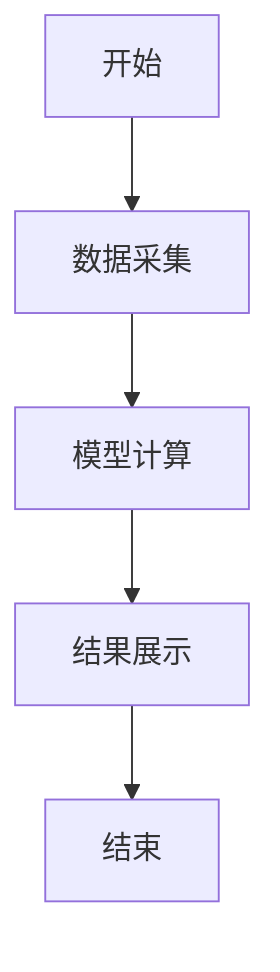

                 


# 巴菲特的股息增长策略：稳定现金流的长期价值

## 关键词：
巴菲特, 股息增长策略, 稳定现金流, 股票投资, 股息支付率, 股息增长模型

## 摘要：
本文系统地探讨了巴菲特的股息增长策略，分析了其背后的数学模型和算法，结合实际案例展示了如何通过股息增长策略实现稳定现金流的长期价值。文章从股息增长策略的背景、核心概念、数学模型、系统分析、项目实战到最佳实践，层层深入，为投资者提供了全面的指导。

---

## 第二章: 股息增长策略的数学模型与算法

### 2.1 股息增长模型的数学推导

#### 2.1.1 戈登股息增长模型
戈登股息增长模型（Gordon Growth Model）是股息增长策略的核心工具之一。该模型假设股息以恒定速率增长，适用于股息持续增长且增长率稳定的股票。

公式为：
$$
P_0 = \frac{D_1}{r - g}
$$

其中：
- \( P_0 \)：股票的内在价值
- \( D_1 \)：下一期预期股息
- \( r \)：折现率
- \( g \)：股息增长率

#### 2.1.2 股息增长模型的公式
除了戈登模型，还有其他股息增长模型，如三阶段股息增长模型，适用于股息增长率变化的股票。

#### 2.1.3 模型的假设条件
- 股息增长率恒定
- 股票的折现率大于股息增长率
- 企业永续经营

### 2.2 股息增长模型的算法实现

#### 2.2.1 算法流程图



#### 2.2.2 算法的Python实现

```python
def gordon_growth_model(dividends, growth_rate, discount_rate):
    """
    计算股票的内在价值，使用戈登股息增长模型。
    参数:
        dividends: 当前股息
        growth_rate: 股息增长率，%
        discount_rate: 折现率，%
    返回:
        股票的内在价值
    """
    g = growth_rate / 100
    r = discount_rate / 100
    D1 = dividends * (1 + g)
    P0 = D1 / (r - g)
    return P0

# 示例计算
dividends = 2.0  # 当前股息
growth_rate = 5   # 股息增长率%
discount_rate = 10  # 折现率%
value = gordon_growth_model(dividends, growth_rate, discount_rate)
print(f"股票的内在价值为：{value:.2f}")
```

#### 2.2.3 算法的优缺点分析
- **优点**：简单易懂，计算速度快。
- **缺点**：假设股息增长率恒定，可能不适用于实际市场中的复杂情况。

---

## 第三章: 股息增长策略的系统分析

### 3.1 系统分析与架构设计

#### 3.1.1 系统功能需求
- 数据采集：收集股息数据
- 模型计算：应用股息增长模型
- 结果展示：可视化股票价值

#### 3.1.2 系统架构图



#### 3.1.3 系统接口设计
- 输入接口：股息数据、增长率、折现率
- 输出接口：股票价值

### 3.2 系统实现与测试

#### 3.2.1 系统实现流程



#### 3.2.2 系统测试方法
- 单元测试：测试每个模块的功能
- 集成测试：测试系统整体流程
- 性能测试：测试系统在大数据情况下的表现

---

## 第四章: 股息增长策略的项目实战

### 4.1 项目环境搭建

#### 4.1.1 系统环境要求
- Python 3.8+
- Jupyter Notebook
- pandas、numpy库

#### 4.1.2 工具安装与配置
```bash
pip install pandas numpy
```

#### 4.1.3 数据来源与获取
使用Yahoo Finance API获取历史股息数据。

### 4.2 核心功能实现

#### 4.2.1 股息增长股筛选

```python
import pandas as pd
import numpy as np

def screen_dividend_stocks(data, min_dividend, growth_rate):
    """
    筛选符合条件的股息增长股。
    参数:
        data: 数据框，包含股息数据
        min_dividend: 最小股息
        growth_rate: 最小股息增长率
    返回:
        符合条件的股票列表
    """
    filtered = data[(data['股息'] > min_dividend) & 
                   (data['股息增长率'] > growth_rate)]
    return filtered.index.tolist()

# 示例数据
data = pd.DataFrame({
    '股息': [2.0, 3.0, 1.5, 4.0],
    '股息增长率': [5%, 6%, 4%, 7%]
})

selected_stocks = screen_dividend_stocks(data, 2.0, 5)
print(f"符合条件的股票：{selected_stocks}")
```

---

## 第五章: 股息增长策略的最佳实践

### 5.1 投资策略与风险管理

#### 5.1.1 投资组合的构建
- 分散投资：避免集中于单一股票或行业
- 定期再平衡：根据市场变化调整投资组合

#### 5.1.2 风险管理的策略
- 设置止损点：当股价下跌超过一定比例时卖出
- 监控股息变化：及时发现股息减少的情况

#### 5.1.3 短期与长期投资的平衡
- 短期：关注股息收入
- 长期：关注股息增长潜力

### 5.2 投资者的注意事项

#### 5.2.1 选择股息增长股的误区
- 过度关注当前股息率，忽视股息增长潜力
- 忽略公司的基本面，只看股息数据

#### 5.2.2 市场波动的应对策略
- 长期持有：避免短期波动影响
- 分批买入：分散投资成本

#### 5.2.3 长期价值投资的纪律性
- 遵循投资策略，不被短期市场情绪左右
- 定期审视投资组合，及时调整

---

## 第六章: 股息增长策略的拓展与应用

### 6.1 股息增长策略的行业分析

#### 6.1.1 高股息行业的特点
- 公用事业、房地产信托基金（REITs）、金融行业等通常股息较高

#### 6.1.2 不同行业的股息增长潜力
- 高增长行业：科技、医疗等行业的股息增长潜力较大
- 稳定行业：公用事业、消费品行业的股息增长较为稳定

#### 6.1.3 行业周期对股息增长的影响
- 在经济衰退期，部分行业可能减少股息支付
- 在经济复苏期，企业可能增加股息支付

---

## 结论

巴菲特的股息增长策略是一种长期有效的投资方法，通过选择股息持续增长的优质公司，投资者可以实现稳定的现金流和长期的财富增长。本文通过数学模型、算法实现、系统分析和项目实战，全面展示了如何在实际投资中应用这一策略。同时，最佳实践部分提供了实用的建议，帮助投资者规避风险，提高投资效率。

---

## 作者：AI天才研究院 & 禅与计算机程序设计艺术

