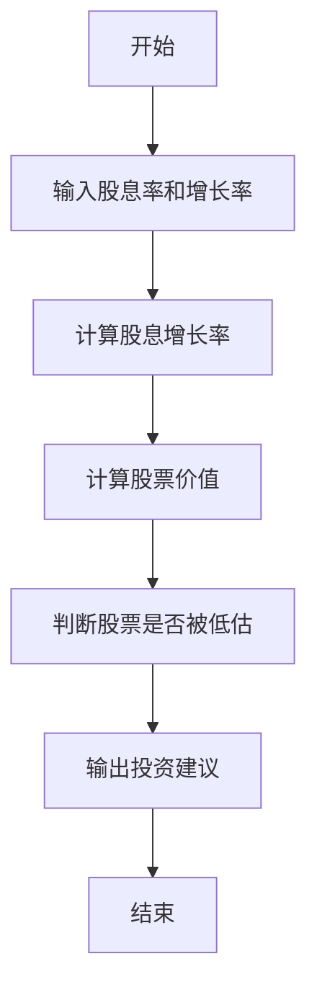
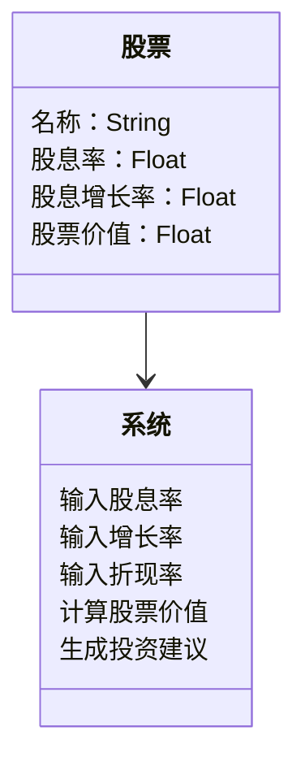
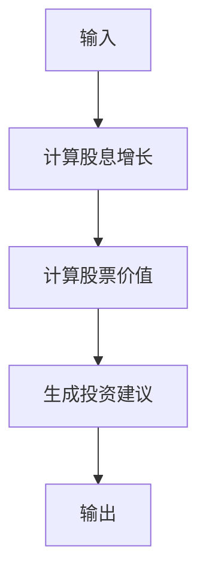
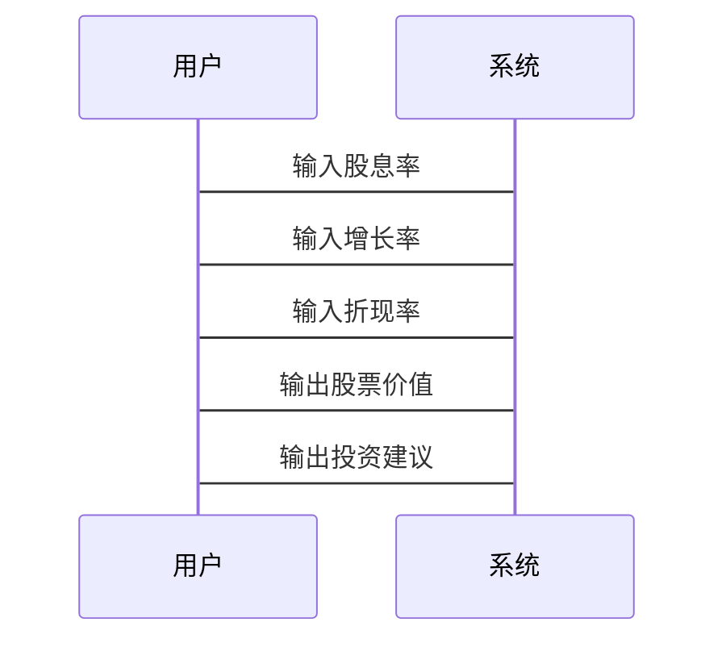

                 


# 巴菲特的股息增长策略：通缩经济下的收益来源

> 关键词：巴菲特, 股息增长策略, 通缩经济, 股票投资, 股息率, 股票价值, 股息增长模型

> 摘要：本文深入分析巴菲特的股息增长策略，探讨其在通缩经济环境下的应用价值。通过数学模型、算法原理、系统架构和项目实战等多维度的分析，揭示股息增长策略的核心逻辑，为投资者提供科学的投资决策支持。文章内容涵盖股息增长策略的背景介绍、数学模型、系统架构设计、项目实战案例分析以及最佳实践建议。

---

# 第一部分: 巴菲特的股息增长策略概述

## 第1章: 巴菲特投资理念与股息增长策略

### 1.1 巴菲特投资理念概述

#### 1.1.1 巴菲特的生平与投资哲学
沃伦·巴菲特（Warren Buffett）作为全球最著名的投资者之一，其投资哲学以“价值投资”为核心。他强调长期投资、安全边际和企业基本面分析。巴菲特的投资理念并非基于短期市场波动，而是着眼于企业的长期盈利能力。

#### 1.1.2 巴菲特的价值投资理念
巴菲特的价值投资理念可以概括为以下几点：
1. **安全边际**：买入价格低于内在价值的股票。
2. **企业基本面**：关注企业的盈利能力、财务状况和竞争优势。
3. **长期持有**：避免频繁交易，长期持有优质股票。

#### 1.1.3 巴菲特对股息投资的重视
巴菲特对股息投资的重视源于他对股东价值的追求。他认为，股息是企业盈利能力的体现，同时也是企业对股东的一种回馈。通过股息再投资，可以进一步放大投资收益。

### 1.2 股息增长策略的核心概念

#### 1.2.1 股息的定义与作用
股息是公司分配给股东的利润部分，通常以每股形式计算。股息的作用包括：
1. **股东收益**：股息是股东的一种收益来源。
2. **企业价值信号**：高股息率的股票通常被视为企业盈利能力强、财务稳定的信号。

#### 1.2.2 股息增长策略的内涵
股息增长策略是指通过投资于股息率高且持续增长的股票，实现长期稳定的收益。其核心在于选择那些能够持续提高股息的公司。

#### 1.2.3 股息增长策略的边界与外延
股息增长策略的边界在于企业的盈利能力、财务状况和行业环境。外延则包括通过股息再投资实现资产增值。

### 1.3 股息增长策略的核心要素

#### 1.3.1 股息率的计算与分析
股息率的计算公式为：
$$股息率 = \frac{每股股息}{股票价格}$$

#### 1.3.2 股息增长的可持续性评估
股息增长的可持续性取决于企业的盈利能力、现金流和债务水平。

#### 1.3.3 股息增长策略的数学模型
股息增长模型用于评估股票的内在价值，公式为：
$$P = \frac{D_1}{r - g}$$
其中，$P$ 为股票价格，$D_1$ 为下一年度股息，$r$ 为折现率，$g$ 为股息增长率。

---

## 第2章: 股息增长策略的数学模型与算法原理

### 2.1 股息增长模型的原理
股息增长模型通过预测未来股息的增长，计算股票的内在价值。

#### 2.1.1 股息增长模型的定义
股息增长模型假设股息将以固定速度增长，适用于股息稳定增长的公司。

#### 2.1.2 股息增长模型的数学公式
股息增长模型公式：
$$P = \frac{D_1}{r - g}$$

#### 2.1.3 股息增长模型的假设条件
1. 股息增长率 $g$ 保持不变。
2. 折现率 $r$ 保持不变。

### 2.2 股息增长模型的算法流程


### 2.3 股息增长模型的实现代码
```python
def calculate_stock_value(dividend_yield, growth_rate, discount_rate):
    # 计算下一年度股息
    D1 = dividend_yield * (1 + growth_rate)
    # 计算股票价值
    P = D1 / (discount_rate - growth_rate)
    return P

# 示例计算
dividend_yield = 0.05  # 股息率
growth_rate = 0.03     # 股息增长率
discount_rate = 0.08    # 折现率
stock_value = calculate_stock_value(dividend_yield, growth_rate, discount_rate)
print(f"股票价值：{stock_value}")
```

---

## 第3章: 通缩经济下的股息增长策略

### 3.1 通缩经济的特点与影响
通缩经济的特点包括价格水平下降、货币购买力上升和企业盈利能力下降。

#### 3.1.1 通缩经济的定义与表现
通缩经济是指整体价格水平持续下降的经济环境。

#### 3.1.2 通缩经济对股市的影响
通缩经济可能导致企业盈利下降，但低利率环境可能推动股息增长。

#### 3.1.3 通缩经济下股息增长的可持续性
在通缩经济下，企业可能通过减少股息支付率来维持现金流，但优质企业仍能保持股息增长。

### 3.2 通缩经济下股息增长策略的适用性
在通缩经济下，股息增长策略的优势在于其防御性和稳定性。

#### 3.2.1 股息增长策略的防御性
股息增长策略在通缩经济下具有较强的防御性，因为股息是企业盈利能力的体现。

#### 3.2.2 股息增长策略的稳定性
股息增长策略的投资收益相对稳定，适合通缩经济环境下的长期投资。

---

## 第4章: 系统分析与架构设计方案

### 4.1 问题场景介绍
在通缩经济环境下，投资者需要选择能够持续增长股息的股票。

### 4.2 系统功能设计
系统功能包括股息增长模型计算、股票筛选和投资建议生成。

#### 4.2.1 领域模型设计


#### 4.2.2 系统架构设计


### 4.3 系统接口设计
系统接口包括输入接口和输出接口。

### 4.4 系统交互设计


---

## 第5章: 项目实战

### 5.1 环境安装
需要安装Python和相关开发工具。

### 5.2 核心代码实现
```python
def calculate_stock_value(dividend_yield, growth_rate, discount_rate):
    D1 = dividend_yield * (1 + growth_rate)
    P = D1 / (discount_rate - growth_rate)
    return P

# 示例计算
dividend_yield = 0.05
growth_rate = 0.03
discount_rate = 0.08
stock_value = calculate_stock_value(dividend_yield, growth_rate, discount_rate)
print(f"股票价值：{stock_value}")
```

### 5.3 案例分析
以苹果公司为例，计算其股票价值。

### 5.4 项目小结
股息增长策略在通缩经济下的应用具有实际操作价值。

---

## 第6章: 总结与展望

### 6.1 总结
巴菲特的股息增长策略在通缩经济下具有防御性和稳定性，适合长期投资。

### 6.2 展望
未来，股息增长策略可以通过大数据和人工智能技术进一步优化。

---

# 结语
通过本文的分析，读者可以深入理解巴菲特的股息增长策略在通缩经济下的应用，并掌握相关的数学模型和系统设计方法。

---

# 作者
作者：AI天才研究院 & 禅与计算机程序设计艺术

