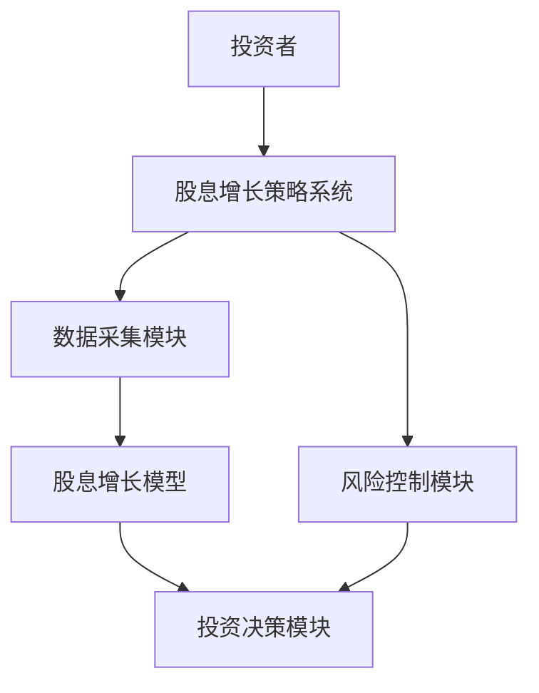
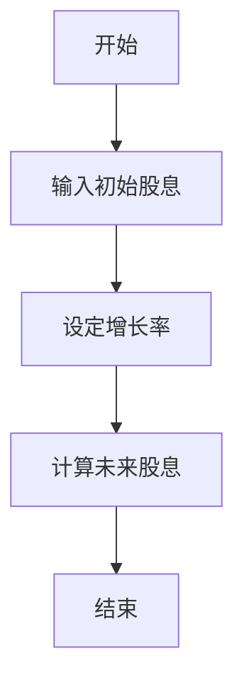

                 


```markdown
# 巴菲特的股息增长策略：通货膨胀时代的收益来源

> 关键词：巴菲特，股息增长策略，通货膨胀，收益来源，投资策略，股息增长模型

> 摘要：本文深入分析了巴菲特的股息增长策略，探讨其在通货膨胀时代的收益来源，从理论到实证，结合数学模型和经典案例，揭示股息增长策略的投资逻辑与优势。

---

# 第一部分：股息增长策略概述

## 第1章：巴菲特的投资哲学与股息增长策略

### 1.1 巴菲特的投资理念
- 巴菲特的长期主义投资观
- 股息增长策略的核心思想：选择优质企业，长期持有

### 1.2 股息增长策略的定义
- 股息增长策略的内涵
- 股息增长与股息收益率的区别
- 股息增长策略的适用场景

### 1.3 股息增长策略的优势
- 稳定的现金流来源
- 抗通胀能力
- 长期复利效应

---

## 第2章：股息增长策略的内在逻辑

### 2.1 股息增长模型
- 股息增长模型的数学公式：
  $$ D_{n} = D_{0} \times (1 + g)^n $$
- 其中，$D_{n}$ 是第 n 年的股息，$D_{0}$ 是初始股息，$g$ 是股息增长率，$n$ 是时间长度。

### 2.2 股息增长模型的假设条件
- 股息增长率 $g$ 保持不变
- 股息支付率稳定
- 投资者要求的回报率不变

### 2.3 股息增长模型的适用性
- 适用于股息稳定增长的企业
- 适用于长期投资策略

### 2.4 股息增长模型的优缺点
- 优点：简单易懂，便于计算
- 缺点：假设条件过于理想化，实际中可能存在波动

---

## 第3章：股息增长策略的实证分析

### 3.1 巴菲特的经典投资案例
- 可口可乐：长期稳定的股息增长
- 吉列公司：持续的股息增长与企业盈利

### 3.2 实证分析方法
- 数据来源：选取巴菲特持仓中的股息增长型股票
- 分析指标：股息增长率、股息支付率、市盈率等

### 3.3 分析结果
- 股息增长策略的有效性
- 股息增长策略在通货膨胀中的表现

---

## 第4章：通货膨胀对股息增长的影响

### 4.1 通货膨胀的定义与影响
- 通货膨胀对企业盈利的影响
- 通货膨胀对股息支付能力的影响

### 4.2 股息增长策略的抗通胀机制
- 股息增长的复利效应
- 优质企业的盈利稳定性

### 4.3 股息增长策略在通胀环境下的优势
- 稳定的现金流来源
- 抗通胀的资产配置
- 长期的复利增长

---

## 第5章：股息增长策略的系统分析

### 5.1 系统架构设计


### 5.2 数据采集模块
- 数据来源：历史股息数据、财务报表、宏观经济指标
- 数据处理：清洗、整理、分析

### 5.3 股息增长模型
- 输入：初始股息、股息增长率、时间长度
- 输出：未来股息预测
- 算法流程图：


### 5.4 投资决策模块
- 策略选择：股息增长型股票筛选
- 风险评估：波动率、行业风险、公司基本面
- 决策输出：投资组合建议

### 5.5 风险控制模块
- 风险识别：市场风险、流动性风险、企业经营风险
- 风险应对：分散投资、定期再平衡、止损机制

---

## 第6章：股息增长策略的实战指导

### 6.1 投资组合构建
- 确定投资目标：收益目标、风险承受能力
- 选择股息增长型股票：筛选标准、权重分配
- 定期调整：再平衡、风险控制

### 6.2 工具使用
- 数据分析工具：Excel、Python（Pandas、NumPy）
- 股票筛选工具：金融数据分析平台（如Yahoo Finance、Morningstar）

### 6.3 投资策略实施
- 分散投资：避免过度集中
- 定期再平衡：保持投资组合的稳定性
- 动态调整：根据市场变化调整策略

### 6.4 实战案例
- 案例分析：构建一个股息增长型投资组合
- 步骤解析：数据采集、筛选、建模、决策

---

## 第7章：总结与建议

### 7.1 总结
- 股息增长策略的有效性
- 通货膨胀时代的优势
- 系统化投资的重要性

### 7.2 投资建议
- 长期投资：耐心持有优质企业
- 分散投资：降低风险
- 定期调整：保持投资组合的健康

### 7.3 风险管理
- 设置止损点
- 定期评估投资组合
- 关注宏观经济环境

### 7.4 长期视角
- 理解股息增长策略的复利效应
- 坚持长期主义
- 持续学习与调整

---

# 作者

作者：AI天才研究院 & 禅与计算机程序设计艺术

---

# 结语

巴菲特的股息增长策略在通货膨胀时代展现出了强大的收益能力。通过系统的分析与实践，投资者可以更好地理解和运用这一策略，实现稳健的投资回报。
```

