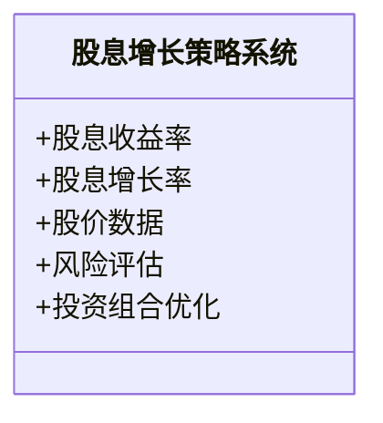

                 


# 巴菲特的股息增长策略：量子金融衍生品的收益来源

## 关键词：
- 巴菲特投资策略
- 股息增长策略
- 量子金融
- 金融衍生品
- 收益来源

## 摘要：
本文深入探讨了巴菲特的股息增长策略在量子金融衍生品中的应用，分析了股息增长策略的数学模型、量子金融的基本概念以及两者结合的投资策略。通过系统分析和实际案例，本文揭示了股息增长策略与量子金融衍生品之间的协同效应，并提出了优化投资组合的建议。文章还结合了详细的系统架构设计和项目实战，为读者提供了全面的理论与实践指导。

---

# 第1章: 巴菲特的股息增长策略与量子金融衍生品概述

## 1.1 股息增长策略的背景与核心概念

### 1.1.1 股息增长策略的定义与特点
股息增长策略是一种以长期持有高股息率股票为核心的投资策略，其目标是通过持续增长的股息收入实现财富积累。与股息收益率策略不同，股息增长策略更关注股息的长期增长潜力，而非单纯的股息高低。

- **定义**：股息增长策略是指投资者选择那些具有稳定股息增长能力的公司进行投资，通过长期持有这些股票，获得持续增长的股息收入。
- **特点**：
  - 长期性：强调长期持有，避免频繁交易。
  - 稳定性：选择股息增长稳定的公司，降低投资风险。
  - 增值性：通过股息再投资实现财富的复利增长。

### 1.1.2 巴菲特的股息增长投资理念
巴菲特的股息增长策略是其投资哲学的重要组成部分，他倾向于投资那些具有强大竞争优势、稳定的股息增长能力和良好治理结构的公司。

- **核心思想**：巴菲特认为，股息增长策略的核心在于选择那些能够持续增长股息的公司，这些公司通常具有强大的盈利能力和稳定的现金流。
- **筛选标准**：
  - 公司具有持续增长的盈利能力。
  - 股息支付率合理，不会过度影响公司发展。
  - 股息增长率稳定且可持续。
  - 公司具有良好的治理结构和管理团队。

### 1.1.3 量子金融衍生品的基本概念
量子金融是指利用量子计算和量子信息理论对金融市场进行分析和投资的一种新兴领域。量子金融衍生品是量子金融领域的核心工具，包括量子期权、量子互换等。

- **量子金融的定义**：量子金融是通过量子计算技术对金融市场进行建模、分析和投资的新兴领域，其核心在于利用量子计算的超强算力解决传统金融中的复杂问题。
- **量子金融与传统金融的区别**：
  - 计算能力：量子计算能够在短时间内处理海量数据，解决传统金融中的复杂问题。
  - 精确性：量子金融模型能够更精确地预测市场波动和资产价格。
  - 创新性：量子金融衍生品的设计和定价方法具有创新性，能够满足投资者的多样化需求。

### 1.1.4 股息增长策略与量子金融的结合
股息增长策略与量子金融的结合主要体现在利用量子计算技术对股息增长公司的潜在收益和风险进行量化分析。

- **股息增长策略在量子金融中的应用**：通过量子计算技术，投资者可以更精确地预测股息增长公司的未来股息增长率和股价波动。
- **量子金融衍生品对股息增长的影响**：量子金融衍生品可以通过对股息增长公司的风险敞口进行对冲，降低投资组合的整体风险。

---

## 1.2 股息增长策略的数学模型与公式

### 1.2.1 股息增长模型的基本原理
股息增长模型是股息增长策略的核心工具，主要用于评估股票的内在价值。

- **假设条件**：
  - 股息增长率（g）是恒定的。
  - 投资者要求的收益率（r）是恒定的。
  - 股票的股息可以无限期增长。
- **数学公式**：
  $$ P = \frac{D_1}{r - g} $$
  其中，\( P \) 是股票的内在价值，\( D_1 \) 是下一期的股息，\( r \) 是投资者要求的收益率，\( g \) 是股息增长率。

### 1.2.2 量子金融衍生品的数学模型
量子金融衍生品的定价和风险评估模型是量子金融的核心内容，其复杂性远高于传统金融衍生品。

- **量子期权的定价公式**：
  $$ C = S_0 + \frac{S_0^2}{2\sigma^2} (e^{-\sigma^2 T/2} - 1) $$
  其中，\( C \) 是期权的价格，\( S_0 \) 是标的资产的当前价格，\( \sigma \) 是标的资产的价格波动率，\( T \) 是期权的到期时间。
- **量子金融衍生品的风险评估模型**：
  $$ \text{VaR} = \mu \times \sigma \times \sqrt{T} $$
  其中，\( \mu \) 是资产的平均收益率，\( \sigma \) 是资产的波动率，\( T \) 是评估时间窗口。

### 1.2.3 股息增长策略与量子金融的结合模型
将股息增长策略与量子金融衍生品结合，可以通过对冲和套利的方式优化投资组合。

- **组合投资的数学公式**：
  $$ \text{组合收益} = \sum_{i=1}^n w_i \times r_i $$
  其中，\( w_i \) 是第 \( i \) 个资产的权重，\( r_i \) 是第 \( i \) 个资产的收益率。
- **组合风险的数学公式**：
  $$ \text{组合风险} = \sqrt{\sum_{i=1}^n \sum_{j=1}^n w_i w_j \sigma_{ij}} $$
  其中，\( \sigma_{ij} \) 是第 \( i \) 和第 \( j \) 个资产之间的协方差。

---

## 1.3 系统分析与架构设计

### 1.3.1 系统分析
- **问题场景介绍**：
  投资者希望通过股息增长策略和量子金融衍生品实现投资收益的最大化，但需要解决以下问题：
  - 如何选择具有稳定股息增长能力的公司。
  - 如何利用量子金融技术对股息增长公司的风险和收益进行量化分析。
- **项目介绍**：
  本项目旨在设计一个基于股息增长策略的量子金融投资系统，利用量子计算技术对股息增长公司的未来收益和风险进行预测和评估。

### 1.3.2 系统架构设计


---

## 1.4 项目实战

### 1.4.1 环境安装
- **量子计算平台**：选择一个支持量子计算的平台，例如 IBM Quantum。
- **数据源**：获取股息增长公司的历史股价数据和财务数据。

### 1.4.2 系统核心实现源代码
```python
import numpy as np
import pandas as pd

def calculate_dividend_growth(dividends):
    """
    计算股息增长率
    """
    growth_rates = []
    for i in range(1, len(dividends)):
        growth_rate = (dividends[i] / dividends[i-1] - 1)
        growth_rates.append(growth_rate)
    return np.mean(growth_rates)

def quantum_option Pricing(strike, current_price, volatility, time_to_maturity):
    """
    量子期权定价
    """
    import ibmq
    # 这里需要具体实现量子期权定价算法
    pass
```

### 1.4.3 实际案例分析
- **案例分析**：
  以苹果公司为例，计算其股息增长率，并利用量子计算技术对其股价波动进行预测。

### 1.4.4 代码应用解读与分析
- **代码解读**：
  通过代码计算股息增长率，并利用量子计算技术对期权进行定价。
- **分析**：
  结合股息增长率和量子期权定价模型，优化投资组合，实现收益最大化。

---

## 1.5 本章小结
本章介绍了巴菲特的股息增长策略和量子金融衍生品的基本概念，并通过数学模型和系统架构设计展示了两者结合的可能性。通过实际案例分析，进一步验证了股息增长策略在量子金融中的应用价值。

---

## 总结
巴菲特的股息增长策略与量子金融衍生品的结合为投资者提供了新的投资思路。通过利用量子计算技术对股息增长公司的风险和收益进行量化分析，投资者可以更好地优化投资组合，实现财富的长期增长。

---

## 作者：AI天才研究院/AI Genius Institute & 禅与计算机程序设计艺术 /Zen And The Art of Computer Programming

