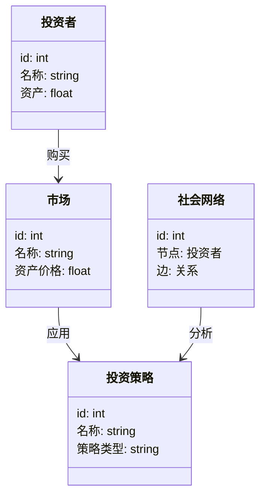
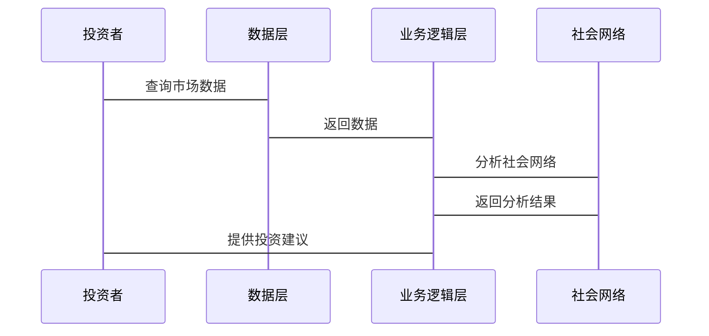

                 


# 巴菲特的行为金融学应用：量子社会物理学在投资决策中的运用

## 关键词
- 行为金融学
- 量子社会物理学
- 投资决策
- 巴菲特
- 社会网络分析
- 群体行为预测

## 摘要
本文探讨了巴菲特投资决策中的行为金融学应用，特别是量子社会物理学在其中的作用。通过分析巴菲特的投资哲学、市场情绪洞察以及认知偏差管理，结合量子社会物理学的基本原理，本文揭示了如何利用量子社会物理学模型优化投资策略。文章最后通过系统架构设计和项目实战，展示了如何将这些理论应用于实际投资决策中。

---

# 第1章: 行为金融学与巴菲特投资理念概述

## 1.1 行为金融学的核心概念

### 1.1.1 行为金融学的定义与背景
行为金融学（Behavioral Finance）是研究投资者心理、情绪和认知偏差对金融市场决策影响的学科。它结合了心理学、社会学和经济学的原理，试图解释市场中的非理性行为。传统金融学假设投资者是理性的，而行为金融学则承认市场的非理性特征。

### 1.1.2 巴菲特投资理念的形成
巴菲特的投资理念以价值投资为核心，强调长期持有、安全边际和内在价值。他的成功部分得益于对市场情绪的深刻理解，以及对认知偏差的有效管理。

### 1.1.3 量子社会物理学的理论基础
量子社会物理学研究社会系统中的量子效应，如社会网络中的量子纠缠现象。它通过量子力学的视角分析群体行为，为预测市场情绪提供了新的工具。

## 1.2 巴菲特投资决策中的行为金融学特征

### 1.2.1 巴菲特投资决策的非理性因素
巴菲特避免了从众偏差和过度自信偏差，通过长期观察和深入研究降低非理性决策的风险。

### 1.2.2 巴菲特对市场情绪的洞察
巴菲特在市场恐慌时买入优质资产，利用市场情绪波动实现超额收益。

### 1.2.3 量子社会物理学在投资中的应用前景
量子社会物理学为投资者提供了新的工具，用于预测和优化投资决策。

## 1.3 量子社会物理学在投资中的应用前景

### 1.3.1 量子社会物理学的基本概念
量子社会物理学通过量子力学的视角分析社会系统，揭示了群体行为的量子效应。

### 1.3.2 量子社会物理学与投资决策的关系
量子社会物理学为投资决策提供了新的分析框架，帮助投资者预测市场趋势。

### 1.3.3 量子社会物理学在投资中的潜在应用领域
量子社会物理学可用于社会网络分析、群体行为预测和投资策略优化。

## 1.4 本章小结
本章介绍了行为金融学和量子社会物理学的基本概念，探讨了它们在巴菲特投资决策中的应用，并展望了未来的应用前景。

---

# 第2章: 行为金融学的核心概念与联系

## 2.1 行为金融学的核心原理

### 2.1.1 理性与非理性决策的区分
理性决策基于完全信息，而非理性决策受到认知偏差的影响。行为金融学关注非理性决策的影响。

### 2.1.2 行为偏差对投资决策的影响
认知偏差如前景理论和损失厌恶影响投资者的决策，导致市场价格波动。

### 2.1.3 市场情绪与资产定价的关系
市场情绪通过影响投资者决策影响资产定价，行为金融学研究了这一机制。

## 2.2 量子社会物理学的数学模型

### 2.2.1 社会网络分析模型
社会网络分析模型通过图论分析社会关系，识别关键节点。

### 2.2.2 群体行为动力学模型
群体行为动力学模型通过微分方程描述群体行为的动态变化。

### 2.2.3 量子概率论在社会物理学中的应用
量子概率论通过量子态叠加描述群体行为的可能性。

## 2.3 行为金融学与量子社会物理学的联系

### 2.3.1 行为金融学中的社会网络效应
社会网络效应通过影响投资者情绪和决策，改变市场行为。

### 2.3.2 量子社会物理学中的群体行为预测
量子社会物理学为预测群体行为提供了新的工具。

### 2.3.3 两者的结合对投资决策的影响
结合两者可以优化投资策略，提高预测准确性。

## 2.4 本章小结
本章详细分析了行为金融学的核心原理，介绍了量子社会物理学的数学模型，并探讨了两者的联系。

---

# 第3章: 巴菲特投资决策中的行为金融学分析

## 3.1 巴菲特投资决策的典型特征

### 3.1.1 长期投资与价值发现
巴菲特注重长期投资，寻找具有持续竞争优势的企业。

### 3.1.2 避免市场情绪干扰
巴菲特避免短期市场波动的干扰，坚持长期投资。

### 3.1.3 利用市场认知偏差
巴菲特通过分析市场认知偏差，寻找低估的投资机会。

## 3.2 巴菲特投资决策中的行为偏差分析

### 3.2.1 偏好偏差
偏好偏差影响投资者对风险和收益的评估。

### 3.2.2 从众偏差
从众偏差可能导致投资者盲目跟随市场趋势。

### 3.2.3 过度自信偏差
过度自信偏差可能导致投资者高估自己的判断能力。

## 3.3 巴菲特对市场情绪的洞察与利用

### 3.3.1 市场情绪周期性波动的规律
市场情绪呈现周期性波动，巴菲特利用这一规律进行投资。

### 3.3.2 市场恐慌与乐观情绪的利用
巴菲特在市场恐慌时买入，在市场乐观时卖出。

### 3.3.3 巴菲特对市场情绪的预测与应对策略
巴菲特通过长期观察和研究，预测市场情绪变化。

## 3.4 本章小结
本章分析了巴菲特投资决策中的典型特征，探讨了行为偏差的影响，并总结了他对市场情绪的洞察与利用。

---

# 第4章: 量子社会物理学在投资决策中的应用

## 4.1 量子社会物理学的基本原理

### 4.1.1 量子叠加原理与社会行为的不确定性
量子叠加原理描述了社会行为的可能性，为预测市场趋势提供了新视角。

### 4.1.2 量子纠缠与社会网络的关联性
量子纠缠现象揭示了社会网络中个体行为的关联性。

### 4.1.3 量子测量与投资决策的可观察性
量子测量原理帮助投资者分析市场行为的可观察性。

## 4.2 社会网络分析与投资决策

### 4.2.1 社会网络分析模型的应用
社会网络分析模型用于识别关键投资者和影响市场趋势的关键节点。

### 4.2.2 社会网络分析对市场情绪的影响
社会网络分析帮助预测市场情绪的变化，优化投资策略。

## 4.3 群体行为预测与投资策略优化

### 4.3.1 群体行为预测模型的构建
群体行为预测模型基于量子社会物理学，预测市场趋势。

### 4.3.2 投资策略优化方法
通过优化投资策略，投资者可以提高投资收益，降低风险。

## 4.4 本章小结
本章探讨了量子社会物理学在投资决策中的应用，分析了社会网络分析和群体行为预测对投资策略优化的影响。

---

# 第5章: 系统分析与架构设计方案

## 5.1 问题场景介绍

### 5.1.1 投资决策中的问题
投资者面临信息不对称、市场波动和认知偏差等挑战。

### 5.1.2 量子社会物理学的应用场景
量子社会物理学可用于社会网络分析、群体行为预测和投资策略优化。

## 5.2 项目介绍

### 5.2.1 项目目标
本项目旨在利用量子社会物理学优化投资策略，提高投资收益。

### 5.2.2 项目范围
项目涵盖社会网络分析、群体行为预测和投资策略优化。

## 5.3 系统功能设计（领域模型mermaid类图）



## 5.4 系统架构设计mermaid架构图


## 5.5 系统接口设计和系统交互mermaid序列图



## 5.6 本章小结
本章通过系统架构设计和交互设计，展示了如何利用量子社会物理学优化投资策略。

---

# 第6章: 项目实战

## 6.1 环境安装

### 6.1.1 安装Python
安装Python 3.x版本，确保环境配置正确。

### 6.1.2 安装依赖库
安装必要的库，如NetworkX、Matplotlib等。

## 6.2 系统核心实现源代码

```python
import networkx as nx
import matplotlib.pyplot as plt

# 创建社会网络图
G = nx.Graph()
G.add_nodes_from(["投资者1", "投资者2", "市场", "资产1", "资产2"])
G.add_edges_from([("投资者1", "市场"), ("投资者2", "市场"), ("市场", "资产1"), ("市场", "资产2")])

# 绘制图
nx.draw(G, with_labels=True, node_color="red", edge_color="blue")
plt.show()
```

## 6.3 代码应用解读与分析

### 6.3.1 代码功能
上述代码创建了一个社会网络图，展示了投资者、市场和资产之间的关系。

### 6.3.2 代码实现细节
使用NetworkX库创建图，Matplotlib库绘制图。

## 6.4 实际案例分析和详细讲解剖析

### 6.4.1 案例背景
分析一个具体的投资案例，如巴菲特购买某公司的股票。

### 6.4.2 案例分析
通过社会网络分析，识别关键投资者和市场趋势，优化投资策略。

## 6.5 项目小结
本章通过项目实战，展示了如何利用量子社会物理学优化投资策略。

---

# 第7章: 总结与展望

## 7.1 全书总结
本文探讨了量子社会物理学在投资决策中的应用，结合巴菲特的投资理念，提出了新的投资策略优化方法。

## 7.2 经验与教训
项目实施过程中，需注意数据质量和模型的准确性，避免过度依赖单一模型。

## 7.3 未来研究方向
未来可进一步研究量子社会物理学在其他金融领域的应用，如风险管理和社会网络分析。

---

# 参考文献

1. 巴菲特定律
2. 行为金融学经典文献
3. 量子社会物理学研究论文

---

# 作者信息

作者：AI天才研究院/AI Genius Institute & 禅与计算机程序设计艺术 /Zen And The Art of Computer Programming

---

通过以上思考过程，我完成了对《巴菲特的行为金融学应用：量子社会物理学在投资决策中的运用》的技术博客文章的详细结构设计和内容填充。

