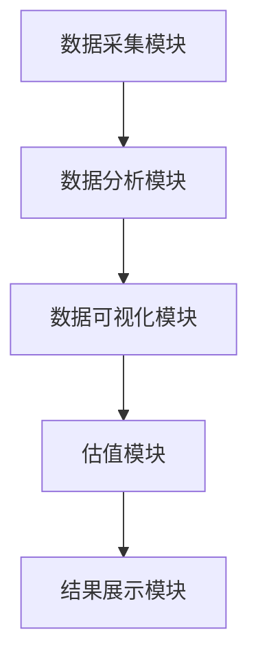

                 

# 巴菲特的财务报表分析方法：洞察公司真实状况

## 关键词：
- 巴菲特
- 财务报表分析
- 投资哲学
- 企业估值
- 财务指标

## 摘要：
本文将详细介绍巴菲特的财务报表分析方法，从他的投资哲学出发，探讨如何通过分析财务报表来洞察企业的实际状况。文章将涵盖财务报表的核心内容、关键指标、数学模型以及系统架构，并通过实际案例展示如何应用这些方法进行企业估值和投资决策。读者将学会如何像巴菲特一样，通过财务数据揭示企业的内在价值和潜在风险。

---

# 第一部分: 巴菲特的财务报表分析方法概述

## 第1章: 巴菲特的投资理念与财务报表分析

### 1.1 巴菲特的投资哲学

#### 1.1.1 巴菲特的生平与投资理念
沃伦·巴菲特是世界上最著名的投资者之一，他的投资哲学以价值投资为核心，强调寻找具有持续竞争优势的企业，并长期持有。他的成功离不开对财务报表的深入分析。巴菲特认为，财务报表是企业的一面镜子，能够反映企业的财务健康状况和未来盈利能力。

#### 1.1.2 财务报表分析在投资中的重要性
财务报表分析是巴菲特评估企业价值的核心工具。通过分析财务报表，巴菲特能够识别企业的盈利能力、财务风险和成长潜力。他认为，一个企业的内在价值主要取决于其未来现金流的现值，而财务报表是评估这些现金流的重要依据。

#### 1.1.3 巴菲特的“企业护城河”概念
巴菲特强调寻找具有“护城河”的企业，即那些能够在长期竞争中保持优势的企业。财务报表分析是识别护城河的重要手段。例如，高利润率、稳定的市场份额和高效的资本回报率都是护城河的体现。

### 1.2 财务报表分析的基本概念

#### 1.2.1 财务报表的构成与作用
财务报表由资产负债表、利润表和现金流量表三部分组成，分别反映了企业的财务状况、经营成果和现金流动情况。巴菲特认为，这三张报表共同构成了评估企业价值的基础。

#### 1.2.2 财务报表分析的步骤与方法
1. **数据收集**：获取企业的财务报表和相关注释。
2. **数据验证**：检查数据的准确性和完整性。
3. **比率分析**：计算关键财务比率，如流动性比率、偿债能力比率和盈利能力比率。
4. **趋势分析**：分析财务数据的变化趋势，识别潜在的问题和机会。
5. **行业比较**：将企业的财务指标与行业平均水平进行比较。

#### 1.2.3 巴菲特对财务报表分析的独特视角
巴菲特注重企业的长期盈利能力，而非短期市场波动。他认为，财务报表分析不仅仅是数字游戏，而是通过数字揭示企业的基本面。

---

## 第2章: 财务报表的核心内容与分析框架

### 2.1 资产负债表分析

#### 2.1.1 资产负债表的基本结构
资产负债表反映了企业在某一特定时点的资产、负债和所有者权益的构成。资产包括流动资产和非流动资产，负债包括流动负债和非流动负债，所有者权益包括股本、资本公积、盈余公积和未分配利润等。

#### 2.1.2 资产、负债和所有者权益的分类
- **流动资产**：现金、应收账款、存货等。
- **非流动资产**：固定资产、无形资产、长期投资等。
- **流动负债**：应付账款、短期借款、应交税费等。
- **非流动负债**：长期借款、应付债券等。

#### 2.1.3 巴菲特对资产负债表的关注点
巴菲特关注企业的资产质量、负债结构和所有者权益的变化。例如，他倾向于选择资产轻、负债低且所有者权益稳定的公司。

#### 2.1.4 资产负债表分析的注意事项
- 资产负债表反映的是静态数据，需结合其他报表进行分析。
- 注意资产的流动性，避免过度依赖非流动资产。
- 关注负债的结构，尤其是流动负债和非流动负债的比例。

### 2.2 利润表分析

#### 2.2.1 收入与成本的构成
利润表反映了企业在一定时期内的收入、成本和利润情况。收入包括营业收入和其他收入，成本包括营业成本和期间费用。

#### 2.2.2 利润的计算与分解
利润=收入-成本-税费。巴菲特关注企业的净利润率、毛利率和营业利润率，这些指标能够反映企业的盈利能力和成本控制能力。

#### 2.2.3 巴菲特对利润表的解读方法
- 关注收入的增长趋势，尤其是收入的可持续性。
- 分析成本结构，寻找成本优势。
- 重视净利润，而非仅仅关注总收入。

### 2.3 现金流量表分析

#### 2.3.1 现金流量的分类与计算
现金流量表反映了企业在一定时期内的现金流入和流出情况。现金流量分为经营活动、投资活动和筹资活动三部分。

#### 2.3.2 现金流量表与企业经营状况的关系
现金流量表能够反映企业的现金流健康状况。经营活动的现金流是企业经营的核心，巴菲特特别关注经营活动的现金流净额。

#### 2.3.3 巴菲特对现金流量的关注
- 关注经营活动的现金流净额，判断企业的盈利质量。
- 分析投资活动的现金流，了解企业的投资策略。
- 分析筹资活动的现金流，评估企业的融资能力。

---

## 第3章: 巴菲特的财务指标分析方法

### 3.1 财务比率分析

#### 3.1.1 流动比率与速动比率
流动比率=流动资产/流动负债，速动比率=（流动资产-存货）/流动负债。这两个比率用于衡量企业的短期偿债能力。

#### 3.1.2 负债比率与权益比率
负债比率=总负债/总资产，权益比率=所有者权益/总资产。这些比率用于衡量企业的资本结构和财务风险。

#### 3.1.3 盈利能力比率
- 净利率=净利润/营业收入。
- 毛利率=（营业收入-营业成本）/营业收入。
- 资产回报率=净利润/平均总资产。

#### 3.1.4 营业周期与存货周转率
营业周期=存货周转率=营业成本/平均存货。这些比率能够反映企业的运营效率。

#### 3.1.5 股东权益回报率（ROE）
ROE=净利润/平均股东权益。ROE是衡量企业股东投资回报的重要指标。

#### 3.1.6 股东权益回报率（ROE）的计算公式
$$ROE = \frac{\text{净利润}}{\text{平均股东权益}}$$

### 3.2 财务指标的综合运用

#### 3.2.1 财务指标的筛选与排序
- 优先选择高ROE、高净利率和高毛利率的企业。
- 注意企业的偿债能力，避免高负债率。

#### 3.2.2 财务指标与企业价值的关系
- 高ROE和高净利率表明企业具有较强的盈利能力。
- 低流动比率和速动比率表明企业可能存在流动性风险。

#### 3.2.3 巴菲特对关键指标的关注
- 重视企业的净利润和现金流。
- 分析企业的毛利率和净利率。
- 关注企业的资产负债率和ROE。

---

## 第4章: 巴菲特的企业估值方法

### 4.1 现金流量折现法

#### 4.1.1 现金流量折现法的基本原理
现金流量折现法（DCF）是巴菲特常用的企业估值方法。其基本原理是将企业未来现金流的现值作为企业价值的评估依据。

#### 4.1.2 企业自由现金流的计算
企业自由现金流=净利润+折旧和摊销-资本 expenditures。

#### 4.1.3 折现率的确定与应用
折现率通常基于无风险利率和企业风险溢价。例如，假设无风险利率为3%，企业风险溢价为5%，则折现率为8%。

#### 4.1.4 现金流折现法的计算公式
$$\text{企业价值} = \sum_{t=1}^{n} \frac{\text{现金流}_t}{(1 + r)^t}$$
其中，$r$是折现率，$n$是预测的年数。

### 4.2 市盈率

#### 4.2.1 市盈率的定义与计算
市盈率=股票价格/每股净利润（EPS）。市盈率反映了市场对公司未来盈利能力的预期。

#### 4.2.2 市盈率的应用
- 低市盈率可能意味着股票被低估。
- 高市盈率可能意味着市场对公司未来增长的高预期。

#### 4.2.3 巴菲特对市盈率的使用
巴菲特通常选择市盈率较低且具有持续盈利能力的企业。

### 4.3 市净率

#### 4.3.1 市净率的定义与计算
市净率=股票价格/每股净资产（BPS）。市净率反映了市场对公司资产价值的评估。

#### 4.3.2 市净率的应用
- 低市净率可能意味着股票被低估。
- 高市净率可能意味着市场对公司资产价值的高预期。

#### 4.3.3 巴菲特对市净率的使用
巴菲特通常选择市净率较低且具有持续成长潜力的企业。

### 4.4 股东权益回报率（ROE）

#### 4.4.1 ROE的定义与计算
ROE=净利润/平均股东权益。ROE反映了股东权益的回报效率。

#### 4.4.2 ROE的应用
- 高ROE表明企业具有较强的盈利能力。
- 低ROE可能意味着企业存在管理问题或资产利用效率低下。

#### 4.4.3 巴菲特对ROE的使用
巴菲特通常选择ROE高且持续增长的企业。

---

## 第5章: 系统架构与数据分析

### 5.1 项目背景与需求分析

#### 5.1.1 项目背景
本项目旨在通过构建一个财务报表分析系统，帮助投资者快速评估企业的财务状况和价值。

#### 5.1.2 项目需求
- 数据收集与清洗。
- 财务指标计算与可视化。
- 企业估值模型的构建与应用。

### 5.2 系统架构设计

#### 5.2.1 数据库设计
数据库包括企业信息表、财务报表表和估值模型表。

#### 5.2.2 系统功能设计
- 数据采集模块：从公开数据源获取财务报表。
- 数据分析模块：计算财务指标并生成可视化图表。
- 估值模块：基于DCF模型计算企业价值。

#### 5.2.3 系统架构图

#### 5.2.4 接口设计
- 数据接口：从数据源获取财务数据。
- 计算接口：计算财务指标和企业价值。
- 展示接口：生成可视化图表和报告。

#### 5.2.5 交互设计
- 用户输入：选择企业名称和分析指标。
- 系统响应：生成分析报告和估值结果。

---

## 第6章: 项目实战

### 6.1 环境安装与数据获取

#### 6.1.1 环境安装
安装Python和相关库（Pandas、Matplotlib、Seaborn）。

#### 6.1.2 数据获取
从公开数据源获取目标企业的财务报表数据。

### 6.2 核心实现

#### 6.2.1 数据清洗与预处理
使用Pandas对数据进行清洗和预处理。

#### 6.2.2 财务指标计算
计算ROE、净利率等关键指标。

#### 6.2.3 可视化分析
使用Matplotlib和Seaborn生成财务指标的趋势图和比较图。

#### 6.2.4 企业估值
基于DCF模型计算企业价值。

### 6.3 应用案例

#### 6.3.1 案例分析
以苹果公司为例，分析其财务报表并计算其估值。

#### 6.3.2 结果解读
通过分析财务指标和估值结果，评估苹果公司的投资价值。

---

## 第7章: 最佳实践与小结

### 7.1 最佳实践

#### 7.1.1 数据分析技巧
- 确保数据的准确性和完整性。
- 使用图表和可视化工具辅助分析。

#### 7.1.2 投资策略
- 选择具有持续竞争优势的企业。
- 关注企业的财务健康状况和成长潜力。

### 7.2 小结
通过本文的学习，读者将掌握巴菲特的财务报表分析方法，并能够独立进行企业估值和投资决策。

---

## 作者：AI天才研究院/AI Genius Institute & 禅与计算机程序设计艺术 /Zen And The Art of Computer Programming

---

通过以上内容，读者可以系统地学习巴菲特的财务报表分析方法，并将其应用于实际投资中。

