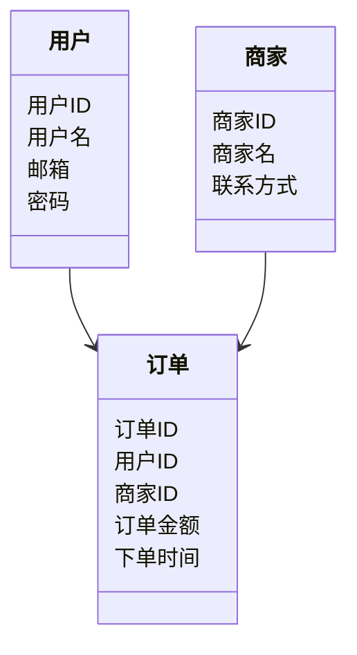
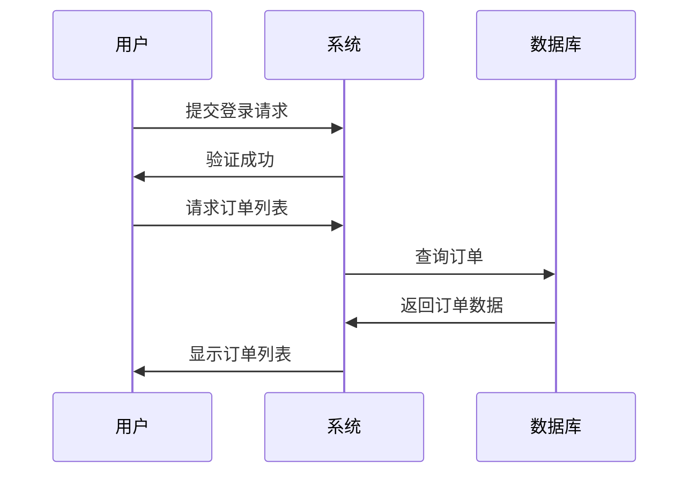

                 


# 巴菲特的财务报表分析：解读平台经济的新指标

## 关键词：巴菲特，财务报表分析，平台经济，用户行为指标，网络效应，价值投资

## 摘要：本文探讨了如何将巴菲特的经典财务分析方法应用于现代平台经济。通过分析平台经济的独特特征，文章引入了用户行为指标和网络效应等新指标，以更全面地评估平台企业的财务健康和潜在价值。结合数学模型和实际案例，文章展示了如何在平台经济中优化财务分析，为投资者和企业管理者提供了新的视角和工具。

---

# 第1章: 平台经济的定义与特点

## 1.1 平台经济的定义

### 1.1.1 平台经济的基本概念

平台经济是一种通过数字技术连接供需双方的商业模式，通常涉及双边或多边市场。平台通过提供中间服务，促进用户之间的交易或互动，如电子商务平台、社交媒体平台和在线支付系统。

### 1.1.2 平台经济的核心特征

- **双边或多边市场**：平台同时服务两个或多个不同的用户群体，例如消费者和商家。
- **网络效应**：用户数量的增加会增强平台的价值，形成正反馈循环。
- **数据驱动**：平台通过收集和分析用户数据来优化服务和商业模式。
- **轻资产模式**：平台通常依赖技术和数据而非重资产运营。

### 1.1.3 平台经济与传统经济的对比

| 特征                | 传统经济           | 平台经济             |
|---------------------|-------------------|----------------------|
| 用户关系            | 一对一交易         | 多边或双边交易       |
| 交易效率            | 较低，依赖中间商    | 高效，直接连接供需双方 |
| 成本结构            | 高固定成本         | 低固定成本，高可变成本 |
| 数据利用            | 有限或无           | 数据是核心资源        |

---

## 1.2 平台经济的模式与类型

### 1.2.1 双边平台的定义与特点

双边平台连接两个不同的用户群体，例如消费者和商家。这类平台通过提供交易撮合服务或信息服务来创造价值，如淘宝、滴滴出行。

### 1.2.2 多边平台的定义与特点

多边平台涉及三个或更多用户群体，例如苹果应用商店，连接开发者、用户和苹果公司。

### 1.2.3 平台经济的典型行业案例

- 电子商务平台（如亚马逊、淘宝）
- 拉钩网（Lagou）：就业信息平台
- 在线支付平台（如支付宝、PayPal）
- 社交媒体平台（如Facebook、微博）

---

## 1.3 平台经济的财务特征

### 1.3.1 平台经济的收入模式

- **交易佣金**：基于交易额收取费用。
- **订阅或会员服务**：用户支付定期费用获得独家服务。
- **广告收入**：通过广告位销售获取收入。
- **数据销售**：分析用户数据后出售给第三方。

### 1.3.2 平台经济的成本结构

- **固定成本**：服务器、软件开发、租金。
- **可变成本**：用户获取成本、内容采购成本。
- **边际成本**：每增加一个用户或交易的额外成本通常较低。

### 1.3.3 平台经济的用户行为分析

用户行为是平台经济的核心，分析用户活跃度、留存率和转化率对于评估平台的健康状况至关重要。例如，用户活跃度高的平台更容易吸引新用户，形成正向循环。

---

## 1.4 平台经济的财务报表分析挑战

### 1.4.1 平台经济的复杂性

平台经济涉及多方利益相关者，传统的财务指标可能无法全面反映其价值。

### 1.4.2 传统财务指标的局限性

- **净利润率**：无法衡量平台的网络效应和用户增长潜力。
- **ROE（股东权益回报率）**：在用户增长初期可能不准确，因为平台可能需要大量投资。

### 1.4.3 平台经济的新指标需求

引入用户生命周期价值（CLV）、用户获取成本（CAC）等新指标，以更准确地评估平台的财务表现。

---

# 第2章: 巴菲特的财务报表分析方法

## 2.1 巴菲特的投资理念

### 2.1.1 巴菲特的价值投资理论

巴菲特的价值投资理论强调寻找那些具有持续盈利能力、良好管理团队和合理估值的企业。他认为，市场短期可能疯狂，但长期会回归基本面。

### 2.1.2 巴菲特的长期投资策略

巴菲特定位于长期投资，注重企业的内在价值，而非短期市场波动。

### 2.1.3 巴菲特的财务报表分析框架

- **收入分析**：关注收入来源的稳定性和增长性。
- **利润分析**：考察净利润和利润率，确保企业具备盈利能力。
- **资产负债表分析**：评估企业的资产质量、负债结构和股东权益。
- **现金流量分析**：确保企业具备健康的现金流，支持持续经营。

---

## 2.2 巴菲特的财务指标分析

### 2.2.1 营业收入与成本分析

- **营业收入**：反映企业的核心业务表现。
- **营业成本**：分析成本结构的合理性。

### 2.2.2 净利润与盈利能力分析

- **净利润率**：净利润 / 营业收入。
- **毛利润率**：毛利 / 营业收入。

### 2.2.3 资产负债表分析

- **流动资产**：评估企业的短期偿债能力。
- **长期资产**：评估企业的投资和生产能力。
- **负债结构**：分析企业的债务风险。

### 2.2.4 现金流量表分析

- **经营活动现金流**：反映企业核心业务的现金流入流出。
- **投资活动现金流**：评估企业的资本支出和投资活动。
- **筹资活动现金流**：分析企业的融资能力。

---

## 2.3 巴菲特的财务报表分析案例

### 2.3.1 某公司财务报表分析

以某公司为例，分析其收入、成本、利润和现金流情况，评估其财务健康状况和投资潜力。

### 2.3.2 案例分析总结

通过案例分析，总结巴菲特分析方法的应用和对企业价值的判断。

---

# 第3章: 平台经济中的新指标

## 3.1 平台经济中的用户行为指标

### 3.1.1 用户活跃度

用户活跃度是衡量平台用户参与程度的重要指标，通常通过日活跃用户数（DAU）和月活跃用户数（MAU）来衡量。

### 3.1.2 用户留存率

用户留存率反映了用户粘性和平台的用户质量，包括日留存率、周留存率和月留存率。

### 3.1.3 用户生命周期价值（CLV）

用户生命周期价值是用户在平台上的平均消费总额，计算公式为：

$$ CLV = \text{平均订单价值} \times \text{用户生命周期长度} $$

---

## 3.2 平台经济中的网络效应指标

### 3.2.1 网络效应的定义

网络效应是指随着用户数量的增加，平台的价值也随之增加。例如，社交媒体平台，用户越多，平台越有价值。

### 3.2.2 网络效应的衡量指标

- **用户增长速率**：衡量平台扩展能力。
- **用户互动频率**：反映网络效应的强弱。

### 3.2.3 网络效应与平台价值的关系

网络效应越强的平台，其市场价值通常越高，因为其具有更强的用户粘性和竞争优势。

---

## 3.3 平台经济中的成本结构优化指标

### 3.3.1 边际成本分析

边际成本是指每增加一个单位产品的额外成本。在平台经济中，边际成本通常较低，尤其是随着用户数量的增加。

### 3.3.2 规模经济与范围经济

- **规模经济**：随着用户数量增加，单位成本下降。
- **范围经济**：通过扩展产品或服务种类，降低成本。

### 3.3.3 成本结构优化策略

优化平台的成本结构，例如通过自动化技术减少人工成本，或通过数据驱动的精准营销降低获客成本。

---

## 3.4 平台经济中的收入模型创新

### 3.4.1 多边平台的收入来源

- **交易佣金**：基于交易额收取费用。
- **订阅或会员服务**：用户支付定期费用获得独家服务。
- **广告收入**：通过广告位销售获取收入。

### 3.4.2 平台的定价策略

- **价值定价**：根据用户获得的价值定价。
- **动态定价**：根据市场供需变化调整价格。

### 3.4.3 平台的收入增长路径

- **用户增长**：通过吸引新用户增加收入。
- **用户价值提升**：通过提高用户活跃度和消费频率增加收入。

---

# 第4章: 平台经济的财务模型与数学公式

## 4.1 平台经济的收入模型

### 4.1.1 收入模型的定义

收入模型描述了平台如何通过不同的收入来源创造收入。

### 4.1.2 收入模型的数学公式

$$ 收入 = 用户数量 \times 用户平均收入 $$

---

## 4.2 平台经济的成本模型

### 4.2.1 成本模型的定义

成本模型描述了平台在获取和维护用户过程中产生的成本。

### 4.2.2 成本模型的数学公式

$$ 成本 = 固定成本 + 可变成本 $$

---

## 4.3 平台经济的利润模型

### 4.3.1 利润模型的定义

利润模型描述了平台在收入和成本之间的差额，即利润。

### 4.3.2 利润模型的数学公式

$$ 利润 = 收入 - 成本 $$

---

## 4.4 平台经济的用户生命周期模型

### 4.4.1 用户生命周期的定义

用户生命周期包括获取、活跃、留存和流失四个阶段。

### 4.4.2 用户生命周期价值（CLV）的计算公式

$$ CLV = \text{用户平均收入} \times \text{用户生命周期长度} $$

---

# 第5章: 系统分析与架构设计方案

## 5.1 问题场景介绍

平台经济涉及多方利益相关者，系统的架构需要支持复杂的交互和数据处理。

---

## 5.2 系统功能设计

### 5.2.1 领域模型

领域模型展示了平台的核心业务流程和实体关系，使用Mermaid类图表示。



---

### 5.2.2 系统架构设计

系统架构设计展示了平台的分层结构，使用Mermaid架构图表示。


---

## 5.3 系统交互设计

### 5.3.1 用户登录流程

使用Mermaid序列图表示用户登录的交互流程。



---

## 5.4 项目实战

### 5.4.1 环境安装

需要安装Python、数据库（如MySQL）和开发框架（如Django）。

---

## 5.4.2 系统核心实现源代码

以下是一个简单的用户认证模块的Python代码示例：

```python
from django.contrib.auth.models import User
from django.contrib.auth import authenticate, login, logout
from rest_framework.decorators import api_view
from rest_framework.response import Response

@api_view(['POST'])
def user_login(request):
    username = request.data.get('username', '')
    password = request.data.get('password', '')
    user = authenticate(request, username=username, password=password)
    if user is not None:
        login(request, user)
        return Response({'status': 'success', 'message': 'Login successful'})
    else:
        return Response({'status': 'error', 'message': 'Invalid credentials'})
```

---

## 5.4.3 代码应用解读与分析

上述代码实现了用户的登录功能，使用Django框架和REST框架，通过POST请求接收用户名和密码，进行身份验证并返回结果。

---

## 5.4.4 实际案例分析和详细讲解剖析

以某电商平台为例，分析其用户认证模块的设计和实现，探讨如何通过代码实现用户登录、注册和权限管理。

---

## 5.4.5 项目小结

通过实际案例分析，总结平台经济系统设计的关键点和注意事项，为后续的开发和优化提供参考。

---

# 第6章: 最佳实践 tips、小结、注意事项、拓展阅读

## 6.1 最佳实践 tips

- **持续关注用户行为**：定期分析用户活跃度和留存率，优化平台体验。
- **数据驱动决策**：利用数据挖掘和分析工具，指导平台的运营和推广。
- **网络效应的培养**：通过用户激励机制和内容建设，增强网络效应。

---

## 6.2 小结

本文通过分析平台经济的定义、特点以及巴菲特的财务分析方法，引入了用户行为指标和网络效应等新指标，为平台经济的财务分析提供了新的视角和工具。结合实际案例和系统设计，展示了如何在平台经济中优化财务分析，为投资者和企业管理者提供了实践指导。

---

## 6.3 注意事项

- **数据隐私保护**：在分析用户行为时，需遵守数据隐私法规，保护用户隐私。
- **模型的适用性**：不同的平台可能需要不同的分析模型，需根据具体情况调整。
- **持续监控**：平台经济的动态变化快，需持续监控财务指标和用户行为。

---

## 6.4 拓展阅读

- **书籍推荐**：《平台经济学：数字时代的商业革命》
- **在线课程**：Coursera上的“平台经济与创新”课程
- **行业报告**：Gartner或麦肯锡关于平台经济的最新报告

---

# 作者：AI天才研究院/AI Genius Institute & 禅与计算机程序设计艺术 /Zen And The Art of Computer Programming

