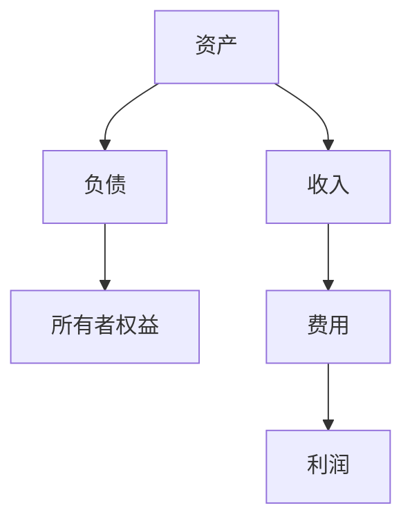
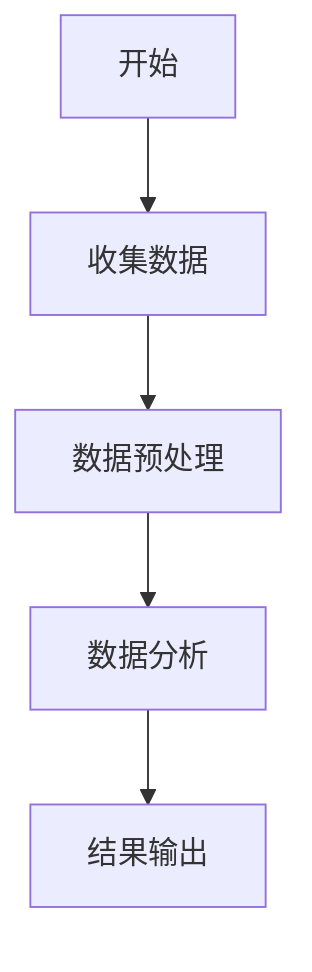
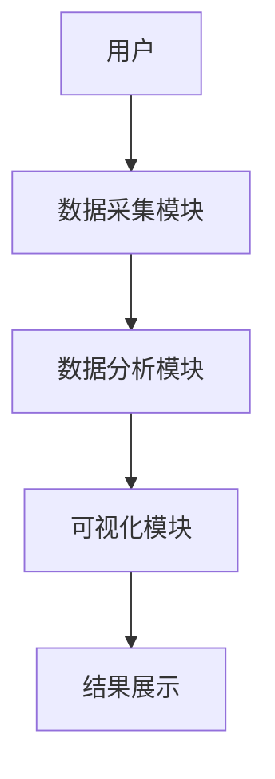
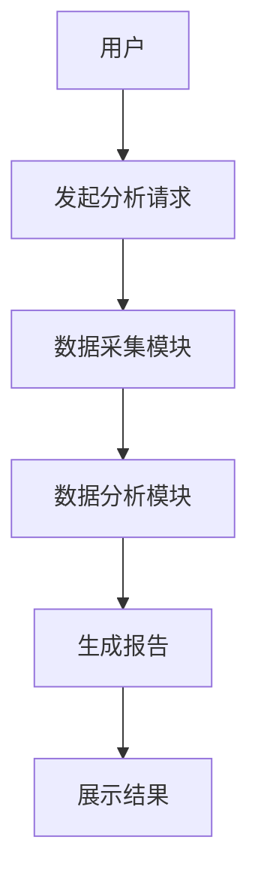

                 


# 巴菲特的财务报表分析：解读数字经济时代的新指标

## 关键词：巴菲特，财务报表分析，数字经济，投资分析，价值评估，财务指标

## 摘要：本文详细解读了巴菲特的财务报表分析方法，结合数字经济时代的新特点，探讨了新的财务指标和分析工具，帮助投资者更好地理解和应用这些方法，以实现价值评估和投资决策的优化。

---

# 第1章：巴菲特的财务报表分析概述

## 1.1 巴菲特分析方法的背景与重要性

### 1.1.1 传统财务报表分析的局限性
传统的财务报表分析主要依赖于三大报表（资产负债表、利润表、现金流量表），但其局限性在于：
- **静态性**：传统分析多基于历史数据，难以反映企业的动态变化。
- **单维度**：仅关注财务数据，忽视了非财务因素如市场趋势和技术创新的影响。
- **缺乏深度**：难以全面评估企业的长期发展潜力和竞争优势。

### 1.1.2 巴菲特分析方法的核心理念
巴菲特的财务报表分析方法强调：
- **长期投资视角**：关注企业的持续盈利能力，而非短期财务数据。
- **企业基本面分析**：通过分析企业的财务状况、行业地位和竞争优势，评估其长期价值。
- **安全边际原则**：通过低估企业的内在价值，确保投资的安全性。

### 1.1.3 数字经济时代对财务分析的新要求
在数字经济时代，企业价值的评估需要考虑以下新指标：
- **无形资产价值**：如品牌价值、技术专利等。
- **研发投入与创新**：技术创新对企业长期发展的影响力。
- **数字化转型**：企业数字化能力对财务表现的影响。

---

## 1.2 巴菲特分析方法的理论基础

### 1.2.1 财务报表分析的基本框架
巴菲特的分析框架包括以下几个关键部分：
1. **资产质量**：关注企业的资产是否优质，能否持续创造价值。
2. **盈利能力**：通过ROE（净资产收益率）等指标评估企业的盈利能力。
3. **财务健康状况**：分析企业的偿债能力、运营效率和现金流状况。

### 1.2.2 巴菲特的"三圈投资法"与财务报表分析的关系
"三圈投资法"是巴菲特投资策略的核心，包括：
1. **企业特质**：企业是否具备持续竞争优势。
2. **管理层能力**：管理层是否具备诚信和能力。
3. **估值**：企业是否被市场低估。

### 1.2.3 财务报表分析的三大报表体系
1. **资产负债表**：反映企业的财务状况。
2. **利润表**：反映企业的经营成果。
3. **现金流量表**：反映企业的现金流动情况。

---

## 1.3 巴菲特分析方法的实践价值

### 1.3.1 巴菲特分析方法在投资决策中的应用
巴菲特的分析方法可以帮助投资者：
- 精准评估企业的内在价值。
- 识别具有长期竞争优势的企业。
- 降低投资风险，提高投资回报率。

### 1.3.2 巴菲特分析方法对企业价值评估的作用
通过分析企业的财务数据，巴菲特的方法能够：
- 揭示企业的财务健康状况。
- 评估企业的盈利能力和成长潜力。
- 为企业的估值提供依据。

### 1.3.3 巴菲特分析方法的局限性与改进方向
- **局限性**：过于依赖财务数据，忽视了非财务因素的影响。
- **改进方向**：结合行业特点，引入新的财务指标（如研发投入、数字化转型指标等）。

---

## 1.4 本章小结
本章介绍了巴菲特的财务报表分析方法，强调了其在数字经济时代的重要性和新要求。通过分析企业的财务状况、盈利能力和竞争优势，投资者可以更好地评估企业的内在价值，做出更明智的投资决策。

---

# 第2章：财务报表分析的核心概念与联系

## 2.1 财务报表分析的核心概念

### 2.1.1 资产负债表的核心要素
- **资产**：企业拥有的资源，包括流动资产（如现金、应收账款）和非流动资产（如固定资产）。
- **负债**：企业欠款，包括流动负债（如应付账款）和非流动负债（如长期借款）。
- **所有者权益**：企业净资产，等于资产减去负债。

### 2.1.2 利润表的核心要素
- **收入**：企业经营活动中产生的收入。
- **费用**：企业为获得收入而发生的支出。
- **利润**：收入减去费用后的净收益。

### 2.1.3 现金流量表的核心要素
- **经营活动现金流**：企业日常经营活动产生的现金流。
- **投资活动现金流**：企业投资活动（如购买或出售资产）产生的现金流。
- **筹资活动现金流**：企业筹资活动（如发行债券或贷款）产生的现金流。

---

## 2.2 核心概念的联系与对比

### 2.2.1 资产负债表与利润表的联系
- 利润表中的净利润会影响资产负债表中的所有者权益。

### 2.2.2 利润表与现金流量表的联系
- 利润表中的收入和费用会影响现金流量表中的经营活动现金流。

### 2.2.3 核心概念的对比分析
| 概念 | 定义 | 主要内容 |
|------|------|----------|
| 资产负债表 | 反映企业财务状况 | 资产、负债、所有者权益 |
| 利润表 | 反映企业经营成果 | 收入、费用、利润 |
| 现金流量表 | 反映企业现金流动情况 | 经营、投资、筹资活动现金流 |

---

## 2.3 财务报表分析的ER实体关系图



---

## 2.4 本章小结
本章详细阐述了财务报表分析的核心概念及其联系，通过对比分析和ER实体关系图，帮助读者更好地理解三大报表之间的关系。

---

# 第3章：财务报表分析的算法原理

## 3.1 财务报表分析的算法原理

### 3.1.1 财务报表分析的基本流程
1. **数据收集**：获取企业的财务报表数据。
2. **数据预处理**：清洗数据，处理异常值。
3. **数据分析**：计算关键财务指标，如ROE、ROI等。
4. **结果输出**：生成分析报告，提出投资建议。

### 3.1.2 财务报表分析的数学模型
- **ROE（净资产收益率）**：$$ROE = \frac{\text{净利润}}{\text{净资产}}$$
- **ROI（投资回报率）**：$$ROI = \frac{\text{净利润}}{\text{投资成本}}$$
- **毛利率**：$$\text{毛利率} = \frac{\text{营业收入} - \text{营业成本}}{\text{营业收入}} \times 100\%$$

### 3.1.3 财务报表分析的算法实现
```python
def calculate_ROE(net_income, equity):
    return net_income / equity

def calculate_ROI(net_income, investment_cost):
    return net_income / investment_cost

# 示例数据
net_income = 100
equity = 500
investment_cost = 200

ROE = calculate_ROE(net_income, equity)  # 0.2
ROI = calculate_ROI(net_income, investment_cost)  # 0.5
```

---

## 3.2 算法的mermaid流程图



---

## 3.3 算法的Python实现
```python
# 示例代码
def financial_analysis(data):
    # 计算ROE
    roe = data['净利润'] / data['净资产']
    # 计算ROI
    roi = data['净利润'] / data['投资成本']
    return {'ROE': roe, 'ROI': roi}
```

---

## 3.4 本章小结
本章通过数学模型和算法流程图，详细阐述了财务报表分析的实现过程，为后续的系统分析和项目实战奠定了基础。

---

# 第4章：系统分析与架构设计方案

## 4.1 系统分析

### 4.1.1 问题场景介绍
在数字经济时代，企业需要实时监控财务数据，快速进行财务分析，以支持决策。

### 4.1.2 系统功能设计
1. **数据采集模块**：采集企业的财务数据。
2. **数据分析模块**：计算关键财务指标。
3. **可视化模块**：生成图表，直观展示分析结果。

---

## 4.2 系统架构设计



---

## 4.3 系统接口设计
1. **数据接口**：提供API，供其他系统调用。
2. **用户接口**：提供友好的用户界面，方便用户操作。

---

## 4.4 系统交互设计



---

## 4.5 本章小结
本章通过系统分析和架构设计，为实现高效的财务报表分析提供了一个可行的解决方案。

---

# 第5章：项目实战

## 5.1 环境安装
需要安装以下工具：
1. Python
2. 数据分析库（如Pandas、Matplotlib）
3. 系统设计工具（如Mermaid）

---

## 5.2 核心实现源代码

```python
import pandas as pd
import matplotlib.pyplot as plt

def calculate_metrics(data):
    # 计算ROE
    roe = data['净利润'] / data['净资产']
    # 计算ROI
    roi = data['净利润'] / data['投资成本']
    return {'ROE': roe, 'ROI': roi}

# 示例数据
data = {
    '净利润': 100,
    '净资产': 500,
    '投资成本': 200
}

metrics = calculate_metrics(data)
print(metrics)  # {'ROE': 0.2, 'ROI': 0.5}
```

---

## 5.3 代码应用解读与分析
- **数据输入**：企业财务数据。
- **计算过程**：计算ROE和ROI。
- **结果输出**：生成分析结果，供投资者参考。

---

## 5.4 实际案例分析
以一家科技公司为例，分析其财务报表，计算ROE和ROI，评估其投资价值。

---

## 5.5 本章小结
本章通过实际案例分析，展示了如何应用巴菲特的财务报表分析方法进行投资决策。

---

# 第6章：最佳实践与小结

## 6.1 最佳实践

### 6.1.1 定期分析
定期对企业财务报表进行分析，及时发现潜在问题。

### 6.1.2 关注趋势
关注企业的财务指标变化趋势，评估企业的成长潜力。

### 6.1.3 结合行业特点
根据行业特点，调整分析指标和方法。

---

## 6.2 注意事项

### 6.2.1 数据准确性
确保数据来源可靠，避免分析误差。

### 6.2.2 结合市场环境
考虑宏观经济和行业环境对企业的潜在影响。

### 6.2.3 动态调整
根据市场变化，及时调整分析方法和策略。

---

## 6.3 未来展望
随着数字经济的发展，财务报表分析将更加注重企业的数字化转型和技术创新能力。未来，投资者需要掌握更多的新指标和新方法，以更好地评估企业的内在价值。

---

## 6.4 本章小结
本章总结了巴菲特财务报表分析方法的最佳实践，并提出了未来的改进方向。

---

# 第7章：总结与展望

## 7.1 全书总结
本文系统地介绍了巴菲特的财务报表分析方法，结合数字经济时代的新特点，探讨了新的财务指标和分析工具。通过实际案例分析和系统设计，为投资者提供了实用的指导。

## 7.2 未来展望
随着技术的进步和市场的变化，财务报表分析将更加注重企业的长期价值和创新能力。投资者需要不断学习和适应，以应对新的挑战和机遇。

---

## 作者：AI天才研究院 & 禅与计算机程序设计艺术

--- 

本文详细介绍了巴菲特的财务报表分析方法，并结合数字经济时代的新特点，探讨了新的财务指标和分析工具。通过实际案例分析和系统设计，为投资者提供了实用的指导。

