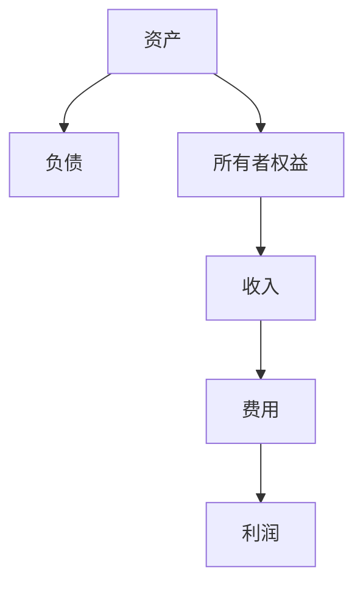

                 


```markdown
# 巴菲特的财务报表深度解析：数字背后的商业逻辑

**关键词：** 财务报表分析，巴菲特投资理念，企业价值评估，财务指标，投资决策，现金流量表

**摘要：**  
本文深入解析巴菲特的财务报表分析方法，揭示数字背后的商业逻辑。通过详细分析财务报表的核心要素、巴菲特的投资理念及其在实际投资决策中的应用，帮助读者理解如何通过财务数据评估企业价值。文章结合数学模型、系统架构图和实际案例，提供从理论到实践的全面指导。

---

## 第一部分: 巴菲特的财务报表深度解析基础

## 第1章: 财务报表分析基础

### 1.1 财务报表的基本概念

#### 1.1.1 财务报表的定义与作用
- 财务报表是企业财务状况、经营成果和现金流量的总结，是投资者评估企业价值的重要工具。
- 通过财务报表，投资者可以了解企业的资产结构、盈利能力、偿债能力等关键信息。

#### 1.1.2 财务报表的主要类型
- 资产负债表：反映企业在某一特定日期的资产、负债和所有者权益。
- 利润表：展示企业在一定会计期间的收入、费用和净利润。
- 现金流量表：记录企业在一定会计期间内现金流入和流出的情况。

#### 1.1.3 财务报表分析的重要性
- 通过财务报表分析，投资者可以评估企业的财务健康状况，识别潜在风险，制定投资策略。

### 1.2 巴菲特投资理念概述

#### 1.2.1 巴菲特的投资哲学
- 巴菲特主张长期投资，寻找具有持续竞争优势和良好治理结构的企业。
- 他强调企业价值的评估，而非短期市场波动。

#### 1.2.2 巴菲特的选股标准
- 企业应具备强大的竞争优势，能够在长期中保持高利润率。
- 企业应具有良好的财务状况，特别是低负债率和稳定的现金流。

#### 1.2.3 巴菲特对财务报表的关注点
- 关注企业的盈利能力、资产质量、偿债能力和现金流状况。
- 通过分析财务报表，识别企业的核心竞争力和潜在风险。

### 1.3 财务报表分析与投资决策

#### 1.3.1 财务报表分析在投资中的作用
- 帮助投资者评估企业的财务健康状况，识别投资机会和风险。
- 通过财务数据，投资者可以判断企业的盈利能力和成长潜力。

#### 1.3.2 如何通过财务报表评估企业价值
- 分析企业的盈利能力，如净利润率和毛利率。
- 评估企业的资产质量，如应收账款和存货周转率。
- 关注企业的现金流状况，确保企业具备持续经营的能力。

#### 1.3.3 财务报表分析的边界与外延
- 财务报表分析是投资决策的重要工具，但需结合行业分析和市场环境。
- 通过多维度分析，投资者可以更全面地评估企业的价值。

---

## 第二部分: 财务报表的核心要素与联系

## 第2章: 财务报表的核心要素与联系

### 2.1 财务报表的核心概念

#### 2.1.1 资产、负债、所有者权益的定义与区别
- 资产：企业拥有的资源，预期能带来经济利益。
- 负债：企业承担的债务，需在未来偿还。
- 所有者权益：企业资产扣除负债后，归所有者所有的部分。

#### 2.1.2 收入、费用、利润的关系
- 收入：企业在一定会计期间内销售商品或提供服务所获得的总收入。
- 费用：企业为获取收入而发生的各项支出。
- 利润：收入减去费用后的净收益。

#### 2.1.3 现金流的定义与分类
- 现金流：企业在一定会计期间内现金和现金等价物的流入和流出。
- 分为经营活动现金流、投资活动现金流和筹资活动现金流。

### 2.2 财务报表的实体关系图



### 2.3 财务报表的核心公式

#### 净利润 = 收入 - 费用
$$ \text{净利润} = \text{收入} - \text{费用} $$

#### 资产 = 负债 + 所有者权益
$$ \text{资产} = \text{负债} + \text{所有者权益} $$

#### 现金流 = 收入 - 费用 + 其他项目
$$ \text{现金流} = \text{收入} - \text{费用} + \text{其他项目} $$

---

## 第三部分: 巴菲特的财务报表分析方法

## 第3章: 资产负债表分析

### 3.1 资产负债表的核心要素

#### 3.1.1 资产的分类与评估
- 流动资产：现金及现金等价物、应收账款、存货等。
- 非流动资产：长期投资、固定资产、无形资产等。

#### 3.1.2 负债的分类与评估
- 流动负债：短期借款、应付账款、应付职工薪酬等。
- 非流动负债：长期借款、债券发行等。

#### 3.1.3 所有者权益的结构
- 实收资本、资本公积、盈余公积、未分配利润等。

### 3.2 资产负债表分析的数学模型

#### 资产负债表的平衡关系
$$ \text{资产} = \text{负债} + \text{所有者权益} $$

#### 资产负债率计算
$$ \text{资产负债率} = \frac{\text{总负债}}{\text{总资产}} \times 100\% $$

### 3.3 资产负债表分析案例

#### 案例：苹果公司资产负债表分析
- 分析苹果的流动资产和非流动资产，评估其资产结构。
- 计算苹果的资产负债率，判断其财务杠杆风险。

---

## 第四部分: 利润表与现金流分析

## 第4章: 利润表分析

### 4.1 利润表的核心要素

#### 4.1.1 收入的分类与计算
- 营业收入：主营业务收入和其他业务收入。
- 净收入：扣除折扣和退回后的收入。

#### 4.1.2 费用的分类与计算
- 营业费用：销售费用、管理费用、研发费用等。
- 财务费用：利息支出、汇兑损益等。

#### 4.1.3 利润的层次结构
- 营业利润：营业收入减去营业费用和财务费用。
- 净利润：营业利润减去所得税费用。

### 4.2 利润表的数学模型

#### 净利润计算公式
$$ \text{净利润} = \text{营业收入} - \text{营业费用} - \text{财务费用} - \text{所得税费用} $$

#### 毛利率计算
$$ \text{毛利率} = \frac{\text{营业收入} - \text{营业成本}}{\text{营业收入}} \times 100\% $$

### 4.3 利润表分析案例

#### 案例：亚马逊公司利润表分析
- 分析亚马逊的营业收入和成本结构，计算其毛利率。
- 评估亚马逊的净利润增长趋势，判断其盈利能力。

---

## 第五章: 现金流量表分析

### 5.1 现金流量表的核心要素

#### 5.1.1 经营活动现金流
- 销售商品和提供服务收到的现金。
- 支付的工资、税费等经营性支出。

#### 5.1.2 投资活动现金流
- 购买或出售固定资产、无形资产等投资活动的现金流。

#### 5.1.3 筹资活动现金流
- 吸收投资、偿还债务等筹资活动的现金流。

### 5.2 现金流量表的数学模型

#### 现金流量表的平衡关系
$$ \text{现金流入} - \text{现金流出} = \text{净现金流} $$

#### 现金流量比率计算
$$ \text{现金流量比率} = \frac{\text{经营活动现金流净额}}{\text{流动负债}} $$

### 5.3 现金流量表分析案例

#### 案例：谷歌公司现金流量表分析
- 分析谷歌的经营活动现金流，判断其盈利质量。
- 评估谷歌的自由现金流，判断其投资能力。

---

## 第六章: 综合财务报表分析

### 6.1 财务报表综合分析的框架

#### 6.1.1 企业综合价值评估
- 结合资产负债表、利润表和现金流量表，评估企业的综合价值。

#### 6.1.2 财务健康状况评估
- 通过财务比率分析，判断企业的偿债能力、盈利能力和发展能力。

### 6.2 财务比率分析

#### 6.2.1 偿债能力指标
- 速动比率：$$ \text{速动比率} = \frac{\text{速动资产}}{\text{流动负债}} $$
- 产权比率：$$ \text{产权比率} = \frac{\text{总负债}}{\text{所有者权益}} $$

#### 6.2.2 盈利能力指标
- 净资产收益率：$$ \text{ROE} = \frac{\text{净利润}}{\text{所有者权益}} \times 100\% $$
- 资产回报率：$$ \text{ROA} = \frac{\text{净利润}}{\text{总资产}} \times 100\% $$

#### 6.2.3 发展能力指标
- 营业收入增长率：$$ \text{营业收入增长率} = \frac{\text{本期营业收入} - \text{上期营业收入}}{\text{上期营业收入}} \times 100\% $$
- 净利润增长率：同理。

### 6.3 综合分析案例

#### 案例：巴菲特投资的公司分析
- 以巴菲特持仓的公司为例，综合分析其财务报表，评估其投资价值。

---

## 第七章: 巴菲特投资策略的实际应用

### 7.1 巴菲特投资策略的总结

#### 7.1.1 寻找具有持续竞争优势的企业
- 企业应具备强大的市场地位、独特的竞争优势和稳定的市场需求。

#### 7.1.2 评估企业的财务健康状况
- 关注企业的负债率、现金流状况和盈利能力。

### 7.2 投资策略的实际应用

#### 7.2.1 选择具有护城河的企业
- 例如，可口可乐的全球品牌影响力和分销网络。

#### 7.2.2 评估管理层的能力和诚信
- 管理层应具备优秀的职业道德和长期的愿景。

#### 7.2.3 关注企业的长期增长潜力
- 选择处于成长期或成熟期的行业龙头。

### 7.3 巴菲特投资策略的数学模型

#### 企业价值评估公式
$$ \text{内在价值} = \sum_{t=1}^{n} \frac{\text{现金流}_t}{(1+r)^t} + \text{残值} $$

---

## 第八章: 项目实战——巴菲特风格的投资分析

### 8.1 项目背景

#### 8.1.1 项目目标
- 通过分析具体公司的财务报表，评估其投资价值。

#### 8.1.2 数据来源
- 使用公开的财务报表数据，如SEC filings。

### 8.2 项目实施步骤

#### 8.2.1 数据收集
- 收集目标公司的资产负债表、利润表和现金流量表。

#### 8.2.2 数据分析
- 计算关键财务比率，如ROE、ROA、负债率等。
- 进行趋势分析，观察财务数据的变化趋势。

#### 8.2.3 投资决策
- 结合行业分析和市场环境，评估企业的投资价值。

### 8.3 项目案例

#### 案例：巴菲特持仓的公司分析
- 以巴菲特持仓的公司为例，详细分析其财务报表，评估其投资价值。

---

## 第九章: 总结与展望

### 9.1 总结

#### 9.1.1 财务报表分析的核心要点
- 理解财务报表的基本概念和结构。
- 掌握关键财务比率的计算和应用。

#### 9.1.2 巴菲特投资理念的精髓
- 长期投资，寻找具有持续竞争优势的企业。
- 重视企业的财务健康状况和管理层能力。

### 9.2 展望

#### 9.2.1 财务报表分析的未来趋势
- 结合大数据和人工智能技术，进行更精准的财务预测和分析。

#### 9.2.2 巴菲特投资理念的传承与发展
- 新一代投资者如何在数字时代应用巴菲特的理念。

### 9.3 最佳实践 tips

#### 9.3.1 财务报表分析的关键注意事项
- 结合行业特点，灵活运用财务分析方法。
- 谨防财务造假，关注非财务信息。

#### 9.3.2 巴菲特投资理念的实践建议
- 长期持有优质股票，避免短期波动的干扰。
- 定期复盘和调整投资组合。

---

## 附录: 巴菲特经典语录

### 附录1: 巴菲特的十大投资准则

1. **第一条**：只投资你理解的公司。
2. **第二条**：绝不投机。
3. **第三条**：寻找具有强大竞争优势的企业。
4. **第四条**：关注企业的财务健康状况。
5. **第五条**：评估管理层的能力和诚信。
6. **第六条**：长期投资，耐心等待。
7. **第七条**：分散投资，降低风险。
8. **第八条**：关注企业的长期增长潜力。
9. **第九条**：保持理性，避免情绪化决策。
10. **第十条**：不断学习，提升自己的投资能力。

---

## 作者：AI天才研究院/AI Genius Institute & 禅与计算机程序设计艺术 /Zen And The Art of Computer Programming
```

