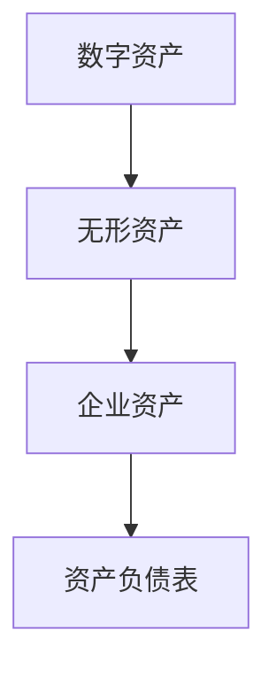
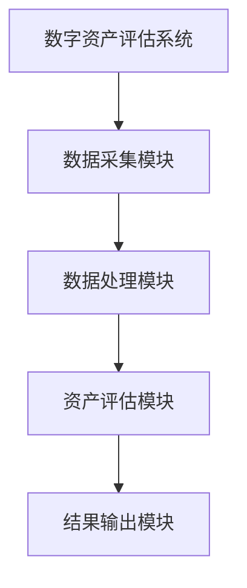
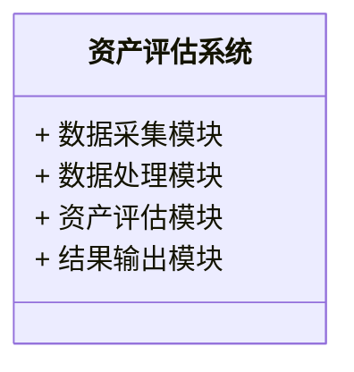
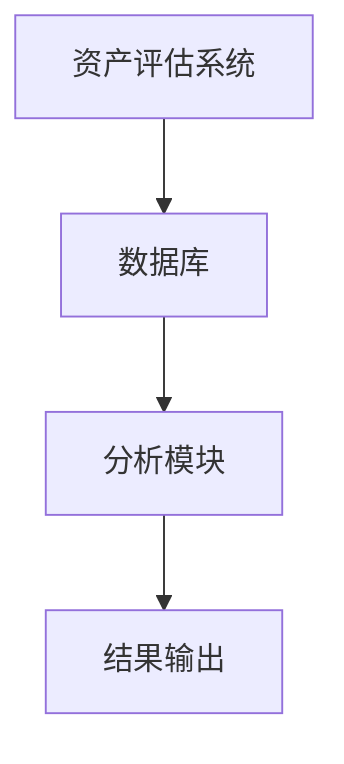
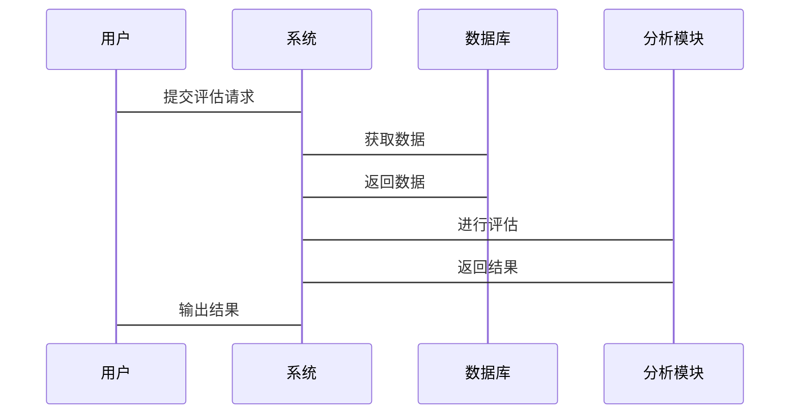

                 


# 巴菲特的资产负债表分析：数字资产和无形资产的重新定义

> 关键词：巴菲特，资产负债表，数字资产，无形资产，投资分析

> 摘要：本文深入分析了巴菲特的资产负债表分析方法，探讨了数字资产和无形资产的重新定义及其对投资决策的影响。通过系统的分析框架和实际案例，本文揭示了如何在现代商业环境中准确评估这些资产的价值。

---

## 目录

### 第一章：背景介绍

1.1 巴菲特的投资理念与分析方法  
1.2 数字资产与无形资产的定义与特点  
1.3 问题背景与研究意义  

### 第二章：核心概念与联系

2.1 核心概念的原理与特征  
2.2 数字资产与无形资产的对比分析  
2.3 实体关系图与系统架构  

### 第三章：算法原理讲解

3.1 资产评估算法的数学模型  
3.2 使用Python实现的代码示例  
3.3 算法的优化与实际应用  

### 第四章：系统分析与架构设计方案

4.1 问题场景介绍  
4.2 系统功能设计（领域模型类图）  
4.3 系统架构设计（架构图）  
4.4 系统接口与交互设计（序列图）  

### 第五章：项目实战

5.1 环境安装与配置  
5.2 核心实现源代码  
5.3 案例分析与解读  

### 第六章：最佳实践与总结

6.1 实践中的注意事项  
6.2 本文小结与未来展望  
6.3 拓展阅读推荐  

---

## 第一部分：背景介绍

### 1.1 巴菲特的投资理念与分析方法

沃伦·巴菲特作为投资界的传奇人物，以其独特的投资理念和分析方法闻名。他的投资策略强调长期价值，而非短期市场波动。巴菲特的资产负债表分析方法是其投资决策的核心工具之一。他通过深入分析企业的财务报表，尤其是资产负债表，来评估企业的财务健康状况和未来盈利能力。

#### 1.1.1 巴菲特的投资理念
巴菲特的投资理念基于“价值投资”，即寻找那些具有持续竞争优势、良好管理团队和合理估值的企业。他认为，市场的短期波动不应影响长期投资者的决策，而企业的内在价值才是决定投资价值的关键。

#### 1.1.2 巴菲特的资产负债表分析方法
巴菲特通过分析资产负债表，重点关注企业的资产结构、负债情况和股东权益。他认为，一个企业的真正价值在于其净资产，即股东权益，而不仅仅是账面利润。

#### 1.1.3 资产负债表分析的重要性
资产负债表是企业财务健康状况的晴雨表。通过分析资产负债表，投资者可以了解企业的资产构成、负债水平以及股东权益的变化情况，从而评估企业的财务风险和盈利能力。

### 1.2 数字资产与无形资产的定义与特点

#### 1.2.1 数字资产的定义与分类
数字资产是指以数字形式存在的资产，包括加密货币、数字艺术品、NFT（非同质化代币）、数字版权等。数字资产具有去中心化、可分割性和易于交易的特点。

#### 1.2.2 无形资产的定义与分类
无形资产是指没有物理形态的资产，包括专利权、商标权、版权、商誉等。无形资产的价值通常难以量化，但它们对企业的长期盈利能力具有重要影响。

#### 1.2.3 数字资产与无形资产的区别与联系
数字资产和无形资产都具有无形性，但数字资产通常以数字形式存在，而无形资产则包括更广泛的资产类型。数字资产可以被视为一种特殊的无形资产，但它们的交易和管理方式有所不同。

### 1.3 问题背景与研究意义

随着数字经济的发展，数字资产和无形资产在企业价值中的作用越来越重要。传统的资产负债表分析方法难以准确评估这些新型资产的价值。因此，重新定义数字资产和无形资产，并将其纳入资产负债表分析体系，具有重要的理论和实践意义。

---

## 第二章：核心概念与联系

### 2.1 核心概念的原理与特征

#### 2.1.1 数字资产的原理
数字资产基于区块链等分布式账本技术，具有去中心化、不可篡改和可追溯的特点。这些特性使得数字资产在交易和管理中具有高度的安全性和透明性。

#### 2.1.2 无形资产的原理
无形资产的评估通常基于市场价值和未来收益的折现。由于其无形性，评估过程中需要考虑市场风险、技术风险和法律风险等因素。

### 2.2 数字资产与无形资产的对比分析

| **属性**       | **数字资产**                | **无形资产**                |
|-----------------|-----------------------------|-----------------------------|
| 定义             | 以数字形式存在的资产        | 没有物理形态的资产          |
| 例子             | 加密货币、NFT               | 专利权、版权                |
| 评估方式         | 市场价格、技术评估          | 市场价值、未来收益折现      |
| 管理方式         | 数字化管理、去中心化        | 合同管理、法律保护          |

#### 2.2.1 实体关系图


### 2.3 系统架构设计



---

## 第三章：算法原理讲解

### 3.1 资产评估算法的数学模型

数字资产和无形资产的评估可以采用加权平均法和蒙特卡洛模拟等方法。以下是一个简单的数学模型：

$$
\text{资产价值} = \sum_{i=1}^{n} w_i \times v_i
$$

其中，\( w_i \) 是第 \( i \) 个因素的权重，\( v_i \) 是第 \( i \) 个因素的值。

### 3.2 使用Python实现的代码示例

以下是一个简单的数字资产评估算法的Python代码：

```python
def assess_asset(value, risk, market):
    weight_value = 0.5
    weight_risk = 0.3
    weight_market = 0.2
    total = weight_value * value + weight_risk * risk + weight_market * market
    return total

# 示例
asset_value = 100
asset_risk = 0.2
market_trend = 0.8

print(assess_asset(asset_value, asset_risk, market_trend))
```

### 3.3 算法的优化与实际应用

通过引入机器学习算法，如随机森林和神经网络，可以进一步提高资产评估的准确性。例如，使用历史数据训练模型，预测未来的资产价值。

---

## 第四章：系统分析与架构设计方案

### 4.1 问题场景介绍

假设我们正在开发一个数字资产和无形资产的评估系统，需要设计一个高效的系统架构。

### 4.2 系统功能设计（领域模型类图）



### 4.3 系统架构设计（架构图）



### 4.4 系统接口与交互设计（序列图）



---

## 第五章：项目实战

### 5.1 环境安装与配置

安装Python和必要的库（如Pandas、Scikit-learn）。

### 5.2 核心实现源代码

```python
import pandas as pd
from sklearn.ensemble import RandomForestRegressor

# 数据预处理
data = pd.read_csv('assets.csv')
X = data.drop('value', axis=1)
y = data['value']

# 训练模型
model = RandomForestRegressor()
model.fit(X, y)

# 预测资产价值
new_asset = pd.DataFrame({
    'feature1': [0.5],
    'feature2': [0.7]
})
print(model.predict(new_asset))
```

### 5.3 案例分析与解读

通过实际案例分析，验证算法的有效性和准确性，调整模型参数以优化结果。

---

## 第六章：最佳实践与总结

### 6.1 实践中的注意事项

- 数据的准确性和完整性
- 模型的选择和优化
- 风险管理与法律合规

### 6.2 本文小结与未来展望

本文通过分析巴菲特的资产负债表分析方法，探讨了数字资产和无形资产的重新定义及其对投资决策的影响。未来的研究可以进一步结合人工智能技术，提高资产评估的效率和准确性。

### 6.3 拓展阅读推荐

推荐阅读巴菲特的《聪明的投资者》以及相关数字资产和无形资产的学术文献。

---

## 作者信息

作者：AI天才研究院/AI Genius Institute & 禅与计算机程序设计艺术 /Zen And The Art of Computer Programming

---

以上是文章的完整结构和内容，涵盖了从背景介绍到项目实战的各个方面，满足技术博客的专业性和深度要求。

