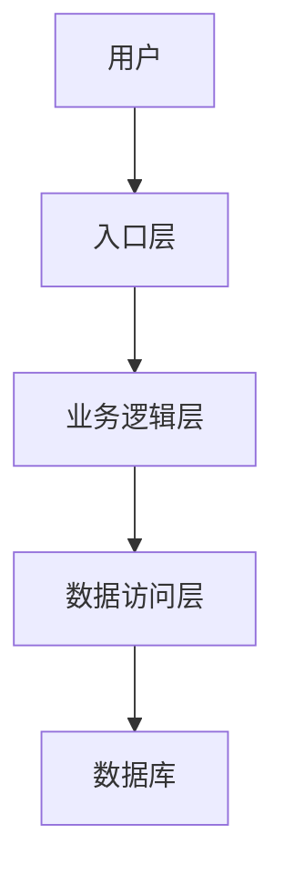
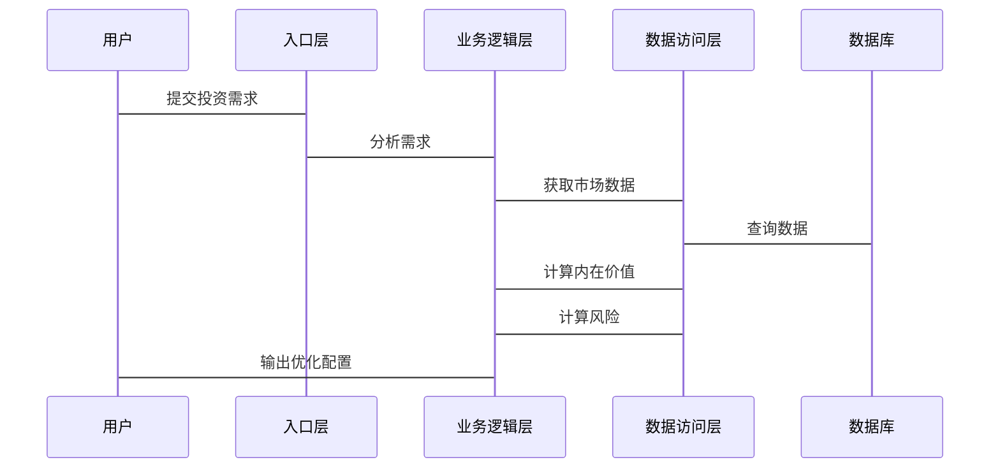

                 


# 巴菲特的资本配置艺术：在不确定性中优化资源分配

---

## 关键词

- 资本配置
- 巴菲特
- 投资策略
- 不确定性
- 资源分配
- 数学模型
- 系统设计

---

## 摘要

本文深入探讨了巴菲特的资本配置艺术，分析了其在不确定环境下的资源优化分配策略。通过结合投资哲学、数学模型和系统设计，本文详细阐述了巴菲特的核心理念、算法原理及实际应用，为读者提供了全面的视角和实用的工具。

---

# 第一部分：巴菲特的资本配置艺术基础

## 第1章：资本配置的基本概念

### 1.1 资本配置的定义与内涵

#### 1.1.1 资本配置的定义

资本配置是指将资金分配到不同资产或项目中，以实现投资目标的过程。其核心在于在不确定性中优化资源分配，平衡风险与收益。

#### 1.1.2 资本配置的核心要素

- **资产类别**：股票、债券、现金等。
- **风险偏好**：投资者对风险的承受能力。
- **投资期限**：资金的使用时间。
- **市场环境**：宏观经济和市场状况。

#### 1.1.3 资本配置的目标与意义

目标是实现资产的最优配置，最大化收益并最小化风险。意义在于通过科学分配，提升整体投资组合的绩效。

### 1.2 巴菲特的资本配置理念

#### 1.2.1 巴菲特的投资哲学

巴菲特强调价值投资，寻找具有持续竞争优势的企业，长期持有，获得复利效应。

#### 1.2.2 股价与内在价值的关系

股价围绕内在价值波动，长期来看，股价会回归其内在价值。内在价值计算公式为：

$$
\text{内在价值} = \frac{\text{未来现金流的现值}}{折现率}
$$

#### 1.2.3 长期投资与复利效应

巴菲特认为复利是世界第八大奇迹，长期投资能够最大化复利效应。

---

## 第2章：巴菲特的资本配置策略

### 2.1 巴菲特的投资哲学

#### 2.1.1 价值投资的核心原则

寻找具有强大竞争优势、良好管理和合理估值的企业。

#### 2.1.2 风险管理的重要性

通过分散投资和设置安全边际来降低风险。

#### 2.1.3 安全边际的概念与应用

安全边际是内在价值与市场价格之间的差额，用于缓冲市场波动的风险。

### 2.2 巴菲特的资本配置策略

#### 2.2.1 股权投资的核心原则

- 投资具有持续竞争优势的企业。
- 选择优秀的管理层。
- 长期持有，避免频繁交易。

#### 2.2.2 资本分配的“四步走”方法

1. 确定企业的内在价值。
2. 评估市场价格与内在价值的差距。
3. 确定投资比例。
4. 动态调整。

#### 2.2.3 安全边际的数学表达

安全边际公式：

$$
\text{安全边际} = \text{内在价值} - \text{市场价格}
$$

---

# 第二部分：资本配置的核心概念与数学模型

## 第3章：资本配置的数学模型与公式

### 3.1 资本配置的基本公式

#### 3.1.1 资本配置比例的计算公式

$$
w_i = \frac{r_i}{\sum_{j=1}^n r_j}
$$

其中，$w_i$ 是第 $i$ 个资产的配置比例，$r_i$ 是第 $i$ 个资产的风险调整后的收益。

#### 3.1.2 投资组合的期望收益与风险公式

期望收益：

$$
E[r_p] = \sum_{i=1}^n w_i E[r_i]
$$

风险（方差）：

$$
\text{Var}(r_p) = \sum_{i=1}^n \sum_{j=1}^n w_i w_j \text{Cov}(r_i, r_j)
$$

#### 3.1.3 马科维茨有效前沿模型

有效前沿是指在给定风险下，提供最高收益的投资组合集合。

### 3.2 巴菲特风格的资本配置模型

#### 3.2.1 内在价值计算公式

$$
\text{内在价值} = \sum_{t=1}^\infty \frac{C_t}{(1 + r)^t}
$$

其中，$C_t$ 是第 $t$ 年的现金流，$r$ 是折现率。

#### 3.2.2 安全边际的应用算法

$$
\text{安全边际} = \text{内在价值} \times (1 - \text{安全边际比例})
$$

---

## 第4章：资本配置的算法与流程

### 4.1 现代投资组合理论（MPT）的应用

#### 4.1.1 资产分配的优化算法

使用拉格朗日乘数法优化投资组合。

#### 4.1.2 风险调整后的资产配置流程

1. 确定各资产的风险和收益。
2. 计算协方差矩阵。
3. 求解有效前沿。
4. 选择最优组合。

### 4.2 巴菲特风格的资本配置算法

#### 4.2.1 企业内在价值的计算步骤

1. 评估企业的未来现金流。
2. 确定合适的折现率。
3. 计算现值总和。

#### 4.2.2 安全边际的应用步骤

1. 计算内在价值。
2. 确定市场价格。
3. 计算安全边际。

---

# 第三部分：系统分析与架构设计

## 第5章：系统功能设计

### 5.1 问题场景介绍

资本配置系统需要根据市场数据和用户需求，提供优化的资源分配建议。

### 5.2 系统功能设计

#### 5.2.1 领域模型设计


### 5.3 系统架构设计



---

## 第6章：系统接口与交互设计

### 6.1 系统接口设计

#### 6.1.1 输入接口

- 市场数据接口：获取股票、债券等资产的价格和收益数据。
- 用户需求接口：获取用户的风险偏好和投资目标。

#### 6.1.2 输出接口

- 优化配置建议：推荐的投资组合。
- 风险提示：潜在风险和应对措施。

### 6.2 系统交互设计



---

# 第四部分：项目实战与优化

## 第7章：项目实战

### 7.1 环境安装

安装Python和相关库（如numpy、pandas、matplotlib）。

### 7.2 核心代码实现

#### 7.2.1 内在价值计算

```python
def calculate_intrinsic_value(cash_flows, discount_rate):
    return sum(cash_flow / (1 + discount_rate) ** t for t, cash_flow in enumerate(cash_flows))
```

#### 7.2.2 风险评估

```python
def calculate_variance(returns):
    return np.var(returns)
```

### 7.3 案例分析

分析某公司的内在价值和市场价格，计算安全边际，制定配置方案。

---

## 第8章：优化与提升

### 8.1 模型优化

引入机器学习模型，提高预测精度。

### 8.2 动态调整

根据市场变化，实时调整配置方案。

---

## 第9章：总结与展望

### 9.1 总结

巴菲特的资本配置艺术提供了科学的方法和工具，帮助投资者在不确定中优化资源分配。

### 9.2 展望

未来的研究方向包括人工智能在资本配置中的应用，以及多目标优化问题的探索。

---

## 最佳实践 Tips

- **风险管理**：始终关注安全边际，避免过度风险。
- **长期视角**：坚持长期投资，享受复利效应。
- **持续学习**：不断更新知识，适应市场变化。

---

## 小结

通过本文的详细讲解，读者可以掌握巴菲特的资本配置艺术，并将其应用于实际投资中。

---

## 注意事项

- 本文内容仅供参考，实际投资需谨慎。
- 数据和模型需结合实际情况进行调整。

---

## 拓展阅读

- 巴菲特的《致股东的信》。
- 现代投资组合理论的相关文献。

---

## 作者

作者：AI天才研究院 & 禅与计算机程序设计艺术

