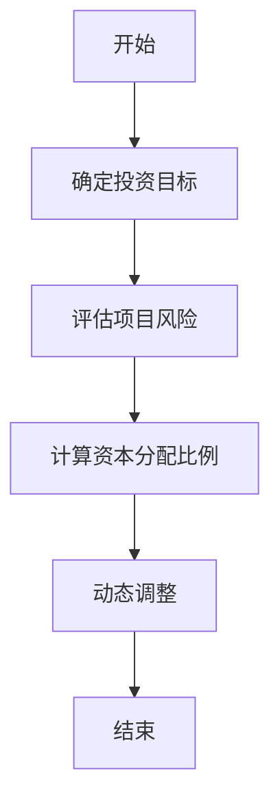
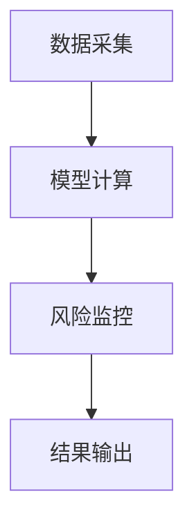

                 


# 巴菲特的资本配置艺术：如何有效分配公司资源

## 关键词：资本配置、巴菲特、投资策略、价值投资、企业资源分配、投资哲学

## 摘要： 
本文深入探讨了巴菲特的资本配置艺术，分析了其核心理念、数学模型、系统架构以及在实际投资中的应用。通过详细解析巴菲特的投资策略和资本分配模型，本文揭示了如何通过科学的方法有效分配公司资源，以实现长期价值最大化。文章结合实际案例，为读者提供了从理论到实践的全面指导。

---

## 第一章：引言：巴菲特的资本配置艺术概述

### 1.1 巴菲特的投资理念
#### 1.1.1 价值投资的核心思想
价值投资是巴菲特投资哲学的核心，强调以低于内在价值的价格买入优质资产。他注重企业的基本面分析，寻找具有持续竞争优势和良好治理结构的企业。

#### 1.1.2 资本配置的基本概念
资本配置是指将资金分配到不同资产或项目中，以实现收益最大化。巴菲特的资本配置策略强调长期投资和价值发现。

#### 1.1.3 巴菲特投资策略的演变
从早期的套利交易到后来的价值投资，巴菲特的策略不断完善，但核心始终围绕资本的有效配置。

---

## 第二章：资本配置的核心概念

### 2.1 资本配置的定义与目标
资本配置的目标是最大化股东价值，通过合理分配资源实现企业增长和股东收益。

### 2.2 资本配置的数学模型
#### 2.2.1 资本分配公式
$$ C = \sum_{i=1}^{n} w_i \times A_i $$
其中，$C$ 表示总资本分配，$w_i$ 表示第 $i$ 个项目的权重，$A_i$ 表示第 $i$ 个项目的资本分配金额。

#### 2.2.2 资本配置的属性特征对比
| 属性 | 流动性 | 风险性 | 收益性 | 稳定性 |
|------|--------|--------|--------|--------|
| 对比 | 高     | 高     | 高     | 中     |

### 2.3 资本配置的框架与策略
#### 2.3.1 资本分配的四个维度
- 时间维度：短期 vs 长期
- 风险维度：高风险 vs 低风险
- 收益维度：高收益 vs 低收益
- 资源维度：内部 vs 外部

#### 2.3.2 资本分配的优先级
优先投资于具有持续竞争优势和良好治理结构的企业。

---

## 第三章：资本配置的数学模型与算法

### 3.1 资本配置算法的流程图


### 3.2 资本配置算法的Python实现
```python
def calculate_weight(portfolio_value, risk_tolerance):
    weights = {}
    for asset in portfolio:
        # 计算每种资产的权重
        weights[asset] = (portfolio_value / sum(portfolio.values()))
    return weights
```

---

## 第四章：资本配置的风险管理与优化

### 4.1 资本配置中的风险管理
#### 4.1.1 分散投资
通过分散投资降低风险，避免过度依赖单一资产。

#### 4.1.2 止损机制
设定止损点，避免重大损失。

### 4.2 长期资本配置策略
#### 4.2.1 股东价值最大化
通过长期投资实现股东价值的最大化。

#### 4.2.2 伯克希尔的案例
分析伯克希尔的资本配置策略，总结其成功经验。

---

## 第五章：资本配置的系统架构与实现

### 5.1 系统功能设计
#### 5.1.1 数据采集模块
采集市场数据、企业基本面数据等。

#### 5.1.2 模型计算模块
使用数学模型计算资本分配比例。

#### 5.1.3 风险监控模块
实时监控投资组合的风险。

### 5.2 系统架构图


---

## 第六章：资本配置的长期策略与案例分析

### 6.1 长期资本配置策略
#### 6.1.1 股东价值最大化
通过长期投资实现股东价值的最大化。

#### 6.1.2 资本分配的动态调整
根据市场变化和企业情况调整资本分配。

### 6.2 伯克希尔的案例
分析伯克希尔的资本配置策略，总结其成功经验。

---

## 第七章：总结与展望

### 7.1 总结
巴菲特的资本配置艺术通过科学的模型和长期的策略，实现了资源的最优分配，为投资者提供了宝贵的借鉴。

### 7.2 展望
未来，资本配置将更加依赖于技术进步和数据分析，投资者需要不断学习和适应新的挑战。

---

## 作者：AI天才研究院/AI Genius Institute & 禅与计算机程序设计艺术 /Zen And The Art of Computer Programming

---

这篇文章系统地分析了巴菲特的资本配置艺术，结合理论与实践，为读者提供了从基础到应用的全面指导。通过详细的数学模型、算法流程图和系统架构设计，文章深入浅出地展示了如何有效分配公司资源，实现长期价值最大化。

