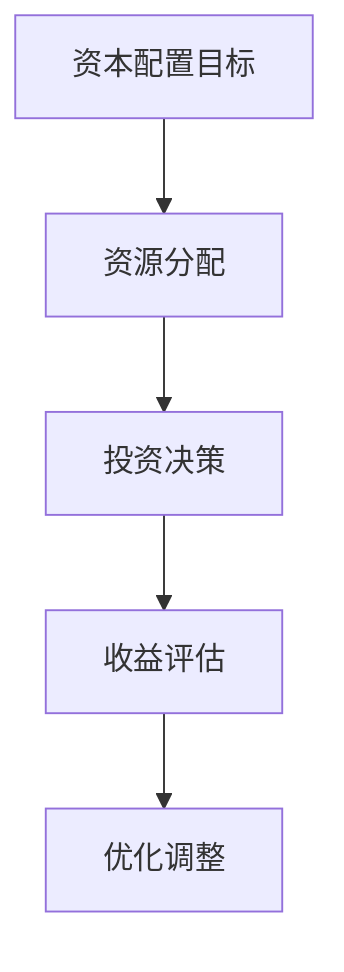
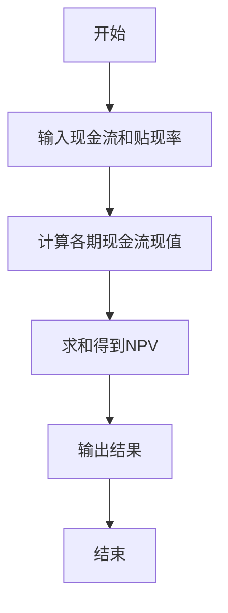
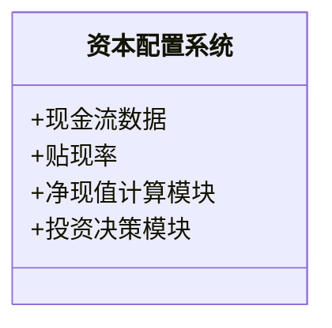
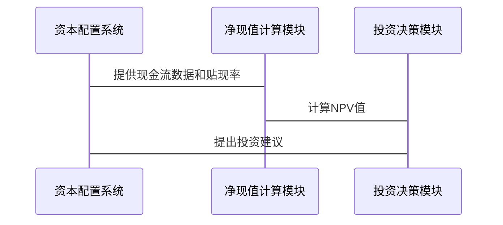

                 


```markdown
# 巴菲特的资本配置艺术：数字化转型中的资源优化

## 关键词：
资本配置，巴菲特，数字化转型，资源优化，投资策略，资本预算，数据驱动

## 摘要：
本文将深入探讨巴菲特的资本配置艺术，并结合数字化转型的背景，分析资源优化的关键策略。通过解析资本配置的核心概念、算法原理、系统架构以及实际案例，本文旨在为企业提供一套高效的数据驱动方法，以实现资源的最优配置和最大化收益。文章结合理论与实践，为读者提供全面的指导。

---

## 第一部分：资本配置的核心概念与背景

### 第1章：资本配置的基本概念与背景

#### 1.1 资本配置的核心概念

##### 1.1.1 资本配置的定义与内涵
资本配置是指将企业的可用资源（如资金、人力、技术等）分配到不同的项目或投资中，以实现企业目标的过程。资本配置的核心在于通过科学的决策，最大化资源的利用效率和投资回报。

##### 1.1.2 资本配置的基本原则
资本配置需遵循以下基本原则：
- **最大化收益**：确保资源配置能够带来最大的收益。
- **风险控制**：在追求收益的同时，控制投资风险。
- **动态调整**：根据市场变化和企业目标，及时优化资源配置。

##### 1.1.3 资本配置的边界与外延
资本配置的边界包括企业的财务状况、市场环境和战略目标。外延则涉及资本预算、投资决策和风险管理等多个方面。

#### 1.2 巴菲特的投资理念与资本配置

##### 1.2.1 巴菲特的资本配置哲学
巴菲特的资本配置哲学强调长期价值投资，注重企业的基本面分析和管理层能力评估。

##### 1.2.2 巴菲特投资策略的核心要素
- **价值投资**：寻找被市场低估的企业。
- **长期持有**：避免频繁交易，降低交易成本。
- **分散投资**：通过多样化投资降低风险。

##### 1.2.3 巴菲特资本配置的成功案例
以巴菲特投资可口可乐为例，分析其资本配置策略的成功之处。

---

### 第2章：数字化转型中的资源优化

#### 2.1 数字化转型的背景与趋势

##### 2.1.1 数字化转型的定义与特征
数字化转型是指利用数字技术对企业运营模式、业务流程和组织结构进行重塑，以提升效率和竞争力。

##### 2.1.2 数字化转型对企业资源优化的影响
数字化转型通过数据驱动的决策和自动化工具，显著提升了资源利用效率。

##### 2.1.3 数字化转型中的资源分配挑战
企业在数字化转型中面临资源分配不均、技术选型不当等问题。

#### 2.2 资本配置与数字化转型的结合

##### 2.2.1 数字化转型中的资本分配策略
企业应根据数字化转型的需求，调整资本分配策略，优先投资于高回报的技术项目。

##### 2.2.2 数据驱动的资本配置方法
通过数据分析和预测模型，优化资本分配决策，提升资源配置效率。

##### 2.2.3 数字化工具在资本配置中的应用
利用大数据分析、人工智能等技术，辅助资本配置决策。

---

## 第二部分：资本配置的核心概念与联系

### 第3章：资本配置的原理与模型

#### 3.1 资本配置的原理与模型

##### 3.1.1 资本配置的原理分析
资本配置的原理在于通过科学的分析和决策，确保资源的最优分配。

##### 3.1.2 资本配置的主要模型
- **净现值法（Net Present Value, NPV）**
- **内部收益率法（Internal Rate of Return, IRR）**
- **投资回收期法（Payback Period）**

##### 3.1.3 不同模型的优缺点对比
通过对比分析，选择最适合企业需求的资本配置模型。

#### 3.2 核心概念对比表格
以下是传统资本预算法与现代数据驱动方法的对比：

| 对比维度         | 传统资本预算法                | 现代数据驱动方法              |
|------------------|-------------------------------|------------------------------|
| 数据来源         | 历史数据、假设                | 实时数据、大数据分析          |
| 决策依据         | 简单财务指标                 | 复杂模型与预测               |
| 适用场景         | 简单投资项目                  | 复杂、多元投资项目            |

#### 3.3 系统架构图（Mermaid）



---

## 第三部分：资本配置的算法原理

### 第4章：资本配置的算法原理

#### 4.1 净现值法（Net Present Value, NPV）

##### 4.1.1 NPV的数学模型
$$NPV = \sum_{t=0}^{n} \frac{C_t}{(1+r)^t}$$
其中，$C_t$是第$t$期的现金流，$r$是贴现率。

##### 4.1.2 NPV算法的流程图（Mermaid）



##### 4.1.3 NPV算法的Python实现

```python
def calculate_npv(cash_flows, discount_rate):
    npv = 0
    for t, cash_flow in enumerate(cash_flows):
        npv += cash_flow / (1 + discount_rate) ** t
    return npv

# 示例
cash_flows = [100, 200, 300]
discount_rate = 0.1
print("NPV =", calculate_npv(cash_flows, discount_rate))
```

---

## 第四部分：系统分析与架构设计

### 第5章：系统分析与架构设计方案

#### 5.1 问题场景介绍
企业数字化转型中，如何优化资源配置以提升投资回报率。

#### 5.2 系统功能设计（领域模型）



#### 5.3 系统架构设计（Mermaid架构图）


#### 5.4 系统接口设计
- 输入接口：现金流数据、贴现率
- 输出接口：NPV值、投资建议

#### 5.5 系统交互流程图（Mermaid序列图）



---

## 第五部分：项目实战

### 第6章：项目实战

#### 6.1 环境安装
- 安装Python和相关库（如numpy、pandas）

#### 6.2 系统核心实现源代码

```python
import numpy as np

def calculate_npv(cash_flows, discount_rate):
    return np.npv(discount_rate, *cash_flows)

# 示例
cash_flows = [-100, 200, 300]
discount_rate = 0.1
print("NPV =", calculate_npv(cash_flows, discount_rate))
```

#### 6.3 代码应用解读与分析
- 使用numpy的`np.npv`函数计算净现值，代码简洁高效。

#### 6.4 实际案例分析
以某企业数字化转型项目为例，分析如何通过NPV法优化资源配置。

#### 6.5 项目小结
通过项目实战，验证了数据驱动方法在资本配置中的有效性。

---

## 第六部分：最佳实践与小结

### 第7章：最佳实践

#### 7.1 关键要点总结
- 数据质量是资本配置的关键。
- 模型迭代是优化资源配置的重要手段。
- 长期监测是确保资本配置效果的重要保障。

#### 7.2 小结
本文通过理论与实践的结合，详细探讨了巴菲特的资本配置艺术，并结合数字化转型的背景，提出了资源优化的策略和方法。

#### 7.3 注意事项
- 注重数据的准确性和完整性。
- 定期评估和调整资本配置策略。
- 风险控制是资本配置的重要环节。

#### 7.4 拓展阅读
建议阅读《巴菲特传》和《资本论》等书籍，深入理解资本配置的艺术。

---

## 作者：AI天才研究院/AI Genius Institute & 禅与计算机程序设计艺术/Zen And The Art of Computer Programming

---

**这篇文章系统地介绍了巴菲特的资本配置艺术，并结合数字化转型的背景，分析了资源优化的关键策略。通过理论与实践的结合，为企业提供了高效的数据驱动方法，以实现资源的最优配置和最大化收益。**
```

