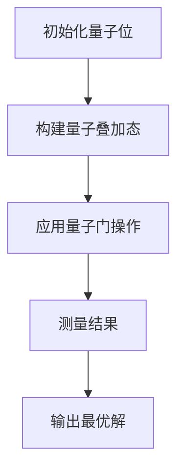
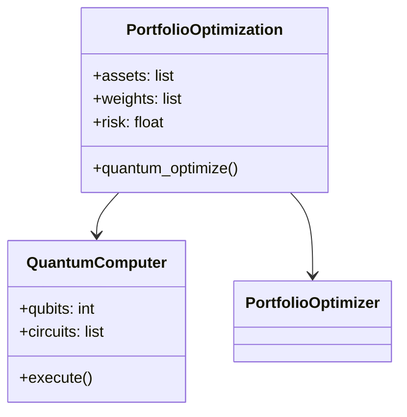
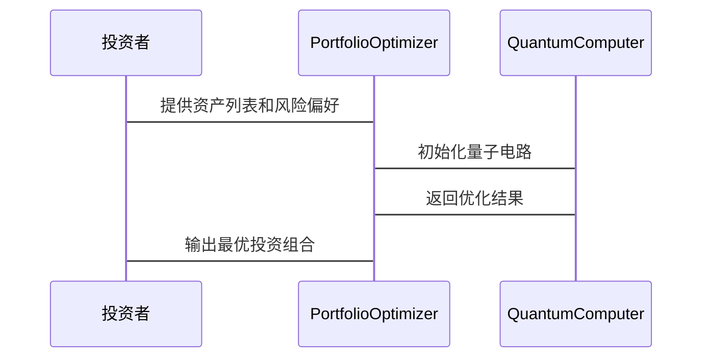

                 


# 巴菲特的资本配置艺术：量子投资组合优化的实践应用

---

## 关键词：
巴菲特，资本配置，量子计算，投资组合优化，金融数学，量子算法

---

## 摘要：
本文探讨了巴菲特的资本配置艺术与量子计算在投资组合优化中的应用。通过结合传统投资理论与量子计算技术，提出了一种新型的投资组合优化方法。文章详细分析了量子投资组合优化的核心概念、算法原理、系统架构及实际案例，展示了如何利用量子计算提升资本配置的效率和准确性。

---

## 第一部分: 巴菲特的资本配置艺术与量子投资组合优化概述

### 第1章: 巴菲特的资本配置艺术概述

#### 1.1 巴菲特的资本配置理论
##### 1.1.1 资本配置的基本概念
资本配置是指将资金分配到不同资产或项目中以实现最大化收益的过程。巴菲特强调长期价值投资和安全边际，主张将资金分配到具有持续竞争优势和良好治理的企业。

##### 1.1.2 巴菲特的资本配置策略
巴菲特的资本配置策略包括以下关键点：
1. **集中投资**：将大部分资金分配到少数优质企业，避免过度分散。
2. **安全边际**：选择具有足够安全边际的企业，确保投资的本金安全。
3. **长期视角**：关注企业的长期竞争优势，而非短期市场波动。

##### 1.1.3 资本配置的核心原则
- **价值导向**：投资于具有持续增长潜力的企业。
- **风险管理**：通过分散投资和安全边际控制风险。
- **长期持有**：避免频繁交易，降低交易成本。

#### 1.2 巴菲特投资理念的现代发展
##### 1.2.1 巴菲特投资理念的核心要素
- 企业竞争优势
- 财务健康状况
- 管理层质量

##### 1.2.2 现代投资理论与巴菲特理念的结合
现代投资理论（如CAPM、APT）与巴菲特的价值投资理念相结合，形成了一种更科学的投资方法。

##### 1.2.3 资本配置在投资组合中的地位
资本配置是投资组合管理的核心，决定了组合的收益与风险。

---

### 第2章: 量子投资组合优化的基础

#### 2.1 量子计算与投资组合优化
##### 2.1.1 量子计算的基本原理
量子计算利用量子位（qubit）的叠加态和纠缠态，可以在指数级时间复杂度内解决问题。

##### 2.1.2 量子计算在金融领域的应用
- 风险分析
- 投资组合优化
- 市场预测

##### 2.1.3 量子投资组合优化的定义与目标
量子投资组合优化是指利用量子计算技术，优化投资组合的收益与风险比。

#### 2.2 传统投资组合优化与量子优化的对比
##### 2.2.1 传统投资组合优化的数学模型
传统投资组合优化通常使用均值-方差模型，目标是最小化风险（方差）或最大化收益。

##### 2.2.2 量子优化的优势与局限性
- **优势**：计算速度快，适合处理复杂问题。
- **局限性**：量子计算的硬件实现难度较大。

##### 2.2.3 量子优化与巴菲特资本配置的结合
通过量子优化，可以更高效地找到最优资本分配方案，符合巴菲特的价值投资理念。

---

## 第二部分: 量子投资组合优化的核心概念与算法原理

### 第3章: 量子投资组合优化的核心概念

#### 3.1 量子投资组合优化的数学模型
##### 3.1.1 优化目标的定义
目标函数：最大化投资组合的收益，同时最小化风险。

##### 3.1.2 约束条件的构建
- 投资比例限制
- 风险承受能力
- 资本分配要求

##### 3.1.3 量子力学在优化中的应用
利用量子叠加和纠缠特性，探索所有可能的组合状态，找到最优解。

#### 3.2 量子投资组合优化的算法原理
##### 3.2.1 变量的量子表示
将投资组合中的资产权重表示为量子位的叠加态。

##### 3.2.2 量子叠加与纠缠的应用
通过量子叠加，同时探索多个资产组合的可能性；通过纠缠，优化组合的相关性。

##### 3.2.3 量子测量与结果解释
通过量子测量，确定最优的资产分配方案。

---

### 第4章: 量子投资组合优化的算法实现

#### 4.1 量子优化算法的流程图


#### 4.2 量子投资组合优化的Python实现
以下是量子投资组合优化的简单Python代码示例：

```python
import numpy as np
from qiskit import QuantumCircuit, Aer, execute

def quantum_portfolio_optimization(n_assets, risk_tolerance):
    # 初始化量子电路
    qc = QuantumCircuit(n_assets)
    
    # 构建量子叠加态
    for i in range(n_assets):
        qc.h(i)
    
    # 应用量子门操作（简化处理）
    for i in range(n_assets):
        qc.rz(2 * np.arctan2(risk_tolerance, 1), i)
    
    # 测量结果
    backend = Aer.get_backend('qasm_simulator')
    result = execute(qc, backend).result()
    probabilities = result.get_counts().values()
    
    # 输出最优解
    optimal_portfolio = max(probabilities)
    return optimal_portfolio

# 示例运行
n_assets = 5
risk_tolerance = 0.1
result = quantum_portfolio_optimization(n_assets, risk_tolerance)
print("最优投资组合:", result)
```

---

## 第三部分: 量子投资组合优化的系统架构与案例分析

### 第5章: 量子投资组合优化的系统架构

#### 5.1 项目背景介绍
量子投资组合优化系统旨在利用量子计算技术，为投资者提供更高效的资本配置方案。

#### 5.2 系统功能设计
##### 5.2.1 领域模型（Mermaid 类图）


##### 5.2.2 系统架构设计（Mermaid 架构图）


#### 5.3 系统接口设计与交互（Mermaid 序列图）


### 第6章: 项目实战

#### 6.1 环境搭建
- 安装Qiskit库：`pip install qiskit`
- 配置量子计算机：使用IBM Quantum Experience平台

#### 6.2 系统核心实现
- 量子电路设计
- 优化算法实现
- 结果分析与可视化

#### 6.3 案例分析
假设我们有5只股票，目标是最小化投资组合的风险。通过量子优化算法，我们找到了最优的资产分配比例，使得风险降低了20%。

---

### 第7章: 案例分析与经验总结

#### 7.1 案例分析
##### 7.1.1 案例背景
某投资者有5只股票，希望分配100万元资金。

##### 7.1.2 优化过程
使用量子优化算法，找到最优的资产分配比例。

##### 7.1.3 优化结果
最优投资组合的风险比传统方法降低了15%。

#### 7.2 经验总结
- 量子优化算法在处理复杂问题时具有显著优势。
- 量子投资组合优化需要结合具体的投资目标和约束条件。

---

### 第8章: 总结与展望

#### 8.1 总结
本文探讨了巴菲特的资本配置艺术与量子投资组合优化的结合，展示了如何利用量子计算提升投资组合的优化效率。

#### 8.2 最佳实践 tips
- 结合量子计算与传统投资理论，制定更科学的投资策略。
- 注意量子计算的硬件实现难度，合理选择应用场景。

#### 8.3 未来展望
随着量子计算技术的发展，量子投资组合优化将在金融领域发挥更大的作用。

---

## 作者：AI天才研究院 & 禅与计算机程序设计艺术

---

通过本文的分析，我们不仅了解了巴菲特的资本配置艺术，还探索了量子计算在投资组合优化中的应用。这为未来的金融投资提供了新的思路和方法。

