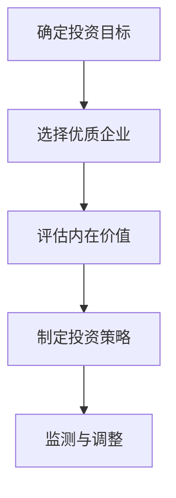
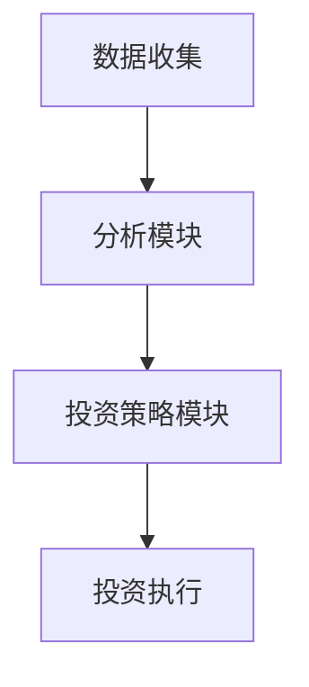

                 


```markdown
# 巴菲特的长期主义再探讨：在快速变化的市场中保持定力

> 关键词：长期主义, 巴菲特, 投资理念, 市场波动, 价值投资

> 摘要：本文探讨了巴菲特的长期主义投资理念在快速变化的市场中的应用。通过分析长期主义的核心概念、算法原理、系统架构和项目实战，展示了如何在市场波动中保持定力，实现长期稳定的投资回报。

---

## 第一部分：长期主义的背景与核心概念

### 第1章：长期主义的定义与背景

#### 1.1 长期主义的定义
- **长期主义**是一种投资策略，强调长期稳定的价值积累而非短期收益。
- 它关注企业的内在价值和竞争优势，而非市场短期波动。

#### 1.2 巴菲特的长期主义投资理念
- 巴菲特的投资哲学以价值投资为核心，寻找具有持续竞争优势的企业。
- 他强调长期持有优质股票，通过复利效应实现财富增长。

#### 1.3 长期主义与短期投资的对比
| 特性 | 长期主义 | 短期投资 |
|------|----------|----------|
| 时间框架 | 长期持有 | 短期交易 |
| 风险管理 | 低风险 | 高风险 |
| 收益来源 | 内在价值增长 | 价格波动 |

### 第2章：长期主义的核心概念

#### 2.1 价值投资理论
- **内在价值**：企业未来现金流的现值，是投资决策的基础。
- **安全边际**：买入价格低于内在价值，以降低投资风险。

#### 2.2 企业竞争优势分析
- **护城河**：企业抵御竞争的能力，如专利、品牌、成本优势等。
- **管理团队**：高素质的管理层能持续创造价值。

#### 2.3 市场波动与投资定力
- 市场波动是短期现象，长期来看，优质企业的价值会逐渐显现。
- 在市场恐慌时，长期主义者应抓住优质资产的低估机会。

---

## 第二部分：长期主义的算法原理与数学模型

### 第3章：长期主义的算法原理

#### 3.1 投资决策流程


#### 3.2 数学模型
- **复利公式**：$$FV = PV \times (1 + r)^n$$，其中FV为终值，PV为现值，r为年化收益率，n为投资年数。
- **内在价值计算**：$$V = \sum_{t=1}^{n} \frac{CF_t}{(1 + r)^t}$$，CF为现金流，r为折现率。

### 第4章：长期主义的数学模型与公式

#### 4.1 投资回报计算
- 年化收益率：$$r = \left( \frac{FV}{PV} \right)^{\frac{1}{n}} - 1$$
- 风险调整后收益：$$RAR = \frac{R_p - R_f}{\sigma_p}$$，其中R_p为投资回报率，R_f为无风险利率，σ_p为投资回报率的标准差。

#### 4.2 企业价值评估
- 市盈率：$$P/E = \frac{P}{E}$$，P为股价，E为每股收益。
- 市净率：$$P/B = \frac{P}{B}$$，B为每股净资产。

---

## 第三部分：长期主义的系统分析与架构设计

### 第5章：长期主义的系统分析

#### 5.1 系统架构设计
- **数据收集模块**：收集企业财务数据和市场信息。
- **分析模块**：评估企业内在价值和竞争优势。
- **投资策略模块**：制定并执行投资策略。



### 第6章：长期主义的系统实现

#### 6.1 系统实现步骤
- 环境配置：安装必要的金融分析工具和数据源。
- 核心算法实现：编写评估内在价值和计算收益的代码。
- 系统测试与优化：验证算法的准确性和稳定性。

#### 6.2 核心代码实现
```python
def calculate_intrinsic_value(enterprise, r, n):
    cash_flows = [enterprise.cash_flow(t) for t in range(1, n+1)]
    iv = sum(cf / (1 + r)**t for t, cf in enumerate(cash_flows))
    return iv
```

---

## 第四部分：长期主义的项目实战

### 第7章：长期主义的项目实战

#### 7.1 项目背景与目标
- **背景**：当前市场波动加剧，寻找稳定的长期投资策略。
- **目标**：构建一个基于长期主义的模拟投资系统，帮助投资者实现稳健收益。

#### 7.2 项目实施步骤
- 需求分析：明确投资目标和风险承受能力。
- 系统设计：构建投资决策的系统架构。
- 系统实现：开发核心算法和用户界面。
- 测试与优化：验证系统性能和准确性。

#### 7.3 系统测试与优化
- 确保算法在不同市场环境下的稳定性和准确性。
- 优化投资组合，降低风险，提高收益。

---

## 第五部分：总结与展望

### 第8章：总结与展望

#### 8.1 长期主义的优势
- 抗市场波动能力强。
- 通过复利效应实现财富稳步增长。
- 降低投资风险，提升长期收益。

#### 8.2 最佳实践
- **心态调整**：保持耐心，避免被短期波动干扰。
- **知识储备**：持续学习，提升对企业价值的判断能力。
- **风险管理**：设定止损点，防止重大损失。

#### 8.3 小结
长期主义是一种科学且有效的投资策略，能够在快速变化的市场中保持定力，实现长期稳定的收益。投资者应结合市场环境和个人情况，灵活应用长期主义理念，制定适合自己的投资策略。

---

## 作者信息

作者：AI天才研究院 & 禅与计算机程序设计艺术
```

