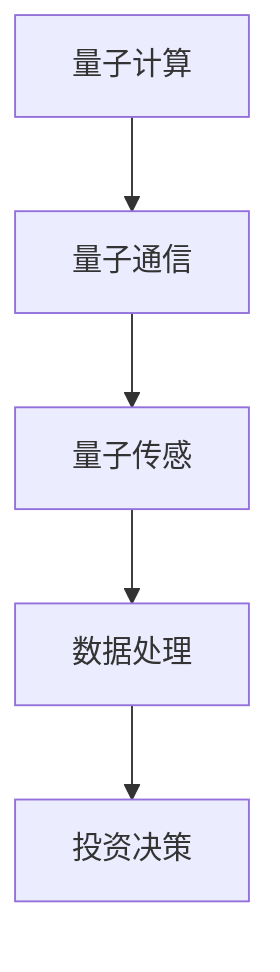
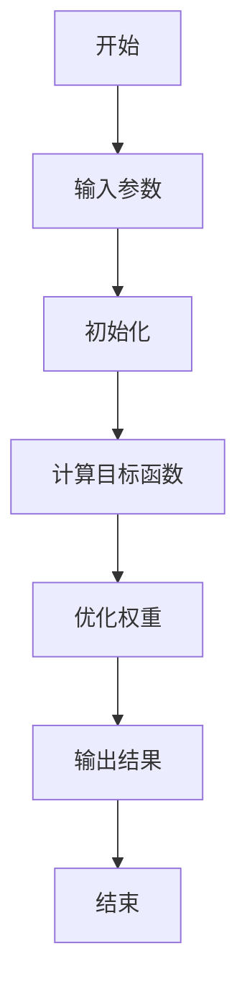

                 


# 巴菲特的长期主义在快速迭代的量子技术领域的调整

> 关键词：长期主义、量子技术、投资策略、快速迭代、量子计算、投资优化、技术调整

> 摘要：本文探讨了巴菲特的长期主义投资策略在快速迭代的量子技术领域的调整。通过分析量子技术的特点、长期主义的核心理念，结合量子计算的算法原理和系统架构，提出了在量子技术快速迭代中如何优化长期投资策略的方法。文章从背景介绍、核心概念、算法原理、系统设计、项目实战等多方面展开，结合实际案例分析，为投资者提供了深度的理论支持和实践指导。

---

## 第1章：长期主义的背景与定义

### 1.1 长期主义的定义

#### 1.1.1 长期主义的核心概念
长期主义是一种投资哲学，强调关注企业的长期价值，而非短期市场波动。巴菲特是长期主义的典型代表，他认为企业内在价值的增长才是投资的核心驱动力。

#### 1.1.2 长期主义在投资中的重要性
长期主义能够帮助投资者避免短期市场的干扰，专注于企业的基本面和长期增长潜力。这种策略在技术快速迭代的领域尤为重要，因为短期波动可能掩盖长期趋势。

#### 1.1.3 长期主义与短期决策的对比
长期主义注重企业的核心竞争力和长期增长，而短期决策则关注市场波动和短期收益。在快速迭代的技术领域，长期主义能够帮助投资者捕捉技术进步带来的长期价值。

### 1.2 量子技术的发展现状

#### 1.2.1 量子计算的基本原理
量子计算利用量子位（qubit）的叠加态和纠缠态，能够在某些情况下比经典计算机更高效地解决复杂问题。

#### 1.2.2 量子技术的当前应用领域
目前，量子技术已经在密码学、药物研发、金融建模等领域展现出强大的潜力。

#### 1.2.3 量子技术的未来发展趋势
量子技术的快速迭代和突破性进展将深刻改变多个行业，尤其是在人工智能和数据分析领域。

---

## 第2章：长期主义在量子技术中的应用

### 2.1 长期主义与量子技术的结合

#### 2.1.1 量子技术的长期投资价值
量子技术的长期价值在于其潜在的颠覆性创新，能够为多个行业带来根本性变革。

#### 2.1.2 长期主义在量子技术投资中的策略
投资者应关注量子技术领域的龙头企业和创新公司，长期持有优质资产，避免短期波动的干扰。

#### 2.1.3 量子技术对长期主义的影响
量子技术的快速发展为长期主义者提供了更多机会，但也带来了更高的风险和不确定性。

### 2.2 量子技术的快速迭代与调整

#### 2.2.1 技术更新的周期性
量子技术的迭代周期较短，技术创新频繁，投资者需要及时调整投资策略。

#### 2.2.2 技术迭代对企业的影响
快速迭代的量子技术可能导致企业的竞争优势迅速变化，投资者需要关注企业的创新能力。

#### 2.2.3 技术迭代对投资策略的调整
投资者应根据量子技术的最新进展，动态调整投资组合，优化资产配置。

---

## 第3章：量子技术的系统分析与架构设计

### 3.1 系统分析的基本框架

#### 3.1.1 系统分析的方法论
系统分析是一种结构化的方法，用于理解和优化复杂系统的行为。

#### 3.1.2 系统分析在量子技术中的应用
通过系统分析，投资者可以更好地理解量子技术的内部结构和外部环境。

#### 3.1.3 系统分析对投资决策的影响
系统分析能够帮助投资者识别量子技术的关键驱动因素，优化投资策略。

### 3.2 量子技术系统的架构设计

#### 3.2.1 系统功能设计
量子技术系统的核心功能包括量子计算、量子通信和量子传感。

#### 3.2.2 系统架构图（Mermaid）


#### 3.2.3 系统接口设计
量子技术系统的接口设计需要考虑与现有IT系统的兼容性。

---

## 第4章：量子技术投资的算法原理

### 4.1 量子计算在投资中的应用

#### 4.1.1 量子算法的基本原理
量子算法利用量子叠加和纠缠的特性，能够在某些问题上实现指数级加速。

#### 4.1.2 量子算法在投资决策中的应用
量子算法可以用于优化投资组合、风险管理和市场预测。

#### 4.1.3 量子算法的优缺点
量子算法的计算速度极快，但目前仍面临硬件和算法的限制。

### 4.2 投资决策的数学模型

#### 4.2.1 投资组合优化的数学公式
$$\text{目标函数：} \max \sum_{i=1}^{n} w_i r_i$$
$$\text{约束条件：} \sum_{i=1}^{n} w_i = 1$$
其中，\( w_i \) 是资产 \( i \) 的权重，\( r_i \) 是资产 \( i \) 的预期收益。

#### 4.2.2 风险评估的数学模型
$$\text{风险度量：} \sigma = \sqrt{\sum_{i=1}^{n} w_i^2 \sigma_i^2}$$
其中，\( \sigma_i \) 是资产 \( i \) 的标准差。

#### 4.2.3 算法流程图（Mermaid）


---

## 第5章：项目实战与案例分析

### 5.1 量子技术投资项目的环境配置

#### 5.1.1 开发环境的搭建
需要安装量子计算模拟器和相关开发工具。

#### 5.1.2 工具链的安装
安装Python和量子计算库，如Qiskit。

### 5.2 核心代码实现

#### 5.2.1 投资组合优化的代码实现
```python
import numpy as np

def quantum_portfolio_optimization(weights, returns):
    # 定义目标函数
    objective = -np.dot(weights.T, returns)
    # 定义约束条件
    constraints = [{'type': 'eq', 'fun': lambda x: np.sum(x) - 1}]
    # 使用优化算法
    from scipy.optimize import minimize
    result = minimize(objective, weights, constraints=constraints)
    return result.x

# 示例输入
weights = np.array([0.2, 0.3, 0.5])
returns = np.array([0.1, 0.2, 0.3])

# 调用优化函数
optimized_weights = quantum_portfolio_optimization(weights, returns)
print("优化后的权重：", optimized_weights)
```

#### 5.2.2 风险评估的代码实现
```python
import numpy as np

def calculate_risk(weights, returns):
    covariance_matrix = np.cov(returns)
    variance = np.dot(weights.T, np.dot(covariance_matrix, weights))
    return np.sqrt(variance)

# 示例输入
weights = np.array([0.2, 0.3, 0.5])
returns = np.array([0.1, 0.2, 0.3])

# 计算风险
risk = calculate_risk(weights, returns)
print("投资组合的风险：", risk)
```

### 5.3 实际案例分析

#### 5.3.1 案例背景介绍
假设我们关注一家量子计算公司，分析其长期投资价值。

#### 5.3.2 案例分析过程
使用量子算法优化投资组合，评估公司的长期收益和风险。

#### 5.3.3 案例结果与启示
量子算法可以帮助投资者更准确地预测公司的长期价值，优化投资决策。

---

## 第6章：总结与展望

### 6.1 本书的核心观点总结

#### 6.1.1 长期主义与量子技术的结合
长期主义在量子技术领域的应用可以帮助投资者捕捉技术进步带来的长期价值。

#### 6.1.2 快速迭代中的调整策略
投资者需要根据量子技术的最新进展，动态调整投资策略。

#### 6.1.3 系统分析与投资决策
系统分析能够帮助投资者更好地理解量子技术的内部结构和外部环境。

### 6.2 未来展望

#### 6.2.1 量子技术的发展趋势
量子技术将在更多领域展现出强大的潜力，成为未来科技的核心驱动力。

#### 6.2.2 长期主义在其他领域的应用
长期主义的投资哲学可以推广到更多领域，帮助投资者实现长期价值。

#### 6.2.3 投资策略的未来演变
随着量子技术的快速发展，投资策略将更加依赖于量子算法和系统分析。

### 6.3 最佳实践 tips

#### 6.3.1 投资者应关注量子技术领域的龙头企业和创新公司。

#### 6.3.2 长期主义者应动态调整投资组合，优化资产配置。

#### 6.3.3 投资者应深入理解量子技术的核心原理和系统架构。

---

作者：AI天才研究院/AI Genius Institute & 禅与计算机程序设计艺术 /Zen And The Art of Computer Programming

